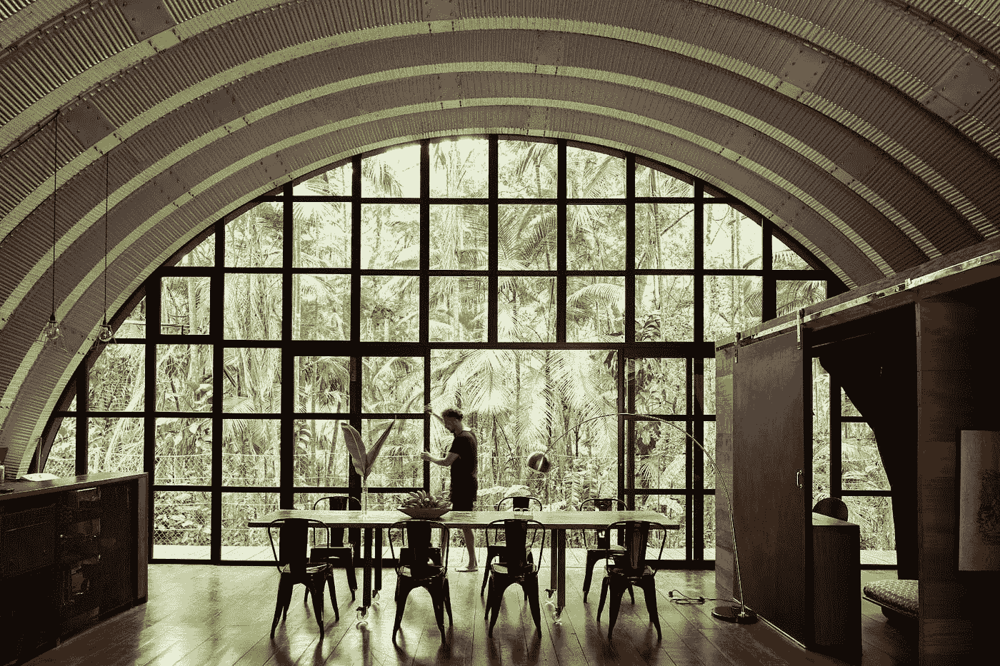

# 我的 Airbnb 之旅——弗洛里安·安第斯

> 原文：<https://medium.com/airbnb-engineering/my-journey-to-airbnb-florian-andes-5080685262d3?source=collection_archive---------2----------------------->

从制造飞机到 Airbnb 的员工技术项目经理

[*弗洛里安·安德斯*](https://www.linkedin.com/in/floandes/) *是 Airbnb 的员工技术项目经理。他在软件、制造和战略咨询行业拥有超过 10 年的经验。他曾在法兰克福、伦敦、新加坡和波士顿学习，并在那里获得了商业和企业家的学士和 MBA 学位。*

虽然在硅谷的“大型科技”行业找到自己的位置可能很难，也很令人生畏，但 Florian 依靠好奇心和开放性在 Airbnb 建立了成功的职业生涯。继续阅读弗洛里安自己关于在商业和软件工程的交汇处工作、转移到美国以及将 Airbnb 的技术项目从零扩展到 10 倍等等的话。

# 一个为自己的职业找到归宿的全球公民

很多年前，Airbnb 有一句广告语真正启发了我:“不要去那里。住在那里。”我已经尽可能地接受了这个想法。我有机会在几个不同的国家生活和工作——德国、英国、新加坡、中国，现在是美国，我目前住在旧金山。

我在德国南部长大，特别是一个叫乌尔姆的小城市(它以阿尔伯特·爱因斯坦和拥有世界上最高的教堂建筑而闻名)。在成长过程中，我的父亲对我是一个巨大的鼓舞。二十多岁的时候，他开始了自己的事业。他的旅程教会了我很多关于毅力、奉献和远见的思考。我仍然受到他在计算机早期开创硬件和软件工程交叉的启发。

在我的职业生涯中，我已经跨越了不同的行业，从硬件工程转向了软件工程。(我的第一份工作是在一个朋友的餐馆里叠披萨盒。)在德国，有大量的硬件和制造业:汽车、工业机器和一般的电器。我从空中客车公司起步，用先进的塑料和纤维材料制造飞机，然后进入汽车行业和移动领域的战略咨询。

一路走来，我对软件公司和互联网技术产生了浓厚的兴趣。在我攻读 MBA 的新加坡，我加入了一家快速发展的科技初创公司，管理他们在 APAC 各地的合作伙伴关系。我喜欢它。我在东南亚飞来飞去，在创业活动上演讲，向投资者推销，解释这个想法和我们正在解决的问题——这一切都让我非常兴奋。

最后，我参加了一个炉边聊天，与当时 Airbnb 的工程副总裁迈克·柯蒂斯(Mike Curtis)聊天，由当地一家初创公司联合工作空间(co-working space)主办，他分享了他在旅途中学到的经验。我受到了启发，并在演讲结束后与 Mike 和 Airbnb 的一些人取得了联系，我加入 Airbnb 的机会从那里开始有机增长。

# 技术和商业交汇处的开创性项目

TPM 参与 Airbnb 的每个主要发布。有些 TPM 更侧重于产品和业务(我就是这样)，有些则更面向基础设施和平台。影响的可能性很高，因为你经常与工程领导者非常接近。您会与首席技术官、工程领域的许多高级领导以及我们的产品团队进行对话。

我已经在 Airbnb 工作了五年多，随着时间的推移，我的工作在技术深度和广度上都有所扩展。我起初专注于 EMEA(位于柏林)的业务运营和战略，然后被调到美国，从零开始建立一个全新的 API 项目，现在我负责监管与 Airbnb 托管产品相关的所有技术项目。这是一个非常有趣的领域，它弥合了我们业务的技术(工程、产品、数据科学和设计)和商业部分之间的差距。

我最近参与的两个项目展示了我们项目的广度。一个是采用了我们的[设计语言系统](https://airbnb.design/building-a-visual-language/) (DLS)，这是一个预建组件的仓库，设计师和工程师可以重复使用，而不是构建新的东西。因此，每当 Airbnb 的工程师必须实现一个按钮时，他们不必从头开始构建这个按钮。另一个是降低我们在 T2 的 AWS 成本。我们在 Airbnb 引入了一个新的归因模型，将 AWS 成本与不同的团队直接关联起来，我的角色是监控我们组织的消费，并倡导许多文化变革，以便在我们构建产品时考虑 AWS 的成本效益。

# 远程程序管理策略

最近，一个很大的焦点自然是在远程工作期间保持团队的参与和协作。传达清晰的项目愿景和使用框架来保持项目在正轨上是比以往任何时候都更重要的两个策略。

我认为另一件重要的事情是庆祝胜利和关键的里程碑。以前，当我们在办公室时，庆祝重大胜利要容易得多。在 Airbnb，我们有一个工具，让你可以向他人表达谢意。我一直在使用它，因为当我与设计、产品、工程和 QA 的多个利益相关者一起工作时，人们通常会在不同的阶段做出贡献。当项目结束时，你可能不再有这个大论坛，因为大多数人已经离开了。但重要的是，仍然要对每个人在这一过程中所做的工作给予肯定，并确保他们的经理能够看到他们的贡献。

# 是什么让 TPM 这个角色在 Airbnb 独一无二

TPM 作为一项功能本身是相对较新的，每个公司对待它的方式都略有不同。即使在 Airbnb，它也在不断发展和进步。然而，有一件事是永远不变的，那就是 TPM 需要利用影响力来领导项目、团队和产品——而不是行使直接的权力。作为一名全员生产性维护人员，你必须支持想法，成为一名优秀的沟通者，并与你的合作伙伴一起协调优先事项，推动项目向前发展。

你不必学习软件工程来成为一名技术项目经理——我认为你需要证明你有能力在技术方面成长和学习，这可以在工作前或工作中发生。例如，起初我对 AWS 优化、前端设计语言系统或开源没有太多了解，但 Airbnb 的人非常乐于分享知识，这让我很快加入并接受了这些项目。你只需要保持好奇和开放的心态去学习。

我喜欢在 Airbnb 工作，因为这家公司的员工和使命驱动的性质。我认为成为 Airbnb 的 TPM 非常独特的一点是，仍然有许多“绿地”和未开发的领域，在那里你可以真正帮助定义新的战略和愿景。

*有兴趣加入 Airbnb 做 TPM？查看这些开放的角色:*

[高级 TPM，客主技术](https://careers.airbnb.com/positions/4024213/?gh_src=6b8b81e61us)

[员工 TPM，保险平台](https://careers.airbnb.com/positions/3955056/?gh_src=8a794a6e1us)

[员工全员生产性维护，基础设施区域化](https://careers.airbnb.com/positions/3651016/?gh_src=77ab28041us)