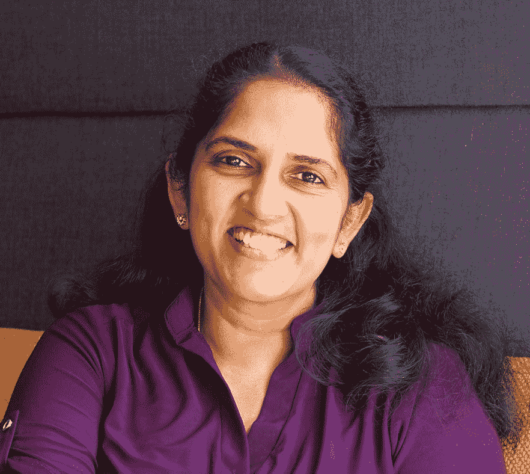

# 我的 Airbnb 之旅——Kamini Dandapani

> 原文：<https://medium.com/airbnb-engineering/my-journey-to-airbnb-kamini-dandapani-7f51f1fbb2bb?source=collection_archive---------2----------------------->

Airbnb 的工程副总裁谈为什么你不必改变自己的本性就能成为领导者

Airbnb 的工程副总裁 Kamini Dandapani 领导着基础设施工程组织，该组织在许多方面都是公司的支柱:负责为保持 Airbnb 平稳运行的系统提供动力，并帮助新产品惠及数百万人。Kamini 对平台如何支持和维持业务和产品充满热情，在两年前加入 Airbnb 之前，她在易贝和 LinkedIn 发展了体贴和热情的领导风格。除了她在 Infra 的角色之外，她还倡导工作场所的多样性和归属感，并且是 Airbnb 技术多样性委员会的联合发起人，该委员会旨在创建技术行业中最具多样性和包容性的社区。

*想听 Kamini 和其他基础设施团队成员谈论团队的一些最新项目吗？查看 2022 年 3 月开始的* [*【为我们的平台提供动力】Airbnb 技术讲座*](https://www.facebook.com/AirbnbTech/videos/635338454172729/) *。您将了解到我们在下一代服务网格、可观察性、功能工程和可扩展存储方面的一些重大举措。*

# 从钦奈到芝加哥

我在印度长大，是三个女孩中最小的一个。尽管面临着周围其他人的怀疑和批评，我的父母在我们的教育上投入了大量的资金，给了我们一个非常坚实的基础，没有这些，我想我不会有今天的成就。

我开始熟悉工程世界，并发现我非常喜欢它。我读了电子和通信本科，在我父亲的鼓励下——他在美国领事馆前通宵排队领签证——我来到美国攻读计算机科学硕士学位。

在芝加哥，我不得不适应许多新的经历(包括冬天的寒冷！).在印度，我从来不一个人做任何事，但在这里，我必须独立做每件事，从理财到开车。毕业后，我觉得很幸运能在硅谷找到一份工作，从那以后我就一直呆在这里。

# 在平台和产品的交叉点上领先

有效的基础设施不可能建立在真空中。相反，它需要与我们的产品工程师密切合作，以支持我们的产品和整体业务战略。我的专业最佳点是平台架构与最终用户体验相结合的地方——再加上规模！

在我的工程生涯中，我在易贝工作了 12 年，成长为一名主管，领导国际扩张。之后，我在 LinkedIn 工作了六年，领导消费者应用的基础设施和工具，在那里我学会了如何运营和开发大规模平台。Airbnb 联系我的时候，我并不是在寻求改变。但在我的每一次交谈中，这个地方都有一些真正神奇的东西——从领导力、包容性到公司的使命——我非常感激自己做出了这一飞跃。

最让我兴奋的是把几十年的规模化运营带到了 Airbnb。大规模运营的一个关键要素是跨职能部门高效、顺畅地工作，并与我们的产品团队和关键业务合作伙伴建立密切的关系。我在我自己的团队和 Airbnb 上看到了一些真正令人难以置信的团队合作。

# 打造 Airbnb 的技术支柱

为 Airbnb 提供动力的大部分技术基础来自于基础设施组织。这个团体的影响是如此广泛和深远。

基础架构组织有几个关键支柱:

*   **搜索基础设施**，为我们的访客搜索体验驱动后端系统
*   **数据平台**，用于存储、处理和管理为每一个用户体验提供动力的所有数据
*   **开发者平台**，它通过构建工具、服务和环境来帮助 Airbnb 工程师开发、构建、测试和部署他们的代码，从而让他们的生活变得无摩擦
*   **云基础设施，**交付和运营支持 Airbnb 的云环境
*   **可靠性工程，**通过工具和自动化补救和预防现场性能问题

在这些领域中的每一个领域，我们都有许多长期、多年的项目，都是我们所谓的 Tech Stack 2.0 的一部分:我们技术的发展和现代化。一些示例计划包括[灵活的来宾搜索](https://news.airbnb.com/unique-stays-hosts-earn-more-than-300-million-since-start-of-pandemic/)和我们开创性的下一代存储系统 UDS。

# 我的身份:女性，南亚人，移民

人们经常指出我是独一无二的，因为我是科技领域的女性领导者。但事实上，我的身份有三个重要方面:是的，我是一名女性，但我也是南亚人和移民。所有这些塑造了今天的我。

我在一个非常不同的文化中长大。我们被劝阻不要挑战现状，对于我的父母和祖父母来说，他们的想法是，如果你非常努力地工作，认可就会随之而来。这里不是这样的:有时你似乎需要有自己的观点和主张，才能被认真对待。

在很多方面，我认为与众不同是一个领导者的优势。虽然我鼓励团队中的每个人确保他们的声音被听到，但我也相信做真实的自己。这就是我如何与我的团队建立信任，让他们看到真实的我。我的哲学是，没有人能成为所有事情的专家。你将会看到人们的不同程度——我想全力支持这种思想和经验的多样性，因为一个全面发展的团队更有效率。

# 带着人们一起

当我加入 Airbnb 时，我要求有专门的时间和机构来做关于多元化和性别平等的工作。我现在和首席信息官卢修斯·迪菲利普斯(Lucius DiPhillips)一起担任技术多样性委员会的联合发起人，我们在这个委员会倡导技术组织的多样性相关项目。我也是我们亚洲员工资源小组的顾问之一。

Airbnb 的这些员工资源小组有一些我以前从未见过的特别之处。这是一个非常小的紧密团结的团体，我们可以联系到我们相似的教养和文化规范。我们真诚地互相关照，放大我们亚洲“同事”的声音。

有一种说法是“如果你想走得快，就一个人走，但如果你想走得远，就一起走。”无论是分享我们工作的背景，承认我的错误，还是建立一个多元化的组织，我都非常相信把人们带在身边。我在 Airbnb 找不到比这里更好的地方了，我们公司的使命是让任何人属于任何地方。

*有兴趣在 Airbnb 工作吗？我们在招人！查看这些开放的角色:*

[员工软件工程师，分布式存储](https://careers.airbnb.com/positions/3029584/)

[网络平台高级前端基础设施工程师](https://careers.airbnb.com/positions/3903900/?gh_src=3da3a8881us)

[员工软件工程师，云基础设施](https://careers.airbnb.com/positions/2410642/)

[存储基础架构高级/员工备份和恢复工程师](https://careers.airbnb.com/positions/3747712/)