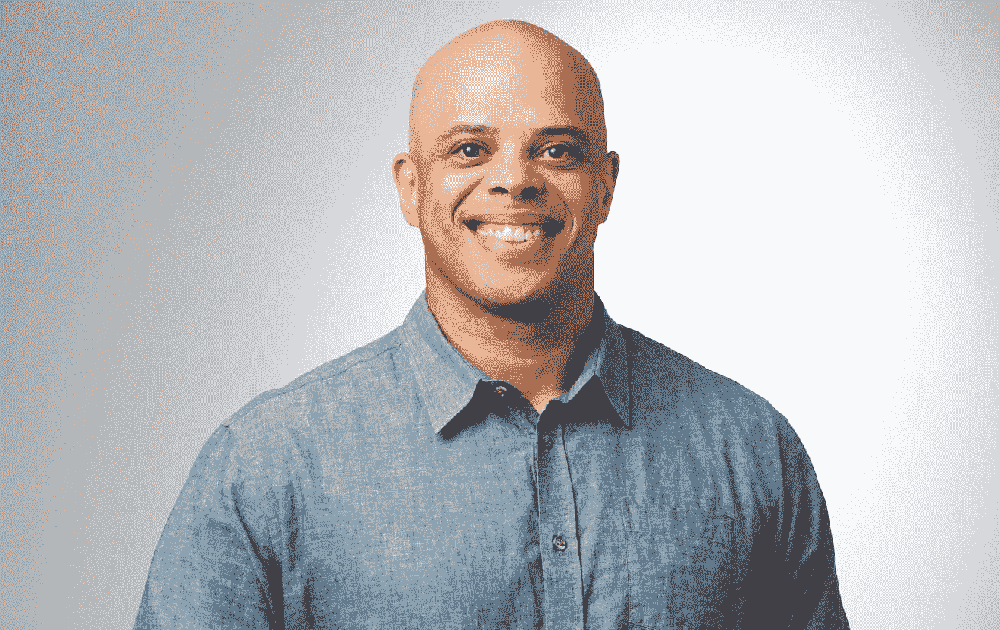

# 我的 Airbnb 之旅——卢修斯·迪菲利普斯

> 原文：<https://medium.com/airbnb-engineering/my-journey-to-airbnb-lucius-diphillips-79d1f0bc72a2?source=collection_archive---------1----------------------->

Airbnb 首席信息官谈赞助、归属感和人际关系的力量

Lucius DiPhillips 是 Airbnb 的首席信息官。他拥有 20 多年的经验，涉及产品开发、信息技术、客户服务、金融服务、支付、电子商务和信托&安全。他拥有伦斯勒理工学院的管理信息系统学位，并担任公司多个多元化和归属感团体和计划的执行发起人。通过他的赞助，Lucius 一直在帮助改善 Airbnb 吸引和保留多样化技术人才的方式。

# 打破障碍，从逆境中成长

我在纽约北部一个叫哈德逊瀑布的小镇长大。我是单亲妈妈带大的，我是独生女。在成长过程中，我们在经济上挣扎，我尽我所能帮助他们。从十岁时送报纸到高中时做服务生，我总是要平衡一些事情。这一直帮助我成为一名领导者:平衡和努力工作的职业道德，以及看到我妈妈作为单身母亲的挣扎。

我是多种族的:我妈妈是白人，我爸爸有黑人血统。在很小的时候，我就敏锐地意识到自己与众不同，有时我觉得自己没有归属感——因为我的长相，因为我的父母都不在照片中，因为我们在经济上并不富裕。我没有让差异阻碍我，而是让自己沉浸在许多事情中，从运动到学校合唱团和音乐剧。我想认识很多不同的人，并最终超越我们之间肤浅的标签和障碍。

这已经成为我领导团队的一部分，也是我组建团队的一部分。这在很大程度上是与你表面上看不到的人建立联系，并真正试图找到共同点。这是一项来自我职业生涯早期黑暗时期的技能，现在已经成为一项帮助我成为教练、导师和赞助者的技能，他投资于他人并带领他们在自己的职业生涯中发展。

# 由好奇心、关系和对话塑造的职业道路

我第一次对科技感兴趣是在 90 年代，当时我还是一名学生，对互联网这个新生事物充满好奇。虽然我的职业生涯始于传统 IT，但后来我进入了面向最终用户的产品开发和软件开发领域。通常，这是两个不同的侧面，但我更像是一个对技术的所有方面都有广泛理解的混合体。我热爱技术，但我也热爱运营、领导和人。我很欣赏我们如何确保在一天结束时将技术领域发生的事情与真实的客户、真实的人联系起来。

与导师和同事建立并保持许多不同的个人关系，这给我的职业生涯带来了各种各样的机会，并最终将我带到了 Airbnb。我第一次来 Airbnb 是领导我们的支付技术组织。Airbnb 有一个结构化的职业对话框架，涉及评估你的理想工作、你的故事、你的优势以及你想做得更好的地方，并从那里确定职业发展机会。这个过程让我成为了 Airbnb 的第一任首席信息官。

我觉得作为首席信息官，我的工作是最棒的。在 Airbnb，我感觉自己在为世界上最好的公司工作。这就是为什么四年后我还在这里发光发热。对我来说，这只是开始。

# 科技的多样性和归属感

我是技术多样性委员会(Tech Diversity Council)的联合发起人，该委员会是 Airbnb 的一个高级技术领导者小组，其任务是在我们的技术组织中扩大和倡导与多样性相关的项目和倡议。这是我必须扮演的最重要的角色之一，如果不是最重要的话。我们成立了这个委员会，因为我们在科技和 Airbnb 的代表性方面还有很长的路要走。对我来说，参与其中的最佳方式是付出我的时间，将想法和愿景付诸行动，产生影响。

这里谈的不仅仅是一个计划，而是许多并行的努力，从大范围到个人。除了技术多样性委员会之外，我们还有一个针对技术领域黑人群体的超级焦点，我们还有黑人赞助计划，由 Airbnb 的黑人员工资源小组 Black@开发和领导。我领导了一个每月一期的系列，面向那些在技术领域自我认同为黑人的人，他们可以随意地走到一起，有一个安全的地方来分享和贡献。

在 Airbnb，我们一直为坚持我们的信仰而自豪。随着黑人的命也是命运动和乔治·弗洛伊德的抗议，我觉得我们有支持说出我们的感受和经历。Black@ group 制作了如何成为盟友的指南，我们主持了许多关于黑人在美国意味着什么的谈话。对我来说，这是当时我们能做的最重要的事情，我们会继续做下去。

# 重新设计我们的招聘流程

我为 Airbnb 感到骄傲，因为大多数公司甚至不会谈论他们希望他们去哪里。他们不共享表示数字。我们不仅分享它们，我们说我们可以做得更好，我们会做得更好，下面是如何和何时。

我们已经做的事情之一是重新设计我们的招聘流程。出于对运营、数据和推动流程改进的热爱，我像对待产品一样对待我们的招聘流程。我们一步一步地看着数据，问自己“对于某些人口统计数据，是否存在不成比例的下降？我们可以做哪些不同的事情？”

我们意识到工程师是非常独特的——不仅仅是在他们的性别、种族和工作经验上，而是在他们如何最舒适地面试上。所以我们决定给候选人更多的灵活性:他们可以选择要么做一个带回家的编码测试，要么向我们展示一些他们引以为豪的开源作品。我们还让更多的经理参与基层工作，以支持我们的多元化和包容性候选人，并帮助他们感到被看到、被理解，并与他们未来的团队联系在一起。在招聘过程中尽早聘用更多多元化的工程师产生了巨大的影响。

从我在支付组织工作开始，我就认识到了这一时刻的紧迫性以及代表名额不足的候选人所面临的风险，并推动招聘团队将变革付诸行动，而不是等待或退缩。我称之为打破一些玻璃——你需要偶尔打破一些玻璃来挑战现状。

# 以人为本的领导方式

如果你关注归属感和参与度，并把它作为优先事项，那么你就能为你的团队创造一个更好的环境。当创伤性的事情发生时，重要的是教育其他人，这样他们可以成为盟友，以及为人们创造一个安全的空间来分享。作为我们健康计划的一部分，我们主持“倾听会议”我和我的领导团队一起招待过他们，为了“黑色”,为了阿富汗难民问题，或者当新冠肺炎·疫情在印度受到攻击时。

我也热衷于揭示这样一个事实，即工作与生活的平衡是一件你可以真正征服的事情。我们谈论工作与生活的平衡，这是我最讨厌的。我的平衡与你们任何一个人的平衡都非常不同。所以让我们来谈谈灵活性，以及对彼此独特的需求和情况的同情。

我关心透明和可用，我做到这一点的方法之一是每天提供两次办公时间，任何人都可以在任何时候注册。我们实际上采纳了这个想法，并将其扩展为一个叫做咖啡聊天的东西。我们组织中的任何人都可以注册与他人进行咖啡聊天。你不知道会是谁，直到你出现。这就是我喜欢我的办公时间的地方，能够问，“你有什么故事？你在这里多久了？你在想的一件私事是什么？”从内心来说，我想与人交流。我想展示一种以人为中心的领导方式。

–

有兴趣在 Airbnb 和 Lucius 合作吗？查看这些开放的角色:

[税务平台高级工程经理](https://careers.airbnb.com/positions/3897689/)

[系统工程师，客户工程](https://careers.airbnb.com/positions/3873636/)