# 我的 Mendix / PostgreSQL 数据库连接器之旅

> 原文：<https://medium.com/mendix/my-journey-with-db-connector-in-mendix-postgresql-8d76dd2e2a05?source=collection_archive---------0----------------------->

# Mendix 使创建和维护包含实体、属性和关联的数据库变得更加容易。

## 只需要转到域模型并在那里创建实体。创建属性时，预定义的数据类型有助于创建特定数据类型的属性。然后是两个或多个表/实体之间的关系，也不需要担心这些，有创建关系的选项，如关联、一般化或专门化。有两种类型的实体:

## 1)将数据存储在应用程序数据库中的持久实体 2)临时存储数据并仅存在于运行时内存中的非持久实体。

[https://bit.ly/MXW21](https://bit.ly/MXW21)

# Mendix 支持的外部数据库

从 Mendix 中的外部数据库开始，数据库连接器可用于无缝连接到外部数据库，而不会限制您对数据库或 SQL 方言的选择，使您能够将外部数据直接合并到您的 Mendix 应用程序中。

【PostgreSQL 使用数据库连接器:

数据库连接器有助于直接访问外部 SQL 数据库，并支持查询以及更新、删除、存储过程调用等操作。Mendix Market Place 中提供的“数据库连接器”可用于运行 SQL 操作。

Mendix 支持的数据库列表有**亚马逊红移、**、**火鸟**、 **H2** **数据库引擎、HSQLDB、IBM DB2、IBM Informix、MariaDB、微软 SQL/SQL 数据库、MySQL、OracleDB、OrientDB、PostgreSQL、Presto 和 SQLite** 。

# 先决条件

从[这里](https://jdbc.postgresql.org/download.html)安装 PostgreSQL 依赖项

[HikariCP](https://github.com/brettwooldridge/HikariCP)

**配置:**

1.  从 Mendix Market Place 下载“数据库连接器”到您的项目中。

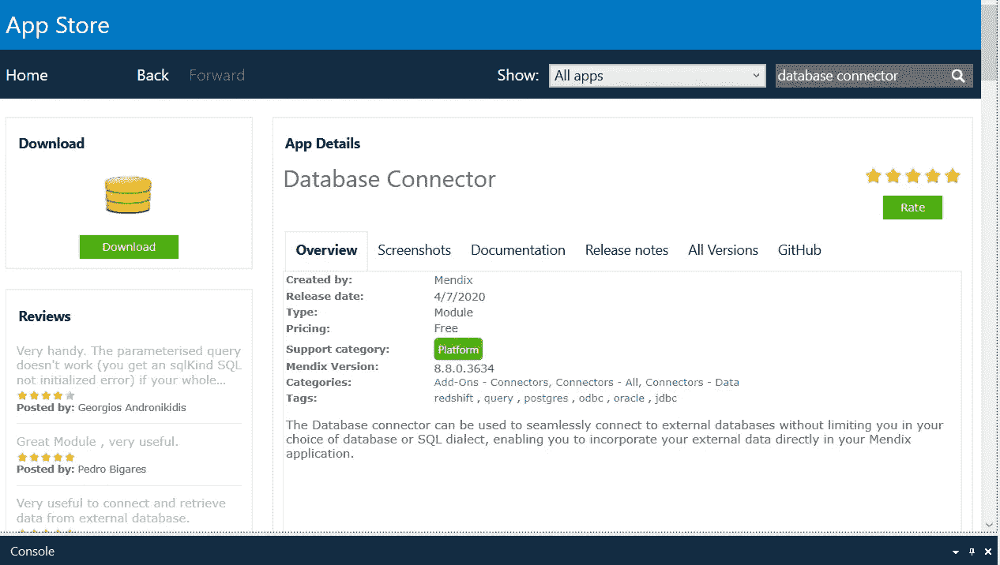

2.为 URL、用户名和密码的配置创建默认值(常量)。红色矩形显示常数。

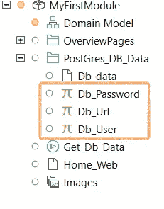

DB_URL —在 DB_URL 常量中给出默认值。

例如:“JDBC:PostgreSQL://localhost/Info”。

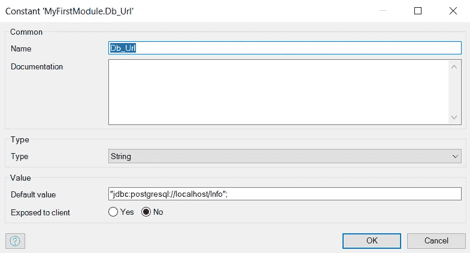

Db_Username:在 Db_User 中给 Username 一个默认值。

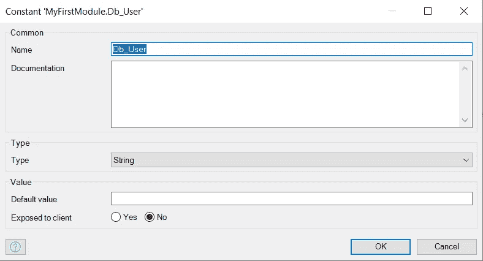

Db_Password:在 Db_Password 中给 Password 一个默认值。

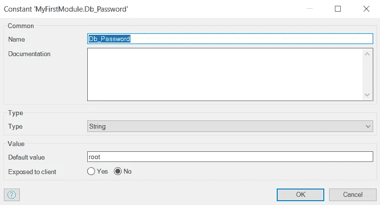

3.转到根目录下的设置，并在配置中给出网址，用户名和密码。

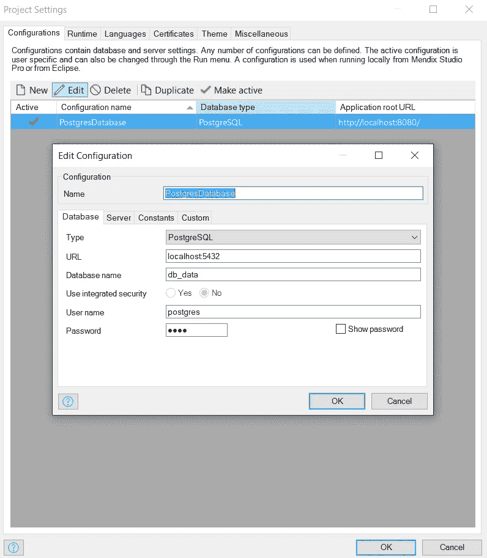

创建与 PostgreSQL 数据库中创建的实体和属性相同的实体和属性。

4.创建微流:要创建微流，添加一个创建实体的动作，并选择在域模型中创建的实体。然后从数据库连接器工具箱中拖动执行查询，如图所示。

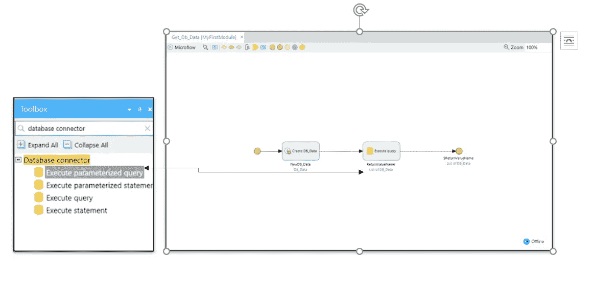

5.执行查询:对于 JDBC 网址，用户名，密码点击编辑，并选择如下所示的常数

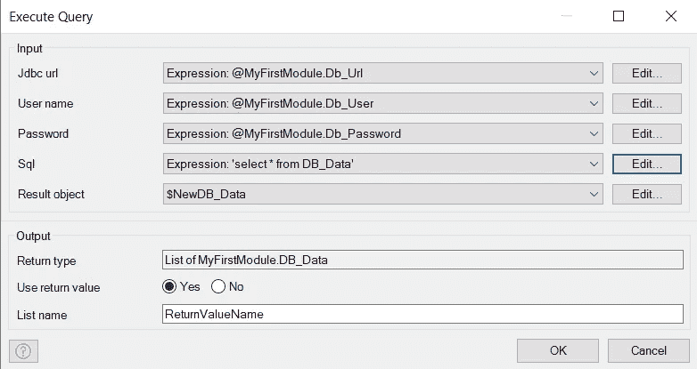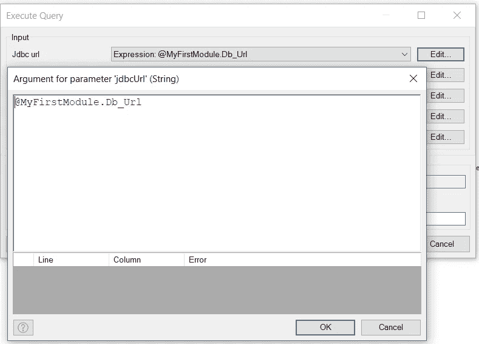

对于 SQL，点击编辑并在引号“查询”内写入查询。

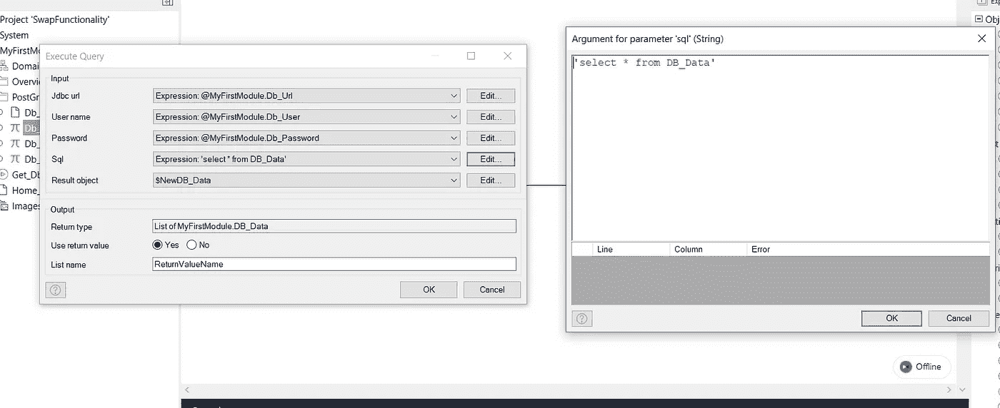

并在结束事件时为微流设置$ReturnValue。

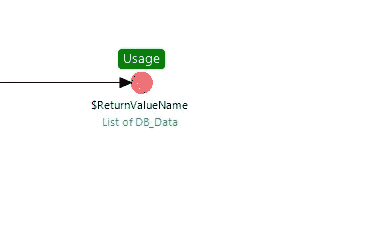

现在转到域模型，右键单击实体并创建如图所示的概览页面。

并选择实体 DB_Data。

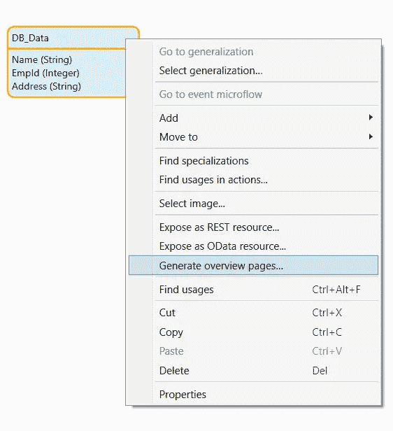

打开导航，添加新的，给标题，选择图标。在单击操作中，选择显示下拉列表中的页面，然后选择创建的 DB_Data_Overview 页面。

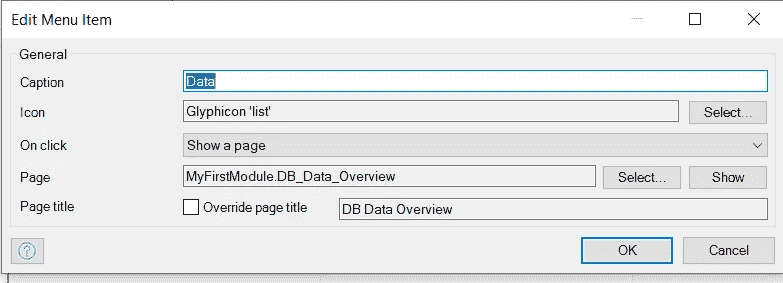

打开 pg admin(PostgreSQL admin)进行所有配置，这些配置应该与 mendix 配置中给出的配置相同。

从 Mendix studio pro 编译并运行该项目，然后单击导航栏中的数据，您将看到数据库中的所有数据。如图所示。

来自 mendix 数据库的数据(域模型)。

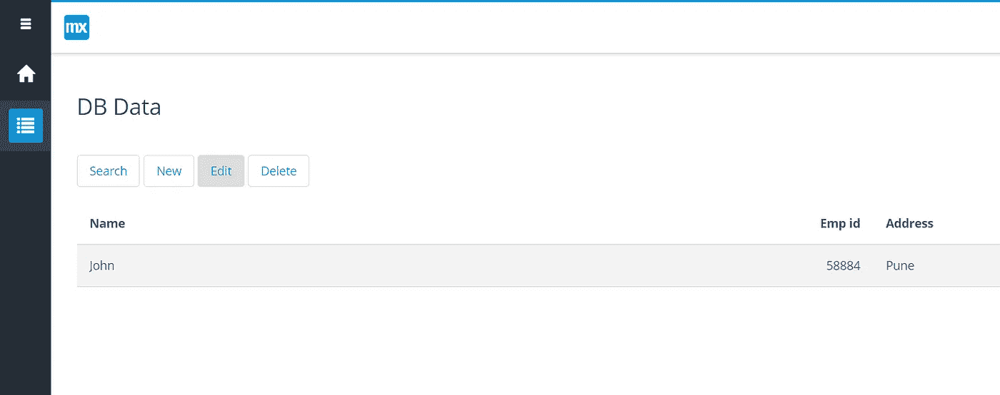

来自 PostgreSQL 的数据。

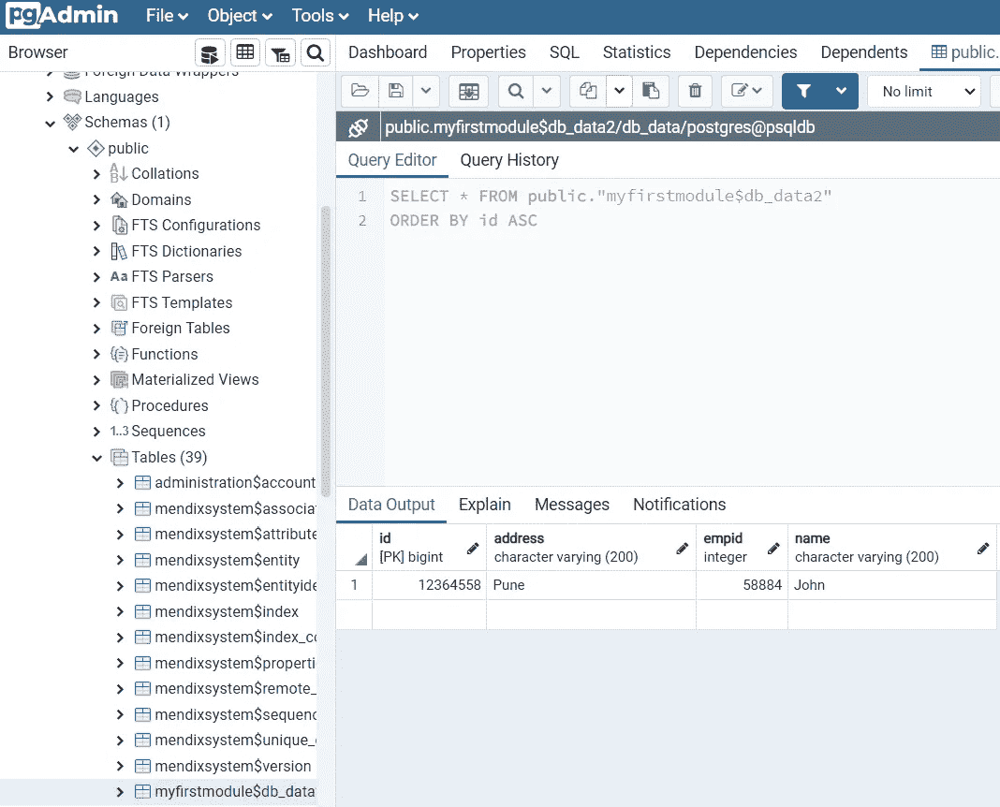

现在，从 Mendix 数据库向数据库添加新数据，单击概览页面中的 new。

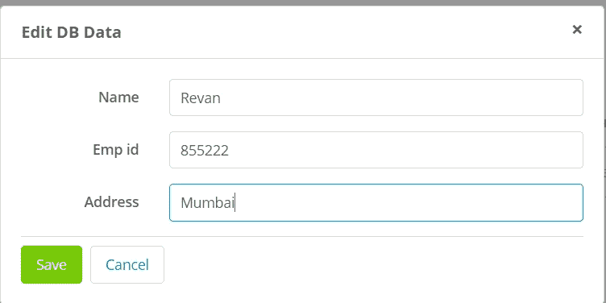

相同的数据将反映在两个数据库中。

添加新数据后修改数据:

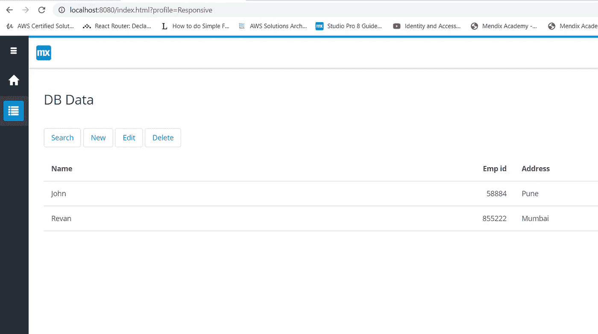

添加新值后修改 PgAdmin 数据:

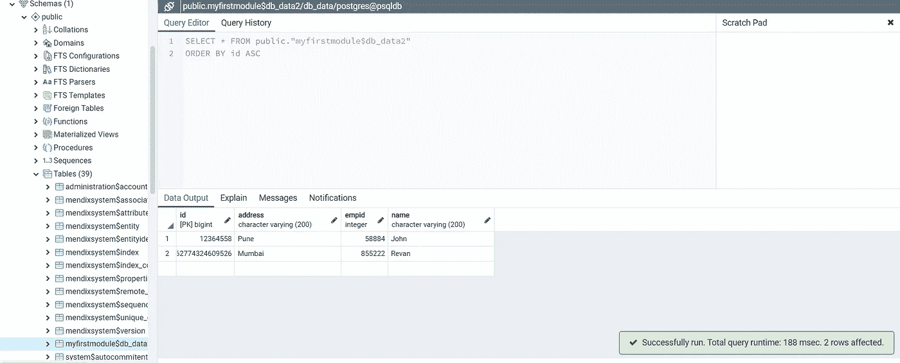

**查询报表:**

1.  **执行查询:**对关系型外部数据库执行 SELECT SQL 查询。当 java 操作试图与存在 JDBC 驱动程序的关系数据库连接时，使用 JDBC API。
2.  **Execute 语句:** Execute 语句内部工作方式与用于插入、更新、删除和存储过程或 DDL 语句的 Execute 动作相同。
3.  **执行查询&执行参数化查询**主要用于 SELECT SQL 命令，返回行类型的对象列表。
4.  **执行语句&执行参数化语句**用于插入，更新&删除。返回 integer/long 值，通常表示受影响的行数。

**Oracle 数据库**:对于 Oracle 数据库，“Oracle 连接器”在 Mendix 市场有售。因此，它支持特定于 oracle 的功能，如 PLSQL。

## 依赖关系:

根据数据库依赖的类型需要添加在项目结构中(在 Userlib 内部)

1) [HikariCP](https://github.com/brettwooldridge/HikariCP)

2)高性能(JDBC 连接池)

## 常见的 JDBC 驱动程序:

[亚马逊红移](https://docs.aws.amazon.com/redshift/latest/mgmt/configure-jdbc-connection.html#download-jdbc-driver)

[阿帕奇德比](http://db.apache.org/derby/derby_downloads.html)

[火鸟](http://www.firebirdsql.org/en/jdbc-driver/)

[H2 数据库引擎](http://www.h2database.com/html/main.html)

[HSQLDB](https://sourceforge.net/projects/hsqldb/files/)

[IBM DB2](https://www.ibm.com/support/pages/download-initial-version-115-clients-and-drivers)

[IBM Informix](https://www.ibm.com/products/informix?mhsrc=ibmsearch_a&mhq=informix)

[马里亚布](https://downloads.mariadb.org/connector-java/)

[微软 SQL 服务器/SQL 数据库](https://www.microsoft.com/en-us/download/details.aspx?id=11774)

[MySQL](https://dev.mysql.com/downloads/connector/j/)

[甲骨文数据库](https://www.oracle.com/database/technologies/appdev/jdbc-downloads.html)

[OrientDB](https://orientdb.org/)

[PostgreSQL](https://jdbc.postgresql.org/download.html)

[转眼间](https://prestodb.github.io/docs/current/installation/jdbc.html)

## 阅读更多

 [## Mendix World 2021 |召集您的应用开发团队 2021 年 9 月 7 日至 9 日

### 好像你需要说服…在一个全球制造商社区，他们想通过探索什么来相互学习…

bit.ly](https://bit.ly/MXW21) 

*来自出版商——*

如果您喜欢这篇文章，您可以在我们的 [*媒体页面*](https://medium.com/mendix) *或我们自己的* [*社区博客网站*](https://developers.mendix.com/community-blog/) *找到更多类似的内容。*

*希望入门的创客可以注册一个* [*免费账号*](https://developers.mendix.com/meetups/#meetupsNearYou) *，通过我们的* [*学苑*](https://academy.mendix.com/link/home) *获得即时学习。*

有兴趣更多地参与我们的社区吗？您可以加入我们的 [*slack 社区频道*](https://join.slack.com/t/mendixcommunity/shared_invite/zt-hwhwkcxu-~59ywyjqHlUHXmrw5heqpQ) *或者对于那些想要更多参与的人，请加入我们的* [*见面会*](https://developers.mendix.com/meetups/#meetupsNearYou) *。*