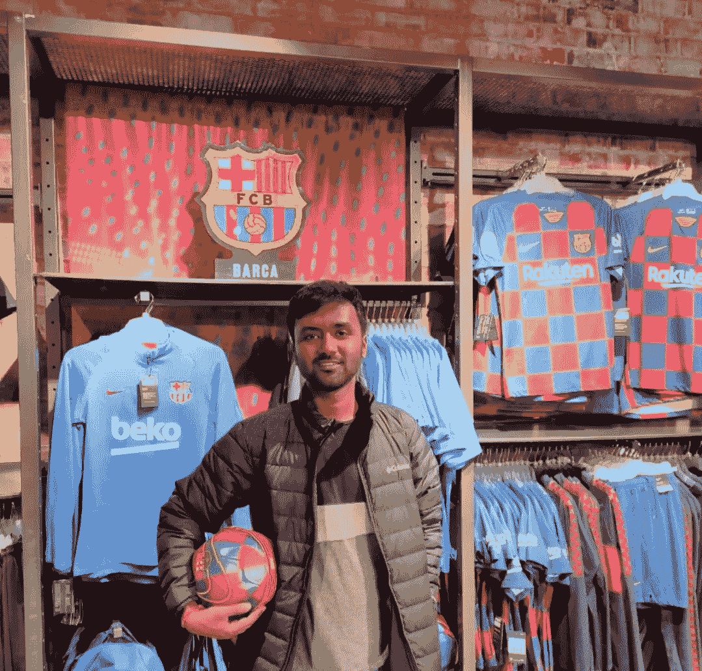

# 我与 Mendix / Dhrubo Jyoti Ghosh 的旅程

> 原文：<https://medium.com/mendix/my-journey-with-mendix-dhrubo-jyoti-ghosh-f3762362cb32?source=collection_archive---------3----------------------->

26 岁时，Dhrubo Ghosh 利用 Mendix 开始了他的国际开发生涯。我和他见了面，想知道低代码职业是如何帮助他在离家 5756 英里的伦敦开始生活的。

你刚开始做 Mendix 的时候在哪里？

从印度大学毕业后，我开始在凯捷工作(咨询、技术和外包服务)，这是我的第一份工作。我合作的第一个客户是 Chubb 保险公司。该项目是他们的 Ignite 应用程序之一，所以我必须学习用 Mendix 编写代码，因为 Ignite 是一个使用 Mendix 构建的平台，由 Chubb 所有。

**你在和 Mendix 一起开发之前是做什么的？**

我在印度国家理工学院读了四年工程学，取得了学士学位。我所在的校园有一个帮助学生毕业后找工作的项目，这就是我获得凯捷面试机会的原因。

在大学里，我学习了 Java 和 Python，还兼职学习了一些 Java 课程，所以我很专业，我想这在我的面试中帮助了我。加入凯捷培训后，我花了一段时间，但几个月后，我被安排作为顾问远程为 Chubb insurance 工作，那时我参加了学院速成班。

**从那以后，你的生活发生了怎样的变化？**

从那以后，我的生活发生了很大的变化。我想你可以说我能去伦敦是因为我的门德克斯技能。当我开始与 Mendix 一起构建时，我只是一名刚毕业的实习生。现在，我在我的项目中承担了更多的管理责任——从规划项目到组织团队。我从事这项工作已经有两年了，刚开始时，凯捷为我提供了很多培训。现在我在帮助训练我手下的人！它发生得非常快。

**你现在为 Chubb 开发了多少应用程序？**

与我的团队一起，我们已经为 Chubb 开发了六七个生产环境中的应用程序。除此之外，我还帮助过他们几个人。

**不到两年 7 个 app？！这一切都是远程工作吗？**

起初，我在凯捷印度海得拉巴办事处工作，但去年，我被派往伦敦，亲自在 Chubb 位于伦敦市的办事处工作。

在那之前你去过很多地方吗？

在我搬到伦敦之前，我只因为工作去过一次。凯捷让我去班加罗尔做一个关于 Mendix 的价值和好处的演示，这非常酷，也非常令人兴奋。

**学习平台前后，你对“低代码”开发有什么看法？**

在我得到我的第一个项目之前，我不知道什么是 Mendix 或 low-code。但我发现这很有趣，有编码经验的我感兴趣的是不必浪费时间为每个新项目编写基本代码来设置项目。

我很快就理解了它，因为它只是我在学校学到的面向对象编程原则的图形化表示，所以学习起来非常直观。因此，我很容易将业务需求转化为功能原型。

平台中有你最喜欢的功能或小工具吗？

我曾广泛使用过 [Excel 导入模块](https://appstore.home.mendix.com/link/app/72/Mendix/Excel-importer)。

它是我们许多应用程序的核心部分，我已经非常擅长通过 Mendix 应用程序处理电子表格。我喜欢编写定制的 Java 动作，因为我仍然可以以这种方式使用我的 Java 技能。我很擅长用 Java 处理微软 Office 文档。我们构建的每个应用都与其他系统有一些集成，使用 Rest 或 Soap API 连接总是很容易。

我最喜欢这个平台的部分是它的灵活性，因为它允许我轻松快速地充分利用我的技能。

**自从你开始使用 Mendix 后，你学到了什么新技能？**

我已经知道了 Java，但是从开始，我已经提高了这些技能。我们还试图让我们的应用程序变得漂亮，所以我在工作中学习了 CSS 和样式。我认为，与其拓展新的技能，不如提高我已经掌握的技能，获得更专业的技能组合。

搬到伦敦一定让你大吃一惊，这里和海德拉巴相比怎么样？

在英国生活，我最喜欢的是所有我喜欢的足球俱乐部都在这里！我从小就是一个狂热的足球迷。今年早些时候，我去曼彻斯特参观了他们的体育场。

这里有一种巨大的运动和健身文化，我喜欢它。我喜欢和我的朋友在公园踢足球。

我对伦敦城也很陌生，所以我喜欢观光，喜欢乘火车和地铁上下班。

**那么，当你不忙于开发时，你会做些什么来娱乐呢？**

在来这里之前，我对鼓很有热情。我喜欢玩摇滚，一些我最喜欢的乐队是电台司令和红辣椒乐队，但自从我来到伦敦，我还没有得到一套鼓，所以这很难。

我喜欢和朋友出去玩电子游戏，我有室友，我们一起工作，所以如果我们不出去，下班后就一起玩。

我们也经常踢足球。我是个超级球迷，我最喜欢的球队是巴塞罗那。如果我不能玩，那么我喜欢和我的室友去酒吧看比赛。

我现在也经常给我的家人打视频电话，我的姐姐在美国读化学工程研究生，我的父母在印度老家，所以我一有时间就打电话。

Dhrubo standing in a football merchandise store surrounded with Barcelona shirts

有什么最终意见吗？

我只想感谢我家乡的家人和朋友，以及所有在伦敦支持我的新朋友和同事，谢谢大家！

你有激动人心的故事吗？或者知道谁知道吗？在 [**Mendix 社区 Slack 频道**](https://join.slack.com/t/mendixcommunity/shared_invite/zt-8g6ecnz8-v2YXGYjVn07Xw1RmXeKNIA) **上找我，或者在** [**LinkedIn**](https://www.linkedin.com/in/ryan-mocke-43328093/) 上找我。