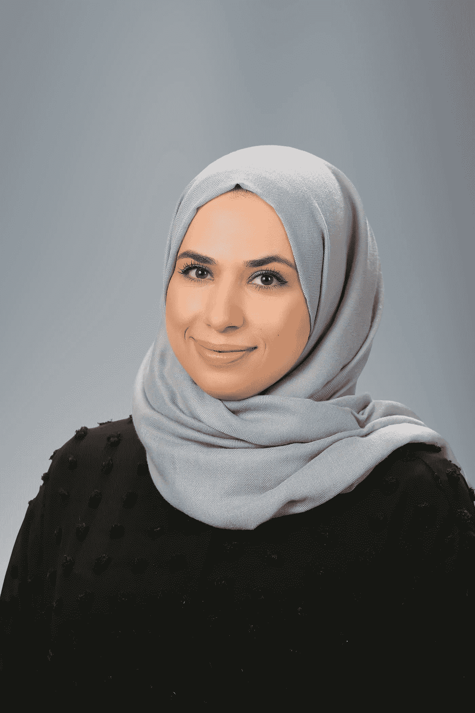

# 我与 Mendix /Nour Abu Asal 的旅程

> 原文：<https://medium.com/mendix/my-journey-with-mendix-nour-abu-asal-e3e038f684a3?source=collection_archive---------7----------------------->

# 你在什么公司工作，你现在的角色是什么？

我已经在 Avertra 公司工作了 3 年多，这是我在 Mendix 开始开发的第一家公司，因为我是加入 Avertra 的第一个有低代码/ BPM 平台经验的人。我成为了一名 Mendix 开发人员，并实现了 Avertra 的新愿景，将其产品从传统编码转换为 Mendix。我目前的职位是工艺工程主管

# 告诉我们你的教育情况

自从我完成大学学业已经有相当长的时间了，我已经获得了计算机信息系统的学士学位。那时，我还不确定我到底想要什么样的职业，我的激情在哪里。我参加了我能参加的最广泛的 IT 课程，这样我就有了一些涵盖一切的技能，但是我知道我想要建立一些东西。

# 您使用我们的平台有多久了？

我使用 Mendix 已经三年多了。三年前，我加入了 Avertra，并在 Mendix 开始了我的职业生涯——这是多么大的变化啊。我不知道我要去哪里，也不知道我是否喜欢它。这是我一生中经历过的最惊人的冒险，它拓展了我的知识、技能和对业务的理解，并总是给我新的挑战。对我来说效果很好…现在我是门迪克斯最有价值球员之一了！

# 你有什么开发技巧？

取决于今天的挑战是什么，以及需要什么样的技能。我喜欢按需学习，当我接到新任务时，我会接受新的课题。低代码/BPM 平台是我的最爱，我喜欢流程建模。用逻辑扩展领域，解决技术问题，展示如何用 Mendix 完成其他人认为用低代码不可能完成的事情。

# 除了 Mendix，你最喜欢的开发工具是什么？(相对于代码/Eclipse/Postman 等)

我喜欢使用 Postman，因为我喜欢制作、集成和测试 API。

# 你第一次听说 Mendix 的时候在哪里？

当我接到 Avertra 的电话时，我正躺在约旦家中的床上。他们想和我面谈 Mendix 开发人员的职位。我开始研究 Mendix，这就是我踏上这段旅程的原因！

# 你在开始用 Mendix 开发之前是做什么的？

我在另一个低代码/BPM 平台上开发了 6 年，这增加了我的技能，我在 Mendix 中扩展了更多。

Nour Abu Asal

# 从那以后你的生活发生了怎样的变化？

很多！在 Mendix 之前，我认为我的技能取决于我所经历的平台。

我不确定我能做什么。在以前的公司，我只是一直在开发应用程序，这并没有给我带来我喜欢的挑战。一遍又一遍地做同样的事情没有给我扩展技能的机会。

现在我知道我能做什么和我能学什么是没有限制的，我知道如何适应所需的技能，即使我不是这方面的专家，我也知道如何找到我的方法。

我很荣幸 Mendix 社区在 Mendix World 2020 炉边谈话中选择我作为三位技术专家演讲人之一；这是一次奇妙的经历，我收到了来自陌生人的可爱反馈，在这样一个开放和接受的社区中感觉很棒。

现在我是 Mendix MVPs 之一，但还有更多事情留给我去实现。

# 在你开发的所有应用中，哪一个是你最喜欢的，为什么？

我想我不止有一个。

我在 Mendix 中的第一个应用程序，我开始从传统编码转换到 Mendix。当我和 Avertra 一起开始在 Mendix 的旅程时，一切都是关于发现和快速开发产品，并在此期间看到产品开始扩展到更多的客户。体验一下是一种很神奇的感觉。现在这个 app“mi customer”是 Avertra 的主打产品。

在新冠肺炎的第一阶段，我还处理了一个客户的变更请求，以帮助添加一个应用程序类型，让他们受到严重影响的客户能够申请财务帮助。在最初几个月在家工作时，我们的一个客户有一个我们开发的应用程序，允许他们的客户提交帮助申请。该系统已经为一种应用程序类型构建，在疫情的第一个月，他们问我们是否可以实现另一种应用程序类型。这是为了让受到失业影响的客户能够提交申请，获得一些资金，以便在困难时期帮助他们。在大约 10 天的时间里，我们改变了整个系统的基础结构，接受了两种类型的申请，在家里的椅子上帮助社区是令人惊讶的。即使在这期间，我们也可以贡献一些东西，也许不是以直接的方式，但我知道我的技能会有所帮助。

根据我以前的经验，我开发了一个应用程序来跟踪针对妇女和儿童的暴力事件，这是我作为 BPM 开发人员职业生涯中的第一个项目，也是为了一个好的理由。用我的技能去帮助那些脆弱的人，让现实世界中的人们变得不同，这让我感觉很棒。

# 自从你完成了 rapid developer 课程，你的职业生涯发生了怎样的变化？

它以一种好的、意想不到的方式改变了很多。我喜欢我正在做的事情，以及我如何发现一些我以前没有注意到的事情。在使用 Mendix 之前，我认为我的技能只适用于我体验过的工具，但当我开始使用 Mendix 时，我意识到低代码平台技能并不局限于特定的工具，因为最终你会为自己的低代码职业生涯建立技能和思维定势。

通过使用 Mendix 和与 Avertra 企业主一起工作来满足需求，我必须提升我在许多领域的技能，我打算继续成长。

# 你对“低代码”开发有什么看法？学平台前后？

2011 年开始职业生涯，做低代码/BPM 平台，2017 年开始和 Avertra 一起在 Mendix 工作。我很高兴看到低代码越来越普及，被越来越多的公司认可和采用。

# 平台里有没有你最喜欢的功能或者小部件？

微流逻辑、集成、结构化领域模型，以及如何应用于最终用户的用户界面，因此基本上是功能和应用程序的 A-Z 过程，以确保它以一种完美的方式工作。

# 从那以后你学了什么语言？

我学习的东西取决于我们在工作中面临的挑战，JS，JQuery，Java，C#。Net 等等。我如何以及何时获得技能和语言是基于我正在从事的项目的质量中心。我的技能计划一直在发展。

# 到目前为止，你认为你最大的成就是什么？

我最大的成就是我的团队。建立它，看着我的团队成员成长。尤其是和年轻的团队成员一起工作。看到他们，他们怎么这么快就熟练起来了。每一天，在很短的时间内，他们比一些资深人士更有效率。

我喜欢思考我不仅影响了他们的职业生涯，他们还在很多不同的层面上影响了我的职业生涯。

# 你最大的梦想或目标是什么？

我希望看到这个世界生活在和平与和谐之中。永远不要根据你的母语、性别、肤色、宗教或思想来判断。

# 如果你可以选择任何一个人(死的或活着的)和你一起被困在电梯里，你会选择谁，为什么？

我想我会有一个晚宴！因为新冠肺炎，我已经有一段时间没有见到我的朋友了。特别是那些留在约旦(我的国家)以外的人，所以我会把他们都聚集起来，只是玩玩。我知道，那需要大电梯！

# 走之前的最后想法，有什么遗言或呼喊吗？

感谢每一个总是给我需要的支持的人，那些在我糟糕的日子里鼓励我的人，那些在我认为我做不到的时候相信我能做到的人。

感谢我所有的 Avertra 团队，这个家庭，无论是好的日子还是坏的日子，我都很乐意成为其中的一员。我很高兴看到自三年前与 Mendix 合作以来，我们一直保持如此快速的增长。

感谢 Mendix 社区认可我，让我成为 Mendix MVP。在整个社区中，开发者和他们的努力应该得到奖励。我希望它能鼓励和激励其他人。

找到你的激情是我鼓励每个人去做的。不断扩展你的知识面，学习的世界是无止境的。开始新的事物或接受新的挑战永远不会太晚。

也许有一天会引领你成为 MVP。

*您有兴趣加入 Mendix 社区或与我们联系，了解如何为我们写作吗？你可以在* [*Mendix 社区松弛频道*](https://join.slack.com/t/mendixcommunity/shared_invite/zt-hwhwkcxu-~59ywyjqHlUHXmrw5heqpQ)*@瑞安莫克*联系我