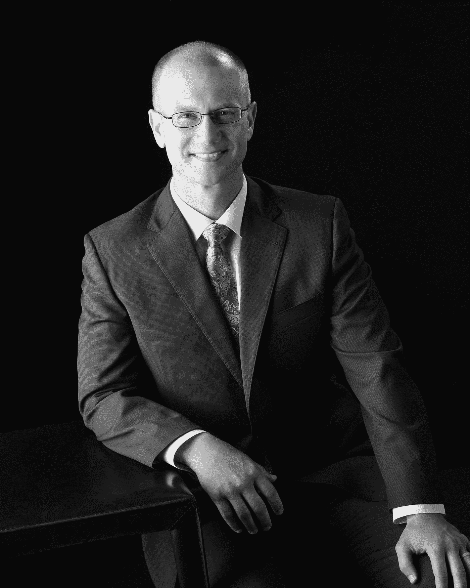
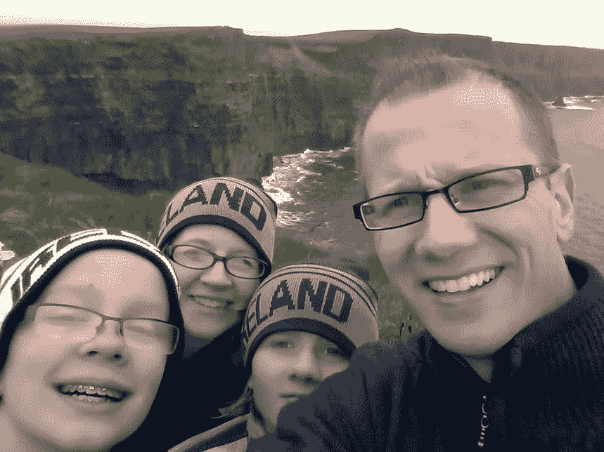

# 我和门迪克斯/保罗·伊登的旅程

> 原文：<https://medium.com/mendix/my-journey-with-mendix-paul-eden-2c3080799e1a?source=collection_archive---------3----------------------->

# 你在什么公司工作，你现在的角色是什么？

我在杨百翰大学工作，目前的职位是 BYU 应用的高级主管。BYU 应用程序是大学 IT 中心办公室的一个部门，我们的章程是为校园建立独特的数字解决方案，这些是大学使命的核心，不能购买或配置。我们维护着 60 多种独特的产品，数百个可独立部署的系统，以及大约 60 名全职和兼职的 IT 专业人员。

# 告诉我们你的教育情况

在高中，我演了很多戏，唱了很多歌，也跳了很多舞。以至于我想成为一名艺人，甚至成为 Mc Hammer 的伴舞。这是在计算机成为主流之前。幸运的是，我决定不这么做，(原因是另一个故事)，但即使在那之后，我也很难决定在 BYU 大学学习什么专业。我经常并且兴致勃勃地换专业，最终获得了人类发展(家庭科学的一个分支)的理学学士学位。大约在我毕业前一年，我从一个室友那里得知，他们的兄弟是一名数据库管理员，收入颇丰。我很惊讶你可以通过做这么有趣的事情来谋生，所以我在毕业前学了大约一半的本科计算机科学课程，并且不得不离开 Provo，因为我年轻的家庭需要收入。我一边工作，一边和年幼的孩子们在一起，在网上获得了 MBA 学位，从那以后，我一直在 IT 行业工作，主要是做软件程序员..

# 您使用我们的平台有多久了？

自 2019 年 6 月 BYU 首次采用该技术以来，我领导了一个项目，为该大学选择并提出了一个低代码/高生产率平台，以实现标准化。

# 你有什么开发技巧？

我从大学学 CS 开始就一直在编程，从那以后就没有停止过。我做过很多 web 和控制台应用程序。老实说，我更像是后端开发人员，而不是前端开发人员。我总是发现前端对我的口味来说太混乱了，而后端要优雅得多。这就是为什么我在制作 web 应用程序时总是强调要有一个前端开发人员与之合作。

我也做过 API、容器和无服务器的工作。

# 除了 Mendix，你最喜欢的开发工具是什么？(相对于代码/Eclipse/Postman 等)

绝对是 VIM。我最初在学习 it 方面的投资已经获得了数倍的回报。它的速度无与伦比，令人印象深刻的是，它实际上是一个控制台编辑器。

之后我会说 IntelliJ 想法。JetBrains 的工作人员在 IDE 上做得非常好。

对于 HTTP 工作来说，Postman 真的很好。

# 你第一次听说 Mendix 的时候在哪里？

我参加了 2018 年底在拉斯维加斯举行的 Gartner 应用战略和解决方案研讨会，调查低代码平台。我第一次见到托尼·梅尔和西蒙·布莱克是在那里。那时，Mendix 只是我们正在学习的许多低代码平台中的一个。

# 你在开始用 Mendix 开发之前是做什么的？

我曾经管理过许多才华横溢、充满激情的软件开发人员和其他 IT 专业人士，现在仍然如此。

# 从那以后你的生活发生了怎样的变化(不是经济上的)？

我们已经能够在我们的项目中比以前在我们的其他技术堆栈中完成更多。我们也不必过多考虑基础设施。那真是太好了。

# 在你开发的所有应用中，哪一个是你最喜欢的，为什么？

我想应该是 BAMP (BYU 应用测量和规划)。这是一个 Mendix 应用程序，它自动化了我所在部门的领导团队必须完成的所有手动流程，在 It 部门还没有更正式的工具。它为我们节省了很多时间，也避免了在许多电子表格中做同样的事情所带来的挫败感。目前，我们使用它进行项目资源规划、规模确定和评估，以及年度团队能力规划。当我们需要为我的部门领导自动化一个过程时，我首先将它放入 BAMP，如果该功能被更正式地实现，我们就停止使用 BAMP 功能。由于官方工具需要很长的时间来实现(通常是几年)，并且不总是适合所有的需求，我设想在很长一段时间内使用 BAMP。Mendix 允许我们根据需求的变化快速改变它。

# 你经常出差吗？

我确实因为工作而旅行，但主要是为了职业发展和向他人学习。2019 年前往荷兰参加 Mendix World 绝对是一大亮点。我和我的家人去过爱尔兰很多次，也很喜欢它。莫赫悬崖令人叹为观止，在爱尔兰酒吧听现场音乐是无与伦比的。

# 自从你完成了 rapid developer 课程，你的职业生涯发生了怎样的变化？

不多。快速开发者课程很好，但是只给你基础。在那之后，我花了好几个月的时间学习、试错，才精通 Mendix。

# 你对“低代码”开发有什么看法？学平台前后？

早在 2018 年之前，我认为低代码更多的是一种噱头或过于特殊的目的，而不是像我们在第三代编程堆栈中那样为广泛的需求创建应用的真正方式。现在，我觉得低代码比我那时适用于更多的用例。可视化编程在理解不熟悉的逻辑方面创造了奇迹。我期待着真正的 Mendix 云自动扩展和零停机部署，这样我们就可以在更多的用例中使用它。

# 在这个平台上，你有没有最喜欢的功能或部件？

我在每个应用程序中都使用数据网格，但是当我需要更多的灵活性时，我会使用列表视图，通常是布局网格和 app store 中的列表视图控件模块。期待 Mendix Studio Pro 9 中对数据网格的增强。Deploy API 对于自动化项目组合管理功能来说也是很棒的，对此我很感激。我目前也在学习可插拔的小部件来创建我自己的 UI 小部件。这是需要很多时间的地方之一，但肯定不会比一直在那个水平上工作更长，我很欣赏当我们需要它时的灵活性。

# 在学习 Mendix 之前，你了解过什么编程语言吗？

我从 1997 年开始编程，一直没有停止过。我首先学习 Java 作为一门课程的一部分，然后是 C 和 C++，然后是 BASH、PERL、Python、JavaScript、Golang 和 Clojure。出于不同的原因，我喜欢它们，但 Python 和 Clojure 是最能让我了解编程的两个。然而可悲的是，即使有了他们，我也总是对用他们创建可工作的产品软件所花的时间感到沮丧。

我觉得软件程序员可以成为伟大的商业领袖(想想比尔·盖茨、拉里·佩奇、谢尔盖·布林、马克·扎克伯格等)，因为他们知道团队结构如何影响数字化转型(有人知道康威定律吗？).因此，一个好的商业领袖也是一个隐含的软件架构师，不管他们是否知道，如果他们知道，结果会更好。这是我坚持编程的原因之一，即使我的时间被管理职责所限制。

# 从那以后你学了什么语言？

坦白地说，自从我学会了 Mendix，我对我可以用它创建多少和多快地工作、生产软件感到非常兴奋，我完全专注于它。我一直对可视化编程环境很着迷，有一次甚至捐了一点给麻省理工学院，帮助他们把他们的 Android 应用 Inventor 移植到 iOS 上。程序员经常觉得他们需要一遍又一遍地重新发明轮子，为了灵活性，他们在技术栈的较低层次工作。在今天的市场中，这样做的成本通常高于必要的认知负荷和浪费的时间。Mendix 允许您在更高的抽象层次上工作，而不会失去在必要时深入到“这里是龙”的更低层次的能力。

# 到目前为止，你认为你最大的成就是什么？

我想说我最大的成就是说服我那了不起的妻子嫁给我。我花了很多努力来提高自己，包括学习弹吉他。

第二是抚养两个了不起的孩子。第三是我去巴西的宗教使命和我在那里帮助的所有人。第四个可能会在圣殿广场的唱诗班演唱。

# 你最大的梦想或目标是什么？

你需要了解我的一点是，我是一个非常虔诚的人。我坚信仁慈公正的上帝和来世。所以我知道我最大的梦想和目标是过上充满爱、善良、勇气和同情的美好生活，在我的生命结束后，回到他和我的家人身边。

# 你将如何实现这个目标？

一天一天，保持与上帝的联系，我把他称为我的天父，通过祈祷，愿意变得勇敢，谦卑，倾听他和其他人，并面对我的恐惧。我一生中所取得的一切都是通过这种方式实现的，包括说服 BYU 的领导层相信我，使用 Mendix 将会为大学带来净收益。

# 如果你可以选择任何一个人(死的或活着的)和你一起被困在电梯里，你会选择谁，为什么？

我老婆！她是如此有趣和不可预测。我珍惜和她在一起的所有时光。她也总是做好准备，所以有她在，我们都更有可能挺过来。

# 走之前的最后想法，有什么遗言或呼喊吗？

向我所有的 BYU 朋友和我们了不起的 Mendix 团队大喊，包括 Indira Deonandan、Jodi Kling、Conor Woelfel、Rob Bond 和 Liza Davidov。