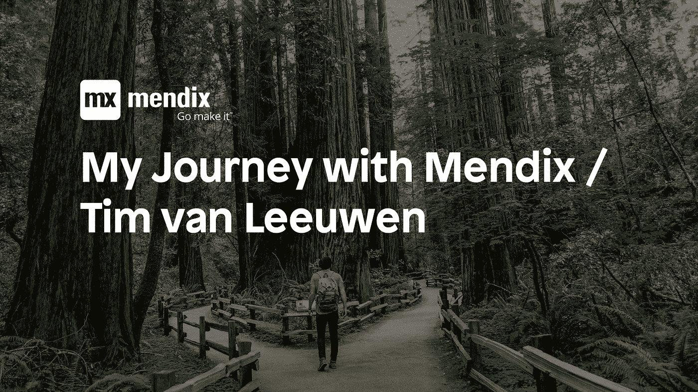

# 我和门迪克斯/蒂姆·范·卢文的旅程

> 原文：<https://medium.com/mendix/my-journey-with-mendix-tim-van-leeuwen-755b9d9fa374?source=collection_archive---------1----------------------->

Tim 只有 21 岁，已经用低级代码开始了他的技术生涯。现在，在与我们一起开始他的旅程后仅仅几个月，他已经为鹿特丹市开发了一个应用程序。我和他坐在一起，想知道他是如何做到的。

# 在接触 low code 之前，你有什么经历？

我在荷兰代尔夫特技术大学学习航空工程，在那里我第一次接触到了计算机编程。有趣的是，这并不是这项研究的主要重点。在大学，我学了三个月的 Python。我可以很容易地理解其中的逻辑，但不知何故，这对我来说并不自然，因为我并没有比“Hello World”应用程序更进一步。

学习之后，我不太确定我是否想把航空航天作为我的职业，所以我决定接受挑战，在[古德佐](https://www.goodzo.nl/)开始实习。GOODZO 是 Mendix 的合伙人，专门从事 IT 外包和人才开发。在这里，我有机会一边工作，一边学习新技能。这给了我足够的时间去思考我想做什么。

当我刚开始工作时，我接听电话帮助解决 IT 问题，管理内部系统上的预订房间请求。过了一段时间，变得相当平淡。就在那一刻，我决定主动编写一个小的 python 应用程序来尝试自动化这一点。当我把这个应用程序展示给我的经理们时，他们立刻被打动了，并问我是否有兴趣学习 Mendix。

# 你们公司有人可以选择学习 Mendix 吗？

如果你仔细想想，有一个小的选择过程是有意义的。最后，公司想确保你开始做你想做的事情。任何感兴趣的人都可以要求参加 Mendix 培训，只要你不打算中途放弃。这真的是为每个喜欢为问题提供解决方案的人准备的。

# 一旦你开始了，你做什么训练？

GOODZO 有一个开发专家，他训练了我和其他五个学员。我们连续三个月只在星期五进行训练，但是不要太兴奋——在这期间我们也有家庭作业。我们也有一个项目，我们在公司内部工作，以提高我们的技能，同时提供一些公司可以使用的东西。我们设法为内部员工开发了一个应用程序，看看你可以申请哪些培训和认证。我们连续一个月每周花一天时间开发这个应用程序，所以你可以说我们用了大约四天时间就完成了。

# 到了这个阶段你对 Mendix 的印象如何？

我以为很好学；我只是喜欢我可以用这个平台做很多事情。使用 API 是我喜欢做的事情，因为你不必浪费时间创建结构和所有这些，你可以直接导入它，Mendix 会处理剩下的事情。

# 你完成训练后，接下来发生了什么？

当我完成[快速开发人员培训](https://gettingstarted.mendixcloud.com/link/path/31/Become-a-Rapid-Developer-(Analyst))时，我被安排在一个 scrum 团队中，但我是团队中唯一的 Mendix 开发人员。那只是一个 scrum 大师，我自己，和一个产品所有者。

此后不久，我有机会去拜访对使用 Mendix 感兴趣的客户；这一切发生得非常快。

# 你转换角色后，生活中最大的变化是什么？

我立即变得更加独立，因为我承担了更多的责任。我加入了一个非常小的团队，所以团队相信我能完成我的工作。但我也承担了更多的责任，这真的很愉快。

一开始，当我接电话和管理系统时，一切都是例行公事，井井有条。现在，我的团队可以给我一个用户故事，我会走开去做，当我把它展示给他们时，他们会说，“哇，这太棒了！真的是你干的吗？”。

# 你最喜欢的应用是什么？

我不得不说，在过去的几个月里，我为鹿特丹市政当局开发的应用程序。这是我最喜欢的应用程序，因为它完全是我自己开发的。我确实使用了市政开发团队创建的一些模块，但应用程序的核心部分都是我自己做的。

该应用程序是为城市的公民，提交社区活动和倡议的计划。

城市的每个区域都有一些主题。但基本上，鹿特丹的居民可以提交想法来改善社区，他们可以从市政当局那里获得资金。

这个想法是让公众对如何建设他们的社区有发言权。

# 这几个月你在家工作吗？

是啊！在我们开始进入封闭状态之前，我在我的新职位上只呆了两个星期左右，这在一开始是非同寻常的。不过，我很快就习惯了，有了 Mendix，使用 [Mendix 团队服务器](https://docs.mendix.com/developerportal/develop/team-server)和开发者门户，远程工作变得很容易。我最喜欢的锁定部分是使用我自己定制的家用电脑。

# 你造了一台定制电脑，我想你是个游戏玩家吧？

当然，我会称自己为游戏玩家。我玩很多游戏，但现在火箭联盟是我最喜欢的游戏之一。我最喜欢做的放松的事情之一是下班后给我的朋友打电话和玩在线游戏。这真的有助于我提供一些正念。

# 你有没有尝试过构建任何原生的移动功能？

实际上，我是上周末才开始学的。我的团队问我是否可以实现一些本机功能。他们想在我现在正在开发的应用上获得离线功能，这是一个交通管理系统。如果交通灯系统出现任何故障，它会记录问题，供现场技术人员解决。所以我还不能说我已经建立了它，但我现在正在研究它。我已经在社区中找到了大量的在线资源来帮助我开始。

资源:

*   [原生手机](https://docs.mendix.com/howto/mobile/native-mobile)
*   [原生手机入门](https://docs.mendix.com/howto/mobile/getting-started-with-native-mobile)
*   [部署原生应用](https://docs.mendix.com/howto/mobile/deploying-native-app)

# 蒂姆，下一步是什么？

现在，我正忙于工作，但我想找个时间回去学习，在那里我想了解更多关于不同的 IT 研究。我不认为我会全职学习，但也许我可以兼职学习新技能。现在，我正在从事 CSS 和造型方面的工作，但我想找一个大学课程，只要我继续为他们工作，GOODZO 就会继续鼓励我的职业发展，所以我打算好好利用这一点。本周五我还将参加 Mendix 高级开发人员考试——太令人激动了！(蒂姆已经通过了考试，加油，蒂姆！)

总的来说，我想继续探索 Mendix 之旅，看看它会把我带到哪里。

# 请在空闲时与我们交谈

你是从什么时候，怎么开始使用 Mendix 的？我们希望收到您的来信！如果您想分享您的故事，请在 Mendix Slack 上找到 Ryan 或 Lars。