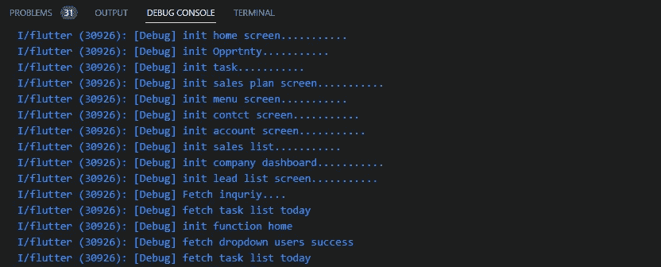

# 我的十月飘动笔记— 2

> 原文：<https://medium.easyread.co/my-october-flutter-notes-2-6e0c78cf2e56?source=collection_archive---------1----------------------->

## 提高 Flutter 应用程序性能的 flutter 解决方案、问题和技巧


Photo by [Davies Designs Studio](https://unsplash.com/@davies_designs?utm_source=medium&utm_medium=referral) on [Unsplash](https://unsplash.com?utm_source=medium&utm_medium=referral)

—在学习和开发 flutter app 的过程中，我面临了几个挑战和问题。我第一次用 flutter 创建应用程序时，主要的指导方针是构建一个工作应用程序。但是现在，挑战不同了。它不仅能工作，还能构建性能良好的应用程序。在这里，我收集了我为提高性能所做的更改。

顺便说一下，这是我上个月笔记的延续。我在博客中总结了六个特性、解决方法或开发技巧。如果你错过了，你可以通过下面的链接阅读:

[](/my-september-flutter-notes-700907827c7f) [## 我九月飘动的音符。

### 您可能已经错过的一些 flutter 开发技巧、特性和解决方法。

medium.easyread.co](/my-september-flutter-notes-700907827c7f) 

> 目录

> — *明智地使用 SingleChildScrollView 停止使用索引堆栈来持久化底部导航栏
> —关于 TextStyle 的问题
> —处理长列表
> —引用*

好的，这就是我们将在这个博客中探讨的。让我们从第一个开始:

## 1.明智地使用 SingleChildScrollView

如果你认为 [**列**](https://api.flutter.dev/flutter/widgets/Column-class.html)**+**[**SingleChildScrollView**](https://api.flutter.dev/flutter/widgets/SingleChildScrollView-class.html)**=**[**ListView**](https://api.flutter.dev/flutter/widgets/ListView-class.html)**(**带纵轴方向 **) 【T25)，那你就选错了。**

乍一看，行为是一样的。[**ListView**](https://api.flutter.dev/flutter/widgets/ListView-class.html)**是一个可滚动的小部件。 [**列**](https://api.flutter.dev/flutter/widgets/Column-class.html) 是在垂直方向显示其子级的小工具。而在通常的做法中，当我们需要使[](https://api.flutter.dev/flutter/widgets/Column-class.html)****列可滚动时，最简单的方法就是用[**SingleChildScrollView**](https://api.flutter.dev/flutter/widgets/SingleChildScrollView-class.html)将其包装起来。虽然这是常见的做法，但并不意味着这是正确的使用方法。******

****我们来看看对比。我这里有 50 个 [**卡**](https://api.flutter.dev/flutter/material/Card-class.html) 小部件。****

```
**List<Widget>.generate(50,(int index)=> MyCardWidget());**
```

********

****SingleChildScrollView + Column****

********

****Listview****

****正如我们在上面两张图片中看到的，它们是完全不同的。所以… **当**你有一个子列表并且不需要跨轴收缩包装行为时，例如，一个总是和屏幕一样宽的滚动列表，考虑 [**ListView**](https://api.flutter.dev/flutter/widgets/ListView-class.html) 。**不使用**[**SingleChildScrollView**](https://api.flutter.dev/flutter/widgets/SingleChildScrollView-class.html)**。**对于这种情况，使用一个[**ListView**](https://api.flutter.dev/flutter/widgets/ListView-class.html)**要高效得多。******

> ******为什么？******

******简单的逻辑:当你有一个动态大小的部件时，渲染的成本会比静态大小的部件更高。*示例*:索引为 11 的小工具索引 1 根据小工具内文本的长度有不同的宽度。颤振首先计算文本的长度，然后将尺寸分配给 [**卡**](https://api.flutter.dev/flutter/material/Card-class.html) 。******

****而在 [**Listview**](https://api.flutter.dev/flutter/widgets/ListView-class.html) 中，所有 [**卡片**](https://api.flutter.dev/flutter/material/Card-class.html) 小工具宽度相同。无需对每张卡进行计算。****

*****贵，意为* ***他们消耗更多的资源*** *。这导致了较差的性能。*****

****[**singlechildscroll view**](https://api.flutter.dev/flutter/widgets/SingleChildScrollView-class.html)**当你有一个通常完全可见的单个框时，这个选项很有用。作为一个好的实践，使用[**SingleChildScrollView**](https://api.flutter.dev/flutter/widgets/SingleChildScrollView-class.html)**来解决小部件溢出大小的警告。这通常发生在设备屏幕太小的时候。********

******当你有一个很长的窗口小部件列表时，考虑使用一个 [**列表视图**](https://api.flutter.dev/flutter/widgets/ListView-class.html) 。那是因为 [**ListView**](https://api.flutter.dev/flutter/widgets/ListView-class.html) 按需构建孩子。******

*****按需构建子项意味着只创建屏幕上可见的子项。例如，如果我们有 1000 个窗口小部件，但屏幕上只能显示 8 个窗口小部件。那么构建器将只创建 8 个可见的小部件。每当用户滚动列表时，都会创建一个新的子列表。屏幕上不再可见的老孩子将被销毁。*****

****不建议将[**ListView**](https://api.flutter.dev/flutter/widgets/ListView-class.html)**中的 [**列**](https://api.flutter.dev/flutter/widgets/Column-class.html) 用[**SingleChildScrollView**](https://api.flutter.dev/flutter/widgets/SingleChildScrollView-class.html)包装。******

```
**// Bad Practice
SingleChildScrollView(
 child:Column(
    children: [
       ListView.builder(),
       SizedBox(),
       ListView.builder(),
       ....**
```

****[**ListView**](https://api.flutter.dev/flutter/widgets/ListView-class.html)**。上面代码中的构建器**将不再提供任何性能优势。所有子部件将被一次创建。如果视区通常包含超出屏幕尺寸的内容，那么[**SingleChildScrollView**](https://api.flutter.dev/flutter/widgets/SingleChildScrollView-class.html)**将会非常昂贵。******

## *******2。停止使用 IndexedStack 制作持久底部导航栏*******

******如果您正在寻找使您的[**BottomNavigationBar**](https://api.flutter.dev/flutter/material/BottomNavigationBar-class.html)**在所有屏幕上持久化的代码，您可能会找到一些使用[**indexed stack**](https://api.flutter.dev/flutter/widgets/IndexedStack-class.html)**小部件的变通方法。这是一个很好很简单的解决方案，我以前用过。然而，当我们第一次打开应用程序时，它**有一个相当糟糕的影响**。我们来看看使用 [**IndexedStack**](https://api.flutter.dev/flutter/widgets/IndexedStack-class.html) 时的 widget 树形结构。**********

****使用这种方法，我们将有一个父小部件，它有[**BottomNavigationBar**](https://api.flutter.dev/flutter/material/BottomNavigationBar-class.html)**。**小时候屏幕会一个一个叠起来。将根据所选索引显示子部件。****

> ****那怎么了？****

****这是我解决问题的方法。当我打开应用程序时，它将首先导航到 BaseLayout 小部件(根据我的类名)。事实是，“所有”子部件都将由 flutter 执行。不仅是选定的索引。****

****例如:我有 10 个子部件。`Page1()`、`Page2()`、`Page3()`等等……
初始选择指数= 0。在这种情况下，`Page1()`将显示在屏幕上。****

****我假设只有`Page1()` 类会被执行。然而，flutter 执行了`Page1()`到`Page10()`。****

> ****让我们证明它****

****我在每个孩子的 initState 中打印字符串。我将在我的主屏幕上举一个功能的例子。比如下面的代码:****

```
**[@override](http://twitter.com/override)
void initState() {
  print("init home screen...........");
  super.initState();
  fetchApi();
}**
```

****我也为所有的孩子打印相同的字符串。见下图，所有 initState 函数执行 print "**init $ { name screen }………"******

********

****想象一下，如果你小时候在 [**IndexedStack**](https://api.flutter.dev/flutter/widgets/IndexedStack-class.html) 有一个 tens 屏幕。您的 flutter 应用程序将需要一些时间来完成所有执行。****

****对于这个问题，我目前的解决方案是将[**indexed stack**](https://api.flutter.dev/flutter/widgets/IndexedStack-class.html)**换成 **switch-case** 。使用这种方法，只会执行选定的索引。参见下面的代码:******

## *****3。关于文本样式的问题*****

****我是从[**stack overflow**](https://stackoverflow.com/q/73923860)上的一个问题发现这个问题的。[**text style**](https://api.flutter.dev/flutter/painting/TextStyle-class.html)**的背景颜色被字符串末尾的空格(asci code = 32)忽略。这就是我如何调查它的。******

```
****Container(
  color: Colors.amber,
  child: const Text('   Foo    ',
      style: TextStyle(
      backgroundColor: Colors.blue,
      color: Colors.white,
     ),
  ),
),****
```

******请参见下图:******

************

******我用一个 [**容器**](https://api.flutter.dev/flutter/widgets/Container-class.html) 包装了 [**文本**](https://docs.flutter.dev/development/ui/widgets/text) 小部件，并将背景色设置为黄色。而对于 [**Textstyle**](https://api.flutter.dev/flutter/painting/TextStyle-class.html) ，我把背景色设置为蓝色。******

*   ****第一个`Foo` :蓝色背景应用到最后一个“o”。最初，我假设没有呈现空白。****
*   ****第二个`Foo` :证明空白被渲染。黄色背景色赋予了 [**文本**](https://docs.flutter.dev/development/ui/widgets/text) 小部件中的最后一个空格。****
*   ****第三:我在 [**文本**](https://docs.flutter.dev/development/ui/widgets/text) 小部件中添加了一个不可见的字符 *\u200e* ，应用了背景。****
*   ****最后，只有空白:没有应用蓝色背景****

> ****其实这个问题还是悬而未决的。如果你真的需要为 [**文本**](https://docs.flutter.dev/development/ui/widgets/text) 小工具添加空间，你可以使用上面的提示，在最后一个字符串上添加一个不可见的字符。另一个选项是使用一个[**TextSpan**](https://api.flutter.dev/flutter/painting/TextSpan-class.html)**小部件，并向其添加水平填充。******

******对该问题竖起大拇指，以引起贡献者的注意。您可以在这里找到未解决的问题:******

******[](https://github.com/flutter/flutter/issues/112766#issue-1393795134) [## TextStyle:背景色不适用于文本后的“空白”。问题#112766 …

### 我对 StackOverflow 上的问题很好奇。TextStyle 上的 backgroundColor 属性不适用于…

github.com](https://github.com/flutter/flutter/issues/112766#issue-1393795134)****** 

## ******4.使用长列表******

******在第一个主题中，我们比较了[**SingleChildScrollView**](https://api.flutter.dev/flutter/widgets/SingleChildScrollView-class.html)**和 **ListView** 小部件。现在让我们更具体地使用**列表视图**小部件。********

> ****标准的[**ListView**](https://api.flutter.dev/flutter/widgets/ListView-class.html)**构造函数适用于小列表。要处理包含大量项目的列表，最好使用[**listview . builder**](https://api.flutter.dev/flutter/widgets/ListView/ListView.builder.html)构造函数。******

****默认情况下，[**ListView**](https://api.flutter.dev/flutter/widgets/ListView-class.html)**构造函数要求一次性创建所有项目。但是[**listview . builder**](https://api.flutter.dev/flutter/widgets/ListView/ListView.builder.html)构造函数创建滚动到屏幕上的项目。******

****示例案例:如果您有一个长度为 10，000 的列表小部件，可以考虑使用 [**ListView.builder**](https://api.flutter.dev/flutter/widgets/ListView/ListView.builder.html) 。因为渲染 UI 时会影响 app 的性能。成千上万的部件是一个很长的列表。一次生产所有的产品会很贵。 [**ListView.builder**](https://api.flutter.dev/flutter/widgets/ListView/ListView.builder.html) 构造函数将处理按需小部件创建机制。****

****老实说，我想分享许多问题、解决方法和技巧。但是这 4 个题目有很长的解释。所以我决定把它们写在我的下一篇文章中。如果你喜欢这篇文章，请等待我的下一个颤振笔记。最后，感谢你的阅读。如果你有任何问题或意见，欢迎在下面留言。我很乐意展开任何讨论。****

## ****参考****

*   ****[dart —所有屏幕都需要一个持久的/相同的底部导航栏— Flutter —堆栈溢出](https://stackoverflow.com/questions/54767298/need-a-persistent-same-bottom-navigation-bar-for-all-screens-flutter)****
*   ****[https://github . com/flutter/flutter/issues/112766 # issue-1393795134](https://github.com/flutter/flutter/issues/112766#issue-1393795134)****
*   ****[https://www.ascii-code.com/](https://www.ascii-code.com/)****
*   ****[处理长列表|颤动](https://docs.flutter.dev/cookbook/lists/long-lists)****