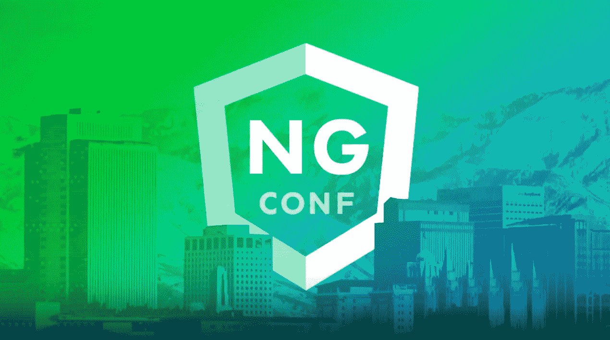

# Angular 我从 ng-conf 2017 中挑选的

> 原文：<https://medium.com/google-developer-experts/my-picks-from-ng-conf-2017-d971842c0d05?source=collection_archive---------2----------------------->

精彩的演讲、幻灯片和其他有用的资源

Image from [ng-conf](https://www.ng-conf.org/).

在这篇博文中，我想通过简单的概述和提供一些额外的资源来分享我在直播中关注的一些演讲。

了解 **Angular** 的最佳途径之一可能是关注世界各地举行的 ng-conf 会议。你可以查看[**Angular . io**](https://angular.io)**来了解你身边发生的其他 [Angular 事件](https://angular.io/events.html)。**

**今年 [**ng-conf**](https://www.ng-conf.org/) 庆祝了他们的**第四版**。这是最初的 Angular 会议，在犹他州盐湖城的一周时间里聚集了各种各样的开发人员。**

> **声明:这是一个非常小的不完整的会谈列表。在此找到今年所有可用的视频[。](https://www.youtube.com/user/ngconfvideos/videos)**
> 
> **知道其他资源吗？让我知道，我会在这里添加它们！*💖***

# **ng-conf 2017**

## **Stephen Fluin 和 Igor Minar 的第一天主题演讲**

**会议开始时，Igor Minar 介绍了 Angular 的主要目标、它的社区、v4 中的新特性、语义版本、长期支持声明以及 v5 中的新特性。Stephen Fluin 介绍了新的 Angular branding、面向库作者的新开发工具包、工具改进、预渲染和 PWA 支持。**

**[斯蒂芬·弗鲁恩](https://twitter.com/stephenfluin)伊戈尔·米纳尔**

## ****马蒂亚斯·尼梅拉在《Angular 4》中的动画****

**在这次演讲中，马蒂亚斯·尼梅拉介绍了 4.1 版动画的新特性，包括:新的动画 API 允许动态参数；用于动态元素选择的新查询 API (query 和 queryAll );使用 AnimationBuilder 的编程动画和路由器转换动画。**

**[马蒂亚斯·涅梅拉](https://twitter.com/yearofmoo) | [幻灯片](http://slides.yearofmoo.com/ng-conf-2017-slides) [演示](http://slides.yearofmoo.com/ng4-animations-preview/demo/)**

## **Tobias Bosch 的 Angular 编译器 4.0**

**深入研究 v4 中的 Angular 编译器变化，以减少包的大小。它涵盖了不同的阶段，并概述了性能权衡。最后，它给出了未来版本中的一些亮点。**

**托拜厄斯·博施**

## **Brad Green 和 Rob Wormald 的第 3 天主题演讲**

**在这个主题演讲中，Brad Green 讲述了 Angular 是如何在 Google 内部使用的，以及他们为什么要开放 Angular 这样的开源项目。Rob Wormald 然后谈到 Angular 平台如何通过使用预渲染、AMP 页面和 PWA 功能来提供人们喜欢使用的应用程序。**

**[布拉德·格林](https://twitter.com/bradlygreen) [罗布·沃玛德](https://github.com/angular-pakistan/ng-conf-2017/blob/master/twitter.com/robwormald) | [谷歌开源](https://opensource.google.com/projects/explore/featured)**

## **卡拉·埃里克森的角度形式验证**

**在这个演讲中，Kara 介绍了表单验证器的新特性。从概述当前表单验证的工作方式开始，继续介绍验证管道来构建更复杂的验证，包括异步操作和细粒度的错误处理。**

**[卡拉·埃里克森](https://twitter.com/karaforthewin) | [幻灯片](https://t.co/cRXy4v3HxO) [规格](https://www.google.com/url?q=https://goo.gl/s1VsRy&sa=D&ust=1491654693243000&usg=AFQjCNEZEfiyS1N_J5l97pXwQKkxgFMuOQ)**

****沉迷 AngularJS？作者皮特·培根和乔治·卡尔帕克斯****

**考虑迁移到 Angular v4？在这次演讲中，Pete 和 George 介绍了他们为什么会对 AngularJS 上瘾，以及我们有哪些选择可以从 AngularJS 升级到 Angular js。它们包括构建一个混合引导程序，涵盖一系列升级和降级场景，以此来完成 ngUpgrade 未来版本的发布。**

**[彼得·培根·达尔文](https://twitter.com/petebd) [乔治·卡尔帕卡斯](https://twitter.com/gkalpakas) | [幻灯片](https://docs.google.com/presentation/d/1enzWLYFCL9NzM19BhJp_Agax7RtoSk2lgs-3Sc4s7Yw/pub?slide=id.g128d8fde34_1_2) [GitHub](https://github.com/angular-upgrade-examples/todo-app)**

# **特别提及**

**今年的 ng-conf 充满了有趣的谈话。这些演讲既有创造性又有艺术性，这让它们变得非常棒！我选了我认为最棒的一个。尽情享受吧！😂**

## **卢卡斯·鲁贝尔克和罗杰·蒂普创作的《恶作剧的制造者》**

**敞开你的心扉去聆听积极的棱角分明的✨，包括大老爹烟斗( [Shai Reznik](https://twitter.com/shai_reznik) )合唱团。**

**[卢卡斯·鲁贝尔](https://twitter.com/simpulton) [罗杰·蒂普](https://twitter.com/rogertippingII)**

**仅此而已！觉得我错过了什么吗？请通过 [@gerardsans](https://twitter.com/intent/user?screen_name=gerardsans) 或 gerard.sans_at_gmail.com 联系我，感谢阅读！**

# **其他资源**

*   **[ng-conf 网站](https://www.ng-conf.org/) | [YouTube 频道](https://www.youtube.com/user/ngconfvideos/videos) | [图片](https://www.dropbox.com/sh/14x3rbv8ccyzms5/AAAAsCqEN0825uMsOTBQfGdva?dl=0)**

** [## 安古拉宗社区

### 欢迎来到我们的社区。我们的激情是有棱角的。加入我们吧！🚀](http://www.meetup.com/AngularZone/) **