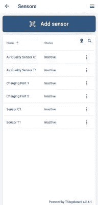
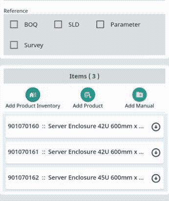
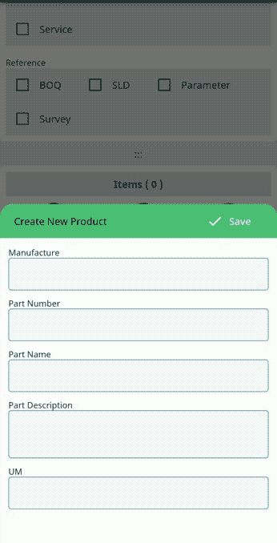
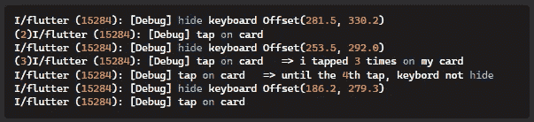

# 我的九月飘动笔记— 1。

> 原文：<https://medium.easyread.co/my-september-flutter-notes-700907827c7f?source=collection_archive---------0----------------------->

## 您可能已经错过的一些 flutter 开发技巧、特性和解决方法

Photo by [Estée Janssens](https://unsplash.com/@esteejanssens?utm_source=medium&utm_medium=referral) on [Unsplash](https://unsplash.com?utm_source=medium&utm_medium=referral)

这是我这一个月所学内容的总结。当我面临这个月早些时候解决的问题时，我才意识到要开始写笔记。然后我花了太多时间在我的几千行代码中寻找解决方案。在 [Stackoverflow](https://stackoverflow.com/users/12838877/pmatatias) 上也从别人的问题中学到了一些新的东西。

这篇笔记包含了一个技巧、技巧、特性的列表，或者任何我在 2022 年 9 月刚刚发现的关于 flutter 框架和 dart 语言的东西。好了，我们开始吧:

## **-如何在 flutter 上制作简单的页脚**。

脚手架提供财产`persistentFooterButtons:[]`。该属性中的所有小部件都将呈现在 BottomNavBar(如果存在)和主体之间。ThingsBoard 移动应用程序就是一个例子。我们可以看到底部的文本“**由 Thingsboard v.3.4.1** 供电”堆叠在屏幕底部。我认为我们可以通过用`Alignment.right`包装`Text`小部件，用`persistentFooterButton`创建一个类似的特性

Screenshoot of Thingsboard app

## **-以编程方式从下一个屏幕或对话框获取返回值的简单方法。**

—如果我们想导航到下一个屏幕，我们可以使用一种方法`Navigator.push()`。然后通过`Navigator.pop()`
得到返回值——这也可以应用于 showDialog 或 showBottomSheet。弹出对话框后，我们就可以得到值了。因为 showDialog 也是一个未来函数。
例:我们使用方法`push()`导航到屏幕 A

字符串“**这是从一个**的主屏幕上接收到的。

—但是如果我们通过“back button”返回到 home，值将会是`Null` its，因为我们没有给方法 pop 设置任何值。对于这种情况，我们可以用`WillpopScope`小部件包装`Scaffold`。这将在用户按下 AppBar 中的 back 按钮时执行该功能。

## **-将小部件分离到另一个类将避免重建不必要的项目**。

我从一开始学习颤振就知道这一点。但是我从来没有意识到它是如何影响应用程序的，直到我构建了一个复杂的表单。所以我有一个包含多个字段的表单来创建库存信息。在我的库存表单中，我创建了带有一些动画的产品卡片小部件。卡片会显示一些物品的信息。在另一个领域，我也有一些复选框仍然在同一个屏幕上。为了更新复选框的值，我需要调用一个方法`setState((){})` 。这将通过从当前类重新执行 **build** 方法来重建部件树。
—以前，我看不出由类和方法分隔的小部件之间的区别。因为过程非常快，所以一切看起来都很顺利。

—然后，在我创建了带有动画的自定义卡片小部件后，这真的影响了我的应用程序。正如你在下图中看到的，每次我选中我的复选框，三件商品卡片就会变成动画。因为他们都是从头开始重建的。即使“参考”字段和“项目”字段是两种不同的方法。

Widget is rebuilt every setState

我解决这个问题的方法是将 item 字段拆分成一个新的`StatefullWidget` ，并将其作为一个组件小部件导入到我的表单中。

## **-如何在 flutter widget 中限制列表**

当列表中有几十个小部件，但你只想显示其中的 3 或 5 个时，你可以用`List.take()`来实现，也可以结合`List.skip()`进行高级索引。我们也可以使用`getRange()`，但是如果索引超出范围，它会抛出一个错误。使用`take()`的好处是返回尽可能多的可用数据，而不会抛出任何错误。例如:

—这是一个我用来在 UI 中渲染的例子。这只会在列中呈现最多 3 个小部件文本。如果列表长度超过 3，`TextButton`将呈现小部件。

## **-当弹出键盘在屏幕上时，自动滚动并聚焦文本字段。**

这是我在弹出键盘屏幕上方渲染 UI 时发现的。这通常发生在我们有一些小部件列表，并且我们需要显示键盘时，小部件被堆叠在键盘后面。详细说明见本文档[链接](https://api.flutter.dev/flutter/widgets/MediaQueryData/viewInsets.html)。这里有一个例子。你可以在下图中看到，我有一个包含一些文本字段的底部工作表。

当我想填写“ *UM* 字段时，键盘会弹出，列表也会滚动。我们不必担心键盘是否覆盖了 Textfield。并且用户在输入表单之前不需要向下滚动。您可以通过用填充来包装父 listview 来实现这一点，如下面的代码片段:

## **-如何使用多个 FutureBuilder** ( [引用](https://stackoverflow.com/a/50627153/12838877))

“Future builder 是一个小部件，它基于与一个[未来](https://api.flutter.dev/flutter/dart-async/Future-class.html)交互的最新快照来构建自己”。它有一个建设者的未来。

你是否曾经想在一个卡片小部件中显示一些信息，但是后端工程师提供了不止一个 API 来完成你的卡片信息？您需要创建额外的模型数据来组合两个对象，以便可以轻松地显示信息。看起来有点麻烦。你试过`Future.wait` 吗？

如果您需要获取多个对象，`Future.wait()`是最佳解决方案。它会将所有未来的函数打包到一个列表中。是的，我刚刚意识到，我们可以在数组未来通过索引访问每个返回值。我们不需要创建新的模型来包装所有返回的对象。

## **-使用监听器而不是手势检测器更快速地捕捉回调事件。**

我在创建一个通过点击或点击屏幕上的任何地方来隐藏键盘的功能时遇到了一个问题。基于人们的建议是通过使用**手势检测器**和调用`FocusManager.instance.primaryFocus?.unfocus();` 。使用这种方法，我们将改变文本字段的焦点，键盘将被隐藏。但是我一试，GestureDetector 的反应就有问题。关于更详细的行为，我在 StackOverflow 上提出了一个[问题。这是打印的控制台日志。见第 2 行和第 4 行，我已经点击屏幕超过 1 次，但隐藏键盘的功能没有被调用，因为我点击屏幕的次数。在**手势检测器**上有一个延迟来捕捉事件。仅供参考，我也在**手势检测器**中使用了**on down**属性，但是没有成功。](https://stackoverflow.com/questions/73632909/gesturedetector-with-hittestbehavior-opaque-not-work-properly-to-hide-keyboard-s)

**手势检测器**正在监听更高级别的手势。这就是为什么它反应较慢。我推荐使用**监听器**，因为它监听原始指针事件。行为上的差异非常明显。

## **-结论**

1.我们可以使用 Scaffold 中的`persistentFooterButtons`属性在 flutter 应用程序中创建一个页脚。
2。从对话框或新屏幕传递数据的另一种方法是绕过 Navigator.pop 参数的值。
3。用不同的类分离窗口小部件，以避免重新构建不必要的窗口小部件功能。
4。用`viewInsets.bottom` 添加填充，当屏幕键盘出现时自动滚动。
5。使用 Future.wait，我们可以从 API 调用中获取多个对象数据，并在 Future.builder
6 中使用。如果我们想捕获原始事件，使用 Listener 而不是 GestureDetector，因为它响应更快，延迟最小。

这个月我学到了很多。这些只是其中一些简单有趣的分享。如果你有不同的理解或问题，请留下你的评论。我很乐意打开下面的讨论。