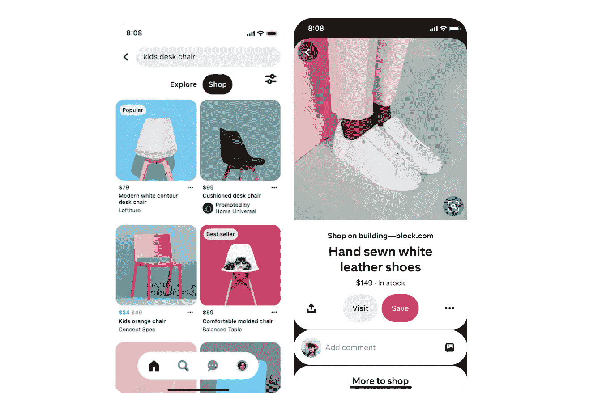
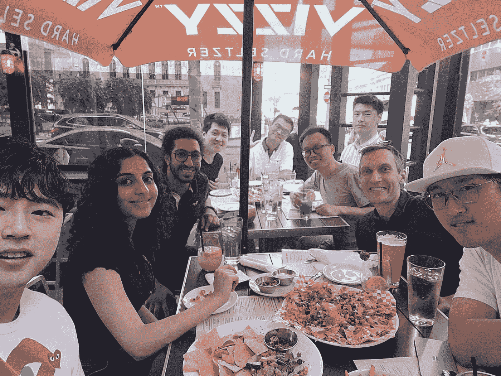
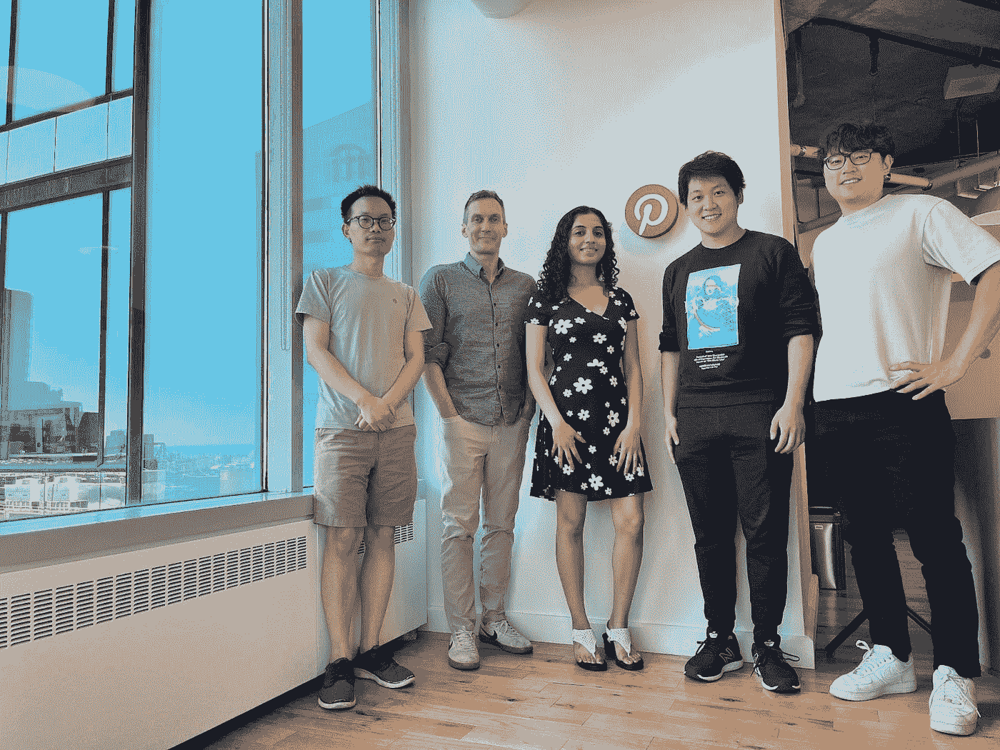

# 我在多伦多 Pinterest 做软件工程实习生的夏天！

> 原文：<https://medium.com/pinterest-engineering/my-summer-as-a-software-engineering-intern-at-pinterest-toronto-a0857bf8cf98?source=collection_archive---------1----------------------->

Khubi Shah |(前)软件工程师实习生，购物内容挖掘

今年夏天，我获得了一个不可思议的机会，在多伦多新工程中心唯一的 Pinterest 实习！

我是滑铁卢大学的一名四年级本科生，主修计算机科学，专业是人工智能。从小到大，Pinterest 一直是我的社交媒体平台，因为它激发了我对食物、时尚、设计或任何创意的新想法！因此，当我今年夏天有机会在多伦多成为一名软件工程实习生时，我非常兴奋地成为了公司使命的一部分:通过视觉发现，为每个人带来创造他们热爱的生活的灵感。

# 应用过程

老实说，这是我从大学开始就一直努力争取的实习形式。我知道我想在一个利用机器学习开发迷人的现实世界应用程序的团队中担任软件工程实习生，所以我尽我所能不仅充实我的简历，还充实我的个人经历，以便我准备好应对这样的挑战。因此，我完成了多门计算机科学和软件工程课程、机器学习和人工智能课程，通过 Leetcode 发展了我的算法解题技能，并获得了软件工程方面的实习经验。我通过 LinkedIn 找到了这个具体的角色，经过一个无缝的面试过程(在线编码挑战+招聘经理的技术电话面试)，我接到了招聘人员非常激动的电话！

# 团队安置

我以软件工程实习生的身份加入了位于多伦多的购物内容挖掘团队(SCM)。SCM 是 Pinterest 购物团队之一，它利用机器学习和其他数据提取技术来提升 Pinterest 的购物功能。

例如，如果消费者在 Pinterest 上找到一把漂亮的椅子，供应链管理团队的工作将确保商家网站上该椅子的所有产品信息，如标题、价格和可用性，都可以在 Pinterest 上直接获得。这使得品酒师能够轻松地将视觉灵感转化为成功的购买。

# 杂志的结构

Pinternships 的结构是这样的，每个实习生在整个实习期间都会被分配一个项目。对我来说，我有机会与我团队中的其他两位工程师合作，建立一个模型管理系统，以取代以前使用的分散的手动过程。我们的项目使得模型管理的整个过程变得更加高效、集中和自动化。它不仅帮助我们的团队节省了大量时间，而且从长远来看，集中式模型管理系统项目将使我们的团队能够扩展我们的购物数据提取工作，因此更多的 Pinterest pins 可以丰富高度可靠的购买信息。当然，还可以做更多的工作来增强该系统，但我很高兴地说，这个项目为未来的发展奠定了基础。

# 典型的一天

作为一名主要的远程实习生，我的每周例行工作是从每周一与我的团队召开虚拟敏捷冲刺计划和项目同步会议开始的。一旦我们确定了 sprint 在任务方面的目标，接下来的一周我们就主要完成独立的工作，还有一些与我的导师和其他两位直接与我合作的团队工程师的合作。远程工作的时间灵活性和零通勤方面非常棒！为了让远程工作更有吸引力，我遵循的一些习惯是与 Pinterest 的其他员工建立虚拟咖啡聊天，以及在我遇到问题时去大自然散步。

# 学习和网络体验

今年夏天在 Pinterest 工作，我真正喜欢的一点是，我被当作全职员工对待，对任务和功能拥有完全的所有权，同时，我还从一些与我共事过的最聪明、最有知识的工程师那里获得了许多宝贵的指导。这包括来自我的指定导师和与我一起从事同一项目的其他工程师的全面技术指导，来自我的经理的高级项目愿景和职业指导，以及来自我的新校友的职业指导。我有机会承担广泛的技术任务，从为我的项目拥有新功能，到与前端工程师就 UI 设计进行头脑风暴，执行端到端功能测试，准备高级软件工程设计文档，以及领导我的工作的设计评审。

除了拓展我在软件工程和架构方面的能力，我还在实习期间学到了很多其他重要的技能。具体来说，我在会议上畅所欲言、向他人展示我的工作、主持自己的会议、精心撰写清晰的技术讨论以及与同事交流时变得更加自信。虽然大多数日子都很遥远，但由于 Pinterest 名为 [PinFlex](/pinterest-engineering/introducing-pinflex-pinterests-model-for-the-future-of-work-437731fabde) 的灵活工作政策，我仍然有机会每月在办公室与我的团队会面一次，并与他们一起享受有趣的郊游，就像我们的快乐时光一样！

Team Happy Hour

也有很多有趣的活动和机会，以满足其他实习生和其他 Pinterest 员工。我最喜欢的是 Pintern 社交时间、虚拟密室、琐事活动和虚拟陶器制作会议！

# **总结思路**

随着我在 Pinterest 为期 16 周的实习即将结束，我很高兴地说，通过今年夏天在 Pintern 的经历，作为一名软件工程师，我获得了巨大的成长。我非常感谢所有我遇到并向其学习的人，我期待着在未来继续提高我的技能(希望有更多这样的机会！).

如果你对 Pinterest 的任何实习机会感兴趣，请在这里申请！

# **致谢**

我要感谢几个让实习经历如此美妙的人。这些将是:

*   我的技术导师 Charles Huang 和 Yu Qian 给了我很多宝贵的建议，帮助我成长为一名软件工程师
*   我的团队经理 Patrick Halina 给了我在他的团队实习的机会，并提供了许多高水平的项目和职业指导
*   我的项目的 UI/UX 工程师塞萨尔·弗雷迪·吉尔·梅希亚与我广泛合作来构建我的项目特性
*   整个 SCM 团队，和他们一起工作很愉快
*   感谢我的新校友 Boris Lin 和 Jennifer Kong 对我职业生涯的宝贵指导
*   我的招聘人员 Shannel Evans 的无缝招聘流程
*   Olivia Berkowitz，Sabrina Ham 和大学招聘团队的其他成员设计了这样一个结构良好且有趣的实习经历

From left: Yu Qian (Software Engineer), Patrick Halina (Engineering Manager), Khubi Shah (Software Engineer Intern), Charles Huang (Software Engineer), David Choi (Product Manager)

*要在 Pinterest 了解更多工程知识，请查看我们的* [*工程博客*](https://medium.com/pinterest-engineering) *，并访问我们的*[*Pinterest Labs*](https://www.pinterestlabs.com?utm_source=medium&utm_medium=blog-article-link&utm_campaign=shah-oct-12-2022)*网站。要探索 Pinterest 的生活，请访问我们的* [*职业*](https://www.pinterestcareers.com?utm_source=medium&utm_medium=blog-article-link&utm_campaign=shah-oct-12-2022) *页面。*