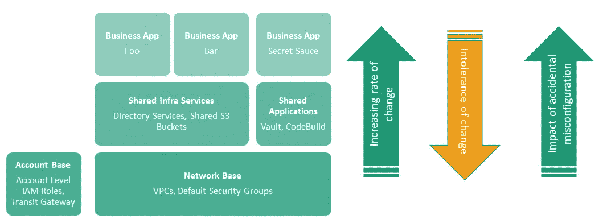
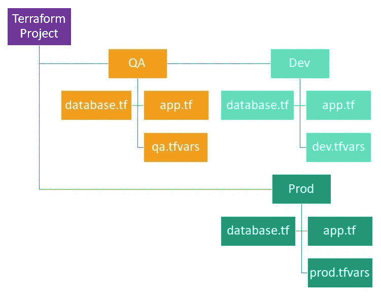
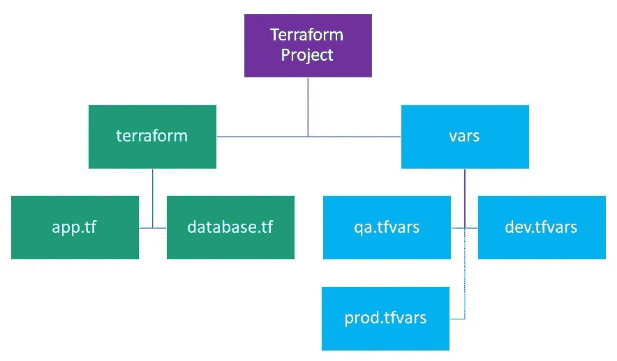

# 我对有效、可维护和安全的 Terraform 0.12 项目的最高提示

> 原文：<https://medium.com/version-1/my-top-tips-for-effective-maintainable-and-safe-terraform-0-12-projects-eaa52846d353?source=collection_archive---------0----------------------->

从 Terraform 开始很容易，安全有效地使用它很难。从在战壕中工作开始，这些是我让生活变得更轻松和避免灾难的建议。好吧，有点戏剧性，但你明白了。😂

Photo by [Stephan Mahlke](https://unsplash.com/@stpxn?utm_source=unsplash&utm_medium=referral&utm_content=creditCopyText) on [Unsplash](https://unsplash.com/s/photos/avalanche?utm_source=unsplash&utm_medium=referral&utm_content=creditCopyText)

# 固执己见的模块是好的，但是不要过分

Terraform 最直接的好处是通过自动化提高了生产率。然而，在这之后，其他的商业利益开始出现，例如，开始通过使用模块将期望的架构模式强加给开发人员。

Terraform 允许你创建任何大小和复杂度的模块，它们可以是“非个性化的”——不超过一个包装器，与此相反，有个性化的模块将提供一个非常严格的架构模型。这方面没有严格的规则，但是当设计自以为是的模块时，需要仔细考虑它们的设计，以确保它们不会限制未来的用例，并提供尽可能简单的接口。根据我的经验，堆栈越低(即 VPC /网络层)，就越需要小心——这是有道理的，这是您架构的基础，这里的一个失误将波及您的整个解决方案。

> 固执己见的模块有助于加强架构模式和可重复性，但要避免设计太不灵活的模块，否则可能会被忽略或创建一个不利于开发的环境。

# 潜在危险信号

*子网魔法* —警惕模块在哪里接受单个 CIDR 并自动分配范围。子网大小将因您的解决方案而异，并且不同的子网可能需要非常专业的路由，您将会覆盖/重复太多，以至于任何好处都可能被抵消。如果强制执行 NACLs 或路由表是必须的，考虑将检查作为管道的一部分，例如，如果您是 Terraform Enterprise 客户，可以使用 [OPA](https://www.openpolicyagent.org/docs/latest/terraform/) 或 Sentinel。

*输入变量膨胀*——超过几十个输入变量，这里有一股代码味。你是否一遍又一遍地提供相同的信息——如果是，为什么模块不使用确定性信息(如标签值)自己查找呢？

# 好例子

我是 AWS Terraform 注册模块的忠实粉丝，尤其是 VPC——它有很好的封装平衡，但没有越界。

# 为可维护性设计您的地形项目

尤其是在多团队环境中工作时，您的 terraform 项目的结构以及它们如何相互链接至关重要。

# 分层

当第一次学习 terraform 时，很容易建立一个垂直范围的项目。这可能包括 VPC、IAM 角色，一直到 EC2 和 Lambdas。创建这种风格的项目很容易，但是使得团队协作明显更加困难，并且在将来可能导致代码重复和不灵活。相反，考虑将你的地形“景观”分成几层；

较低层对变化的容忍度较低(一个变化可能波及整个堆栈)，但是如果它们被分开，与上面的层相比，它们可能会看到非常小的变化。打破这些层将为您的环境创建一个更安全的环境，并减少 terraform 项目中的相互依赖性。理论上应该是这个意思；

*   更容易限制不同的操作关注点——例如，应用程序开发人员应该不需要更改或部署与他们下面的层相关的存储库，
*   将基本的、低流失的项目(如 VPC 和转接网关)分开，将保护它们免受栈中更高层的意外中断性更改的影响，
*   高保证环境将需要职责分离，创建这样的层会创建自然的边界以满足法规遵从性要求。

# 保持干燥

不要重复你自己，你会在任何开发圈子里听到很多(回忆时间——我第一次听到它是在很多年前学习 Ruby on Rails 的时候😅).在 terraform 的世界里，没有定义一个好的项目结构的“轨道”(因此有了这篇文章)，所以如何避免重复在很大程度上取决于你自己。不过，我会留意一些反模式…

**跨项目复制前端**

起初，这看起来像是一个结构良好的项目，然而，再看远一点，无论`app.tf`和`database.tf`的内容是什么，这都可能导致大量的重复。在最好的情况下，这些是前端`module`对公共模块的调用，在最坏的情况下，它们不是。如果您需要更改一个环境中的资源，那么每个环境都需要依次更新——既慢又容易出错。而是考虑；

创建一个公共的 terraform 目录和单独的`tfvars`大大减少了重复。通过根据需要从分支部署到您的开发/ QA /生产环境中，可以实现最前沿的分离。需要在生产中禁用开发服务吗？在模块中创建特性标志来控制它们的行为。

你不能在一个模块上使用`count`，我听到你哭了——看看 [Terraform VPC 注册模块](https://registry.terraform.io/modules/terraform-aws-modules/vpc/aws/2.21.0)中`create_vpc`功能切换的代码，它能工作，而且感觉比 count 还要干净。

一些有助于保持定制模块干燥的技巧；

*   减少你的开发伙伴的精神负担，保持所需的变量清晰、最小和相关，
*   尽可能使用模块中变量的默认值，以减少模块的“接口”大小，
*   使用输入和有用的变量描述来减少输入错误，
*   减少跨 tfvars 的重复，跨环境一致的值应该在一个`auto.tfvars`文件中声明，特定于环境的 tfvars 作为`-var-file=<file>`参数的一部分被引用到`terraform`。

# 伟大的阅读

[Terraform Poka-Yokes](/capital-one-tech/terraform-poka-yokes-writing-effective-scalable-dynamic-and-error-resistant-terraform-dcbd6a0ada6a)——一个写“安全”terra form 的好方法，允许不同层次的消费。这允许在提供灵活性的同时加强架构模式。

[Terraform 环境+应用模式](https://apparently.me.uk/terraform-environment-application-pattern/overview.html) —这是一个很好的深度探索，探索了创建 Terraform 应用的分层方法，但是，我的个人偏好不同意一些实现选择(即跨层共享状态信息的咨询)。我还会考虑，与通过 tfvars 或使用类似于 [terragrunt](https://github.com/gruntwork-io/terragrunt) 的工具进行特性标记相比，使用特定于环境的前端模块的方法有多枯燥。

# Hashicorp 对如何使用他们的工具有自己的看法，请遵循他们的看法

在 GitHub 上阅读 Terraform 的问题跟踪器，许多语言“特性请求”都得到了坚定但深思熟虑的满足。他们清楚地知道他们的语言应该允许你做什么，不应该做什么。

我不会在这里赢得很多粉丝，但我相信这是一件好事。人们最关心的是创建具有更多动态开/关功能的模块——如果您遇到了语言障碍，请考虑您的项目/模块结构是否有问题？我知道震惊！

如果你的代码似乎在循环，考虑把它分开。一个庞大的项目来部署所有的东西会给你带来比任何街头技术更大的痛苦。

# 好的读物

[模块组成](https://www.terraform.io/docs/modules/composition.html#conditional-creation-of-objects)是一个很棒的资源，应该阅读和消化。

阅读 terraform 的 GitHub 问题库中的评论，例如，也可以是一座金矿。

# 设计失败，计划失败(没有双关语)

启动 Terraform 可能有点太简单了(T2)。你可以马上开始，在相当长的一段时间内，一切都会🌈和🦄。

然而，如果没有考虑清楚你将使用 terraform 做什么，谁可能会使用它，这很可能会让你在未来陷入困境。在破土动工之前，试着理解你的基础设施**和开发过程**的一些基本原理。想想；

*   在 AWS 的情况下，你将有一个多帐户设置，或平面结构？(这将影响您如何配置您的状态桶和提供者配置)，
*   您是否有独立的开发运维团队负责基础架构的不同部分？(即使没有，分层仍然是一个非常明智的想法)
*   您将如何划分您的应用程序和不同的环境？(虚拟专用计算机、子网、帐户)
*   你将如何为那些需要通过 terraform 做出改变的人创建一组可靠而安全的角色？(可能—只读控制台，部署权限仅提供给 Terraform runner，即 Atlantis、Jenkins、Terraform Enterprise)
*   您将如何连接您的 VPCs？(考虑到中转网关连接和 VPC 端点，专用子网可以做到这一点)
*   您有通用的标记策略吗？(您可能希望将它推送到一个公共模块)
*   您将如何执行您的 terraform 项目？(从 CI 系统或共享主机内部)

# 保持一致

一旦你对如何使用 terraform 和谁将使用 terraform 有了一个很好的概述，开发一个 terra form 风格和使用指南，作为保持事情一致性的基础。你可能想掩盖；

*   项目将如何分解，
*   命名约定，
*   vars.tf 排序(例如局部变量、变量、带有默认值的变量)，
*   使用哪些平台注册模块，内部创建哪些公共模块，
*   分支和部署策略，
*   陈述铲斗位置和配置。

这里的主题是尽早对 terraform 的使用达成共识，避免技术债务。重构 terraform 是可能的，尤其是在使用`terraform import`的情况下，但是可能会很快变得危险！

你的地球战争故事是什么？分享以下内容供大家学习——目前，我就说到这里！

**关于作者**

*Tom Werner 是 Version 1 的 DevOps 顾问，致力于为英国的企业客户进行现代、创新和有效的云部署。请继续收听第一版《Medium 》,了解更多来自 Tom 的 DevOps 作品。*

*原载于 2020 年 3 月 4 日*[*https://fluffycloudsandlines . blog*](https://fluffycloudsandlines.blog/terraform-top-tips/)*。*