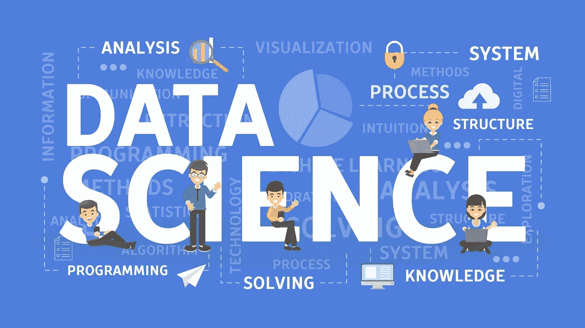

# 我的数据科学之路:

> 原文：<https://medium.com/walmartglobaltech/my-trajectory-to-data-science-aaae771ef93?source=collection_archive---------3----------------------->

**我如何培养职业技能**

[Image source](https://www.dataquest.io/blog/what-is-data-science/)

虽然一些数据科学家拥有统计学或计算机科学的相关学位，但许多人接受了其他学科的培训。这不是一个容易或快速的转变，人们可能会在这个过程中失去信心。在这篇文章中，我想分享我的数据科学之路。这可能对打算开始类似旅程的人有用。

**我的背景**

在我的本科和研究生课程中，我处理了大量的数据，更确切地说，是地理数据。我的专业是地理信息科学(GIS)，它可以发现位置信息并可视化空间数据。学过一些 Python，限于 GIS 软件中预定义的地理处理。对于数据分析，我也是从网上资料了解到 R 统计包的。虽然我喜欢做研究，但需要相当长的时间才能收到初步结果，反馈回路通常会延迟。在一个特殊的场合，我在数据科学行业的朋友与我分享了他们的有益感受，这鼓励我追求专业的数据科学家职业生涯。我有激情和能力从大数据中揭示事情，远远超出地理空间的角度。此外，我喜欢解决问题的快节奏和我的潜力。那是我开始转变的时候，从零开始到作为全职数据科学家加入沃尔玛全球技术公司花了大约三年时间！

**旅程**

数据科学有不同的领域，都需要扎实的统计背景和编码技能。专注于建立这些基础，我在 2018 年夏天开始了我的旅程。

**第一年:第一口**

我以本科课程开始了我的旅程，学习基本的 Python 和数据科学概念。该课程提供了学习数据结构和解决编程问题的系统方法。它向我展示了数据科学:从一个模糊的行话到一个我可以描述的具体学科。从简单的课程开始增强了我的信心。那年晚些时候，我参加了*应用线性模型*，它介绍了背后的理论和数学，并为数据科学奠定了基础。

Needed data scientists’ skills

与此同时，我经常与我的数据科学家朋友交谈，阅读工作描述。最受欢迎的数据科学家技能是:卓越的统计学、机器学习、数据库系统、数据结构&算法、领域知识、讲故事，最后但同样重要的是，良好的沟通技巧。他们是成功的数据科学职业生涯的基石。为了满足技术要求，我参加了我大学里的课程——*数据库管理*和*机器学习高级课题(ML)* 。前者让我掌握了数据库和结构化查询语言(SQL)的知识，而后者提供了前沿 ML 算法的整体概述。两者都通过项目为我提供了实践经验。例如，我和两个同学从事一个图像识别项目，以检测被淹没的道路。它利用了我的地理空间领域知识，并将其与最先进的算法相结合。那时我觉得我可以给数据科学项目带来独特的视角。

**第二年:建筑基础**

在旅程的第二个夏天，我意识到在排练之前我需要更多的训练。当我离开校园数千英里后，我转向书籍和在线课程。这本名为 [***的书介绍了 R***](https://www.statlearning.com/) 中的统计学习及其应用，并通过练习指导我学习了各种统计模型。事实上，我读了三遍，每次都受益匪浅。此外，我参加了由五门课程组成的 R 专业 的 [***统计。这些课程，尤其是前四门，都有生动的用例，很容易掌握。***](https://www.coursera.org/specializations/statistics#courses)

与此同时，我积极申请实习和训练营，以建立我的简历，抓住未来的机会。有超过 50 份申请和推荐，我收到了来自谷歌和脸书的面试以及一些训练营的面试。我很幸运得到了一个训练营的邀请。然而，由于疫情，我跳过了它，继续我的自学之旅。期间学习了一门精心设计的 Udemy 课程[***Python for DS&ML boot camp***](https://www.udemy.com/course/python-for-data-science-and-machine-learning-bootcamp/)，提供数据操作、可视化、带用例的算法等各种接触，品味前沿技术，如 AWS、TensorFlow、Spark 等。偶尔，我会在[***leet code***](https://leetcode.com/)进行数据科学编码练习，提供一千多个算法、数据库等方面的编码问题。

[Image source](https://www.springboard.com/blog/data-science/data-science-projects/)

有了扎实的理论基础，我开始从事实用基石的项目。思考不同的场景，学习如何讲故事，这总是一个很好的练习。当谈到 ML 算法时，我为自己的研究广泛地构建了线性回归模型和决策树。为了获得分类和时间序列分析的经验，我转向了[***ka ggle***](https://www.kaggle.com/)项目，这些项目在数据操作、参数调整、性能评估、模型选择以及背后的推理逻辑方面对我进行了培训。在整个项目中，我看了一本时间系列的书， [***预测:原理与实践***](https://otexts.com/fpp3/) ，学习了 [***预言家***](https://facebook.github.io/prophet/) 和 [***Kats 的最新算法。***](https://facebookresearch.github.io/Kats/) 学习的过程反过来让我的研究受益匪浅。由于地理数据中很少使用时间序列分析，我也在研究中加入了这种味道。

**第三年:最后冲刺**

当新冠肺炎还在肆虐的时候，我已经为毕业做好了准备，并申请了行业工作。朋友们帮我推荐工作，我在 LinkedIn 上向专业人士寻求工作机会。由于公司冻结招聘以减轻疫情的影响，应届毕业生的机会有限。那是没有面试的黑暗日子，但是拒绝不断飞来。由于这超出了我的控制范围，我唯一能做的就是花时间和精力提高我的技能。所以我上了吴恩达 的经典 [***机器学习课程，希望能里里外外的了解。这个课程一步一步地走过了重要的算法和推理过程。我还每天做***](https://www.coursera.org/learn/machine-learning)***[***leet code***](https://leetcode.com/)*练习，浏览了 W3schools 的[***Python***](https://www.w3schools.com/python/)和[***SQL***](https://www.w3schools.com/sql/default.asp)*材料和[***hacker rank***](https://www.hackerrank.com/domains/sql)。每当一份工作寻找一些特定的背景时，我都会花一两周的时间来学习新技能，比如*[***A/B 测试***](https://www.udacity.com/course/ab-testing--ud257) ，或者重温我的笔记。渐渐地，我增强了我的肌肉，并等待着测试它们的机会。******

*疫苗出来后，我偶尔会接受采访。我会为技术和行为部分做准备，并尽可能地去理解公司和领域。采访帮助我改进了谈论项目的方式，尤其是对没有类似背景的人。这个过程也证明了我应该特别关注业务问题，或者说痛点。在解决问题时，每个公司都强调各个方面:成本、客户体验、时间表等。我们会训练自己像研究这些真实案例的数据科学家一样思考。朋友建议我做好面试问题的笔记。她说，不管结果如何，这种经历可以明确面试官感兴趣的是什么。我每次都这样做，最终我有时可以预测问题，知道如何给面试官留下深刻印象。虽然仍然没有好消息，但我越来越接近了。临近四月底，我收到了两份出色的工作邀请。然后我通过了更多，在五月中旬，我收到了我最喜欢的团队的邀请，并取消了接下来的面试。那是我旧的轨迹结束的地方，新的轨迹将会开始。*

**

*New journey starts*

***结论***

*这不是一次短暂的冒险，但却是值得的。有挫败感，有时还有绝望。我问自己，当拥有相关学位的学生在市场上挣扎时，我如何才能找到一份数据科学的工作。我当时没有答案。现在，我认为我的解释和视觉化空间事物的背景是一个额外的收获。这也适用于你:你的独特性可能是未来机会不可或缺的一部分。加入沃尔玛全球技术公司已经九个月了，解决现实世界的问题并利用我的地理空间专业知识是一件令人兴奋的事情。*

*可能会有更多的人考虑转向数据科学。我的建议是向你想成为的人学习:他们的技能、心态、实践、领域知识等等。感谢朋友们一直以来的指导和提示。我也希望我的故事对您的数据科学之旅有所帮助。*

*作者领英:【linkedin.com/in/xuanzhanguga】T2*