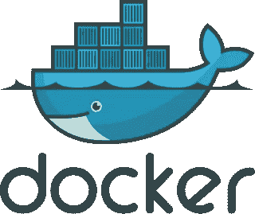

# Docker 容器上未反映的变化之谜

> 原文：<https://medium.com/version-1/mystery-of-changes-not-reflected-on-docker-container-2b48891c7c11?source=collection_archive---------1----------------------->



我最近在做一个项目，需要调整现有的 Dockerfile 配置来添加新的数据库模式。

由于一个(当时)神秘的原因，我没有看到我所期望的在数据库容器中创建的新数据库模式。我花了一段时间才想明白。我分享这个希望这将为其他面临类似情况的开发者节省时间。

发生了什么事？为什么 *Dockerfile* 的变化没有反映在数据库容器上？

为了解释这一点，让我们用一个小例子来看看它的作用:[https://github.com/taomoh/docker-gotcha1](https://github.com/taomoh/docker-gotcha1)

在这个例子中，我们使用了一个*docker file*to "*docker ese*"一个基本的*" Hello World "**Python*应用程序，暴露在端口 8000 上。

从这个*Docker 文件*构建的 Docker 映像将包含应用程序需要的所有依赖项。

1.克隆 github 项目*docker-gotcha 1*:[https://github.com/taomoh/docker-gotcha1](https://github.com/taomoh/docker-gotcha1)

2.从项目的根文件夹运行`docker compose`命令启动应用程序:

```
$ docker-compose up -d web
```

检查容器是否按预期启动:

```
$ docker ps
CONTAINER ID IMAGE     COMMAND     CREATED       STATUS       PORTS                                     NAMES
97f84f04df98 tip-1_web "flask run" 6 seconds ago Up 3 seconds 0.0.0.0:8000->5000/tcp, :::8000->5000/tcp tip-1_web_1
```

第一次运行该命令时，它将根据 *Dockerfile* 中提供的指令构建应用程序 Docker 映像:

```
$ docker image ls
REPOSITORY TAG        IMAGE ID     CREATED        SIZE
tip-1_web  latest     268f207b4ba4 19 seconds ago 179MB
python     3.7-alpine caace8ae014d 11 days ago    45.5MB
```

3.在浏览器上点击 [http://localhost:8000/](http://localhost:8000/) :你会看到信息*“你好，世界！”不出所料。*

4.现在让我们修改一下应用程序代码:
例如，在 *app.py* 中，用`return `Hola Mundo!``替换:`return `Hello World``并重启 Docker 容器:

```
$ docker-compose stop
$ docker-compose up -d web
```

6.在浏览器上点击[*http://localhost:8000/*](http://localhost:8000/):你还是会看到*“你好世界！”而不是“你好，世界！”*不出所料。这是怎么回事？

嗯，`docker compose`命令重用了第一次运行时创建的映像，其中仍然有旧版本的代码:

```
$ docker image ls
REPOSITORY TAG        IMAGE ID     CREATED        SIZE
tip-1_web  latest     268f207b4ba4 17 minutes ago 179MB
python     3.7-alpine caace8ae014d 11 days ago    45.5M
```

您需要重新构建一个新的 Docker 映像来反映代码更改。为此，您需要通过 *-构建*开关:

```
$ docker-compose stop
$ docker-compose up -d --build web
```

列出 Docker 映像，您会看到刚刚创建了一个 web 应用程序的新 Docker 映像:

```
$ docker image ls
REPOSITORY TAG    IMAGE ID     CREATED            SIZE
tip-1_web  latest 5e6982bdd0f1 About a minute ago 179MB
<none>     <none> 268f207b4ba4 23 minutes ago     179M
```

这一次，如果你在浏览器上点击[*http://localhost:8000/*](http://localhost:8000/)，你会看到新的消息*“你好，世界！”*不出所料。

如果您必须更改 *Dockerfile* ，同样的原则也适用:您必须通过向`docker compose up`命令提供 *- build* 开关来重新构建您的应用程序映像。

**关于作者:**
Taoufik Mohdit 是这里的高级 Java 开发人员，负责版本 1。