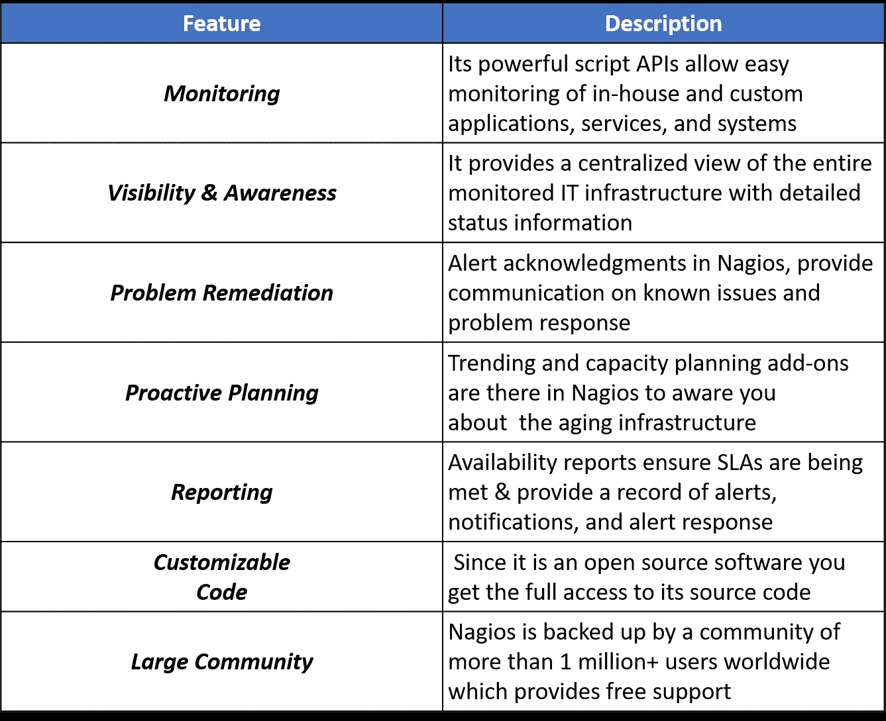
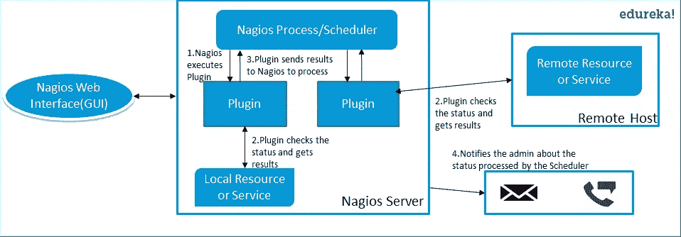
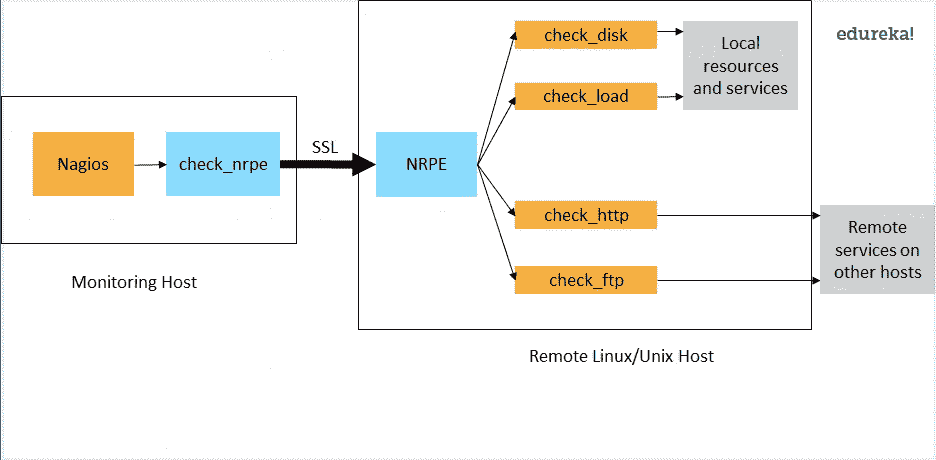

# 2021 年最热门的 Nagios 面试问题

> 原文：<https://medium.com/edureka/nagios-interview-questions-f3719926cc67?source=collection_archive---------3----------------------->

# Nagios 面试问题

Nagios 是最广泛使用的持续监控工具之一。由于组织现在比以往更频繁地发布软件，因此迫切需要一种工具来监控软件的功能，并为团队提供相关的反馈。这是持续监控的原因之一。这使得 Nagios 成为实现 DevOps 的一个非常重要的工具。所以下面是 **Nagios 面试问题**列表。我在做了大量研究并与一些直接参与招聘过程的专家讨论后，收集了这些问题。

本文的第一个问题是:

# Q1。什么是 Nagios？

要回答这个问题，你可以先提到:

Nagios 是用于持续监控系统、应用程序、服务和业务流程等的监控工具之一。在 DevOps 文化中。如果出现故障，Nagios 可以向技术人员发出问题警报，允许他们在中断影响业务流程、最终用户或客户之前开始补救过程。使用 Nagios，您不必解释为什么看不见的基础设施中断会影响您组织的底线。

它的几个重要特性是:

现在，一旦您定义了什么是 Nagios，您就可以提到使用 Nagios 可以实现的各种事情。

通过使用 Nagios，您可以:

*   在过时的系统导致故障之前规划基础设施升级。
*   在问题出现的第一时间做出反应。
*   检测到问题时自动修复。
*   协调技术团队的响应。
*   确保满足您组织的 SLA。
*   确保 IT 基础设施中断对您组织的底线影响最小。
*   监控您的整个基础架构和业务流程。

这总体上完成了这个问题的答案。更多细节，如优点等。可以根据讨论的方向添加。

# Q2。Nagios 是如何工作的？

我会建议你按照下面的解释来回答:

*   Nagios 运行在服务器上，通常作为守护进程或服务。
*   Nagios 定期运行驻留在同一服务器上的插件，它们联系您的网络或互联网上的主机或服务器。
*   用户可以使用 web 界面查看状态信息。
*   如果有事发生，你也可以收到电子邮件或短信通知。
*   Nagios 守护进程的行为就像一个调度程序，在特定的时刻运行特定的脚本。
*   它存储这些脚本的结果，如果这些结果发生变化，它将运行其他脚本。请参考下图:

*现在，下一组 Nagios 面试问题将集中在 Nagios 组件上，如插件、NRPE 等。*

# Q3。Nagios 中有哪些插件？

从定义插件开始回答这个问题。

插件是脚本(Perl 脚本，Shell 脚本等。)可以从命令行运行来检查主机或服务的状态。Nagios 使用插件的结果来确定网络上主机和服务的当前状态。

一旦你定义了插件，我会建议你解释为什么我们需要插件。

每当需要检查主机或服务的状态时，Nagios 就会执行一个插件。插件将执行检查，然后简单地将结果返回给 Nagios。Nagios 将处理从插件收到的结果，并采取必要的措施。

# Q4。Nagios 中的 NRPE (Nagios 远程插件执行器)是什么？

为了回答这个问题，首先给 NRPE 下一个小定义。

NRPE 插件被设计成允许你在远程 Linux/Unix 机器上执行 Nagios 插件。这样做的主要原因是允许 Nagios 监控“本地”资源(如 CPU 负载、内存使用等。)在远程机器上。因为这些公共资源通常不会暴露给外部机器，所以像 NRPE 这样的代理必须安装在远程 Linux/Unix 机器上。

现在我建议你根据下图解释 NRPE 的建筑。

NRPE 插件由两部分组成:

*   check_nrpe 插件，驻留在本地监控机器上。
*   NRPE 守护进程，运行在远程 Linux/Unix 机器上。

如图所示，监控主机和远程主机之间有一个 SSL(安全套接字层)连接。

# Q5。Nagios 后端是什么意思？(找不到相关解释)

我的建议是遵循下面提到的回答流程:

配置和日志都可以存储在后端。配置使用 NagiosQL 存储在后端。历史数据使用 ndoutils 存储。此外，您还有 nagdb 和 opdb。

现在，下一组 Nagios 面试问题将深入挖掘，所以请做好准备。

# Q6。Nagios 中的被动检查是什么意思？

依我看，答案应该从解释什么是被动检查开始。

被动检查由外部应用程序/进程发起和执行，被动检查结果提交给 Nagios 进行处理。

现在我建议你解释一下被动检查的必要性。

被动检查对于监视本质上是异步的并且不能通过定期轮询其状态来有效监视的服务是有用的。它还可用于监控位于防火墙后且无法从监控主机主动检查的服务。

*面试官现在会深入挖掘，所以下一组 Nagios 面试问题将测试你对 Nagios 的体验。*

# Q7。Nagios 什么时候检查外部命令？

确保你在解释过程中坚持这个问题，所以我会建议你遵循下面提到的流程:

Nagios 在以下条件下检查外部命令:

*   按照主配置文件中的 command_check_interval 选项指定的固定时间间隔，
*   事件处理程序执行后立即执行。这是对外部命令检查常规周期的补充，如果事件处理程序向 Nagios 提交命令，它会立即采取行动。

# Q8。Nagios 中主动检查和被动检查有什么区别？

要回答这个问题，首先要指出主动检查和被动检查的基本区别。

主动检查和被动检查的主要区别在于，主动检查是由 Nagios 发起和执行的，而被动检查是由外部应用程序执行的。

如果你的面试官看起来不相信上面的解释，那么我会建议你也提到一些主动和被动检查的关键特征:

被动检查对于监控以下服务非常有用:

*   本质上是异步的，并且不能通过定期轮询它们的状态来进行有效的监控。
*   位于防火墙后面，无法从监控主机主动检查。

主动检查的主要特征如下:

*   Nagios 进程启动主动检查。
*   主动检查会定期运行。

# Q9。Nagios 如何帮助分布式监控？

面试官希望得到一个与 Nagios 分布式架构相关的答案，所以我建议你用下面提到的格式回答:

使用 Nagios，您可以通过使用分布式监控方案来监控整个企业，在该方案中，Nagios 的本地从实例执行监控任务，并将结果报告给单个主实例。您从主服务器管理所有配置、通知和报告，而从服务器完成所有工作。这种设计利用了 Nagios 利用被动检查的能力，即外部应用程序或进程将结果发送回 Nagios。在分布式配置中，这些外部应用程序是 Nagios 的其他实例。

# Q10。解释 Nagios 的主要配置文件及其位置？

我建议您首先提及这个主配置文件包含的内容及其功能。

主配置文件包含许多影响 Nagios 守护进程操作方式的指令。这个配置文件由 Nagios 守护进程和 CGIs 读取(它指定了主配置文件的位置)。

现在你可以知道它存在于何处，以及它是如何产生的。

当您运行配置脚本时，会在 Nagios 发行版的基本目录中创建一个示例主配置文件。主配置文件的默认名称是 nagios.cfg，它通常位于 nagios 安装目录的 etc/子目录中(即/usr/local/nagios/etc/)。

*希望你已经喜欢上了上面一套 Nagios 面试问题，下一套问题会更有挑战性，所以要做好准备。*

# Q11。解释一下 Nagios 中的襟翼检测是如何工作的？

我劝你先解释一下拍打。

当服务或主机过于频繁地改变状态时，就会发生摆动，这会导致许多问题和恢复通知。

一旦定义了摆动，解释 Nagios 如何检测摆动。

每当 Nagios 检查主机或服务的状态时，它将检查它是否已经开始或停止摆动。Nagios 按照下面的过程来完成:

*   存储主机或服务的最后 21 次检查的结果，分析历史检查结果，并确定状态更改/转换发生的位置。
*   使用状态转换来确定主机或服务的百分比状态变化值(变化的度量)。
*   将百分比状态变化值与低和高摆动阈值进行比较
*   当主机或服务的状态变化百分比首次超过高摆动阈值时，确定主机或服务已经开始摆动。
*   当主机或服务的百分比状态低于低波动阈值时，确定其已停止波动。

# Q12。Nagios 中影响递归和继承的三个主要变量是什么？

根据我的看法，这个答案的正确格式应该是:

首先说出变量的名称，然后对每个变量进行简短的解释:

现在我将对这些变量中的每一个做一个小小的解释。

*   名字
*   使用
*   注册

名称是由其他对象使用的占位符。使用定义应该使用其属性的“父”对象。寄存器的值可以是 0(表示它只是一个模板)和 1(一个实际的对象)。寄存器值永远不会被继承。

# Q13。说 Nagios 是面向对象的是什么意思？

这个问题的答案很直接，我会这样回答:

Nagios 的一个特性是对象配置格式，因为您可以创建从其他对象定义继承属性的对象定义，并由此命名。这简化并阐明了各种组件之间的关系。

# Q14。什么是 Nagios 州跟踪？

我建议你先简单介绍一下国家跟踪。

州跟踪用于伐木目的。当对特定的主机或服务启用跟踪时，Nagios 会非常仔细地观察该主机或服务，并在检查结果的输出中记录它看到的任何变化。根据你和面试官之间的讨论，你还可以补充:

这对日志文件的后续分析非常有帮助。在正常情况下，只有当主机或服务自上次检查后更改了状态，才会记录主机或服务检查的结果。

# Q15。Nagios 说我的机器无法访问，而不是停机。区别是什么，是如何实现的？

首先我会建议你解释一下:

当 Nagios 说某个节点不可达时，如果 Nagios 找不到到该节点的路径，那么该节点就是不可达的。

现在你可以提区别了。

节点本身可能启动了，但是因为 Nagios 无法连接到它，所以它必须将其标记为不可达。为了实现这一点，Nagios 使用了组件之间的父子关系。

最后，为了更好的理解，用一个例子来解释它。

路由器可以被定义为服务器的父。

*   现在，Nagios 检查服务器并将其标记为关闭。
*   然后它检查父节点(在我们的例子中是路由器)
*   如果父服务器也关闭，则该服务器被标记为不可访问。
*   如果父服务器已启动，则该服务器被标记为真正关闭。

# Q16。解释 Nagios 的状态类型？

依我看，给出这个答案的最佳方式是这样说:

受监控服务和主机的当前状态由两个组件决定:

*   服务或主机的状态，即正常、警告、启动、关闭等..
*   服务或主机所处的状态类型。

有两种状态软状态和硬状态。

现在解释什么是软状态和硬状态:

*   当服务或主机检查结果处于非正常或非运行状态，并且服务检查尚未重新检查服务或主机定义中 max_check_attempts 指令指定的次数时。这被称为软错误。当服务或主机从被认为是软恢复的软错误中恢复时。
*   当服务或主机检查结果处于非正常或非运行状态，并且服务检查已重新检查了服务或主机定义中的 max_check_attempts 指令指定的次数时。这被称为硬错误。当服务或主机从被认为是硬恢复的硬错误中恢复时。

这是我关于 Nagios 面试问题的文章的结尾。如果你想查看更多关于人工智能、Python、道德黑客等市场最热门技术的文章，你可以参考 Edureka 的官方网站。

请留意本系列中的其他文章，它们将解释 DevOps 的各个方面。

> *1。* [*DevOps 教程*](/edureka/devops-tutorial-89363dac9d3f)
> 
> *2。* [*Git 教程*](/edureka/git-tutorial-da652b566ece)
> 
> *3。* [*詹金斯教程*](/edureka/jenkins-tutorial-68110a2b4bb3)
> 
> *4。* [*码头工人教程*](/edureka/docker-tutorial-9a6a6140d917)
> 
> *5。* [*Ansible 教程*](/edureka/ansible-tutorial-9a6794a49b23)
> 
> *6。* [*木偶教程*](/edureka/puppet-tutorial-848861e45cc2)
> 
> *7。* [*厨师教程*](/edureka/chef-tutorial-8205607f4564)
> 
> *8。* [*Nagios 教程*](/edureka/nagios-tutorial-e63e2a744cc8)
> 
> *9。* [*如何编排 DevOps 工具？*](/edureka/devops-tools-56e7d68994af)
> 
> *10。* [*连续交货*](/edureka/continuous-delivery-5ca2358aedd8)
> 
> *11。* [*持续集成*](/edureka/continuous-integration-615325cfeeac)
> 
> 12。 [*连续部署*](/edureka/continuous-deployment-b03df3e3c44c)
> 
> *13。* [*持续交付 vs 持续部署*](/edureka/continuous-delivery-vs-continuous-deployment-5375642865a)
> 
> *14。* [*CI CD 管道*](/edureka/ci-cd-pipeline-5508227b19ca)
> 
> *15。* [*Docker 作曲*](/edureka/docker-compose-containerizing-mean-stack-application-e4516a3c8c89)
> 
> *16。* [*码头工人群*](/edureka/docker-swarm-cluster-of-docker-engines-for-high-availability-40d9662a8df1)
> 
> *17。* [*Docker 联网*](/edureka/docker-networking-1a7d65e89013)
> 
> *18。*[*ansi ble Vault*](/edureka/ansible-vault-secure-secrets-f5c322779c77)
> 
> *19。* [*岗位职责*](/edureka/ansible-roles-78d48578aca1)
> 
> *20。* [*适用于 AWS*](/edureka/ansible-for-aws-provision-ec2-instance-9308b49daed9)
> 
> *21。* [*詹金斯管道*](/edureka/jenkins-pipeline-tutorial-continuous-delivery-75a86936bc92)
> 
> *22。* [*顶级 Docker 命令*](/edureka/docker-commands-29f7551498a8)
> 
> *23。*[*Git vs GitHub*](/edureka/git-vs-github-67c511d09d3e)
> 
> *24。* [*顶级 Git 命令*](/edureka/git-commands-with-example-7c5a555d14c)
> 
> *25。* [*DevOps 面试问题*](/edureka/devops-interview-questions-e91a4e6ecbf3)
> 
> *26。* [*谁是 DevOps 工程师？*](/edureka/devops-engineer-role-481567822e06)
> 
> *27。* [*DevOps 生命周期*](/edureka/devops-lifecycle-8412a213a654)
> 
> 28。 [*Git Reflog*](/edureka/git-reflog-dc05158c1217)
> 
> *29。*
> 
> *30。 [*组织正在寻找的顶尖 DevOps 技能*](/edureka/devops-skills-f6a7614ac1c7)*
> 
> *三十岁。 [*瀑布 vs 敏捷*](/edureka/waterfall-vs-agile-991b14509fe8)*
> 
> **三十一。* [*詹金斯小抄*](/edureka/jenkins-cheat-sheet-e0f7e25558a3)*
> 
> *32。*
> 
> ***33。* [*Ansible 面试问答*](/edureka/ansible-interview-questions-adf8750be54)**
> 
> ***34。* [*50 码头工人面试问题*](/edureka/docker-interview-questions-da0010bedb75)**
> 
> **35。 [*敏捷方法论*](/edureka/what-is-agile-methodology-fe8ad9f0da2f)**
> 
> ***36。* [*詹金斯面试问题*](/edureka/jenkins-interview-questions-7bb54bc8c679)**
> 
> ***37。* [*Git 面试问题*](/edureka/git-interview-questions-32fb0f618565)**
> 
> ***38。* [*Docker 架构*](/edureka/docker-architecture-be79628e076e)**
> 
> ***39。*[*devo PS 中使用的 Linux 命令*](/edureka/linux-commands-in-devops-73b5a2bcd007)**
> 
> **40。 [*詹金斯 vs 竹子*](/edureka/jenkins-vs-bamboo-782c6b775cd5)**
> 
> ***41。* [*Nagios 教程*](/edureka/nagios-tutorial-e63e2a744cc8)**
> 
> ***42。* [*Nagios 面试问题*](/edureka/nagios-interview-questions-f3719926cc67)**
> 
> ***43。* [*DevOps 实时场景*](/edureka/jenkins-x-d87c0271af57)**
> 
> ***44。* [*詹金斯和詹金斯 X 的区别*](/edureka/jenkins-vs-bamboo-782c6b775cd5)**
> 
> ***45。*[*Windows Docker*](/edureka/docker-for-windows-ed971362c1ec)**
> 
> **46。[*Git vs Github*](http://git%20vs%20github/)**

***原载于*[*https://www.edureka.co*](https://www.edureka.co/blog/interview-questions/nagios-interview-questions/)*。***