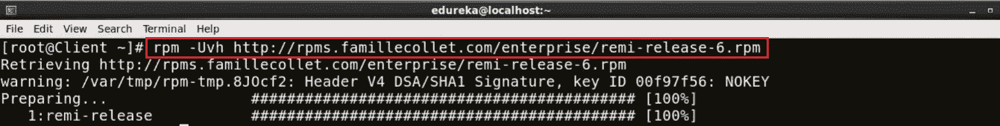

# Nagios 教程——了解如何使用 Nagios 执行连续监控

> 原文：<https://medium.com/edureka/nagios-tutorial-e63e2a744cc8?source=collection_archive---------2----------------------->


Nagios Tutorial — Edureka

我相信 Nagios 上的帖子很少，互联网上的相关信息也不多。所以，我认为这篇文章会让你对这个监控工具有一个清晰的认识。Nagios 监控您的整个 IT 基础设施，以确保系统、应用程序、服务和业务流程正常运行。在这个 Nagios 教程中，我将涉及以下主题:

1.  为什么我们需要持续监控？
2.  什么是持续监控？
3.  什么是 Nagios？
4.  如何安装 Nagios？
5.  如何使用 NRPE 添加远程服务器。

让我们从理解为什么我们需要持续监控开始这个 Nagios 教程，因为每件事的存在都是有原因的。所以，让我们试着找出原因。

# 为什么我们需要持续监控？

持续监控工具解决任何系统错误(内存不足、无法访问服务器等。)以免它们对您的业务效率产生任何负面影响。

使用监控工具的重要原因是:

*   它检测任何网络或服务器问题
*   它决定了任何问题的根本原因
*   它维护服务的安全性和可用性
*   它监控和排除服务器性能问题
*   它使我们能够在过时的系统导致故障之前规划基础架构升级
*   它可以在问题出现的第一时间做出反应
*   它可用于在检测到问题时自动修复问题
*   它确保 It 基础架构中断对您组织的底线影响最小
*   它可以监控您的整个基础架构和业务流程

是的，它做了很多很酷的工作，但是它是什么呢？

# 什么是持续监控？

首先让我告诉你持续监控在 *DevOps 生命周期*中的位置，请看下图:


看着图表，您一定会认为这是 DevOps 生命周期的最后一个阶段，但事实并非如此。DevOps 的生命周期没有尽头，这就是无限符号的原因。一旦在生产服务器上部署了应用程序，就需要持续的监控。

持续监控是指组织检测、报告、响应、遏制和缓解其基础架构中发生的攻击的能力。

连续监测实际上并不新鲜，它已经存在了一段时间。多年来，我们的安全专家一直在对系统日志、防火墙日志、IDS 日志、IPS 日志等进行静态分析。但是，它没有提供适当的分析和回应。今天的持续监控方法使我们能够汇总我在上面讨论的所有事件，关联它们，比较它们，然后估计组织的风险状况。

如果我们把所有这些碎片放在一起，并确保它们之间的相互联系。这就是持续监控的症结所在。

让我用一个用例来解释一下。考虑下图:


现在，让我给你解释一下上面的图表:

1.  我们有各种安全工具，如防火墙、IDS、端点保护等。它们与安全信息和事件管理系统相连。
2.  为了实现持续的监控，我们需要让所有的部分都相互对话，让我来给你解释一下。
3.  因此，我们有安全工具和一系列“端点”，这可以包括客户端和服务器、路由器、交换机、移动设备等。
4.  然后，这两个小组可以通过通用语言，以更加自动化的方式与安全信息和事件管理系统(SIEM)对话。
5.  与此 SIEM 相关的有两个重要组件，第一个是数据仓库。现在，对于这个数据仓库，我们将连接“分析”和“安全智能”。
6.  安全情报(SI)是与保护组织免受外部和内部威胁相关的信息，以及旨在收集和分析这些信息的流程、策略和工具。
7.  此 SIEM 还连接到一个“治理风险和合规性系统”,它主要提供仪表板。
8.  在这个“治理风险和合规系统”上，我们附加了一个风险数据库。这给了我们“可操作的情报”。
9.  可操作的情报只不过是可以采取行动的信息，并进一步暗示应该采取行动。

因此，我们正在持续监控事件，并确定我们正在经历的风险级别。有了这个，我们就能把 SIEM 的事件联系起来。我们可以在“分析引擎”上执行网络行为和异常检测。**这就是持续监控的意义所在**:

> 组织安全工具的集成，安全工具产生的数据的聚合、规范化和关联。基于组织的风险目标和威胁知识的数据分析，以及对已识别风险的近乎实时的响应。

***如果你不能衡量它，你就不能管理它***’。我希望你知道我在说什么。

在接下来的 Nagios 教程中，我将向您介绍一个最著名的监控工具‘Nagios’。

# 什么是 Nagios？

Nagios 用于持续监控 DevOps 文化中的系统、应用程序、服务和业务流程等。如果出现故障，Nagios 可以向技术人员发出问题警报，允许他们在中断影响业务流程、最终用户或客户之前开始补救过程。使用 Nagios，您不必解释为什么看不见的基础设施中断会影响您组织的底线。

让我给你解释一下 Nagios 是如何工作的。考虑下图:


Nagios 运行在服务器上，通常作为守护进程或服务。

它定期运行驻留在同一台服务器上的插件，它们联系您的网络或互联网上的主机或服务器。用户可以使用 web 界面查看状态信息。如果有事发生，你也可以收到电子邮件或短信通知。Nagios 守护进程就像一个调度程序，在特定的时刻运行特定的脚本。它存储这些脚本的结果，如果这些结果发生变化，它将运行其他脚本。

**插件:** 这些是编译后的可执行文件或脚本(Perl 脚本、shell 脚本等。)可以从命令行运行，以检查主机或服务的状态。Nagios 使用插件的结果来确定网络上主机和服务的当前状态。

现在让我们来讨论它的架构。

# Nagios 架构:

*   Nagios 构建在服务器/代理架构之上。
*   通常，在网络上，Nagios 服务器运行在主机上，插件与本地和所有需要监控的远程主机进行交互。
*   这些插件将信息发送给调度程序，调度程序将信息显示在 GUI 中。


我还需要向你解释 NRPE (Nagios 远程插件执行器)。

NRPE 插件被设计成允许你在远程 Linux/Unix 机器上执行 Nagios 插件。这样做的主要原因是允许 Nagios 监控“本地”资源(如 CPU 负载、内存使用等。)在远程机器上。因为这些公共资源通常不会暴露给外部机器，所以像 NRPE 这样的代理必须安装在远程 Linux/Unix 机器上。

考虑下图:


*   check_nrpe 插件驻留在本地监控机器上。
*   NRPE 守护进程运行在远程 Linux/Unix 机器上。
*   如上图所示，监控主机和远程主机之间有一个 SSL(安全套接字层)连接。

现在在这个 Nagios 教程中，是时候进行一些**实践**了。

让我们从安装 Nagios 核心开始

# 安装 Nagios 核心:

安装 Nagios 的完整过程可以总结为四个步骤:

1.  在监控服务器中安装所需的软件包
2.  安装 Nagios 核心、Nagios 插件和 NRPE (Nagios 远程插件执行器)
3.  设置 Nagios 密码以访问 Web 界面
4.  在客户端安装 NRPE

## 步骤 1:在监控服务器上安装所需的软件包:

访问网站:[**http://dl.fedoraproject.org/pub/epel/6/**](https://dl.fedoraproject.org/pub/epel/6/)


点击 i386，然后你将被重定向到一个页面。


由于我使用的是 **CentOS 6** ，所以我将右键单击并复制'***epel-release-6–8 . no arch . rpm***'的链接位置，如上图截图所示。

打开终端，使用***rpm-Uvh****命令粘贴链接。*

**

*我们需要再下载一个存储库，请访问网站'**http://rpms.famillecollet.com/enterprise**/'*

**

*右键复制'***remi-release-6 . rpm***的链接位置*

*再次打开终端，使用 ***rpm -Uvh*** 命令粘贴链接。*

**

*好了，前提条件已经谈完了。让我们进行下一步。*

## *步骤 2:安装 Nagios 核心、Nagios 插件和 NRPE (Nagios 远程插件执行器):*

*在终端中执行以下命令:*

```
*yum -y install nagios nagios-plugins-all nagios-plugins-nrpe nrpe httpd php*
```

*这将安装 Nagios，Nagios 插件，NRPE，NRPE，阿帕奇和 [PHP](https://www.edureka.co/blog/php-tutorial-for-beginners/?utm_source=medium&utm_medium=content-link&utm_campaign=nagios-tutorial) 插件。*

*Apache web 服务器需要监视当前的 web 服务器状态。*

*Php 用于处理网站日期的动态内容。*

**

*接下来，我们需要启用 Apache 和 Nagios 服务:*

```
*chkconfig httpd on && chkconfig nagios on*
```

**

*我们的下一步是启动 Nagios 和 Apache:*

```
*service httpd start && service nagios start*
```

**

*现在，我将启用至少 1GB 的交换内存。是时候使用 dd 命令创建交换文件本身了:*

```
*dd if=/dev/zero of=/swap bs=1024 count=2097152*
```

**

*交换基本上是用来从 RAM 中释放一些不经常访问的信息，并将其移动到硬盘上的特定分区。*

*现在您已经创建了交换分区，使用命令 *mkswap* 来设置交换分区。这将通过创建一个 linux 交换区来准备交换文件。*

```
*mkswap /swap*
```

*为了防止文件在全球范围内可读，您应该对交换文件设置正确的权限:*

```
*chown root. /swap 
chmod 0600 /swap*
```

*如果您没有看到错误，您的交换空间就可以使用了。要立即激活它，请键入:*

```
*swapon /swap*
```

**

*该文件将保留在虚拟专用服务器上，直到计算机重新启动。通过将交换添加到 fstab 文件中，可以确保交换是永久性的。*

```
*echo /swap swap swap defaults 0 0 >> /etc/fstab*
```

**

*操作系统内核可以通过一个名为 **swappiness** 的配置参数来调整它依赖交换的频率。*

*要查找当前的交换度设置，请键入:*

```
*cat /proc/sys/vm/swappiness*
```

*交换度可以是 0 到 100 之间的值。接近 100 的交换率意味着操作系统会经常交换，而且通常交换得太快。虽然交换提供了额外的资源，但 RAM 比交换空间快得多。每当有东西从 RAM 移到 swap 时，它就会变慢。*

*swappiness 值为 0 意味着操作仅在绝对需要时才依赖交换。我们可以用 sysctl 命令调整交换度。要使您的 VPS 在每次启动时自动应用该设置，您可以将该设置添加到/etc/sysctl.conf 文件中:*

```
*echo vm.swappiness = 0 >> /etc/sysctl.conf && sysctl -p*
```

**

*最后，我们完成了第二步。*

*让我们进一步设置 Nagios 密码来访问 web 界面。*

## *步骤 3:设置 Nagios 密码以访问 Web 界面:*

*使用以下命令设置访问 web 界面的密码:*

```
*htpasswd -c /etc/nagios/passwd nagiosadmin*
```

**

*键入密码，并通过重新键入进行确认。*

*现在，打开浏览器。在这里，键入您的公共 IP 或主机名/nagios。考虑下面的例子:*

**

*在这里，给出用户名和密码。默认情况下，用户名是 ***、nagiosadmin*** *、*，密码是您在上一步中设置的。最后，按确定。*

*在此之后，您将被定向到 **Nagios 核心仪表板**。*

**

*您可以单击 hosts 并查看 Nagios 核心当前正在监控的所有主机。*

**

*您可以注意到它只监视一台主机，即 localhost。如果我希望我的 Nagios 内核监控一个远程主机，我需要在那个远程主机上安装 NRPE。这将我们带到下一步，在您希望 Nagios 监控的客户机/机器上安装 NRPE。*

## *步骤 4:在客户端安装 NRPE:*

*好吧，那么，让我们在客户机上安装 NRPE。*

*首先，您需要像我在 Nagios 服务器上一样安装所需的包。因此，只需执行相同的命令，考虑下面的截图:*

****

*现在在客户端安装 Nagios、Nagios 插件和 NRPE:*

```
*yum -y install nagios nagios-plugins-all nrpe*
```

**

*安装后，启用 NRPE 服务:*

```
*chkconfig nrpe on*
```

**

*我们的下一步是编辑， ***nrpe.cfg*** 文件。我将使用 *vi* 编辑器，您也可以选择任何其他编辑器:*

**

*您需要在允许的主机行中添加您的监控服务器的 IP 地址，请考虑下面的屏幕截图:*

**

*这里，我的监控服务器的 IP 地址是 192.168.56.101。*

*现在，我们需要设置防火墙规则，以允许监控服务器和客户端之间的连接。*

```
*iptables -N NRPE*
```

*-选项用于将新规则附加到链的末尾。如果您想把它放在链中的其他地方，您可以使用-I 选项，它允许您指定新规则的位置。*

*以下命令接受端口 5666 上的 tcp 请求。*

```
*iptables -I INPUT -s 0/0 -p tcp --dport 5666 -j NRPE
iptables -I NRPE -s 192.168.56.101 -j ACCEPT
iptables -A NRPE -s 0/0 -j DROP*
```

*这将基本上配置 iptables 接受来自特定主机(在我的例子中是 192.168.56.101)的数据包，并丢弃来自其他主机的数据包。*

*现在，我将保存这些配置:*

```
*/etc/init.d/iptables save*
```

**

*立即开始 NRPE 服务。*

```
*service nrpe start*
```

**

*现在回到监控服务器。*

*在这里，我需要编辑 nagios.cfg 文件。*

```
*vi /etc/nagios/nagios.cfg*
```

**

***取消注释该行—*CFG _ dir = etc/Nagios/servers****

**

*制作‘服务器’目录，为此使用 ***mkdir*** 命令。*

```
*mkdir /etc/nagios/servers/*
```

**

*将您的工作目录更改为服务器。*

```
*cd /etc/nagios/servers*
```

**

*在这个目录中创建一个新文件。cfg 扩展名并编辑它。我将把它命名为 client.cfg，我将使用 **vi** 编辑器。*

```
*vi /etc/nagios/servers/client.cfg*
```

**

*在此添加以下几行:*

**

*这基本上包括了我想要监控的服务类型。给出您希望 Nagios 监控的机器的主机名及其 IP 地址。*

*同样，您可以添加许多想要监视的服务。相同的配置可用于添加“n”个客户端。*

*最后一步伙计们，正确设置文件夹权限，重启 Nagios。*

```
*chown -R nagios. /etc/nagios/*
```

**

*现在，重新启动 Nagios*

```
*service nagios restart*
```

**

*打开浏览器，再次键入*主机名或公共 ip/nagios/。*在我的例子中，是 localhost/nagios/。*

**

*单击 hosts 查看 Nagios 当前正在监控的所有机器。*

**

*这里您可以注意到，它当前正在监视客户机(我希望 Nagios 监视的机器的主机名)。基本上，我们已经添加了一个使用 NRPE 的远程主机。*

*我希望你喜欢阅读 Nagios 教程的这篇文章。如果你想查看更多关于人工智能、Python、道德黑客等市场最热门技术的文章，你可以参考 Edureka 的官方网站。*

*请留意本系列中的其他文章，它们将解释 DevOps 的各个方面。*

> **1。* [*DevOps 教程*](/edureka/devops-tutorial-89363dac9d3f)*
> 
> **2。* [*Git 教程*](/edureka/git-tutorial-da652b566ece)*
> 
> **3。* [*詹金斯教程*](/edureka/jenkins-tutorial-68110a2b4bb3)*
> 
> **4。* [*Docker 教程*](/edureka/docker-tutorial-9a6a6140d917)*
> 
> **5。* [*Ansible 教程*](/edureka/ansible-tutorial-9a6794a49b23)*
> 
> **6。* [*木偶教程*](/edureka/puppet-tutorial-848861e45cc2)*
> 
> **7。* [*厨师教程*](/edureka/chef-tutorial-8205607f4564)*
> 
> **8。* [*如何编排 DevOps 工具？*](/edureka/devops-tools-56e7d68994af)*
> 
> **9。* [*连续交货*](/edureka/continuous-delivery-5ca2358aedd8)*
> 
> **10。* [*持续集成*](/edureka/continuous-integration-615325cfeeac)*
> 
> **11。* [*连续部署*](/edureka/continuous-deployment-b03df3e3c44c)*
> 
> **12。* [*持续交付 vs 持续部署*](/edureka/continuous-delivery-vs-continuous-deployment-5375642865a)*
> 
> **13。* [*CI CD 管道*](/edureka/ci-cd-pipeline-5508227b19ca)*
> 
> **14。* [*Docker 作曲*](/edureka/docker-compose-containerizing-mean-stack-application-e4516a3c8c89)*
> 
> **15。* [*码头工人群*](/edureka/docker-swarm-cluster-of-docker-engines-for-high-availability-40d9662a8df1)*
> 
> *16。 [*码头工人联网*](/edureka/docker-networking-1a7d65e89013)*
> 
> *17。[](/edureka/ansible-roles-78d48578aca1)*
> 
> **18。[](/edureka/ansible-vault-secure-secrets-f5c322779c77)**
> 
> ****19。*[*Ansible for AWS*](/edureka/ansible-for-aws-provision-ec2-instance-9308b49daed9)***
> 
> ***20。 [*詹金斯管道*](/edureka/jenkins-pipeline-tutorial-continuous-delivery-75a86936bc92)***
> 
> ****21。* [*顶级 Git 命令*](/edureka/git-commands-with-example-7c5a555d14c)***
> 
> ****二十二。* [*顶级 Docker 命令*](/edureka/docker-commands-29f7551498a8)***
> 
> ****23。*[*Git vs GitHub*](/edureka/git-vs-github-67c511d09d3e)***
> 
> ****24。* [*DevOps 面试问题*](/edureka/devops-interview-questions-e91a4e6ecbf3)***
> 
> ****25。* [*谁是 DevOps 工程师？*](/edureka/devops-engineer-role-481567822e06)***
> 
> ****26。* [*DevOps 生命周期*](/edureka/devops-lifecycle-8412a213a654)***
> 
> ****27。*[*Git ref log*](/edureka/git-reflog-dc05158c1217)***
> 
> ****28。*[](/edureka/ansible-provisioning-setting-up-lamp-stack-d8549b38dc59)***
> 
> *****29。* [*组织正在寻找的顶尖 DevOps 技能*](/edureka/devops-skills-f6a7614ac1c7)****
> 
> ***三十。 [*瀑布 vs 敏捷*](/edureka/waterfall-vs-agile-991b14509fe8)***
> 
> ****31。* [*Maven 用于构建 Java 应用*](/edureka/maven-tutorial-2e87a4669faf)***
> 
> ****32。* [*詹金斯小抄*](/edureka/jenkins-cheat-sheet-e0f7e25558a3)***
> 
> ****33。* [*Ansible 备忘单*](/edureka/ansible-cheat-sheet-guide-5fe615ad65c0)***
> 
> ****34。* [*Ansible 面试问答*](/edureka/ansible-interview-questions-adf8750be54)***
> 
> ***35。 [*50 码头工人面试问题*](/edureka/docker-interview-questions-da0010bedb75)***
> 
> ***36。 [*敏捷方法论*](/edureka/what-is-agile-methodology-fe8ad9f0da2f)***
> 
> ****37。* [*詹金斯面试问题*](/edureka/jenkins-interview-questions-7bb54bc8c679)***
> 
> ****38。* [*Git 面试问题*](/edureka/git-interview-questions-32fb0f618565)***
> 
> ***39。 [*Docker 架构*](/edureka/docker-architecture-be79628e076e)***
> 
> ***40。[*devo PS 中使用的 Linux 命令*](/edureka/linux-commands-in-devops-73b5a2bcd007)***
> 
> ***41。 [*詹金斯 vs 竹子*](/edureka/jenkins-vs-bamboo-782c6b775cd5)***
> 
> ****42。* [*Nagios 面试问题*](/edureka/nagios-interview-questions-f3719926cc67)***
> 
> ****43。* [*DevOps 实时场景*](/edureka/jenkins-x-d87c0271af57)***
> 
> ****44。* [*詹金斯和詹金斯 X*](/edureka/jenkins-vs-bamboo-782c6b775cd5) 的区别***
> 
> ****45。*[*Windows Docker*](/edureka/docker-for-windows-ed971362c1ec)***
> 
> ****46。*[*Git vs Github*](http://git%20vs%20github/)***

****原载于 2017 年 11 月 22 日*[*www.edureka.co*](https://www.edureka.co/blog/nagios-tutorial/)*。****