# 在 R 中实现朴素贝叶斯的逐步指南

> 原文：<https://medium.com/edureka/naive-bayes-in-r-37ca73f3e85c?source=collection_archive---------2----------------------->

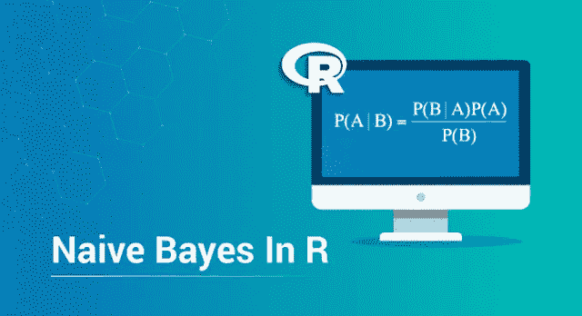

Naive Bayes in R -Edureka

机器学习已经成为市场上最受欢迎的技能。了解各种机器学习算法及其工作原理是非常重要的。在这篇关于 R 中的朴素贝叶斯的文章中，我打算帮助您了解朴素贝叶斯是如何工作的，以及如何使用 R 语言实现它。

本文涵盖了以下主题:

1.  什么是朴素贝叶斯？
2.  朴素贝叶斯背后的数学
3.  朴素贝叶斯算法的贝叶斯定理
4.  朴素贝叶斯是如何工作的？
5.  朴素贝叶斯在 R 中的实际实现

# 什么是朴素贝叶斯？

*朴素贝叶斯是一种基于贝叶斯定理的监督机器学习算法，用于通过遵循概率方法来解决分类问题。它基于这样的想法，即在一个* [*机器学习*](https://www.edureka.co/blog/what-is-machine-learning?utm_source=medium&utm_medium=content-link&utm_campaign=naive-bayes-in-r) *模型中的预测变量是相互独立的。这意味着模型的结果取决于一组彼此无关的独立变量。*

## 但是为什么朴素贝叶斯被称为‘朴素’呢？

在现实世界的问题中，预测变量并不总是相互独立的，它们之间总是存在一些相关性。因为朴素贝叶斯认为每个预测变量都独立于模型中的任何其他变量，所以它被称为“朴素”。

现在让我们来理解朴素贝叶斯算法背后的逻辑。

# 朴素贝叶斯背后的数学

朴素贝叶斯背后的原理是贝叶斯定理，也称为贝叶斯规则。贝叶斯定理用于计算条件概率，条件概率只不过是基于过去事件信息的事件发生的概率。数学上，贝叶斯定理表示为:

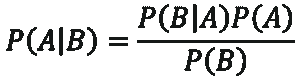

***上式中:***

*   P(A|B):给定事件 B，事件 A 发生的条件概率
*   P(A):事件 A 发生的概率
*   P(B):事件 B 发生的概率
*   P(B|A):给定事件 A，事件 B 发生的条件概率

***形式上，贝叶斯定理的术语如下:***

*   a 被称为命题，B 是证据
*   P(A)代表命题的先验概率
*   P(B)代表证据的先验概率
*   P(A|B)称为后验概率
*   P(B|A)是可能性

因此，贝叶斯定理可以概括为:

***后验=(可能性)。(命题先验概率)/证据先验概率***

也可以按以下方式考虑:

给定一个假设 H 和证据 E，贝叶斯定理说明，得到证据 P(H)之前假设的概率和得到证据 P(H|E)之后假设的概率之间的关系是:

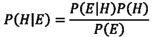

现在你知道贝叶斯定理是什么了，让我们看看它是如何推导出来的。

# 贝叶斯定理的推导

贝叶斯定理的主要目的是计算条件概率。贝叶斯规则可以从以下两个等式中导出:

给定 B，下面的等式表示 A 的条件概率:

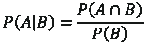

给定 A，下面的等式表示 B 的条件概率:

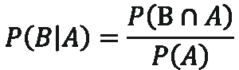

因此，结合上述两个方程，我们得到贝叶斯定理:


# 朴素贝叶斯算法的贝叶斯定理

上述等式适用于单个预测变量，但是在现实应用中，存在多个预测变量，对于分类问题，存在多个输出类。类别可以表示为 C1，C2，…，Ck，预测变量可以表示为向量 x1，x2，…，xn。

朴素贝叶斯算法的目标是用属于特定类别 Ci 的特征向量 x1，x2，…，xn 来测量事件的条件概率，


在计算上述等式时，我们得到:

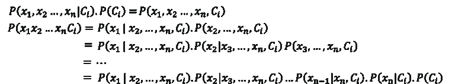

但是，条件概率，即 P(xj|xj+1，…，xn，Ci)总计为 P(xj|Ci)，因为每个预测变量在朴素贝叶斯中是独立的。

最后的等式归结为:

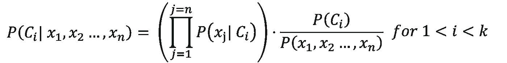

这里， *P(x1，x2，…，xn)* 对于所有的类都是常数，因此我们得到:

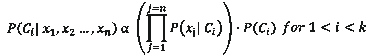

# 朴素贝叶斯是如何工作的？

为了更好地理解朴素贝叶斯的工作原理，我们来看一个例子。

考虑一个具有 1500 个观察值和以下输出类的数据集:

*   猫
*   鹦鹉
*   龟

预测变量本质上是分类的，即它们存储两个值，真或假:

*   游泳
*   翅膀
*   绿色
*   锋利的牙齿

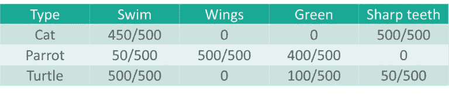

从上表中，我们可以总结出:

***类猫显示:***

*   500 只猫中，有 450 只(90%)会游泳
*   0 数量的猫有翅膀
*   0 只猫是绿色的
*   所有 500 只猫都有锋利的牙齿

***类鹦鹉显示:***

*   50 只(10%)鹦鹉具有游泳的真正价值
*   所有 500 只鹦鹉都有翅膀
*   500 只鹦鹉中有 400 只(80%)是绿色的
*   没有鹦鹉有锋利的牙齿

***甲鱼类显示:***

*   所有的 500 只海龟都会游泳
*   0 数量的乌龟有翅膀
*   500 只海龟中，有 100 只(20%)是绿色的
*   500 只海龟中有 50 只(10%)有锋利的牙齿

现在，有了可用的数据，让我们使用朴素贝叶斯分类器将下面的观察结果分类到其中一个输出类(猫、鹦鹉或海龟)中。


这里的目标是根据定义的预测变量(游泳、翅膀、绿色、锋利的牙齿)预测动物是猫、鹦鹉还是乌龟。

**为了解决这个问题，我们将使用朴素贝叶斯方法，
*P(H |多重证据)= P(C1 | H)* P(C2 | H)……* P(Cn | H)* P(H)/P(多重证据)***

在观察中，变量 Swim 和 Green 为真，结果可以是任何一种动物(猫、鹦鹉、乌龟)。

**检查动物是否为猫:**
*P(猫|游，绿色)= P(游|猫)* P(绿色|猫)* P(猫)/ P(游，绿色)*
*= 0.9 * 0.333/P(游，绿色)*
*= 0*

**检查动物是否为鹦鹉:**
*P(鹦鹉|游，绿)= P(游|鹦鹉)* P(绿|鹦鹉)* P(鹦鹉)/ P(游，绿)*
*= 0.1 * 0.80 * 0.333/P(游，绿)*
*= 0.0264/ P(游，绿)*

**检查动物是否为龟:**
*P(龟|游，绿)= P(游|龟)* P(绿|龟)* P(龟)/ P(游，绿)*
*= 1 * 0.2 * 0.333 / P(游，绿)*
*= 0.0666/ P(游，绿)*

对于上述所有计算，分母是相同的，即 P(游泳，绿色)。P(Turtle| Swim，Green)的值大于 P(Parrot| Swim，Green)，因此我们可以正确预测动物的类别为乌龟。

现在让我们看看如何使用 R 语言实现朴素贝叶斯。

# 朴素贝叶斯在 R 中的实际实现

**问题陈述:**研究一个糖尿病数据集，建立一个预测一个人是否患有糖尿病的机器学习模型。

**数据集描述:**给定的数据集包含 100 个患者的观察结果以及他们的健康细节。这里有一个预测变量列表，可以帮助我们将患者分为糖尿病患者或正常患者:

*   怀孕:迄今为止的怀孕次数
*   葡萄糖:血浆葡萄糖浓度
*   血压:舒张压(毫米汞柱)
*   皮肤厚度:三头肌皮褶厚度(毫米)
*   胰岛素:2 小时血清胰岛素(μU/ml)
*   身体质量指数:体重指数(体重公斤/(身高米) )
*   糖尿病谱系功能:糖尿病谱系功能
*   年龄:年龄(岁)

响应变量或输出变量为:

*   结果:类变量(0 或 1)

**逻辑:**构建朴素贝叶斯模型，通过研究患者的医疗记录(如血糖水平、年龄、身体质量指数等)将患者分类为糖尿病患者或正常患者。

现在你知道了这个演示的目的，让我们开动脑筋，开始编码吧。对于这个演示，我将使用 R 语言来构建模型。

现在，我们开始吧。

**第一步:** *安装并加载所需的包*

```
#Loading required packages
install.packages('tidyverse')
library(tidyverse)
install.packages('ggplot2')
library(ggplot2)
install.packages('caret')
library(caret)
install.packages('caretEnsemble')
library(caretEnsemble)
install.packages('psych')
library(psych)
install.packages('Amelia')
library(Amelia)
install.packages('mice')
library(mice)
install.packages('GGally')
library(GGally)
install.packages('rpart')
library(rpart)
install.packages('randomForest')
library(randomForest)
```

**第二步:** *导入数据集*

```
#Reading data into R
data<- read.csv("/Users/Zulaikha_Geer/Desktop/NaiveBayesData/diabetes.csv")
```

在我们研究数据集之前，让我们将输出变量(“结果”)转换成分类变量。这是必要的，因为我们的输出将是两个类的形式，真或假。其中 true 表示患者患有糖尿病，false 表示患者没有糖尿病。

```
#Setting outcome variables as categorical data$Outcome <- factor(data$Outcome, levels = c(0,1), labels = c("False", "True"))
```

**第三步:** *学习数据集*

```
#Studying the structure of the data 
str(data)
```

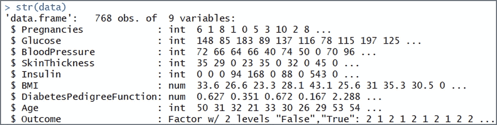

```
head(data)
```

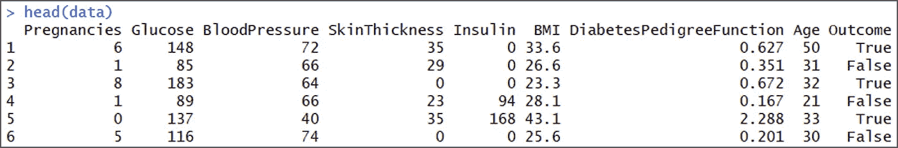

```
describe(data)
```

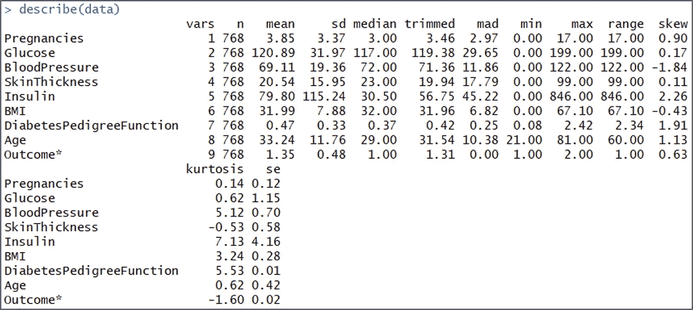

**第四步:** *数据清理*

在分析数据集的结构时，我们可以看到葡萄糖、血压、皮肤厚度、胰岛素和身体质量指数的最小值都为零。这并不理想，因为没有人的葡萄糖、血压等的值为零。因此，这些值被视为缺失的观察值。

在下面的代码片段中，我们将零值设置为 NA:

```
#Convert '0' values into NA
data[, 2:7][data[, 2:7] == 0] <- NA
```

为了检查我们现在有多少缺失的值，让我们将数据可视化:

```
#visualize the missing data
missmap(data)
```

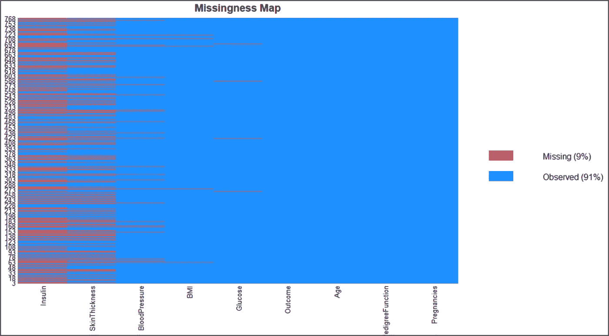

上图显示我们的数据集有大量缺失值，移除所有缺失值会使我们的数据集更小，因此，我们可以在 r 中使用 *mice* 包进行插补。

```
#Use mice package to predict missing values
mice_mod <- mice(data[, c("Glucose","BloodPressure","SkinThickness","Insulin","BMI")], method='rf')
mice_complete <- complete(mice_mod)

iter imp variable
1 1 Glucose BloodPressure SkinThickness Insulin BMI
1 2 Glucose BloodPressure SkinThickness Insulin BMI
1 3 Glucose BloodPressure SkinThickness Insulin BMI
1 4 Glucose BloodPressure SkinThickness Insulin BMI
1 5 Glucose BloodPressure SkinThickness Insulin BMI
2 1 Glucose BloodPressure SkinThickness Insulin BMI
2 2 Glucose BloodPressure SkinThickness Insulin BMI
2 3 Glucose BloodPressure SkinThickness Insulin BMI
2 4 Glucose BloodPressure SkinThickness Insulin BMI
2 5 Glucose BloodPressure SkinThickness Insulin BMI

#Transfer the predicted missing values into the main data set
data$Glucose <- mice_complete$Glucose
data$BloodPressure <- mice_complete$BloodPressure
data$SkinThickness <- mice_complete$SkinThickness
data$Insulin<- mice_complete$Insulin
data$BMI <- mice_complete$BMI
```

为了检查是否还有任何缺失值，让我们使用 missmap 图:

```
missmap(data)
```

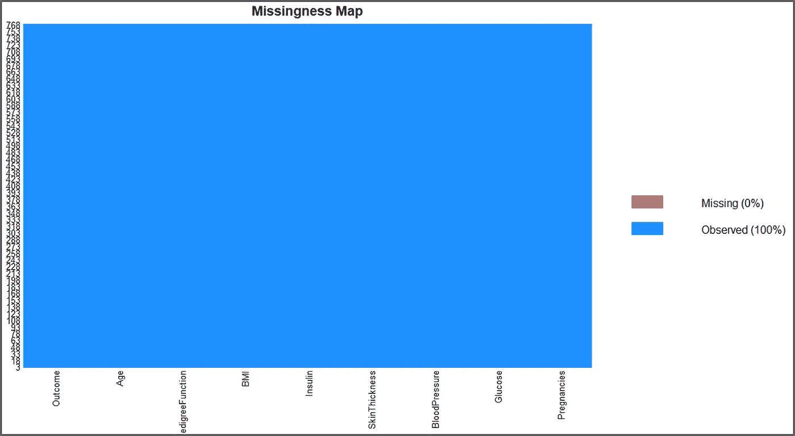

输出看起来不错，没有丢失数据。

**第五步:** *探索性数据分析*

现在，让我们进行一些可视化，以更好地了解每个变量，这一阶段对于理解每个预测变量的意义至关重要。

```
#Data Visualization
#Visual 1
ggplot(data, aes(Age, colour = Outcome)) +
geom_freqpoly(binwidth = 1) + labs(title=”Age Distribution by Outcome”)
```

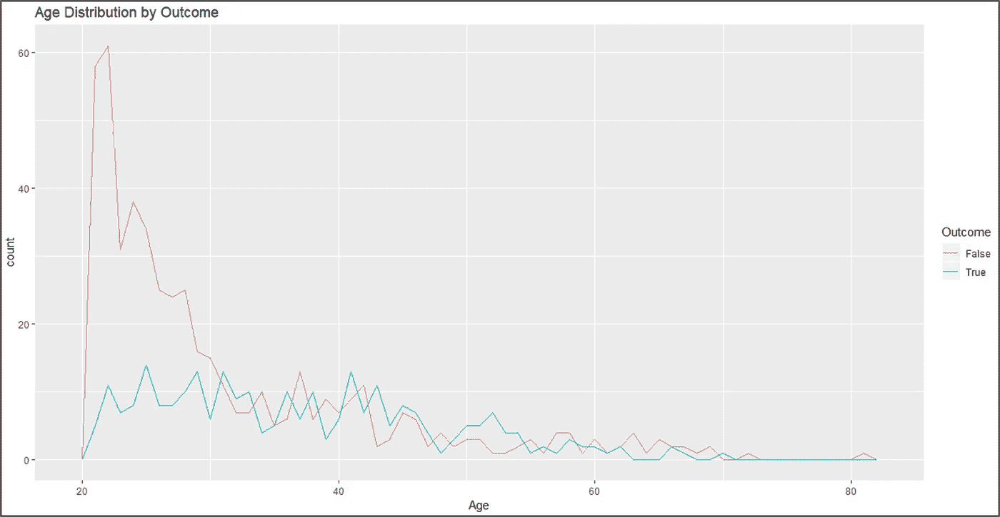

```
#visual 2
c <- ggplot(data, aes(x=Pregnancies, fill=Outcome, color=Outcome)) +
geom_histogram(binwidth = 1) + labs(title="Pregnancy Distribution by Outcome")
c + theme_bw()
```

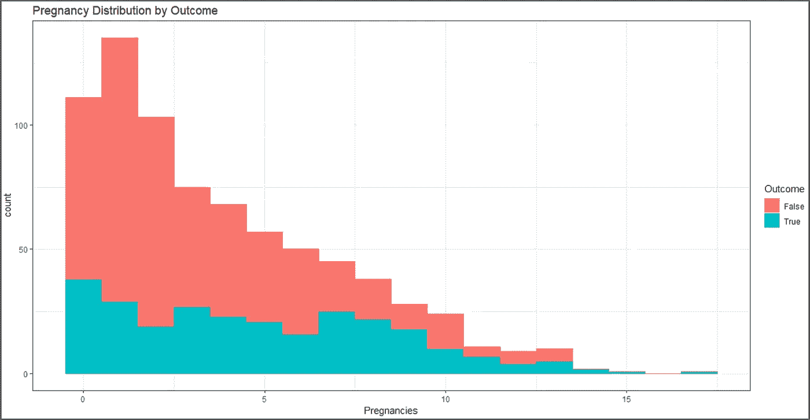

```
#visual 3
P <- ggplot(data, aes(x=BMI, fill=Outcome, color=Outcome)) +
geom_histogram(binwidth = 1) + labs(title="BMI Distribution by Outcome")
P + theme_bw()
```

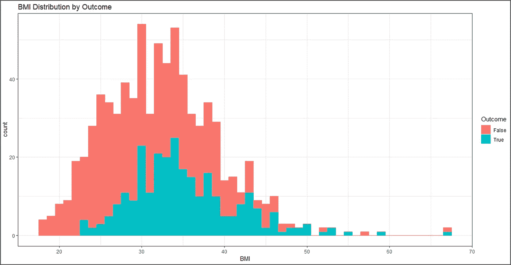

```
#visual 4
ggplot(data, aes(Glucose, colour = Outcome)) +
geom_freqpoly(binwidth = 1) + labs(title="Glucose Distribution by Outcome")
```

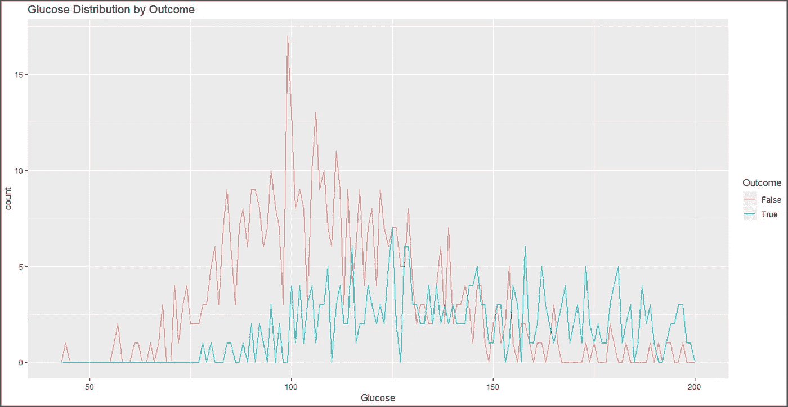

```
#visual 5ggpairs(data)
```

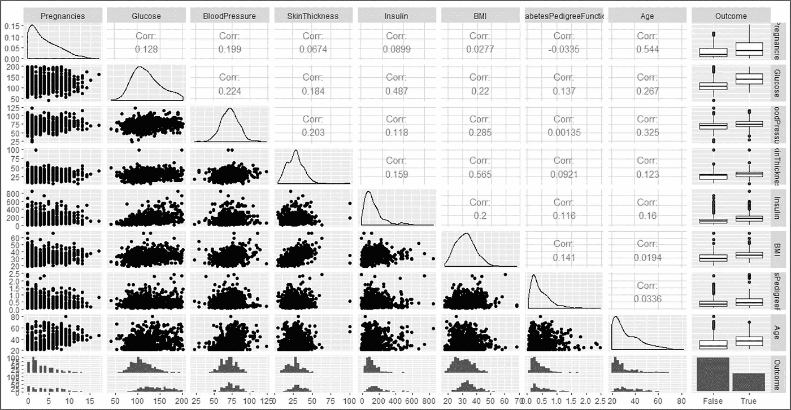

**第六步:** *数据建模*

*   这个阶段从一个称为数据拼接的过程开始，其中数据集被分成两部分:
*   训练集:这部分数据集用于建立和训练机器学习模型。
*   测试集:这部分数据集用于评估模型的效率。

这个阶段从一个称为数据拼接的过程开始，其中数据集被分成两部分:

```
#Building a model
#split data into training and test data sets
indxTrain <- createDataPartition(y = data$Outcome,p = 0.75,list = FALSE)
training <- data[indxTrain,]
testing <- data[-indxTrain,]

#Check dimensions of the split

> prop.table(table(data$Outcome)) * 100

False True
65.10417 34.89583

> prop.table(table(training$Outcome)) * 100

False True
65.10417 34.89583

> prop.table(table(testing$Outcome)) * 100

False True
65.10417 34.89583
```

为了比较培训和测试阶段的结果，让我们创建单独的变量来存储响应变量的值:

```
#create objects x which holds the predictor variables and y which holds the response variables
x = training[,-9]
y = training$Outcome
```

现在是时候加载包含朴素贝叶斯函数的 e1071 包了。这是 r 提供的内置函数。

```
library(e1071)
```

加载包后，以下代码片段将使用训练数据集创建朴素贝叶斯模型:

```
model = train(x,y,'nb',trControl=trainControl(method='cv',number=10))

> model
Naive Bayes

576 samples
8 predictor
2 classes: 'False', 'True'

No pre-processing
Resampling: Cross-Validated (10 fold)
Summary of sample sizes: 518, 518, 519, 518, 519, 518, ...
Resampling results across tuning parameters:

usekernel Accuracy Kappa
FALSE 0.7413793 0.4224519
TRUE 0.7622505 0.4749285

Tuning parameter 'fL' was held constant at a value of 0
Tuning parameter 'adjust' was held
constant at a value of 1
Accuracy was used to select the optimal model using the largest value.
The final values used for the model were fL = 0, usekernel = TRUE and adjust = 1.
```

因此，我们通过使用朴素贝叶斯分类器创建了一个预测模型。

**第七步:** *模型评估*

为了检查模型的效率，我们现在将对模型运行测试数据集，之后我们将使用混淆矩阵来评估模型的准确性。

```
#Model Evaluation
#Predict testing set
Predict <- predict(model,newdata = testing )
#Get the confusion matrix to see accuracy value and other parameter values

> confusionMatrix(Predict, testing$Outcome )
Confusion Matrix and Statistics

Reference
Prediction False True
False 91 18
True 34 49

Accuracy : 0.7292
95% CI : (0.6605, 0.7906)
No Information Rate : 0.651
P-Value [Acc > NIR] : 0.01287

Kappa : 0.4352

Mcnemar's Test P-Value : 0.03751

Sensitivity : 0.7280
Specificity : 0.7313
Pos Pred Value : 0.8349
Neg Pred Value : 0.5904
Prevalence : 0.6510
Detection Rate : 0.4740
Detection Prevalence : 0.5677
Balanced Accuracy : 0.7297

'Positive' Class : False
```

最终输出显示，我们构建了一个朴素贝叶斯分类器，它可以预测一个人是否患有糖尿病，准确率约为 73%。

```
#Plot Variable performance
X <- varImp(model)
plot(X)
```

为了对演示进行总结，让我们绘制一个图表，显示每个预测变量是如何独立负责预测结果的。

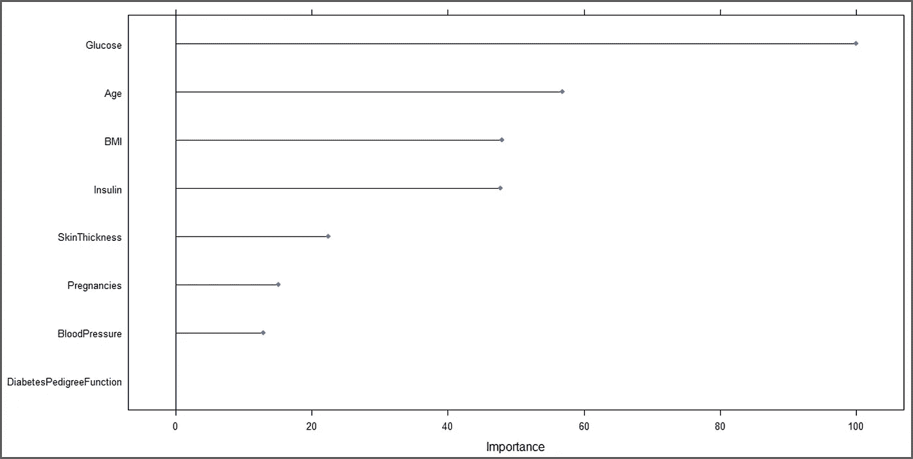

从上图可以清楚地看出,“葡萄糖”是预测结果的最重要的变量。到此，我们来结束这篇文章。

如果你想查看更多关于 Python、DevOps、Ethical Hacking 等市场最热门技术的文章，你可以参考 Edureka 的官方网站。

请留意本系列中的其他文章，它们将解释数据科学的各个方面。

> *1。* [*数据科学教程*](/edureka/data-science-tutorial-484da1ff952b)
> 
> *2。* [*数据科学的数学与统计*](/edureka/math-and-statistics-for-data-science-1152e30cee73)
> 
> *3。*[*R 中的线性回归*](/edureka/linear-regression-in-r-da3e42f16dd3)
> 
> *4。* [*数据科学教程*](/edureka/data-science-tutorial-484da1ff952b)
> 
> *5。*[*R 中的逻辑回归*](/edureka/logistic-regression-in-r-2d08ac51cd4f)
> 
> *6。* [*分类算法*](/edureka/classification-algorithms-ba27044f28f1)
> 
> *7。* [*随机森林中的 R*](/edureka/random-forest-classifier-92123fd2b5f9)
> 
> *8。* [*决策树中的 R*](/edureka/a-complete-guide-on-decision-tree-algorithm-3245e269ece)
> 
> *9。*[*5 大机器学习算法*](/edureka/machine-learning-algorithms-29eea8b69a54)
> 
> *10。* [*机器学习入门*](/edureka/introduction-to-machine-learning-97973c43e776)
> 
> *11。* [*统计与概率*](/edureka/statistics-and-probability-cf736d703703)
> 
> *12。* [*如何创建一个完美的决策树？*](/edureka/decision-trees-b00348e0ac89)
> 
> *13。* [*关于数据科学家角色的 10 大误区*](/edureka/data-scientists-myths-14acade1f6f7)
> 
> *14。* [*顶级数据科学项目*](/edureka/data-science-projects-b32f1328eed8)
> 
> 15。 [*数据分析师 vs 数据工程师 vs 数据科学家*](/edureka/data-analyst-vs-data-engineer-vs-data-scientist-27aacdcaffa5)
> 
> 16。 [*人工智能的种类*](/edureka/types-of-artificial-intelligence-4c40a35f784)
> 
> *17。*[*R vs Python*](/edureka/r-vs-python-48eb86b7b40f)
> 
> *18。* [*人工智能 vs 机器学习 vs 深度学习*](/edureka/ai-vs-machine-learning-vs-deep-learning-1725e8b30b2e)
> 
> 19。 [*机器学习项目*](/edureka/machine-learning-projects-cb0130d0606f)
> 
> 20。 [*数据分析师面试问答*](/edureka/data-analyst-interview-questions-867756f37e3d)
> 
> *21。* [*面向非程序员的数据科学和机器学习工具*](/edureka/data-science-and-machine-learning-for-non-programmers-c9366f4ac3fb)
> 
> *22。* [*十大机器学习框架*](/edureka/top-10-machine-learning-frameworks-72459e902ebb)
> 
> *23。* [*用于机器学习的统计*](/edureka/statistics-for-machine-learning-c8bc158bb3c8)
> 
> *24。* [*随机森林中的 R*](/edureka/random-forest-classifier-92123fd2b5f9)
> 
> *25。* [*广度优先搜索算法*](/edureka/breadth-first-search-algorithm-17d2c72f0eaa)
> 
> *26。*[*R 中的线性判别分析*](/edureka/linear-discriminant-analysis-88fa8ad59d0f)
> 
> *27。* [*机器学习的先决条件*](/edureka/prerequisites-for-machine-learning-68430f467427)
> 
> *28。* [*互动 WebApps 使用 R 闪亮*](/edureka/r-shiny-tutorial-47b050927bd2)
> 
> *29。* [*机器学习十大书籍*](/edureka/top-10-machine-learning-books-541f011d824e)
> 
> *三十。* [*无监督学习*](/edureka/unsupervised-learning-40a82b0bac64)
> 
> *31.1* [*0 最佳数据科学书籍*](/edureka/10-best-books-data-science-9161f8e82aca)
> 
> 32。 [*监督学习*](/edureka/supervised-learning-5a72987484d0)

*原载于 2019 年 4 月 22 日*[*https://www.edureka.co*](https://www.edureka.co/blog/naive-bayes-in-r/)*。*