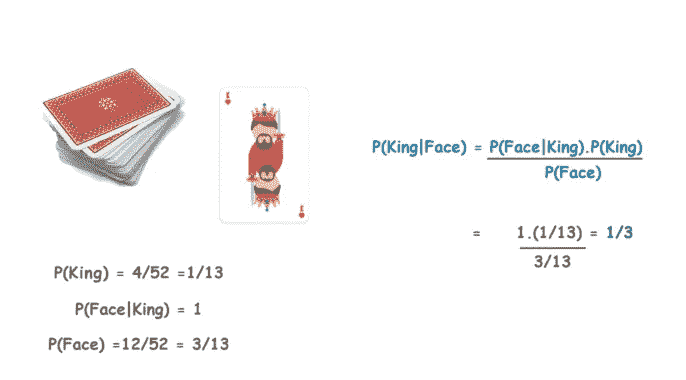
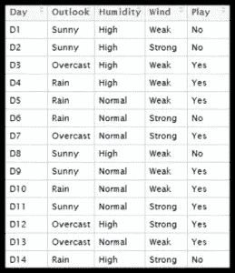
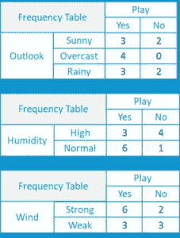
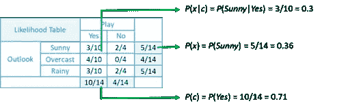
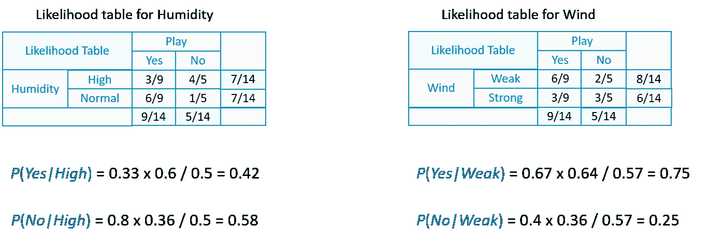
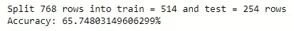
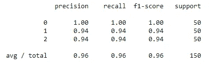
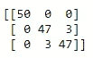

# 朴素贝叶斯分类器简介

> 原文：<https://medium.com/edureka/naive-bayes-tutorial-80939835d5cb?source=collection_archive---------0----------------------->


在一个充满机器学习和人工智能的世界，围绕着我们周围的几乎一切，分类和预测是机器学习最重要的方面之一，而朴素贝叶斯是一种简单但惊人强大的预测建模算法，据 ***机器学习行业专家*** 。所以，伙计们，在这个朴素贝叶斯教程中，我将涵盖以下主题:

*   **什么是朴素贝叶斯？**
*   **什么是贝叶斯定理？**
*   **利用贝叶斯定理的游戏预测**
*   **业内的朴素贝叶斯**
*   **逐步实现朴素贝叶斯**
*   **带 SKLEARN 的朴素贝叶斯**

# 什么是朴素贝叶斯？

朴素贝叶斯是用于**分类**的最简单和最强大的算法之一，它基于贝叶斯定理，假设预测器之间是独立的。朴素贝叶斯模型易于构建，对于非常大的数据集尤其有用。这个算法有两个部分:

*   **天真**
*   **贝叶斯**

朴素贝叶斯分类器假设类中某个要素的存在与任何其他要素无关。即使这些特征相互依赖或依赖于其他特征的存在，所有这些属性独立地促成了特定水果是苹果、桔子或香蕉的概率，这就是为什么它被称为**“天真”。**

让我们继续我们的朴素贝叶斯教程博客，理解贝叶斯定理。

# 什么是贝叶斯定理？

在统计学和概率论中，贝叶斯定理描述了一个事件发生的概率，它基于可能与该事件相关的条件的先验知识。这是一种计算条件概率的方法。

给定一个假设 **H** 和证据 **E，**贝叶斯定理说明，得到证据 **P(H)** 前假设的概率和得到证据 **P(H|E)** 后假设的概率之间的关系为:


这就把得到证据前的假设概率 **P(H)** ，和得到证据后的假设概率 **P(H|E)** 联系起来了。为此，将**称为先验概率**，而将 **P(H|E)** 称为**后验概率**。将两者联系起来的因子 **P(H|E) / P(E)** 称为**似然比**。使用这些术语，贝叶斯定理可以重新表述为:

"后验概率等于先验概率乘以似然比。"

走的有点迷茫？别担心。
让我们继续我们的朴素贝叶斯教程博客，用一个简单的概念来理解这个概念。

## 贝叶斯定理示例

假设我们有一副牌，我们希望找出“**我们随机挑选的牌成为王的概率，假设它是一张脸牌**”。所以，根据贝叶斯定理，我们可以解决这个问题。首先，我们需要找出概率

*   **P(k)**即 **4/52** ，因为一副牌中有 4 张 k。
*   **P(脸|王)**等于 **1** 因为所有的王都是脸牌。
*   **P(面)**等于 **12/52** 因为一套 13 张牌中有 3 张面牌，总共有 4 套。



现在，把所有的值放入贝叶斯方程，我们得到的结果是 **1/3**

# 利用贝叶斯定理进行游戏预测

让我们继续我们的朴素贝叶斯教程博客，并预测我们拥有的天气数据的未来。

这是我们的数据，包括天气、天气、湿度、风况和我们必须预测的最后一栏。



*   首先，我们将使用数据集的每个属性创建一个**频率**表。



*   对于每个频率表，我们将生成一个**可能性**表。



*   给定'**晴**'的'**是**的可能性为:

**P(c|x) = P(是|晴)= P(晴|是)* P(是)/ P(晴)= (0.3 x 0.71) /0.36 = 0.591**

*   类似地，假设'**晴**'，则'**无**'的可能性为:

**P(c | x)= P(No | Sunny)= P(Sunny | No)* P(No)/P(Sunny)=(0.4 x 0.36)/0.36 = 0.40**

*   现在，以同样的方式，我们还需要为其他属性创建可能性表。



假设我们有一个**日**，其值如下:

*   **展望=下雨**
*   **湿度=高**
*   **风=弱**
*   **玩=？**
*   所以，有了数据，我们就要预测“那天能不能玩”。

当天“是”的可能性= P(前景=下雨|是)*P(湿度=高|是)*P(风=弱|是)* P(是)

**当天“否”的可能性=** P(前景=下雨|否)*P(湿度=高|否)*P(风=弱|否)* P(否)

*   现在我们将这些值归一化，然后

**P(是)= 0.0199/(0.0199+0.0166)= 0.55**

**P(No)= 0.0166/(0.0199+0.0166)= 0.45**

*   我们的模型预测明天有 **55%** 的几率有比赛。

# 行业中的朴素贝叶斯

现在你已经知道了什么是朴素贝叶斯，它是如何工作的，让我们看看它在行业中的应用。

**新闻分类:**


从我们的第一个工业应用开始，它是**新闻分类，**或者我们可以使用术语文本分类来拓宽这个算法的范围。web 上的新闻正在快速增长，每个新闻网站都有自己不同的布局和新闻分类。公司使用网络爬虫从新闻文章内容的 HTML 页面中提取有用的文本来构建全文 RSS。每条新闻内容都被**符号化**(分类)。为了获得更好的分类结果，我们从文档中移除不太重要的单词，即 stop 单词。我们应用朴素贝叶斯分类器对基于新闻编码的新闻内容进行分类。

**垃圾邮件过滤:**


朴素贝叶斯分类器是一种流行的电子邮件过滤统计技术。他们通常使用单词包特征来识别垃圾邮件，这是文本分类中常用的方法。朴素贝叶斯分类器的工作原理是将标记(通常是单词，有时是其他东西)的使用与垃圾邮件和非垃圾邮件相关联，然后使用贝叶斯定理来计算电子邮件是或不是垃圾邮件的概率。

特定的单词在垃圾邮件和合法邮件中出现的概率是特定的。例如，大多数电子邮件用户会经常在垃圾邮件中遇到单词“彩票”和“幸运抽奖”，但在其他电子邮件中很少看到。电子邮件中的每个单词都会影响电子邮件的垃圾邮件概率，或者只影响最有趣的单词。这个贡献被称为**后验概率**，并使用**贝叶斯定理进行计算。**然后，计算电子邮件中所有单词的垃圾邮件概率，如果总数超过某个阈值(比如 95%)，过滤器会将该电子邮件标记为垃圾邮件。

**医疗诊断:**


如今，现代医院配备了很好的监测和其他数据收集设备，导致通过健康检查和医疗连续收集大量数据。吸引医生的朴素贝叶斯方法的主要优点之一是**“所有可用的信息都用来解释决策”**。这种解释对于医学诊断和预后来说似乎是“自然的”,即接近于医生诊断患者的方式。

在处理医疗数据时，朴素贝叶斯分类器会考虑来自许多属性的证据，以做出最终预测，并为其决策提供透明的解释，因此被认为是支持医生决策的最有用的分类器之一。

**天气预报:**


天气是我们日常生活中最具影响力的因素之一，在某种程度上，它可能会影响一个依赖农业等职业的国家的经济。多年来，天气预报一直是气象部门的一个挑战性问题。即使在技术和科学进步之后，天气预报的准确性仍然不够。

使用基于贝叶斯方法的天气预测模型，其中**后验概率**用于计算输入数据实例的每个类别标签的**似然度**，具有**最大似然度**的那个被认为是结果输出。

# 朴素贝叶斯的逐步实现


这里我们有一个由 768 名 21 岁及以上女性的观察数据组成的数据集。该数据集描述了对患者的即时测量，如年龄、血检、怀孕次数。每个记录都有一个类别值，用于指示患者是否在 5 年内患过糖尿病。糖尿病患者的数值为 **1** ，非糖尿病患者的数值为 **0** 。

现在，让我们继续我们的朴素贝叶斯博客，并逐一了解所有步骤。我把整个过程分成了以下几个步骤:

*   **处理数据**
*   **汇总数据**
*   **进行预测**
*   **评估准确度**

## 步骤 1:处理数据

我们需要做的第一件事是加载我们的数据文件。数据是 CSV 格式，没有标题行或任何引号。我们可以使用 open 函数打开文件，并使用 CSV 模块中的 reader 函数读取数据行。

```
**import** csv
**import** math
**import** randomdef loadCsv(filename):
lines = csv.reader(open(r'C:UsersKislayDesktoppima-indians-diabetes.data.csv'))
dataset = list(lines)
**for** i in range(len(dataset)):
dataset[i] = [**float**(x) **for** x in dataset[i]]
**return** dataset
```

现在我们需要将数据分成训练和测试数据集。

```
def splitDataset(dataset, splitRatio):
trainSize = **int**(len(dataset) * splitRatio)
trainSet = []
copy = list(dataset)
**while** len(trainSet) &lt; trainSize:
index = random.randrange(len(copy))
trainSet.append(copy.pop(index))
**return** [trainSet, copy]
```

## 第二步:总结数据

收集的训练数据摘要包括每个属性的平均值和标准偏差(按类值)。在进行预测以计算属于每个类值的特定属性值的概率时，这些是必需的。

我们可以将汇总数据的准备工作分解为以下子任务:

*   **按类别分离数据**

```
def separateByClass(dataset): separated = {}
for i in range(len(dataset)):
vector = dataset[i]
if (vector[-1] not in separated):
separated[vector[-1]] = [] separated[vector[-1]].append(vector) return separated
```

*   **计算的意思是**

```
def mean(numbers):
**return** sum(numbers)/**float**(len(numbers))
```

*   **计算标准偏差**

```
def stdev(numbers):
avg = mean(numbers)
variance = sum([pow(x-avg,2) **for** x in numbers])/**float**(len(numbers)-1)
**return** math.sqrt(variance)
```

*   **汇总数据集**

```
def summarize(dataset):
summaries = [(mean(attribute), stdev(attribute)) **for** attribute in zip(*dataset)]
del summaries[-1]
**return** summaries
```

*   **按类别汇总属性**

```
def summarizeByClass(dataset):
separated = separateByClass(dataset)
summaries = {}
**for** classValue, instances in separated.items():
summaries[classValue] = summarize(instances)
**return** summaries
```

## 第三步:做预测

我们现在准备使用从我们的训练数据准备的摘要来进行预测。进行预测包括计算给定数据实例属于每个类的概率，然后选择概率最大的类作为预测。我们需要执行以下任务

*   **计算高斯概率密度函数**

```
def calculateProbability(x, mean, stdev):
exponent = math.exp(-(math.pow(x-mean,2)/(2*math.pow(stdev,2))))
**return** (1/(math.sqrt(2*math.pi)*stdev))*exponent
```

*   **计算类别概率**

```
def calculateClassProbabilities(summaries, inputVector):
probabilities = {}
**for** classValue, classSummaries in summaries.items():
probabilities[classValue] = 1
**for** i in range(len(classSummaries)):
mean, stdev = classSummaries[i]
x = inputVector[i]
probabilities[classValue] *= calculateProbability(x, mean, stdev)
**return** probabilities
```

*   **做个预测**

```
def predict(summaries, inputVector):
probabilities = calculateClassProbabilities(summaries, inputVector)
bestLabel, bestProb = None, -1
**for** classValue, probability in probabilities.items():
**if** bestLabel is None or probability &gt; bestProb:
bestProb = probability
bestLabel = classValue
**return** bestLabel
```

*   **获得精度**

```
def getAccuracy(testSet, predictions):
correct = 0
**for** x in range(len(testSet)):
**if** testSet[x][-1] == predictions[x]:
correct += 1
**return** (correct/**float**(len(testSet)))*100.0
```

最后，我们定义我们的主函数，在这里我们调用我们定义的所有这些方法，一个接一个地得到我们创建的模型的精度。

```
def main():
filename = 'pima-indians-diabetes.data.csv'
splitRatio = 0.67
dataset = loadCsv(filename)
trainingSet, testSet = splitDataset(dataset, splitRatio)
print('Split {0} rows into train = {1} and test = {2} rows'.format(len(dataset),len(trainingSet),len(testSet)))#prepare model
summaries = summarizeByClass(trainingSet)#test model
predictions = getPredictions(summaries, testSet)
accuracy = getAccuracy(testSet, predictions)
print('Accuracy: {0}%'.format(accuracy))main()
```

**输出:**



这里你可以看到我们模型的准确率是 66 %。现在，该值因型号和分流比而异。

这里你可以看到我们模型的准确率是 66 %。现在，该值因型号和分流比而异。

现在我们已经看到了朴素贝叶斯分类器中涉及的步骤，Python 附带了一个库 **SKLEARN** ，它使得上述所有步骤都易于实现和使用。让我们继续我们的朴素贝叶斯教程，看看这是如何实现的。

# 带 SKLEARN 的朴素贝叶斯

## 导入库和加载数据集

```
from sklearn **import** datasets
from sklearn **import** metrics
from sklearn.naive_bayes **import** GaussianNB&amp;nbsp;
dataset = datasets.load_iris()
```

## 使用 Sklearn 创建我们的朴素贝叶斯模型

这里我们有一个 GaussianNB()方法，它执行与上面解释的代码完全相同的功能

```
model = GaussianNB() model.fit(dataset.data, dataset.target)
expected = dataset.target predicted = model.predict(dataset.data)
```

## 获得准确性和统计数据

在这里，我们将创建一个分类报告，其中包含判断一个模型所需的各种统计数据。之后，我们将创建一个混淆矩阵，让我们清楚地了解模型的准确性和拟合度。

```
print(metrics.classification_report(expected, predicted)) print(metrics.confusion_matrix(expected, predicted))
```

**分类报告:**



**混淆矩阵:**



如你所见，有了这个强大的库，所有的数百行代码都可以总结成几行代码。

如你所见，有了这个强大的库，所有的数百行代码都可以总结成几行代码。

就这样，我们结束了这篇朴素贝叶斯教程博客。我希望你喜欢这个博客。如果你正在读这篇文章，那么恭喜你！你不再是朴素贝叶斯的新手了。现在就在您的系统上尝试这个简单的例子。

如果你想查看更多关于 Python、DevOps、Ethical Hacking 等市场最热门技术的文章，那么你可以参考 [Edureka 的官方网站。](https://www.edureka.co/blog/?utm_source=medium&utm_medium=content-link&utm_campaign=naive-bayes-tutorial)

请留意本系列中的其他文章，它们将解释数据科学的各个方面。

> *1。* [*数据科学教程*](/edureka/data-science-tutorial-484da1ff952b)
> 
> *2。* [*数据科学*](/edureka/math-and-statistics-for-data-science-1152e30cee73) 数学与统计
> 
> *3。*[*R 中的线性回归*](/edureka/linear-regression-in-r-da3e42f16dd3)
> 
> *4。* [*机器学习算法*](/edureka/machine-learning-algorithms-29eea8b69a54)
> 
> *5。*[*R 中的逻辑回归*](/edureka/logistic-regression-in-r-2d08ac51cd4f)
> 
> *6。* [*分类算法*](/edureka/classification-algorithms-ba27044f28f1)
> 
> *7。* [*随机森林中的 R*](/edureka/random-forest-classifier-92123fd2b5f9)
> 
> *8。* [*决策树中的 R*](/edureka/a-complete-guide-on-decision-tree-algorithm-3245e269ece)
> 
> 9。 [*机器学习入门*](/edureka/introduction-to-machine-learning-97973c43e776)
> 
> *10。* [*朴素贝叶斯在 R*](/edureka/naive-bayes-in-r-37ca73f3e85c)
> 
> *11。* [*统计与概率*](/edureka/statistics-and-probability-cf736d703703)
> 
> *12。* [*如何创建一个完美的决策树？*](/edureka/decision-trees-b00348e0ac89)
> 
> *13。* [*关于数据科学家角色的十大误区*](/edureka/data-scientists-myths-14acade1f6f7)
> 
> *14。* [*顶级数据科学项目*](/edureka/data-science-projects-b32f1328eed8)
> 
> *15。* [*数据分析师 vs 数据工程师 vs 数据科学家*](/edureka/data-analyst-vs-data-engineer-vs-data-scientist-27aacdcaffa5)
> 
> *16。* [*人工智能的种类*](/edureka/types-of-artificial-intelligence-4c40a35f784)
> 
> *17。*[*R vs Python*](/edureka/r-vs-python-48eb86b7b40f)
> 
> *18。* [*人工智能 vs 机器学习 vs 深度学习*](/edureka/ai-vs-machine-learning-vs-deep-learning-1725e8b30b2e)
> 
> *19。* [*机器学习项目*](/edureka/machine-learning-projects-cb0130d0606f)
> 
> *20。* [*数据分析师面试问答*](/edureka/data-analyst-interview-questions-867756f37e3d)
> 
> *21。* [*面向非程序员的数据科学和机器学习工具*](/edureka/data-science-and-machine-learning-for-non-programmers-c9366f4ac3fb)
> 
> *22。* [*十大机器学习框架*](/edureka/top-10-machine-learning-frameworks-72459e902ebb)
> 
> 23。 [*统计机器学习*](/edureka/statistics-for-machine-learning-c8bc158bb3c8)
> 
> *24。* [*随机森林中的 R*](/edureka/random-forest-classifier-92123fd2b5f9)
> 
> *25。* [*广度优先搜索算法*](/edureka/breadth-first-search-algorithm-17d2c72f0eaa)
> 
> 26。[*R 中的线性判别分析*](/edureka/linear-discriminant-analysis-88fa8ad59d0f)
> 
> *27。* [*机器学习的先决条件*](/edureka/prerequisites-for-machine-learning-68430f467427)
> 
> 28。 [*互动 WebApps 使用 R 闪亮*](/edureka/r-shiny-tutorial-47b050927bd2)
> 
> *29。* [*十大机器学习书籍*](/edureka/top-10-machine-learning-books-541f011d824e)
> 
> 30。 [*监督学习*](/edureka/supervised-learning-5a72987484d0)
> 
> *31。* [*10 本最好的数据科学书籍*](/edureka/10-best-books-data-science-9161f8e82aca)
> 
> *32。* [*机器学习使用 R*](/edureka/machine-learning-with-r-c7d3edf1f7b)

*原载于 2018 年 8 月 7 日*[*https://www.edureka.co*](https://www.edureka.co/blog/naive-bayes-tutorial/)*。*