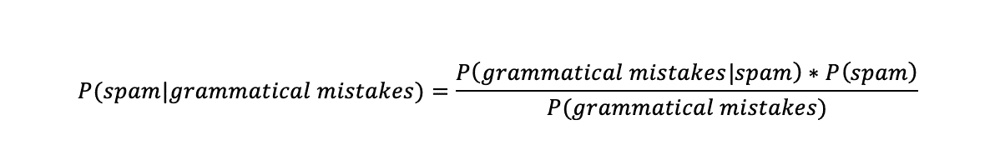

# 用于机器学习的朴素贝叶斯分类器

> 原文：<https://medium.com/capital-one-tech/naives-bayes-classifiers-for-machine-learning-2e548bfbd4a1?source=collection_archive---------6----------------------->

## 机器学习算法介绍系列的第 3 部分

*我们已经讲述了* [*k 近邻*](/capital-one-tech/k-nearest-neighbors-knn-algorithm-for-machine-learning-e883219c8f26) *和* [*k 均值聚类*](/capital-one-tech/k-means-clustering-algorithm-for-machine-learning-d1d7dc5de882) *，今天我们将讲述朴素贝叶斯分类器*

# 介绍

Naives bayes 分类器是一组机器学习算法，它们都使用 [Bayes 定理](https://en.wikipedia.org/wiki/Bayes%27_theorem)来分类数据点。贝叶斯定理是以托马斯·贝叶斯牧师的名字命名的，他在 18 世纪研究了概率和二项分布。但是，不能肯定地说是谁发现了这个定理；有传言称，尼古拉斯·桑德斯森(Nicholas Saunderson)在贝叶斯时代之前很久就发现了这个定理，他的大部分职业生涯都在发展和完善传统的数学和科学哲学。

你可能想知道，为什么这些分类器被称为“朴素贝叶斯”之所以称它们为“幼稚”,是因为它们都假设一个数据点的特征彼此完全独立。Naives bayes 分类器使用某些事件为真的概率(假设其他事件为真)来预测新的数据点。这是使这个公式与其他机器学习分类算法相比如此独特的因素。

赞成者:

*   易于构建和使用。
*   容易训练。
*   忽略不相关的功能。

**缺点:**

*   假设数据点要素是独立的。
*   更好地处理大型数据集。

# 在哪里使用朴素贝叶斯

这些分类器用于您每天访问的应用程序的幕后！它们的一些最受欢迎的用途是天气预报、垃圾邮件检测和面部识别。这种算法非常适合这些应用，因为它总是假设独立性。假设独立性是处理这类数据的算法的关键品质。

[http://dataespresso.com/en/2017/10/24/comparison-between-naive-bayes-and-logistic-regression/](http://dataespresso.com/en/2017/10/24/comparison-between-naive-bayes-and-logistic-regression/)

借助垃圾邮件检测，naives bayes 分类器将通过查看与该电子邮件相关的不同事件发生的概率来帮助确定该电子邮件是否是垃圾邮件。如果电子邮件来自某个电子邮件地址、具有某种格式或包含语法错误，它可以评估该电子邮件是垃圾邮件的可能性。简单的数学表示如下所示:

在大型分类问题中，比如这个例子和我提到的其他例子，可能的事件远不止一两个。这些问题着眼于每一种可能的情况，并评估这些情况的所有组合之间的概率。

# 朴素贝叶斯背后的数学原理

naives bayes 分类器完全依赖于 bayes 定理(因此得名)，因为分类器只是将公式应用于数据集。这个定理包括一个评估不同事件发生概率的公式。下面的公式是它的最简单版本，只有两个事件——事件 A 和事件 b。

记住，这是给你事件 B 发生的概率，假设 A 已经发生了。它使用两种类型的概率:

1.  每个事件的概率。
2.  给定另一个事件值时每个事件的概率。

当一个数据集中有两个以上的可能事件时，公式将采用这种形式。

虽然这个公式最初可能看起来令人困惑，但它只是简单地使用了这两种事件概率的组合，以找到某个事件发生的可能性。

例如，假设你有一个喜欢跑步的朋友，但她对外出的天气非常挑剔。你想去她家聊天，但不确定她是否在家。如果你想根据你的朋友对温暖天气的偏好来判断她是否去跑步了，那么公式应该是这样的:

假设你的朋友正在跑步，你正在增加天气变暖的可能性，以及她去跑步的可能性。然后你用它除以外面阳光明媚的概率。

比看起来简单多了！

# 结论

如果你像我一样热爱统计学，那么你可能会更喜欢 naives bayes 分类器。它们假定独立，易于使用，易于训练。如果您认为可能存在影响数据集的隐藏因素，如极端异常值或模糊模式，则最好使用分类器。

但是，需要注意的一点是，数据集中没有代表性的数据或某个事件的零个实例。如果发生这种情况，它可能会给你一个不准确的零概率事件的结果。因为您正在对事件的概率进行乘法和除法运算，所以零概率会危及结果的准确性。这就是为什么收集能准确代表你所研究人群的数据总是很重要的原因。

总之，naives bayes 是一组使用概率对大型数据集进行分类的有用算法。它有许多可能的应用，其中很多你会在日常生活中用到。我要求你找出你日常使用的可能使用这组分类器的应用程序，这将帮助你更好地理解它们的准确性和功能。

有关更多资源，请查看一些使用 naives bayes 分类器的项目:

*   [使用 Python 的朴素贝叶斯练习](https://www.kaggle.com/pranavpandey2511/naive-bayes-classifier-from-scratch)
*   [使用朴素贝叶斯的犯罪分类](https://github.com/LeonRaykin/Naive-Bayes)
*   [使用 R 的朴素贝叶斯选址模型](https://campus.datacamp.com/courses/supervised-learning-in-r-classification/chapter-2-naive-bayes?ex=4)

# 相关:

*   [机器学习的 K 均值聚类算法](/capital-one-tech/k-means-clustering-algorithm-for-machine-learning-d1d7dc5de882)
*   [机器学习的 K-最近邻(KNN)算法](/capital-one-tech/k-nearest-neighbors-knn-algorithm-for-machine-learning-e883219c8f26)
*   [机器学习的随机森林算法](/capital-one-tech/random-forest-algorithm-for-machine-learning-c4b2c8cc9feb)
*   [用于机器学习的人工神经网络](/capital-one-tech/artificial-neural-networks-for-machine-learning-79c67d0681e9)

披露声明:2019 首创一。观点是作者个人的观点。除非本帖中另有说明，否则 Capital One 不隶属于所提及的任何公司，也不被这些公司认可。使用或展示的所有商标和其他知识产权是其各自所有者的财产。