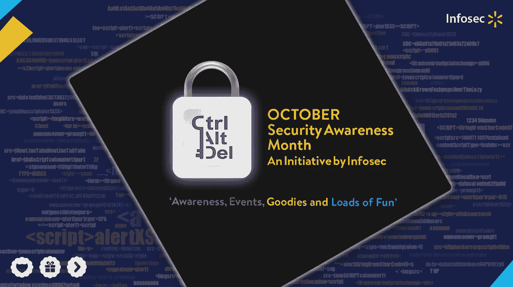
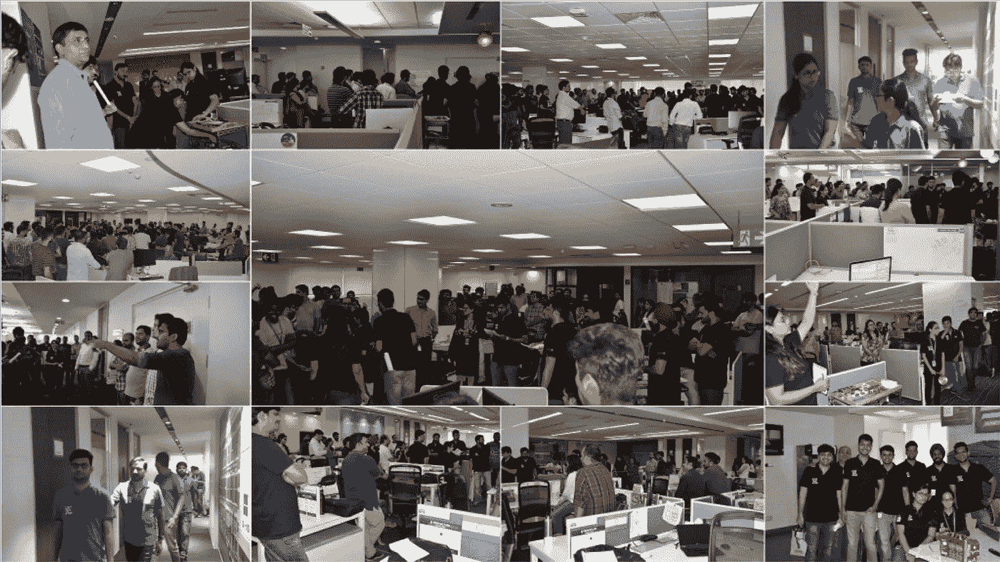
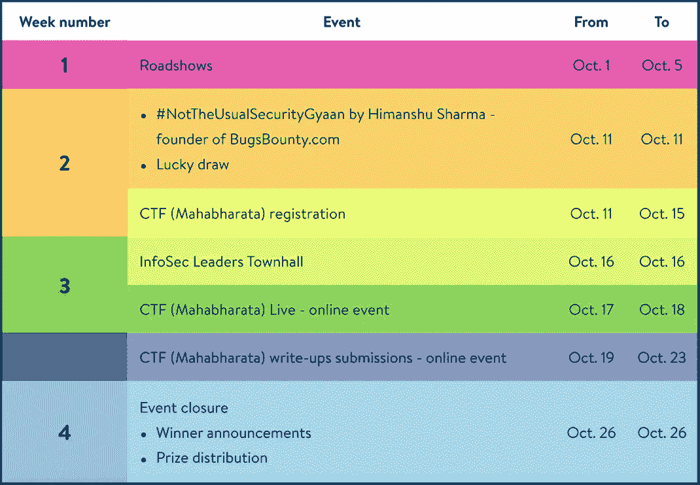
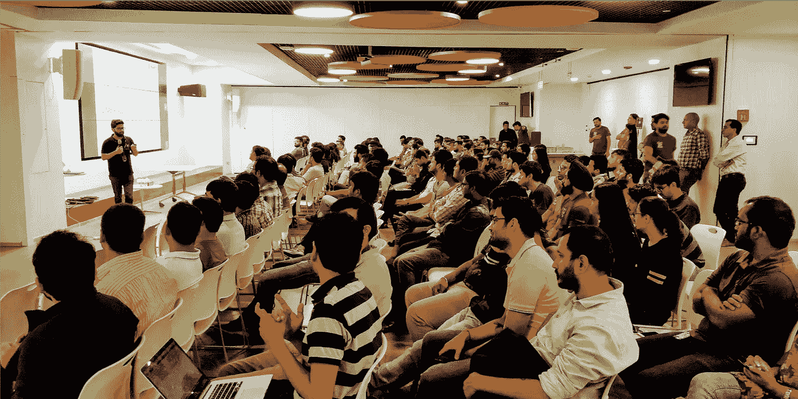
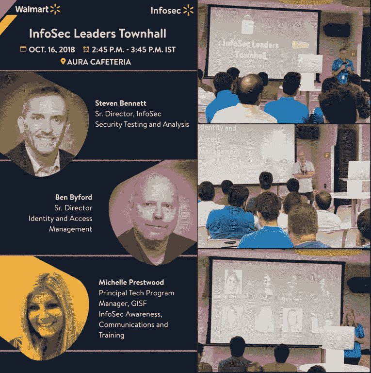
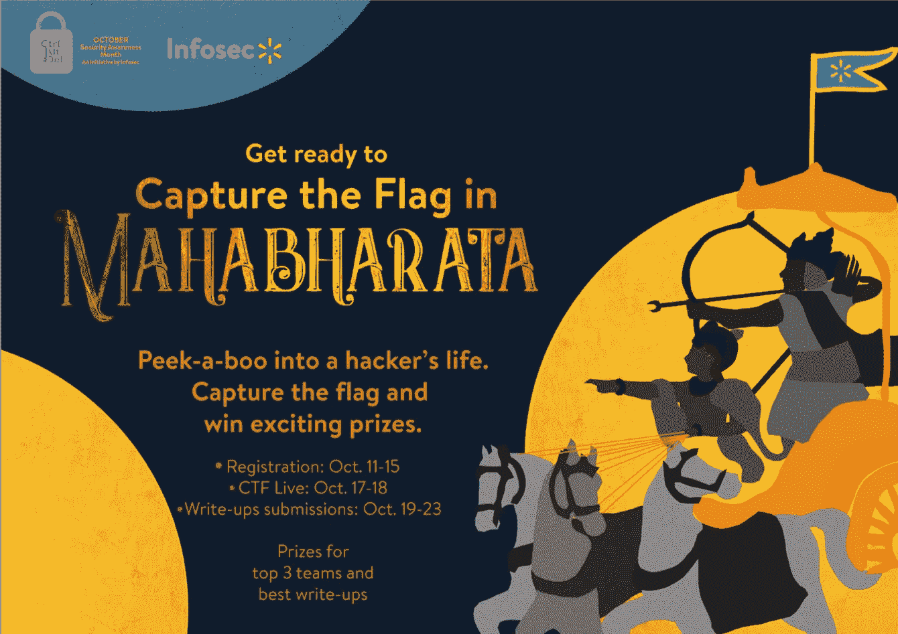
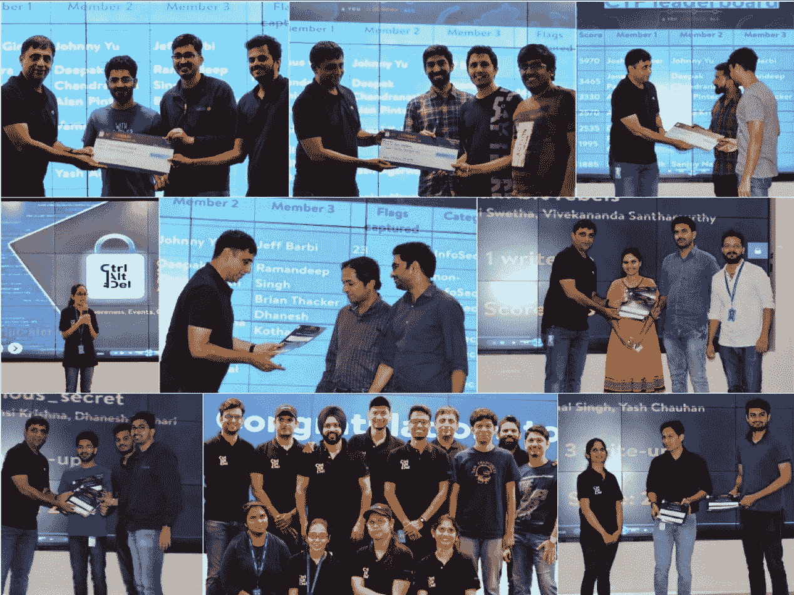

# 印度沃尔玛实验室的国家网络安全意识月

> 原文：<https://medium.com/walmartglobaltech/national-cybersecurity-awareness-month-walmartlabs-india-8e7687eac445?source=collection_archive---------6----------------------->

The main poster with the logo of the CtrlAltDel initiative

10 月是国家网络安全意识月(NCSAM)。在沃尔玛 IDC(印度开发中心)，信息安全或 InfoSec 团队决定在本月向员工宣传安全是每个人的责任。带着这个目标，InfoSec 发起了一项名为 **CtrlAltDel** 的计划。

**CtrlAltDel** 在整个 10 月举办了各种活动，以团队在第一周在 IDC 办公室的每一层进行的*路演*拉开了这个月的序幕。路演帮助该团队介绍了新计划，并在个人层面上与所有员工接触，为网络安全意识活动奠定基础。在每一层，团队都以朗朗上口的音乐进入，以吸引注意力并营造兴奋感，就网络安全进行简短的问答，谈论网络世界中最新的违规行为和广泛的网络威胁，并提供保持安全的提示，玩速射之类的游戏，并分发大量糖果。它还宣布了整个月的活动安排。

Roadshows on different floors

The schedule of events

接下来是由[BugsBounty.com](https://bugsbounty.io)创始人 Himanshu Sharma 所做的技术演讲# NotTheUsualSecurityGyaan，以及由 170 多名员工参加的幸运抽奖。Himanshu 分享了他从黑客经验中发现行业安全漏洞的专业见解；描述有趣的业务逻辑旁路、乏味的服务器错误配置案例研究、网络旋转、升级攻击、SQL 数据渗透和许多其他技术，这些技术使他的团队发现了著名公司应用程序中的漏洞。

#NotTheUsualSecurityGyaan by Himanshu Sharma

InfoSec Leaders Townhall poster and event pics

第三周以 *InfoSec 领导人市政厅*开始，员工们有机会与 InfoSec 的领导人互动，并得到他们所有问题的答案，随后是期待已久的*Mahabharata Capture the Flag(CTF)*比赛。来自所有全球办事处的约 80 个团队共 150 人参加了 CTF 和写作竞赛，该竞赛持续到第四周。CTF 是在 [FBCTF](https://github.com/facebook/fbctf) 平台上举办的一场危险风格竞赛，参与者必须利用易受攻击的应用程序来解决网络安全各个领域的挑战，如加密和隐写术、逆向工程、web 应用程序、网络、取证和 OSINT(开源情报)。它获得了所有领导和参与者的积极评价，是沃尔玛有史以来参与此类活动最多的一次。来自信息安全领域的得分最高的前 3 名团队和来自非信息安全领域的前 4 名团队被宣布为 CTF 竞赛的获胜者。继 CTF 之后的征文比赛选出了前 5 名最佳征文作为获胜者。10 月 26 日，获奖者在今年活动的闭幕式上接受奖励。

The poster for the Mahabharata CTF

The closing ceremony

到月底，超过 70%的参与者表示他们希望在未来成为该计划的一部分，其中约 30%的参与者表示有兴趣加入 InfoSec。CtrlAltDel 团队期待着明年举办更多这样的活动，以接触更多的观众，并且已经充满了新的和创造性的想法。总而言之，团队的辛勤工作、奉献、热情以及在不同媒体(如 WorkPlace、Slack 和电子邮件)上的大量宣传使这次活动取得了全面成功。它不仅成功地制造了大量有趣的话题，还宣传了网络安全的重要性。为 **CtrlAltDel** 团队干杯！