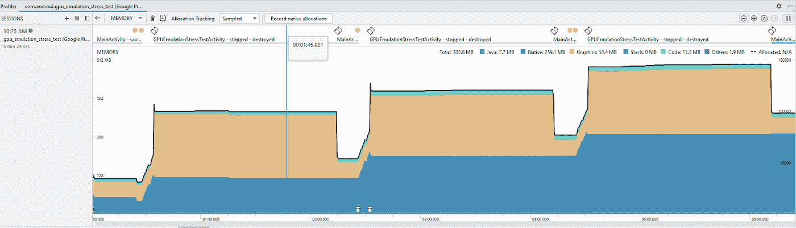
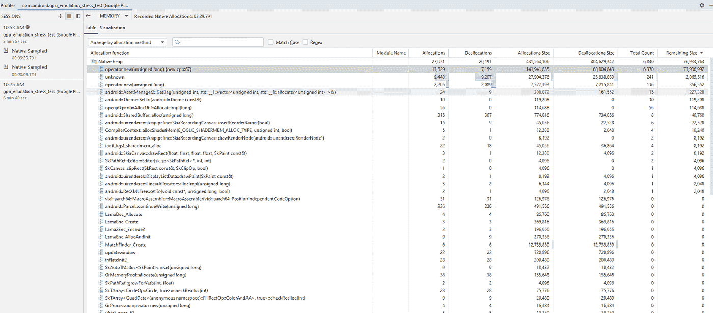
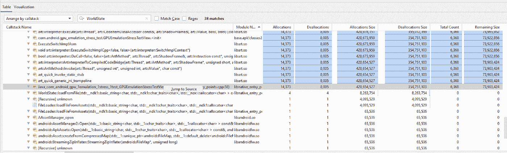
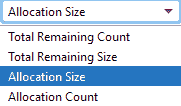
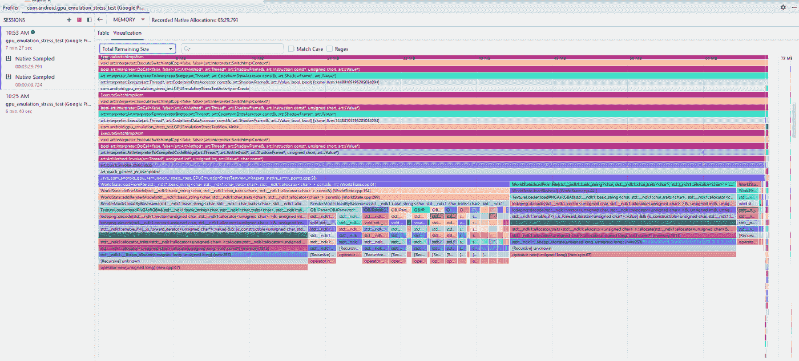
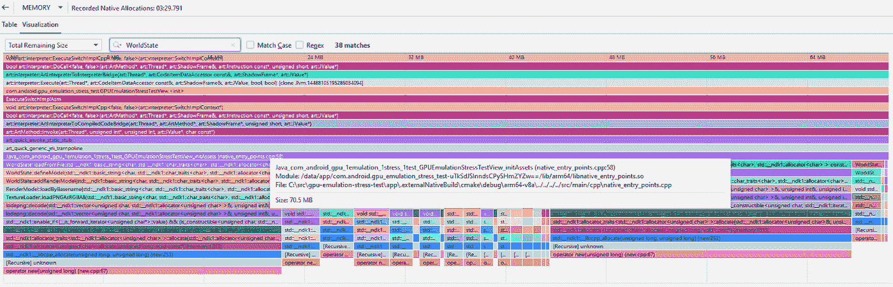
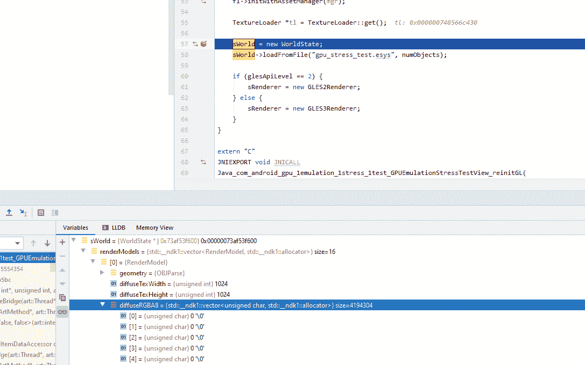
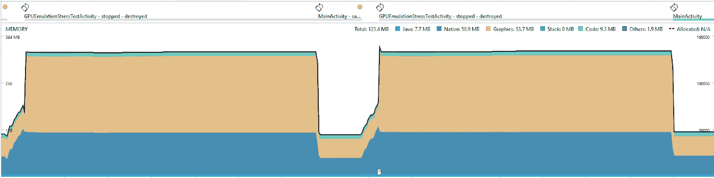
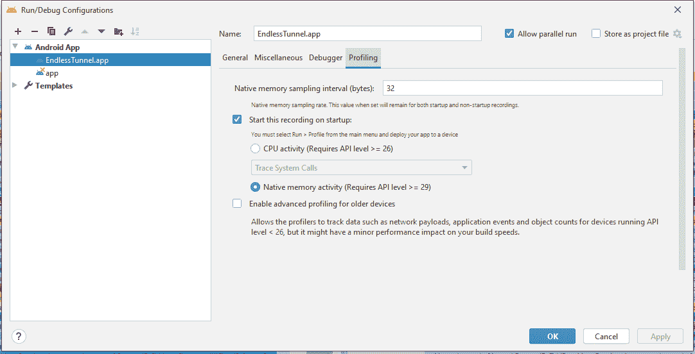

# Android Studio 4.1 的原生内存分析

> 原文：<https://medium.com/androiddevelopers/native-memory-profiling-with-android-studio-4-1-33a9e6b44be?source=collection_archive---------0----------------------->

这是关于 Android Studio 4.1 新特性的两部分系列文章的第二部分。我们之前的帖子重点关注了 [*系统痕迹中的新功能*](/androiddevelopers/whats-new-in-android-studio-system-trace-5841465c5935) *。*

我们从使用 C++的人那里听说调试本地内存相当困难，尤其是在游戏中。在 Android Studio 4.1 中，我们实现了在内存分析器中记录本机内存分配的调用堆栈的能力。原生内存记录构建在 [Perfetto](https://perfetto.dev) 后端之上，这是 Android 的下一代性能检测和跟踪解决方案。

在尝试调试内存问题时，一个常见的技巧是了解什么是分配内存，什么是释放内存。本文的其余部分将使用 [Gpu 仿真压力测试](https://github.com/google/gpu-emulation-stress-test)作为一个示例项目，带您了解如何使用本机内存分析器来帮助跟踪泄漏。

# 入门指南

为了跟进，从[https://github.com/google/gpu-emulation-stress-test](https://github.com/google/gpu-emulation-stress-test)克隆或下载样本。

当怀疑存在内存泄漏时，从高层次开始并观察系统内存中的模式通常是一个好主意。要做到这一点，请单击 Android Studio 中的 profile 按钮，并进入内存分析器以获取更详细的内存跟踪信息。

Top level view of memory profiler. Showing gradual increase in native memory with each run of the “Gpu emulation stress test”

运行几次模拟后，我们可以看到一些有趣的模式。

1.  GPU 内存会增加，正如人们对 GPU 仿真应用程序的预期，但看起来在活动结束后，这些内存也会得到适当的清理。
2.  每次我们进入 GpuEmulationStressTestActivity 时，本机内存都会增加，但是每次运行后，该内存似乎不会重置，这可能表明存在泄漏。

# 本机内存表视图

从 Android Studio 4.1 Canary 6 开始，我们可以获取本机内存分配的记录，以分析为什么内存没有被释放。为了使用 GPU 仿真应用程序完成这项工作，我停止了正在运行的应用程序，并开始分析一个新的实例。从一个干净的状态开始，尤其是在查看一个不熟悉的代码库时，可以帮助我们缩小关注范围。在整个 GPU 仿真演示过程中，我从内存分析器中捕获了一个本机分配记录。为此，请通过选择“运行”->“配置文件”重新启动应用程序。在应用程序启动和概要文件窗口打开后，单击内存概要文件并选择“记录本机分配”

First look at a native memory capture when it is loaded in Android Studio.

表格视图对于使用库实现自己的分配器的游戏/应用程序很有用，突出显示在 new。

加载记录时，数据首先显示在表格中。该表显示了调用 malloc 的叶函数。除了函数名，该表还显示了模块、计数、大小和增量。此信息是抽样的，因此可能不会捕获所有 malloc / free 调用。这在很大程度上取决于[采样率](https://docs.google.com/document/d/1wt1BogH-Y6liWRVR7FxTkRdUeCJIElGr8ifHDr0Aa2E/edit?ts=5f1f52d3#heading=h.aa58d6kq4y3o)，稍后会讨论。

了解这些分配内存的函数是从哪里调用的也很有用。有两种方法可以将这些信息可视化。第一种方法是将“按分配方法排列”下拉列表更改为“按调用堆栈排列”。该表显示了一个调用堆栈树，类似于您可能从 CPU 记录中看到的内容。如果当前项目有符号(这通常是可调试版本的情况；如果你在分析一个外部 APK，查看一下指南[这里](https://developer.android.com/studio/debug/apk-debugger#attach_native)，它们会被自动拾取并使用。这允许你右击一个函数并“跳转到源代码”。

Within the table view Right Clicking an element shows a “Jump to Source” context menu

# 记忆可视化(本地和非本地)

我们还为内存分析器添加了一个新的可视化火焰图，允许您快速查看哪些调用堆栈负责分配最多的内存。当调用堆栈非常深时，这尤其有用。

有四种方法可以沿 X 轴对数据进行排序:

*   “分配大小”是默认值，显示跟踪的内存总量。
*   “分配计数”显示分配的对象总数。
*   “总剩余大小”是在整个捕获过程中采样的、在捕获结束前没有释放的内存大小。
*   “总剩余计数”和剩余大小一样，是在捕获结束前捕获但未释放的对象的计数。

With this capture loaded, in the “Total Remaining Size” view, it is easy to see “lodepng” is responsible for allocating a lot of memory.

在这里，我们可以右键单击调用堆栈，并选择“跳转到源代码”以将我们带到负责分配的代码行。然而，再看一下可视化，我们注意到公共父节点 WorldState 对多个泄漏负责。为了验证这一点，它可以帮助过滤结果。

# 过滤/导航

与表格视图一样，可以使用过滤栏对图表进行过滤。使用过滤器时，图表中的数据会自动更新，只显示函数与搜索的单词/regex 匹配的调用堆栈。

After applying a filter it seems clear that WorldState is responsible for leaking ~70MB of our total assumed leak ~72MB.

有时调用栈会变得很长，或者屏幕上没有足够的空间来显示函数名。为此，ctrl +鼠标滚轮将放大/缩小，或者您可以单击图表以使用 W、A、S、D 进行导航。

# 核实调查结果

添加一个断点并快速运行两次模拟会发现，在第二次运行时，我们通过覆盖第一次运行时的指针导致了泄漏。

Quick view of the debugger showing “sWorld” already has a value the 2nd time around

作为对示例的快速修复，我们可以在世界被标记为 done 后删除它，再次分析应用程序以验证修复。

Memory view after running the demo two times

我们从查看高级内存统计数据开始。验证在模拟结束时删除 sWorld 释放了我们第一次运行所占用的 70mb 空间。

# 启动分析和采样速率设置。

上面的示例展示了如何使用本机内存跟踪来查找和修复内存泄漏。本机内存跟踪的另一个常见用途是了解应用程序启动期间内存的去向。在 Android Studio 4.1 中，我们还添加了从应用程序启动时捕获原生内存记录的功能。这可以在“运行/调试配置”对话框的“性能分析”标签下找到。

Profiling tab located in the Run Configuration dialog.

您可以在运行配置对话框中自定义采样间隔或启动时记录内存。

您还可以在这里更改新采集的采样率。较小的采样速率会对整体性能产生很大的影响，而较大的采样速率会错过一些分配。不同的采样率适用于不同类型的内存问题。

# 包扎

有了新的本机内存分析器，查找内存泄漏和了解内存存放位置变得更加容易了。在 Android Studio 4.1 中尝试一下原生内存分析器，并在我们的[错误跟踪器中留下任何反馈。](https://b.corp.google.com/issues/new?component=192708&template=840533)要获得更多提示和技巧，请务必查看我们今年早些时候在谷歌游戏峰会上的演讲， [Android 内存工具和最佳实践](https://events.withgoogle.com/gdc2020/)。