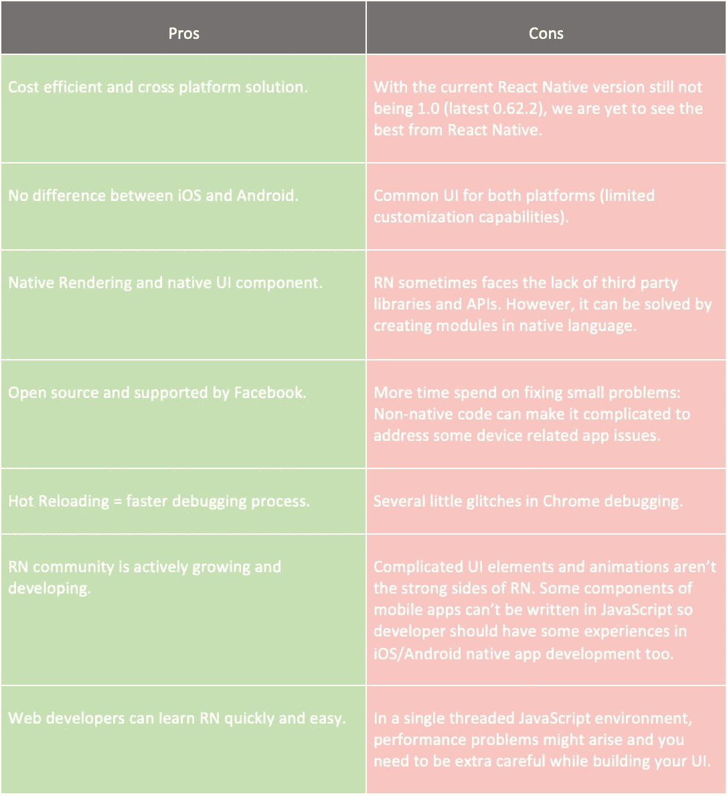

# 本地 vs 反应本地

> 原文：<https://medium.com/walmartglobaltech/native-vs-cross-platform-322e9896e745?source=collection_archive---------0----------------------->

传统上，移动应用程序是用本地语言编写的。随着 React Native 的崛起，越来越多的热门移动应用(如脸书、Instagram、Pinterest、优步、Discord、SoundCloud、Skype……)正在 React Native 中被部分或完全改写。这就引出了一个问题:移动开发者是否应该使用 React Native 进行移动开发，而不是使用 Java 或 Swift 进行完全的原生开发？

嗯，没有正确的答案，这取决于要求。在这篇文章中，我将详细比较它们。

# 本机应用程序:

本机应用程序是为在特定平台或设备上使用而开发的应用程序。因为它是为在特定设备及其操作系统上使用而构建的，所以它能够使用特定于设备的硬件和软件。与开发为跨多个系统通用的 web 应用或移动云应用相比，它可以提供优化的性能，并利用最新的技术，如生物识别或增强现实。

# 反应本机应用程序:

React Native 是一个使用 JavaScript 构建原生 iOS 和 Android 应用的框架。它使用本地组件来呈现用户界面(UI)。它提供了相同的本机外观，同时还提供了额外的可移植性和熟悉的方法。React Native 是脸书创建的一个框架，旨在实现流畅、轻松的跨平台移动开发。JavaScript 是 React Native 的主要编程语言。默认情况下，包含 JSX 扩展是为了方便编写声明性 UI 组件。

在 Android 开发中，你用 Kotlin 或者 Java 写视图；在 iOS 开发中，你使用 Swift 或者 Objective-C，有了 React Native (RN)，你可以使用 React 组件用 JavaScript 调用这些视图。例如，一个本地 TextInput 将有一个相应的 RN 组件，它可以直接导入到 JS 代码中，并像任何其他 React 组件一样使用。因此，开发人员将像编写任何其他 React web 应用程序一样编写代码，但输出将是一个本机应用程序。因为 React 原生组件由与 Android 和 iOS 相同的视图支持，React 原生应用的外观、感觉和性能与任何其他应用一样。我们称这些平台支持的组件为本地组件。

一个很大的区别是，React Native 在一个单独的线程中运行 JavaScript 代码，因此用户界面不会阻塞，动画应该流畅。

JavaScriptCore 在 iOS 中是默认的。但是在 Android 的情况下，RN 将 JavaScriptCore 与应用程序捆绑在一起。这增加了应用程序的大小。因此，对于 Android 来说，RN 的 Hello World 应用程序大约需要 3 到 4 兆字节。脸书开源了 Hermes，这是一个小型轻量级的 JavaScript 引擎，针对 React 原生 Android 应用进行了优化(从 RN 0.60.2 开始)。它带来了 React Native 在移动开发方面的巨大进步，因为它将给 RN 构建的 Android 应用程序带来显著的性能提升，以及更小的构建大小和更少的内存使用。

在 React Native 应用程序中，JavaScript 逻辑在一个专用线程中运行，而应用程序的其余部分在我们称之为“本机领域”中运行。JavaScript 处理应用程序的业务逻辑，而本机领域呈现 UI 并管理设备交互。这两个域依靠一种叫做“桥”的东西进行通信。

JavaScript 线程和本地领域不能进行直接对话——它们不能监听、响应或取消对方发生的事件和操作。相反，它们通过异步消息队列来回传递序列化的消息。这一系统“弥合”了这一差距。例如，React Native 可能会向本机领域发送一条消息，说明“呈现此按钮”收到后(即下次检查消息队列时)，本机领域完成呈现。稍后，当用户单击该按钮时，本地领域向 JavaScript 线程发送一条消息，通知它该操作，触发一些相关的应用程序逻辑，这将导致 UI 更新被推回到本地领域的队列中，等等。

由于该桥的断开和异步特性，可能会出现一些性能问题。例如，队列可能会陷入困境，比方说，如果用户快速滚动一个长而复杂的列表，许多“用户已经滚动”和“绘制这个新的 UI”更新会来回出现。出于类似的原因，动画也可能是一个关注点。实际上，大多数时候这些性能缺陷对用户来说是可以忽略的；然而，它们仍然是开发人员需要了解的东西，以便可以围绕它们进行设计。

iOS 和 Android 的架构都很相似，只是有细微的差别。如果我们从大的方面考虑，RN 平台有**三个部分:**

1.  **原生代码/模块**:iOS 的大部分原生代码是用 Objective C 或者 Swift 编写的，而 Android 的则是用 Java / Kotlin 编写的。要不是为了编写 React 原生应用，我们几乎不需要为 iOS 或 Android 编写原生代码。
2.  Javascript VM :运行我们所有 Javascript 代码的 JS 虚拟机。在 iOS/Android 模拟器和设备上，React Native 使用 **JavaScriptCore。**
3.  **React Native Bridge**:React Native Bridge 是一个 C++/Java 桥，负责本机和 Javascript 线程之间的通信。自定义协议用于消息传递。下图说明了 RN 如何在内部工作。

# 原生与反应原生应用

**为什么是本土？**

# 原生应用的利与弊:

原生应用是大规模、大品牌移动服务的**首选，如脸书、Snapchat、银行应用。由于**高质量和卓越的** **性能**，完全专用的解决方案仍然是要求苛刻的客户开发 B2C 或 C2C 应用的首选武器。如果你想在应用中开发一款法拉利，你会选择 Native。不牺牲质量，不牺牲性能，绝对不牺牲成本和开发时间。下表提供了为什么 native 优于 RN 的更详细的比较。**

**为什么反应原生？**

# React 本机开发的利弊

可用的、现成的 React 本地框架的选择目前有些有限。

总的来说，React Native 是对本地开发的一种成熟且有价值的替代。当需要在质量和性能方面达到最高标准时，Native 仍然处于领先地位。专用软件的优势在目前是毋庸置疑的。

**移动应用中的增强现实:**

****(**[**AR**](https://arvrjourney.com/)**)**app 越来越受到全行业的欢迎。像苹果和谷歌这样的移动平台正在继续为开发者提供新的和改进的 AR 工具包。谷歌为 Android 开发者提供 ARCore，而 iOS 平台则提供 ARKit 1.5，加载了增强的基于 AR 的功能，用于构建沉浸式 AR 应用。虽然这两个工具包看起来都很完整，并且针对各自的平台具有丰富的特性，但是它们是特定于平台的，不允许跨平台呈现。**

**ViroReact 是由 ViroMedia 创建的成熟的跨平台库。它通过利用自定义渲染器来帮助开发人员提供完美的跨平台 AR 应用体验，该渲染器可以分别为 Android 和 iOS 平台包装 ARCore 和 ARKit。它也得到了团队的大力支持。但是**我不推荐**用于复杂/基于性能的应用，因为 React-Native javascript 线程会导致事件拥塞和延迟。因此，如果性能很重要，我会推荐全原生解决方案。**

# **结论**

**尽管如此，React Native 越来越受欢迎也不应该被低估。对于某些目的，像 B2B 服务，这似乎是一个更好的选择。更好的价格和更短的开发时间增加了它的吸引力。虽然 native 将在更长时间内保持其主要地位，但 React Native 越来越多的方面正在描绘一幅正在崛起的失败者的画面，这可能会在未来几年令人惊讶地赶上领导者。下表提供了一个清单，看看 RN 部署是否适用于您的用例。**

****

**原生 iOS 和 Android 将继续存在，在可预见的未来，它们将继续伴随着我们。不过 React Native 的未来有点不确定。诚然，React Native 社区正在快速成长和扩展，但由于当前的 React Native 版本仍然不是 1.0(撰写本文时的最新版本是 0.62.2)，我们还没有看到 React Native 的最佳表现。**

**另一个值得注意的是，脸书确实会定期更新 React Native，他们对修复不直接涉及脸书应用的 bug 并不太感兴趣。react-native 将 XML 编译成本机代码的方式是一个黑盒过程。因此，如果 React 本机组件中有某种错误，您要么必须等待脸书来修复它，要么自己修复它，这需要进入本机代码。**

**到底 React Native 值不值？答案是:*这取决于你的项目。***

**参考资料:**

**https://appinventiv . com/blog/react-native-vs-native-apps/#:~:text = A % 20 native % 20 mobile % 20 application % 20 can，of%20data%20access 。**

**[https://itcraftapps . com/blog/pros-and-cons-of-react-native-and-native-development/](https://itcraftapps.com/blog/pros-and-cons-of-react-native-and-native-development/)**