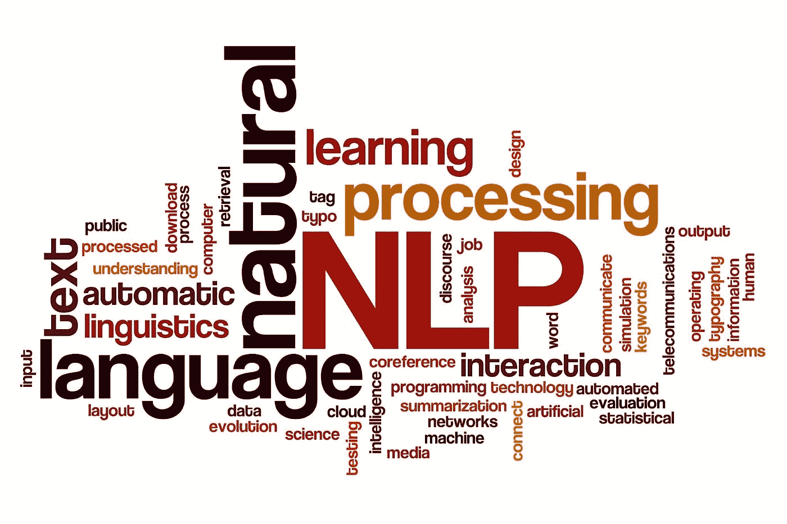
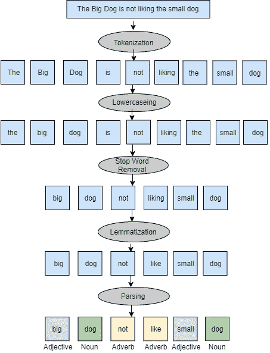

# 自然语言处理

> 原文：<https://medium.com/globant/natural-language-processing-bed6ccacb5b?source=collection_archive---------1----------------------->



这篇文章给出了自然语言处理(NLP)的基本理解，以及它如何影响我们的日常生活。包括了一个在 NLP 中执行情感分析的例子。

[自然语言处理](https://en.wikipedia.org/wiki/Natural_language_processing) (NLP)是机器理解人类口头和书面语言的能力——称为自然语言。它是计算机科学和人工智能(AI)的分支。NLP 最常见的任务是以计算机可以理解的方式分解人类文本和语音数据。

一些其他任务是*语音识别、*语音数据被转换成文本信息；*词性标注，*这是基于特定单词或文本片段的使用和上下文来确定其词性的过程；和*情感分析，*试图从文本中提取品质、态度、情感、讽刺和困惑。

在这篇博客中，我将展示我们如何使用 NLP 来获得相关的见解。为了更好地理解这个主题，我还将解释一个真实的例子。本文档将帮助那些寻求提高他们在数据分析师和数据科学家角色方面的知识的人。

# NLP 的重要性是什么？

我们的大部分日常数据都是通过电子邮件、聊天、社交媒体对话、博客、调查和许多其他渠道产生的。所有这些渠道每秒钟都在不断生成大量数据，由于大量非结构化和无组织的文本数据源，企业很难正确分析数据并获得洞察力。

但是在大数据技术的帮助下，大量的文本数据可以通过分布式计算以非常高的速度进行处理。由于人类语言是复杂多样的，有数百种语言和方言，我们有大部分非结构化形式的数据。非结构化形式的一个例子是像“*你要去哪里:)？*“在这里，我们看到缩写词' *r* '和' *u* '以及一个表情符号。同样的例子在一个结构化的表单中(其中数据是一个更有组织的格式)会是“你要去哪里？”。

在[监督&非监督](https://www.ibm.com/cloud/blog/supervised-vs-unsupervised-learning)学习方法的帮助下，我们可以对人类语言进行建模，特别是通过深度学习，我们可以消除语言中的歧义，并为许多下游应用程序的数据添加有用的数字结构。

# NLP 是如何工作的？

这主要是一个两步过程:首先，你做数据预处理，然后你应用算法到第一步的结果。

## 数据预处理

[*数据预处理*](https://www.analyticsvidhya.com/blog/2021/06/must-known-techniques-for-text-preprocessing-in-nlp/) 涉及为机器分析准备文本数据。我们将在下面看到一个例子。



## **算法**

自然语言处理有许多算法，但通常使用的两种主要算法是基于规则的算法和机器学习算法。

**基于规则的算法:**在这些系统中，人类参与算法的开发和改进过程。在这里，我们根据人类编码的一套规则预定义了结果。例如，如果有人希望将所有与金钱相关的问题放在付款主题下，那么像“账单”、“账户”、“金钱”和“发票”这样的词将被标记在该主题下，这成为一个规则。这种分析方法基于现有规则的开发，因此与基于 ML 的方法相比，该系统不需要大量的训练集。这种算法的缺点是需要熟练的专家:需要语言学家或知识工程师为 NLP 手动编码每个规则。使用基于规则的方法可以很好地捕捉特定的语言现象；它可以解释单词和句子之间的语言关系，因此可以处理句子级的任务，如解析和分词。

[**机器学习(ML)算法**](https://www.ibm.com/cloud/blog/supervised-vs-unsupervised-learning) **:** 在这些系统中，机器定义自己的一套规则，这套规则基于样本数据来构建训练数据集。他们根据这些训练数据学习执行任务。我们有两种学习模式:

*   *受监督的* *学习*:在这些算法中，文本文档被标记或标注了机器应该寻找什么以及应该如何解释的例子。然后这些标记的文档被用于训练模型。
*   *无监督* *学习*:在这些算法中，机器本身从样本数据中学习模式，然后将相似的数据分组为集合，然后这些集合用于训练模型。

ML 的优势在于它的学习能力，这就是为什么不需要人工规则/语法编码的原因。ML 方法的使用可以显著地加速 NLP 系统能力的发展。

# NLP 中有哪些挑战？

尽管近年来在使机器能够使用 NLP 解释人类语言方面已经取得了巨大的进步，但是人类语言的复杂性和多样性使得这种基本实现在几种情况下具有挑战性。

*   **语调和音调变化:**一个句子可以根据说话者重读哪个单词或音节而改变意思。NLP 算法可能会遗漏细微但重要的信息，即在执行语音识别时注意到一个人声音的音调变化。举个例子:“*是的，当然*”可以表示“*不，永远不要*”，这取决于单词怎么说。
*   **精确**:人的言语并不总是精确的；它通常是模糊的，语言结构可能取决于许多复杂的变量，包括俚语、地方方言和社会背景。

# 如何使用 NLP 进行情感分析？

*情感分析是通过 NLP 和文本分析来衡量人们观点的倾向性。*

情感分析最简单的输出不是正面/负面/中性。使用句子中单词的极性(消极、积极或中性)来计算句子的情感得分。

## **预处理**

以下是在应用算法之前预处理数据的步骤。

我从 IMDB(一个与电影和电视剧相关的在线数据库)获取了一组电影评论。)我还将最重要的库， [NLTK](https://towardsdatascience.com/intro-to-nltk-for-nlp-with-python-87da6670dde) (自然语言工具包，一个用于构建使用人类语言数据的 Python 程序的平台)导入到我的 [Jupyter](https://realpython.com/jupyter-notebook-introduction/) 笔记本中，这是一个基于 web 的交互式开发环境，用于笔记本、代码和数据。

```
*import nltk*
```

**第一步——标记化:**自然语言处理的第一步是标记化，包括将评论分解成单词/句子。在这种情况下，字符串被标记为句子列表，然后标记为每个句子中的单词列表。在标记化之后，我们使用`re.sub()`这是一种帮助去除标点符号的方法。

```
data = ["The movie was outstanding", 
        "I fell asleep halfway", 
        "The movie was boring",
        "Hurray! The movie was good", 
        "The movie was pathetic",
        "Good action scenes in the movie", 
        "A better acting can be seen",
        "Outstanding dialogue delivery"]

from nltk.tokenize import sent_tokenize
from nltk.tokenize import word_tokenize
import string, re
sentence = nltk.sent_tokenize(data)
words = nltk.word_tokenize(sentence)
remove_punctuation = re.sub(r'[^a-z0–9A-Z_]','',words)

# OUTPUT: 
# 'The', 'movie', 'was', 'outstanding','I', 'fell', 'asleep', 'halfway',
# 'Hurray', 'the', 'movie','was','good',
# 'the', 'movie', 'was', 'boring', 'the', 'movie', 'was','pathetic',
# 'A','better''acting', 'can','be','seen','delivery',
# 'Good', 'action','scenes','in','the', 'movie','Outstanding','dialogue'
```

**第二步——小写:**所有单词都改成小写，以免重复。如果没有这一步，“电影”和“电影”会被认为是两个不同的词。

```
def lower_case(data):
 return str(data).lower()
lower_words = remove_punctuation.apply(lower_case)py

# OUTPUT: 
# 'the', 'movie', 'was', 'outstanding','i', 'fell', 'asleep', 'halfway',
# 'hurray', 'the', 'movie','was','good',
# 'the', 'movie', 'was', 'boring', 'the', 'movie', 'was','pathetic',
# 'a','better''acting', 'can','be','seen', 'delivery',
# 'good', 'action','scenes','in','the', 'movie','outstanding','dialogue'
```

**第 3 步——停用词移除:**下一步是移除停用词。它们是一些小词，如“是”、“am”、“the”，可以忽略，因为这些词不表达任何意思。删除它们可以提高效率。

```
from nltk.corpus import stopwords
stop_words = stopwords.words('english')
# Stop words are 'is', 'am', 'are', 'the', 'what', 'why', 'i'

def clean_stopwords (token):
  return[ item for item in token if item not in stop_words ]
removed_stopwords = lower_words.apply(clean_stopwords)

# OUTPUT: 
# 'movie', 'outstanding','fell', 'asleep', 'halfway',
# 'hurray', 'movie','good',
# 'movie','boring', 'movie','pathetic',
# 'better''acting','seen', 'delivery',
# 'good', 'action','scenes', 'movie','outstanding','dialogue'
```

**第四步——词汇化:**在这一步，单词被还原成它们的词根形式，具有相同的意思。举例。“Gone”将改为词根形式“go”。“去了”也将改为“去了”。

```
lemmatizer = nltk.stem.WordNetLemmatizer()

def lemmatize_words(token):
  return[ lemmatizer.item for item in token ]

lemmatized_words = removed_stopwords.apply(lemmatize_words) 

# OUTPUT: 
# 'movie', 'outstanding','fall', 'asleep', 'halfway',
# 'hurray', 'movie','good',
# 'movie','bore', 'movie','pathetic',
# 'good''act','see', 'delivery',
# 'good', 'action','scenes', 'movie','outstanding','dialogue'
```

**第四步——标注:**下一步是词性标注，根据语法结构将标记化的句子转换为词性:名词、代词、动词等。词性标注由[佩恩词性标注](https://cs.nyu.edu/~grishman/jet/guide/PennPOS.html)提供。一些常见的符号有名词、JJ 形容词、动词、副词和感叹词。

```
from nltk import pos_tag
tagged_words = pos_tag( lemmatized_words )

# OUTPUT: 
# 'movie' NN, 'outstanding' JJ,'fall' VB, 'asleep' RB, 'halfway' RB,
# 'hurray' UH, 'movie' NN,'good' JJ,
# 'movie' NN,'bore' VB, 'movie' NN,'pathetic' JJ,
# 'good' JJ,'act' VB,'see' VB, 'delivery' NN, 'dialogue' NN,
# 'good' JJ, 'action' RB,'scenes' NN, 'movie' NN, ,'outstanding' JJ
```

**步骤 5-频率分布:**我们收集了上例中使用的形容词列表。现在，为了了解哪个形容词的使用频率最高，我使用了一种`nltk.FreqDist()`方法来创建单词的频率分布。

```
def filter_adj(token):
 return[ item[0] for item in token if item[1] ='JJ']

tag_adj = tagged_words.apply(filter_adj)

from nltk import FreqDist
freq_words = FreqDist(tag_adj)

# OUTPUT 
Words           Frequencies 
Good            3
Outstanding     2
Pathetic        1
```

**步骤 6-算法:**为了分析句子的情感，我们有两种方法:基于规则的方法和 ML 方法。由于上面“NLP 如何工作？”中解释的特性，这里我们将使用后者部分。

有多种用于情感分析的 ML 算法，如支持向量机(SVM)、递归神经网络(RNN)、卷积神经网络(CNN)、随机森林、朴素贝叶斯和 VADER。

我们正在使用多项式 [**朴素贝叶斯分类器**](https://www.upgrad.com/blog/multinomial-naive-bayes-explained/) ，因为它的准确性很高，并且使用了易于理解的特征。它还支持大规模的情感分析工作，因为训练所需的计算速度很快。

这种技术是用于文本数据分析的监督学习分类之一。基于贝叶斯定理的算法预测文本的标签，并计算给定样本的每个标签的概率，然后给出具有最高概率的标签作为输出。

**步骤 6.1:** 这里，我们创建一个训练数据集，然后用这个数据集训练分类器，检查它对给定文本的分类精度。分类器的输出在提供电影评论的标记化形容词之后，我们得到正面、负面或中性的输出。

```
import nltk.classify
from nltk import NaiveBayesClassifier
classifier = nltk.NaiveBayesClassifier.train(tag_adj)

# Output: 
# Good: Positive
# Outstanding: Positive
# Pathetic: Negative
```

**步骤 6.2:** 我们也可以发现我们的模型的准确性。

```
nltk.classify.accuracy(classifier, tag_adj)

# Output: Classifier Accuracy percent: 71%
```

**步骤 6.3:** 我们还可以学习由朴素贝叶斯解释的最具信息性的特征。

```
classifier.show_most_informative_features(2)

# Output (Most Informative features)
# Good= True neg:pos = 1.0:12.9
# Outstanding= True neg:pos = 1.0:12.3
```

上面的列表显示了该模型最具信息性的特征。neg:pos 的比率显示了文本在一个类中出现的频率比其他类多多少。这表明人们非常喜欢这部电影。

情感分析通过分析来自 IMDb 平台的情感来帮助确定电影的表现。使用朴素贝叶斯分类器模型，我们可以获得每个词的情感特征，这有助于我们理解电影评论。

# 结论

在本文中，我们对自然语言处理及其重要性有了一个基本的了解。NLP 是如何工作的，使用了哪些流程？使用 NLP 技术和朴素贝叶斯分类器，我们能够分析特定电影的观众情绪，并确定电影的表现如何。此外，我们看到了在使用 NLP 分析情感时面临的一些挑战。

# 参考

自然语言处理简述。[https://en.wikipedia.org/wiki/Natural_language_processing](https://en.wikipedia.org/wiki/Natural_language_processing)

情感分析的简要说明。https://www.lexalytics.com/technology/sentiment-analysis

用于情感分析的技术。【https://monkeylearn.com/blog/sentiment-classification/ 

下载 NLTK[https://www.guru99.com/download-install-nltk.html](https://www.guru99.com/download-install-nltk.html)的分步过程