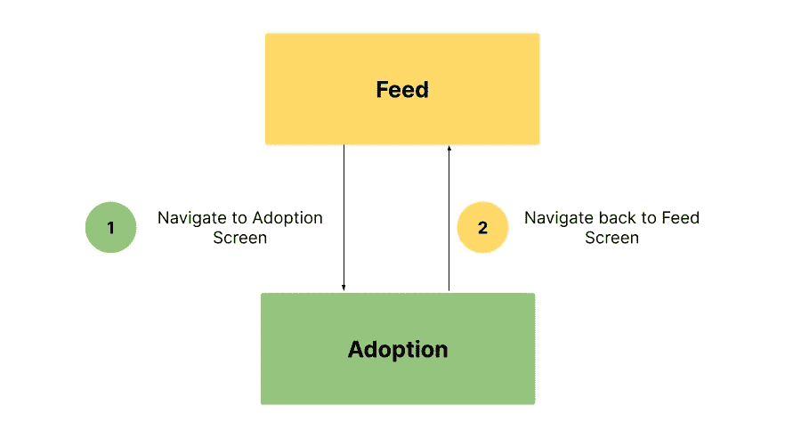
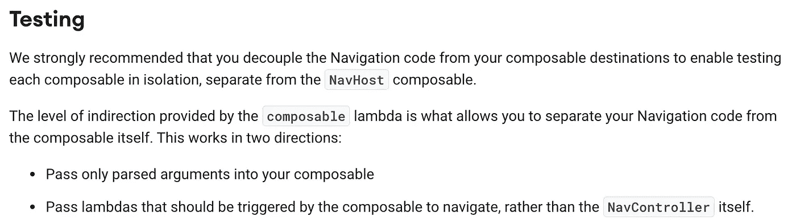

# 在 Jetpack 撰写中导航

> 原文：<https://medium.com/google-developer-experts/navigating-in-jetpack-compose-78c78d365c6a?source=collection_archive---------0----------------------->

如果你正在开发一个移动应用程序，你可能需要某种形式的导航。获得正确的导航并不容易，因为手头有许多挑战:回栈处理、生命周期、状态保存和恢复以及深度链接只是其中的一部分。在本帖中，我们将探索导航组件对 Jetpack Compose 的支持，并深入了解一下！

Could I have chosen a more cliche photo? Probably not! Photo by [Mick Haupt](https://unsplash.com/@rocinante_11?utm_source=unsplash&utm_medium=referral&utm_content=creditCopyText) on [Unsplash](https://unsplash.com/s/photos/navigation?utm_source=unsplash&utm_medium=referral&utm_content=creditCopyText). Thanks, Mick!

# 入门！

在开始之前，我们将添加对`navigation-compose`的依赖，它是导航组件的构件，用于组合支持。

让我们直接进入代码吧！

首先，我们使用`rememberNavController`方法创建并记忆一个`NavController`。`rememberNavController`返回一个`NavHostController`，它是`NavController`的子类，提供了一些`NavHost`可以使用的附加 API。当引用`NavController`并稍后使用它时，我们将把它作为`NavController`使用，因为我们自己不需要了解这些额外的 APIs 这对`NavHost`来说很重要。

我们将它传递给我们的`NavHost` composable。`NavHost` composable 负责托管与`NavBackStackEntry`相关联的`NavDestination`的内容(我们一会儿再看细节！).

我们传递给`NavHost`的 lambda 是我们导航图的构建器。在这里，我们可以访问一个`NavGraphBuilder`，并可以构建和声明我们的导航图。这是我们声明目的地和嵌套图的地方。如果您来自“旧的”导航库，一开始可能会觉得有点奇怪！不再有 XML，甚至导航图也没有。尽管 Kotlin DSL 已经存在很长时间了，但是到目前为止，它仍然被 XML 所掩盖。这也意味着在可预见的将来，我们不会有一个可视化的图表。XML 导航图的呈现视图非常有用，所以让我们希望在某个时候我们将为 Compose 获得这个视图！

声明一个可组合的目的地很容易:我们使用由`navigation-compose`提供的`composable`方法。

它是 `[NavGraphBuilder](https://cs.android.com/androidx/platform/frameworks/support/+/androidx-main:navigation/navigation-compose/src/main/java/androidx/navigation/compose/NavGraphBuilder.kt)`上的[扩展函数，本质上是围绕`NavGraphBuilder`的`addDestination`方法的便利包装器。在这里，创建了一个特定于`ComposeNavigator`的`NavDestination`。](https://cs.android.com/androidx/platform/frameworks/support/+/androidx-main:navigation/navigation-compose/src/main/java/androidx/navigation/compose/NavGraphBuilder.kt)`[ComposeNavigator](https://cs.android.com/androidx/platform/frameworks/support/+/androidx-main:navigation/navigation-compose/src/main/java/androidx/navigation/compose/ComposeNavigator.kt)`是负责处理组件的后栈和导航的`[Navigator](https://cs.android.com/androidx/platform/frameworks/support/+/androidx-main:navigation/navigation-common/src/main/java/androidx/navigation/Navigator.kt)`吗？

`[NavGraphBuilder](https://cs.android.com/androidx/platform/frameworks/support/+/androidx-main:navigation/navigation-common/src/main/java/androidx/navigation/NavGraphBuilder.kt)`是通用(非特定合成)导航 API 的一部分，主要提供一个`addDestination`方法，将目的地添加到导航图中。

回头看看我们的代码，我们将一个`route`传递给那个`composable`函数，告诉`NavGraphBuilder`我们稍后想要使用什么路线来导航到这个目的地。如果您来自“旧的”导航库，那么路线大致相当于为目的地定义一个 id。从版本`2.4.0`的导航库开始，`NavDestination`的 id 是根据其路线自动设置的(并且每次更新路线时都会更新),因此不需要定义 id。

`composable`函数的最后一个参数是一个`@Composable` lambda，它将被设置为目的地的内容。当我们导航到这个目的地时，`NavHost`将托管这个可组合组件。

在我们的`@Composable` lambda 中，我们只托管`FeedScreen`可组合的。虽然理论上你可以直接在导航图中声明你的所有内容，但是请不要这样做。事情很快就会变得一团糟，清理工作会很繁琐！

厉害！我们已经创建了我们的`NavController`，使用`NavHost`可组合和`composable` `NavGraphBuilder`函数来创建一个可组合的目的地，并将其添加到导航图中。让我们添加第二个目的地并导航！

让我们来看看发生了什么变化:

首先，我们向图中添加了一个新的目的地，并添加了`AdoptionScreen` composable。为了在点击`FeedScreen`中的按钮时进行导航，我们将`NavController`添加到了`FeedScreen`的参数中。最后，当点击按钮时，我们调用`NavController#navigate`来获得我们想要导航到的目的地的路线。

## 插曲:引擎盖下

*如果你不了解引擎盖下的具体工作原理，请随意跳到下一部分。这段插曲提供了一个高层次的概述，有助于你理解* `*navigation-compose*` *。*

当我们调用`navigate`时，`[NavController](https://cs.android.com/androidx/platform/frameworks/support/+/androidx-main:navigation/navigation-runtime/src/main/java/androidx/navigation/NavController.kt)`会计算出它必须做什么才能让我们到达目的地。首先，它检查是否有与所请求的路线相关联的目的地，以及它是否在导航图中。我们不想航行到星际空间的深处！

> *注意:使用路线导航时，这被视为内部深层链接。这也意味着，如果你使用导航 Kotlin DSL 并使用路线而不是 id 注册目的地，你可以免费获得* [*深度链接*](https://developer.android.com/jetpack/compose/navigation#deeplinks) *。*

在 NavController 确定我们要导航到的目的地存在后，NavController 查看所有导航选项(是否应该弹出 back stack？目的地应该是单顶发射吗？)和[创建](https://cs.android.com/androidx/platform/frameworks/support/+/androidx-main:navigation/navigation-runtime/src/main/java/androidx/navigation/NavController.kt;l=1429;drc=dcb2c081d6802481afd60131f935bbcb9b0663dc)一个`[NavBackStackEntry](https://cs.android.com/androidx/platform/frameworks/support/+/androidx-main:navigation/navigation-common/src/main/java/androidx/navigation/NavBackStackEntry.kt)`如果目的地还不在后台堆栈上(即当我们之前没有导航到它或者弹出它的时候)，或者[检索](https://cs.android.com/androidx/platform/frameworks/support/+/androidx-main:navigation/navigation-runtime/src/main/java/androidx/navigation/NavController.kt;l=1381;drc=dcb2c081d6802481afd60131f935bbcb9b0663dc)目的地的后台堆栈条目如果它在后台堆栈上。当我们有以下流程时，可能会出现这种情况:

创建一个后堆栈条目，并将其添加到我们的“Feed”起始目的地的后堆栈中。当我们导航到“采用”屏幕时，会为采用屏幕创建一个后台堆栈条目。当我们导航回“Feed”时，我们已经在 back stack 上有了“Feed”back stack 条目。就像我们在 Android 开发中知道的片段、活动或其他组件一样，`NavBackStackEntry` [有一个生命周期](https://cs.android.com/androidx/platform/frameworks/support/+/androidx-main:navigation/navigation-common/src/main/java/androidx/navigation/NavBackStackEntry.kt;l=127;drc=40b3c683910a75599f1da20de1e2e7f95025e2b2)，这样一个后堆栈条目可以保留在后堆栈上，而不是活动的，也就是说，因为它不在后堆栈的顶部。

为了导航，NavController 查看被请求的`[NavDestination](https://cs.android.com/androidx/platform/frameworks/support/+/androidx-main:navigation/navigation-common/src/main/java/androidx/navigation/NavDestination.kt)`的`[Navigator](https://cs.android.com/androidx/platform/frameworks/support/+/androidx-main:navigation/navigation-common/src/main/java/androidx/navigation/Navigator.kt)`。在我们的例子中，这就是`ComposeNavigator`,因为我们正在导航到一个可组合的目的地。NavController 使用请求的目的地和导航选项调用导航器的`navigate`函数，该函数执行导航器的导航逻辑，如果需要，将后台堆栈条目添加到其后台堆栈中。最后，条目也被添加到 NavController 的后台堆栈中。导航器只有它知道如何处理的后台堆栈条目(从该导航器的目的地创建的条目)，而 NavController 维护整个图形的后台堆栈。你可以把 NavController 想成“大老板”，把 navigators 想成“小老板”。
此外，导航器(更准确地说，导航器的`NavigatorState`)将后堆栈条目移动到`RESUMED`状态，因为它现在准备好被显示。NavigatorState 还将前一个条目的状态移动到`CREATED`状态，表明它不再是活动的。

与此同时，`NavHost` composable 查看`ComposeNavigator`的后栈，后者现在已经添加或更新了`NavBackStackEntry`。它使用更新后的后堆栈条目列表进行重组，并将每个后堆栈条目的目的地的`content`(我们之前传递的`@Composable` lambda)发送到组合中。简单地说，它调用我们传递给`NavGraphBuilder`中的`composable`函数的`@Composable` lambda。

多田，我们已经到达目的地了！[🎉](https://emojipedia.org/party-popper/)

## 回到我们的代码

好了，我们完成了我们的小插曲，让我们回到我们的代码！在我们的例子中，我们在导航时没有指定任何导航选项——我们只是用路线调用`navigate`。

默认情况下，前一个目的地(我们的`FeedScreen`目的地)将保留在后台堆栈中。当我们想从我们的`AdoptionScreen`返回时，我们只需要从后面的栈中弹出那个目的地。

我们没有定义我们想去的地方，而是告诉`NavController`在`adopt`路线上的目的地是最顶端的目的地，应该通过将`inclusive`设置为 true 来从后面的堆栈中弹出。注意这是`popBackStack`的默认行为，所以我们也可以不带任何参数调用`navController.popBackStack()`。这样，我们可以从任何地方导航到`adopt`路线，并且总是回到我们来的地方。或者，我们也可以在这里使用`[navController.navigateUp()](https://cs.android.com/androidx/platform/frameworks/support/+/androidx-main:navigation/navigation-runtime/src/main/java/androidx/navigation/NavController.kt;l=585;drc=dcb2c081d6802481afd60131f935bbcb9b0663dc)`。它试图在导航层次结构中向上导航。在大多数情况下，这意味着从后台弹出当前条目，但如果应用程序是通过使用`navigateUp`的深层链接打开的，请确保您返回到原来的位置，例如另一个应用程序。

这样，我们就有了最基本的导航方式。让我们稍微清理一下代码吧！

**清理**

可以想象，在我们想去的任何地方重复我们的路线并不是一个非常可扩展的方法。我们希望能够重复使用这些路线。这将防止我们引入打字错误，并在我们想要改变导航逻辑时帮助我们。有几种方法可以做到这一点，即在一个对象(或多个对象)中将所有路由定义为常量。

这是我们最初使用的，但是我现在更喜欢使用密封类的实现。它更容易阅读，通常也更容易维护。

Kotlin 1.4 和 1.5 对密封类的宽松规则允许对这些定义进行清晰的划分，这使得密封类非常适合这里。

让我们去更新我们之前的代码来使用它吧！

## 争论

当导航到一个目的地时，我们经常希望传递一个 ID 或加载特定数据所需的另一个参数。假设我们的`FeedScreen`现在有一个可爱小狗的列表等待领养，我们想在点击时显示特定小狗的领养页面:

我们的`Screen.Adopt`目的地还不知道如何处理参数，所以让我们先跳回我们的路线并添加一个参数。

使用括住参数名称的花括号来定义参数。稍后我们会用这个名字来检索这个论点。花括号将它注册为占位符，这是创建路由时参数应该出现的位置。
当然，路由的格式完全取决于你，但是遵循 RESTful URL 设计是有意义的。将路线视为屏幕的标识符。它应该是独特的，清晰的，容易理解的。

对于必需的参数，将参数定义为**路径参数**。对于我们的`Adopt`路线，我们总是要求`dogId`出现，所以我们将其定义为路径的一个参数。如果我们想要提供可选参数，我们将使用**查询参数语法** : `adopt?dogId={dogId}`。

回到我们的导航图生成器，`compose`函数的`@Composable`λ带有一个参数:目的地的`NavBackStackEntry`。除了其他重要信息之外，一个`NavBackStackEntry`保存了从被导航到的路线中提取的参数。

从后面的堆栈条目中，我们可以提取出我们在路由中声明为参数的`dogId`。注意，条目的`arguments`是可空的，但是我们可以确定这个数据在这里，因为它是我们定义的路由的一部分。导航时，请求的路线必须与目的地的路线或其模式完全匹配。因为我们的`dogId`参数是路线的一部分，我们不能陷入这个参数丢失的尴尬境地。尽管如此，考虑如何处理这种情况，而不是用一个简单的非空断言来掩盖它，这仍然是一个很好的做法。

现在我们已经设置了导航目的地，我们可以在提要中将参数添加到我们的`navigate`调用中了！为此，我们必须修改我们想要导航到的路线。我们之前使用`Screen.Adopt`作为路线，但是因为更新了这条路线作为模板，所以我们不能在这里添加我们的参数。相反，我们可以用需要的参数创建一个`createRoute`函数来构建路线。这个想法完全归功于克里斯·贝恩斯。

你可以在[官方 Android 开发者文档](https://developer.android.com/jetpack/compose/navigation#nav-with-args)中找到更多关于导航参数、可选参数和除字符串以外的参数类型的信息。

## 协同定位我们的导航呼叫

酷，一切看起来很棒，工作良好，对不对？嗯……对于最初的几个屏幕。随着我们的应用程序变得越来越复杂，我们将希望从多个地方导航到一个目的地。我们最终将`NavController`传递给至少每个屏幕级别的可组合组件。这在 composable 和`NavController`之间创建了一个依赖关系，使得测试和创建`@Preview`更加困难。`navigation-compose` [测试指南](https://developer.android.com/jetpack/compose/navigation#testing)也对此进行了说明:

[https://developer.android.com/jetpack/compose/navigation#testing](https://developer.android.com/jetpack/compose/navigation#testing)

除了测试，这也使得改变我们的导航逻辑更加困难。如果我们从 5 个不同的地方导航到我们的采用屏幕，每个地方都调用`navController.navigate`，如果我们想要添加一个或者以另一种方式改变导航逻辑，比如弹出后台堆栈，我们将会有一段非常恼人、非常困难和容易出错的时间来更新这个目的地的参数。神奇的短语是“调用的协同定位”——我们希望确保所有的导航调用都在一个地方，而不是分散在 30 个不同的组件中。

更新我们的代码，而不是将`NavController`传递给`FeedScreen`和`AdoptionScreen`，我们可以改为接受一个 lambda:

之后，我们更新我们的`CuteDogPicturesApp`来传递这个 lambda。

通过这种方式，我们将可组合组件从实际的导航依赖中分离出来，可以轻松地伪造这种行为，并在以后轻松地重构它。如果我们愿意，我们甚至可以将实际的`navigate`调用提取到一个本地函数中。由于不同的目的地可能需要不同的导航逻辑(当你从屏幕 B 导航到 C 时，你可能想要弹出后台堆栈，但是当你从 A 导航到 C 时，不要弹出后台堆栈),我建议推迟这个(最有可能)不成熟的优化。通过您的`navigate`通话的同处一地，您已经有了一个很好的起点，如果您想在以后提取更多内容的话。

## 嵌套导航图

使用嵌套导航图，我们可以将一组目的地分组并模块化。如果你以前使用过导航组件，你可能知道可以用来声明嵌套导航图的`<navigation>` XML 标签。对于导航 DSL，有一个`navigation`扩展功能，类似于`navigation-compose`提供的`composable`扩展。这个`navigation`扩展功能是由通用的(非特定于合成的)导航人工制品提供的。

为了声明一个嵌套图，我们用这个嵌套图的路由调用`navigation`方法，这样它就可以被导航到并设置起始目的地。我们还引入了一个`DogScreen`密封类来表示这个图中的路由。`Screen`密封类现在表示顶级目的地，而嵌套目的地是在它们自己的密封类中定义的。随着更多目的地的加入，这使得代码更容易阅读和维护。我们还可以将`DogScreen`类移动到它自己的文件中，以便进一步分离！

## 提取导航图

随着应用的增长，你的导航图也会增长。最终，您将需要嵌套导航，并最终得到一个非常长的导航图定义，难以阅读和维护。

由于`composable`和`navigation`函数只是`NavGraphBuilder`的扩展，我们也可以使用扩展函数来分解我们的导航图:

随着导航图的增长，它们也可以存放在各自的文件中，以使操作更容易。如果您的应用程序是模块化的，这也使您能够将模块的导航和路线封装在该模块中。对于我们的例子，这意味着从`dog`模块中公开`addFeedGraph`扩展函数。为了在这个嵌套图之外导航，`addFeedGraph`也将接受一个 lambda 来导航到`adopt`屏幕。

如果你对模块化感兴趣，我强烈推荐 [Joe Birch](https://medium.com/u/61b7f64f0302?source=post_page-----78c78d365c6a--------------------------------) 的[关于 Compose 中模块化导航的文章！](https://joebirch.co/android/modular-navigation-with-jetpack-compose/)

# 来自现实世界的教训

在 [Snapp Mobile](http://snappmobile.io) ，我们目前正与一家技术进步的客户合作，该客户要求我们在一个绿地项目中部署 Jetpack Compose。我们已经在那里使用 Compose 和`navigation-compose`几个月了，根据我们的经验，遵循上面的最佳实践是最重要的。

在阅读关于从`NavController`中分离组件的官方建议之前，我们将它传递给所有的屏幕级组件，并在组件和导航库之间创建紧密耦合。由于使用片段(对不起，杰克)和活动的导航库，我们习惯于在片段中调用`findNavController`,因为我们以前没有任何抽象。起初，向下传递`NavController`是“自然”的方式，但是随着代码库和导航图的增长，很明显这导致了难以改变的混乱代码——我们仍在努力消除这种损害。

如果您刚刚开始使用`navigation-compose`，请遵循以下最佳实践。如果您已经使用了一段时间，我建议您尽快开始考虑重构这段代码的方法，以减少您必须更新的内容。 [Chris Banes](https://medium.com/u/9303277cb6db?source=post_page-----78c78d365c6a--------------------------------) [重构了他的 TiVi 应用的导航](https://github.com/chrisbanes/tivi/pull/799/)如果你正在寻找灵感，最近可以协同定位导航呼叫。

正确定义路线和导航图并将其拆分是另一个要点。正如前面所指出的，我们开始在(嵌套的)对象中定义我们的路由，这变得很难管理，并且也不是以后重构最愉快的事情。在最新的 Kotlin 版本中，利用密封类及其宽松的规则对于保持对事物的了解是很重要的。想想一个有 40 多个导航目的地的应用程序，在一个地方定义所有路线将会导致一个相当大、难以阅读和维护的文件。

## 但是过渡呢？

从 Navigation 2.4.0-alpha02 开始，还不支持可组合目的地之间的转换。在我们当前的项目中，我们还不需要它，但是如果目的地之间的转换是一个需求，那么在你的项目中对`navigation-compose`做决定时，记住这一点是很好的。然而，合成动画和导航团队正在解决这个问题，当导航 2.4.0 稳定下来时，我们应该会看到一些东西。同时，我建议跟踪这个[问题](https://issuetracker.google.com/issues/172112072)。

除了这三个问题，虽然我们偶尔会遇到一两个 bug，`navigation-compose`工作得非常好，我们正在使用它和它的手柄集成，很高兴。与所有新事物一样，我们仍在寻找新的最佳实践，但我们对目前的方法感到满意。Navigation 2.4.0 还支持多个后台堆栈，并修复了大量其他错误，因此看到团队积极致力于所要求的功能非常棒！

## 资源

你已经坚持到最后了！恭喜你。即使有些内容相似，也可以查看一下关于`navigation-compose`的[官方 Android 开发者文档](https://developer.android.com/jetpack/compose/navigation)。Tivi 中 Chris 的 [pull request](https://github.com/chrisbanes/tivi/pull/799) 就是一个远离不良导航模式的好例子。如果你想获得一些灵感，那么 [Tivi 库](https://github.com/chrisbanes/tivi/)本身也是在现实应用中使用`navigation-compose`实现导航的一个很好的参考。
[官方导航样本](https://cs.android.com/androidx/platform/frameworks/support/+/androidx-main:navigation/navigation-compose/integration-tests/navigation-demos/src/main/java/androidx/navigation/compose/demos/)也是一个很好的起点，但请记住，它们只是样本。他们不一定遵循所有的最佳实践(比如不传承你的`NavController`)，所以要有所保留，不要盲目复制。

除了官方资源，Compose 中还有一些很酷的导航社区项目。虽然我们还没有在生产中使用这些库，但我听到其他人说他们喜欢这些库。绝对值得去看看[佐尔特·科西](https://medium.com/u/e819b9e65829?source=post_page-----78c78d365c6a--------------------------------)的`[compose-router](https://github.com/zsoltk/compose-router)`、[扎克·克利彭斯坦](https://twitter.com/zachklipp)的`[compose-backstack](https://github.com/zach-klippenstein/compose-backstack)`和[阿尔卡迪·伊万诺夫](https://medium.com/u/ca9741bc2980?source=post_page-----78c78d365c6a--------------------------------)的[分解](https://github.com/arkivanov/Decompose)库。

你用过`navigation-compose`吗？我很想听听你的真实经历！

感谢 [Volodymyr Galandzij](https://medium.com/u/9a3987a00cc2?source=post_page-----78c78d365c6a--------------------------------) 、 [Mark Dickson](https://medium.com/u/23cf5e89d1c5?source=post_page-----78c78d365c6a--------------------------------) 、[ashdavies](https://medium.com/u/4842ea54f33e?source=post_page-----78c78d365c6a--------------------------------)和 [Ian Lake](https://medium.com/u/51a4f24f5367?source=post_page-----78c78d365c6a--------------------------------) 可爱的建议和评论！