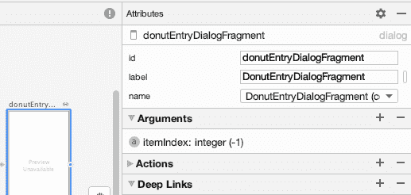
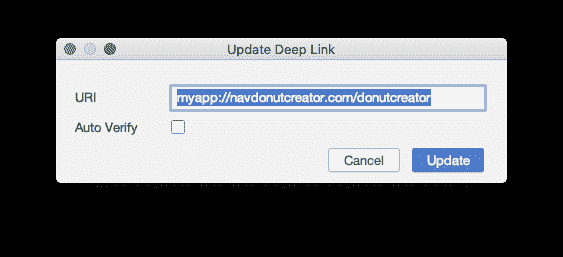

# 使用深层链接导航

> 原文：<https://medium.com/androiddevelopers/navigating-with-deep-links-910a4a6588c?source=collection_archive---------0----------------------->


## 关于深层链接的深层思考…带有导航组件

这是关于[导航组件](https://developer.android.com/guide/navigation) API 和工具系列文章的第四篇。这些文章是基于视频形式解释的内容，作为 [MAD Skills](https://www.youtube.com/playlist?list=PLWz5rJ2EKKc91i2QT8qfrfKgLNlJiG1z7) 系列的一部分，所以你可以随意以你喜欢的任何方式使用这些材料(尽管从文本中复制代码比从视频中复制代码更容易，这也是我们提供这个版本的原因)。

如果您更喜欢视频形式的内容，这里是:

# 介绍

这一集是关于[深度链接](https://developer.android.com/guide/navigation/navigation-deep-link)，导航组件提供的工具，用于帮助用户从应用程序外部的 UI 到达应用程序的更深部分。

有时你想让用户容易地到达你的应用程序流程中的某个特定部分，而不必从开始屏幕*点击-点击-点击*到达那里。例如，也许你想在一个聊天应用程序中显示正在进行的对话，或者在一个购物应用程序中显示用户的购物车。你可以使用深层链接来做到这一点，在应用程序之外，在快捷方式和通知中显示这些链接，允许用户从这些其他位置单击并到达应用程序的更深层部分。

导航组件简化了这些深层链接的创建。为了展示它们是如何工作的，我们将再看看我在[前几集](/androiddevelopers/navigation-component-dialog-destinations-bfeb8b022759)中使用的甜甜圈跟踪器应用程序。app 的[完成代码](https://github.com/android/architecture-components-samples/tree/main/MADSkillsNavigationSample)在 GitHub 上；请随意下载并在 Android Studio 中打开它，以便继续学习。

由于代码已经完成，我将带您完成我所经历的步骤，以使它全部工作。

# 圆环深度链接

在甜甜圈追踪器中，有几个动作非常有用，可以快速进入。例如，如果我在野外有一个非常好的甜甜圈，我希望能够将该信息添加到列表中，而不必先启动应用程序，然后单击`FloatingActionButton`来打开数据输入对话框。此外，如果我刚刚添加或编辑了一个甜甜圈的信息，我想发布一个通知，这样我就可以快速回到编辑最近的条目。

我为这两个操作添加了深层链接:一个用于添加新的甜甜圈，另一个用于返回正在进行的编辑。“添加”操作使用“隐式”深层链接。*隐性*是我们所说的链接，它把你带到你的层级结构中的一个静态位置，一个不会随着时间而改变的位置。在我的应用程序中，隐式深度链接将始终带您到允许您向列表添加新甜甜圈的表单。

“继续编辑”动作使用“显式”深层链接。 *Explicit* 就是我们所说的链接，它把你带到应用程序内部的动态内容。

# 含蓄的

让我们从添加一个新的甜甜圈的隐式深度链接开始。

首先，我需要创建深层链接，这是我在导航编辑器中完成的。单击对话框目标会在右侧显示该目标的属性:



Clicking on a destination shows its properties, which is where we can create a new deep link to navigate to that destination

我点击了**深度链接**旁边的 **+** 。这打开了一个对话框，我在其中输入了一个 URI(统一资源标识符)。在这种情况下，我想要一个特定于应用程序的 URI(而不是可能被浏览器应用程序获取的通用网址)，所以我使用“myapp”作为特定于我们的应用程序的标识符:



Creating a new deep link brings up a dialog where you enter a URL associated with the deep link to that destination

接下来，我编辑了应用程序清单，通知应用程序我需要深层链接的快捷方式:

```
<activity
    android:name="com.android.samples.donuttracker.MainActivity"
    android:label="@string/app_name"
    android:theme="@style/AppTheme.NoActionBar">
 **<nav-graph android:value="@navigation/nav_graph" />**    <intent-filter>
        <action android:name="android.intent.action.MAIN" />
        <category android:name="android.intent.category.LAUNCHER" />
    </intent-filter>
 **<meta-data android:name="android.app.shortcuts"
        android:resource="@xml/shortcuts" />** </activity>
```

在那个`meta-data`块中，我告诉活动在导航图中有关于深层链接的信息。我还引用了`xml` 资源目录中的一个新文件，该文件包含关于此活动的应用程序快捷方式的信息。

然后我创建了`xml`文件夹，并在这个新目录下创建了一个新的`shortcuts.xml`文件。在快捷方式文件中，我输入了关于应用程序快捷方式的信息，包括我们上面看到的 URI:

```
<shortcuts
    xmlns:android="http://schemas.android.com/apk/res/android">
  <shortcut
    android:shortcutId="NewDonutDialogFragment"
    android:enabled="true"
    android:shortcutShortLabel="@string/static_shortcut_label_short"
    android:shortcutLongLabel="@string/static_shortcut_label_long"
    android:shortcutDisabledMessage=
        "@string/static_shortcut_disabled_message"
    android:icon="@drawable/donut_with_sprinkles">
    <intent
       android:action="android.intent.action.VIEW"
 **android:data="myapp://navdonutcreator.com/donutcreator" />**  </shortcut>
</shortcuts>
```

这里重要的部分是数据项，它使用了与我之前在导航工具的深层链接对话框中输入的相同的 URI 字符串。这是连接胶水，导致导航发生从应用程序快捷方式到对话目的地。

这就是隐式深度链接所需要的:我告诉它要导航到的目的地，创建完成导航的快捷方式，然后我就完成了。如果你运行应用程序，你可以通过长按应用程序图标看到快捷方式。单击该快捷方式会将您带到创建新的甜甜圈项目的表单。

那是隐含的深层联系。现在让我们创建一个显式的深度链接，它将根据应用程序的状态动态创建。

# 明确的

如果你像我一样，那么甜甜圈对你来说真的很重要。当我输入一个新发现的甜甜圈的信息时，我可能想慢慢来。因此，我将用一些信息开始这个条目，但我可能希望以后回来，当我真正有机会欣赏这个经历时，输入更多的信息。

这可以通过通知来实现:当我输入一个甜甜圈的信息时，应用程序会创建一个通知，让我更容易回到正在进行的输入。这样做并不需要很多代码；我只需要创建一个带有`PendingIntent`的通知来到达应用程序中的正确位置。

这大部分发生在`DonutEntryDialogFragment`中，在**完成**按钮的`onClick()`监听器中。我们在上一集已经看到了这个点击监听器代码；这是我们向视图模型添加新数据或更新数据的地方。我只需要在这里添加一个额外的步骤来创建通知。**粗体**部分是我为处理通知而添加的代码。

```
binding.doneButton.setOnClickListener {
    ***// Grab these now since Fragment may go away before the
    // lambda below is called* val context = requireContext().*applicationContext* val navController = *findNavController*()** 
    donutEntryViewModel.addData(
        donut?.id ?: 0,
        binding.name.*text*.toString(),
        binding.description.*text*.toString(),
        binding.ratingBar.*rating*.toInt()
    ) **{ actualId ->
        val arg = DonutEntryDialogFragmentArgs(actualId).toBundle()
        val pendingIntent = navController
            .createDeepLink()
            .setDestination(R.id.*donutEntryDialogFragment*)
            .setArguments(arg)
            .createPendingIntent()

        Notifier.postNotification(actualId, context, pendingIntent)
    }**
    dismiss()
}
```

首先，代码用要使用的甜甜圈 id 创建`arg`。这将用于告诉目标对话框检索哪个甜甜圈，用户将继续编辑。

然后代码使用`NavigationController`中的 API 为深层链接创建`pendingIntent`。目的地被设置为这个对话片段。该调用还设置保存 ID 和创建意图的参数。

然后代码调用`Notifer.postNotification()`，这是我创建的一个实用类/方法，用于处理创建和发布通知的细节。

```
fun postNotification(id: Long, 
                     context: Context, 
                     intent: PendingIntent) {
    val builder = NotificationCompat.Builder(context, channelId)
    builder.setContentTitle(context
            .getString(R.string.*deepLinkNotificationTitle*))
        .setSmallIcon(R.drawable.*donut_with_sprinkles*)
    val text = context.getString(R.string.*addDonutInfo*)
    val notification = builder.setContentText(text)
        .setPriority(NotificationCompat.*PRIORITY_HIGH*)
        .setContentIntent(intent)
        .setAutoCancel(true)
        .build()
    val notificationManager =
        NotificationManagerCompat.from(context)
    notificationManager.cancelAll()
    notificationManager.notify(id.toInt(), notification)
}
```

首先，代码创建通知构建器。注意，它需要一个`channelId`来构建构建器，这个构建器是根据需要在`Notifier`的`init()`函数中创建的(详见代码；是标准的东西)。

然后，我为通知提供必要的数据，设置`intent`，并构建它。在发布之前，现有的通知被取消(我只想能够编辑最新的甜甜圈)。

最后，新的通知被发布……完成了。现在，每一个新的编辑操作(无论是新的甜甜圈还是现有的甜甜圈)都将显示一个通知，用户可以单击该通知返回到编辑操作。

# 摘要

在这一集中，我创建了一个**隐式**深度链接，它将用户带到应用程序中的一个静态位置，在那里他们可以输入关于一个新甜甜圈的信息，还创建了一个**显式**深度链接，它允许用户在他们离开的地方继续编辑现有的甜甜圈。

这个甜甜圈追踪器应用程序越来越好了。当然，没有甜甜圈好吃…但是也没有什么比得上。

这次到此为止。去拿个甜甜圈吧——这是你应得的。

# 了解更多信息

有关导航组件的更多详细信息，请查看指南[开始使用 developer.android.com 上的导航组件](https://developer.android.com/guide/navigation/navigation-getting-started)。

要查看完成的甜甜圈跟踪器应用程序(它包含上面概述的代码，但也包含未来剧集中涉及的代码)，请查看 [GitHub 示例](https://github.com/android/architecture-components-samples/tree/main/MADSkillsNavigationSample)。

最后，要查看 MAD Skills 系列的其他内容，请查看 YouTube 上 Android 开发者频道的[视频播放列表](https://www.youtube.com/playlist?list=PLWz5rJ2EKKc91i2QT8qfrfKgLNlJiG1z7)。