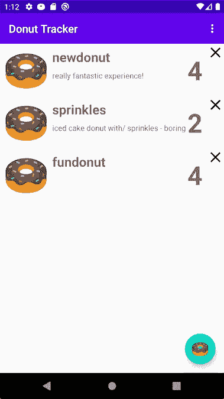
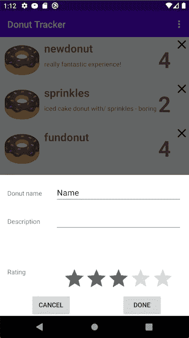
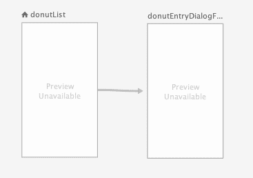
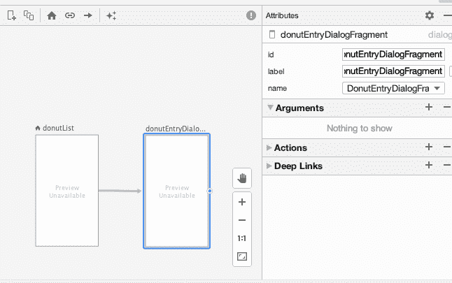
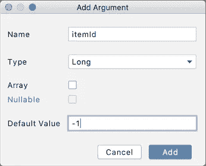

# 使用 SafeArgs 导航

> 原文：<https://medium.com/androiddevelopers/navigating-with-safeargs-bf26c17b1269?source=collection_archive---------0----------------------->


## 我不想争论。但是如果我做了，我会使用 SafeArgs。

这是关于[导航组件](https://developer.android.com/guide/navigation) API 和工具系列文章的第三篇。这些文章是基于视频形式解释的内容，作为 [MAD Skills](https://www.youtube.com/playlist?list=PLWz5rJ2EKKc91i2QT8qfrfKgLNlJiG1z7) 系列的一部分，所以你可以随意以你喜欢的任何方式使用这些材料(尽管从文本中复制代码比从视频中复制代码更容易，这也是我们提供这个版本的原因)。

以下是视频版本:

这一集在`SafeArgs`上，导航组件提供的用于在目的地之间轻松传递数据的设施。

# 介绍

当导航到应用程序中的不同目标时，您可能希望传递数据。与使用对全局对象的引用相反，传递数据允许在代码中进行更好的封装，这样不同的片段或活动只需要共享与它们直接相关的部分。

导航组件支持使用`[Bundles](https://developer.android.com/guide/components/activities/parcelables-and-bundles)`传递参数，这是 Android 中用于在不同活动之间传递信息的通用机制。

我们完全可以在这里这样做，为我们想要传递的参数创建一个`Bundle`，然后将它们从另一端的`Bundle`中取出。

但是导航有更好的东西:`[SafeArgs](https://developer.android.com/guide/navigation/navigation-pass-data#Safe-args)`。

`SafeArgs`是一个 gradle 插件，允许你在导航图中输入关于你想要传递的参数的信息。然后，它为您生成代码，处理为这些参数创建一个`Bundle`并从另一端的`Bundle`中提取这些参数的繁琐工作。

你完全可以直接使用 raw`Bundle`s…但是我们建议使用`SafeArgs`来代替。它不仅更容易编写——需要维护的代码更少——而且还支持参数的类型安全，使您的代码本质上更健壮。

为了展示`SafeArgs`是如何工作的，我将继续使用我在上一集演示的甜甜圈跟踪器应用程序，[对话目的地](/androiddevelopers/navigation-component-dialog-destinations-bfeb8b022759)。如果你想在家跟着做，[下载应用](https://github.com/android/architecture-components-samples/tree/main/MADSkillsNavigationSample)并将其加载到 Android Studio。

# 该做油炸圈饼了

这是我们的甜甜圈追踪应用程序:



Donut Tracker: the app!

甜甜圈跟踪器显示了甜甜圈列表，每个甜甜圈都有我添加的名称、描述和评级信息，或者在通过单击浮动操作按钮访问的对话框中:



Clicking on the FAB brings up a dialog to enter information about a new donut

能够为新的甜甜圈添加信息还不够好；我也希望能够改变现有的油炸圈饼的信息。也许我得到了一张野生甜甜圈的照片，或者我想提升我对那个甜甜圈的评价— *谁知道呢？！？！*

一种自然的方法是单击列表中的一个项目，这将把我带到与之前相同的对话框目的地，在那里我可以更新关于该项目的信息。但是应用程序如何知道在对话框中呈现哪个项目呢？代码需要传递关于被点击的项目的信息。特别是，它需要将项目的底层 id 从列表片段传递到对话框片段，然后对话框可以从数据库中检索具有该 id 的甜甜圈的信息，然后可以适当地填充表单。

为了传递那个 id，我将使用`SafeArgs`。

# 使用安全参数

*在这里，我应该指出我已经写了所有的代码，这就是你将在 GitHub* *上的* [*示例中找到的；完成的代码。因此，我将解释我所做的事情，而不是像我一样带您完成这些步骤，您可以在示例代码中看到结果。*](https://github.com/android/architecture-components-samples/tree/main/MADSkillsNavigationSample)

首先，我需要一些库依赖项。

SafeArgs 与导航的其他部分不是同一种类的库模块；它本身不是一个 API，而是一个可以生成代码的 gradle 插件。所以我需要把它作为一个 gradle dependency 拉进来，然后应用插件在构建时运行，生成必要的代码。

我首先将它添加到项目的 build.gradle 文件的 dependencies 块中:

```
def nav_version = "2.3.0"
classpath “androidx.navigation:navigation-safe-args-gradle-plugin:$nav_version”
```

我使用的是 2.3.0 版本，但是如果你很晚才读到这篇文章，可能有一个更新的版本可以替代。对于导航组件 API 的其他部分，只需使用您正在使用的任何版本。

然后，我将以下命令添加到应用程序的 build.gradle 文件中。这是导致为 SafeArgs 调用生成代码的部分。

```
apply plugin: "androidx.navigation.safeargs.kotlin"
```

此时，gradle 抱怨它想要同步，于是我点击了“立即同步”


This is a nag to sync that you shouldn’t ignore

接下来，我转到导航图，创建并传递必要的数据。



需要参数的目的地是对话框`donutEntryDialogFragment`，它需要关于要显示哪个项目的信息。单击该目的地会在右侧显示目的地属性:



Clicking on a destination brings up the property sheet for that destination, which is where you can enter arguments to pass to it

我点击了**参数**部分的 **+** 号来添加一个新的参数，这就出现了下面的对话框。我想传递关于显示哪个甜甜圈项目的信息，所以我选择了`Long`作为类型，以对应数据库中 id 的类型。



Adding an Argument takes you to this dialog where enter the type, default value (if any) and other information as needed

注意，当我选择`Long`时，**可空的**项是灰色的。这是因为在 Java 编程语言层，允许的基类型(`Integer`、`Boolean`、`Float`和`Long`)由原语类型(`int`、`bool`、`float`和`long`)支持，并且这些类型不能为空。所以即使 Kotlin 的`Long`类型*是*可空的，底层的原语`long`类型不是，所以我们在使用这些基本类型时被限制为不可空的类型。

另一件要注意的事情是，应用程序现在使用对话框目的地来输入一个新的*项目(我在[上一集](/androiddevelopers/navigation-component-dialog-destinations-bfeb8b022759)中提到过)和编辑一个现有的*项目。不会总有一个`itemId`要传递；当用户创建一个新项目时，代码应该指示没有现有项目可显示。这就是为什么我在对话框中输入-1 作为默认值的原因，因为-1 不是一个有效的索引。当代码在没有提供参数的情况下导航到此目的地时，将发送默认值-1，接收代码将使用该值来决定是否正在创建新的甜甜圈。

此时，我运行了一个构建，这使得 gradle 为我输入的信息生成了代码。这一点很重要，因为否则 Studio 不会知道我想要调用的生成函数，自动完成不是很好吗？*(注:最新版本的 Android Studio 4.2 不再需要这一步；我刚刚在 canary 15 上试了一下，它能够自动完成，而无需首先构建和生成代码。)*

通过转到项目列表中的“java (generated)”文件，可以看到生成代码的结果。在其中一个子文件夹中，您可以看到为传递和检索参数而生成的新文件。

在`DonutListDirections`中，你可以看到`companion object`，这是我用来导航到对话框的 API。

```
companion object {
    fun actionDonutListToDonutEntryDialogFragment(
        itemId: Long = -1L): NavDirections =
        ActionDonutListToDonutEntryDialogFragment(itemId)
}
```

代码`navigate()`没有使用`navigate()`调用最初使用的`Action`，而是使用了`NavDirections`对象，该对象封装了动作(将我们带到对话目的地)和之前创建的参数。

请注意，上面的`actionDonutListToDonutEntryDialogFragment()`函数接受一个`Long`参数，这是我们创建的参数，并为它提供默认值-1。因此，如果我们调用不带参数的函数，它将返回一个`NavDirections`对象，其`itemId`参数为-1。

在另一个生成的文件`DonutEntryDialogFragmentArgs`中，您可以看到生成的`fromBundle()`代码，该代码可用于在对话框目标中检索另一端的参数:

```
fun fromBundle(bundle: Bundle): DonutEntryDialogFragmentArgs {
    // ...
    return DonutEntryDialogFragmentArgs(__itemId)
}
```

现在，我可以使用这些生成的函数成功地传递和检索数据。首先，我在`DonutEntryDialogFragment`类中创建了代码来获取`itemId`参数，并决定用户是添加新的甜甜圈还是编辑现有的甜甜圈:

```
val args: DonutEntryDialogFragmentArgs by navArgs()
val editingState =
    if (args.itemId > 0) EditingState.EXISTING_DONUT
    else EditingState.NEW_DONUT
```

第一行代码使用了导航组件库提供的属性委托，这使得从包中检索参数更加容易。它允许我们直接引用`args`变量中的参数名。

如果用户正在编辑一个现有的甜甜圈，代码将检索该项的信息并用它填充 UI:

```
if (editingState == EditingState.*EXISTING_DONUT*) {
donutEntryViewModel.get(args.itemId).observe(
        *viewLifecycleOwner*,
        *Observer* { donutItem ->
            binding.name.setText(donutItem.name)
            binding.description.setText(donutItem.description)
            binding.ratingBar.*rating* = donutItem.rating.toFloat()
            donut = donutItem
        }
    )
}
```

请注意，这段代码在数据库中查询信息，我们希望它发生在 UI 线程之外。因此，代码观察由`ViewModel`提供的`LiveData`对象，并异步处理请求，每当数据进来时填充视图。

当用户点击对话框中的**完成**按钮时，就该保存他们输入的信息了。代码使用对话框 UI 中的数据更新数据库，然后关闭对话框:

```
binding.doneButton.setOnClickListener {
    donutEntryViewModel.addData(
        donut?.id ?: 0,
        binding.name.*text*.toString(),
        binding.description.*text*.toString(),
        binding.ratingBar.*rating*.toInt()
    )
    dismiss()
}
```

我们刚刚走过的代码处理目的地端的参数；现在让我们看看数据是如何被*发送到目的地的。*

在`DonutList`中有两个地方可以导航到对话框。一个处理用户点击`FloatingActionButton` (FAB)时的情况:

```
binding.fab.setOnClickListener { fabView ->
    fabView.*findNavController*().navigate(DonutListDirections
        .actionDonutListToDonutEntryDialogFragment())
}
```

请注意，代码创建了没有构造函数参数的`NavDirections`对象，因此参数将获得默认值-1(表示一个新的甜甜圈),这是我们希望通过点击 FAB 得到的。

另一种导航到对话框的方式是当用户单击列表中的一个现有项目时。这个动作在这个 lambda 中结束，它被传递到`DonutListAdapter`代码的创建中(作为参数`onEdit`)，并在每个项目的`onClick`处理程序中被调用:

```
donut ->
    *findNavController*().navigate(DonutListDirections
        .actionDonutListToDonutEntryDialogFragment(donut.id))
```

这段代码类似于上面当用户点击 FAB 时调用的代码，但是在这种情况下，它使用被点击的项目的 id 来告诉对话框它将编辑一个现有的项目。正如我们在前面的代码中看到的，这将导致对话框中填充现有项目的值，对该数据的更改将更新数据库中的该项。

# 摘要

`SafeArgs`到此为止。它们使用简单(比玩`Bundle` s 简单多了！)因为该库会为您生成代码，以一种类型安全且简单的方式简化目的地之间的数据传递。这使您可以利用数据封装，只在目的地之间传递您需要的数据，而不是更广泛地公开它。

请继续关注关于导航组件的下一集，我将探索如何使用深层链接。

# 了解更多信息

有关导航组件的更多详细信息，请查看 developer.android.com 上的指南[导航组件](https://developer.android.com/guide/navigation/navigation-getting-started)入门。

要查看完成的甜甜圈跟踪器应用程序(它包含上面概述的代码，但也包含未来剧集中涉及的代码)，请查看 [GitHub 示例](https://github.com/android/architecture-components-samples/tree/main/MADSkillsNavigationSample)。

最后，要查看 MAD Skills 系列的其他内容，请查看 YouTube 上 Android 开发者频道中的[视频播放列表](https://www.youtube.com/playlist?list=PLWz5rJ2EKKc91i2QT8qfrfKgLNlJiG1z7)。