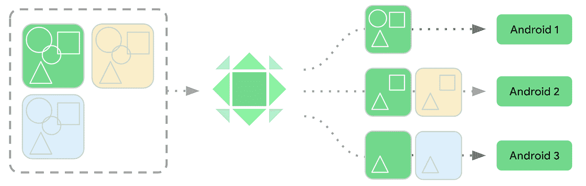
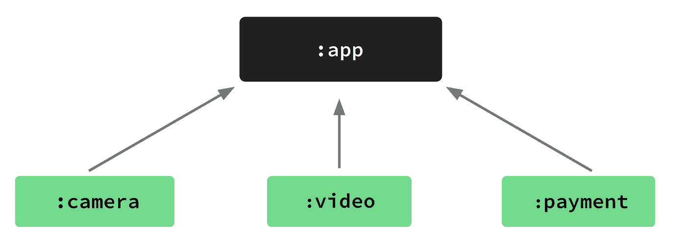
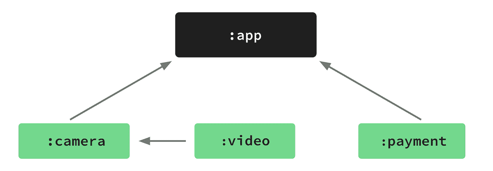
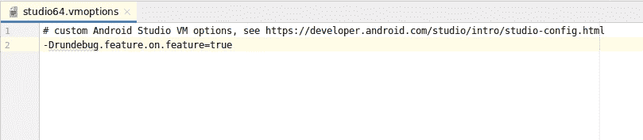
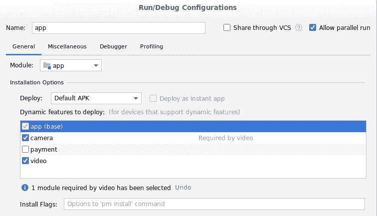
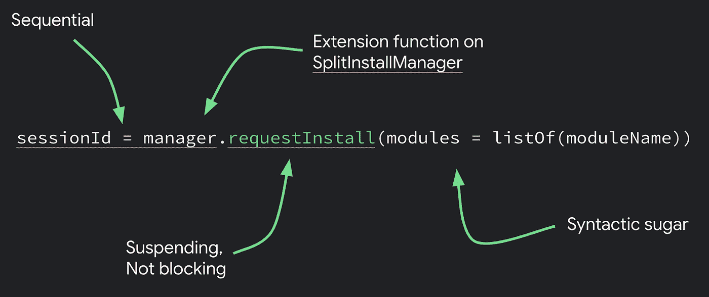
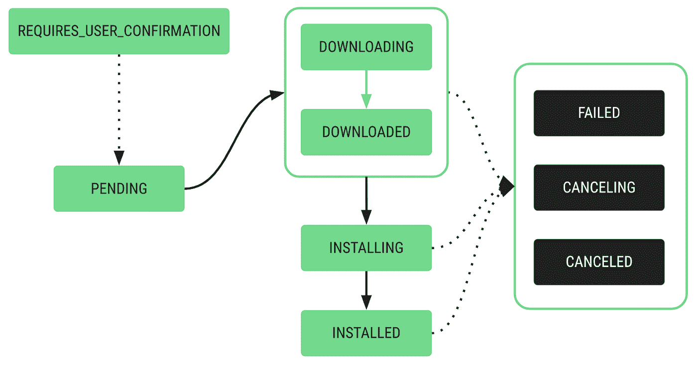

# 在可定制的交付中导航

> 原文：<https://medium.com/androiddevelopers/navigating-your-way-around-customizable-delivery-e7a882390aa?source=collection_archive---------6----------------------->


## 如何模块化您的应用程序，并利用 Android 应用程序捆绑条件交付功能。

*合著*[*Dom Elliott*](https://medium.com/u/ff0b1fb4e6b6?source=post_page-----e7a882390aa--------------------------------)*和* [*Ben Weiss*](https://medium.com/u/65fe4f480b1c?source=post_page-----e7a882390aa--------------------------------)

Android 应用捆绑包是 Android 应用的新发布格式，取代了单一的 APK。app 捆绑包不是直接安装的。相反，Google Play 会从应用捆绑包中为每个设备生成优化的 apk。与整体式 APK 相比，捆绑包生成的 apk 通常要小得多。开发体验也更简单，您不必为每个版本的不同设备配置管理和发布多个 apk，从而节省了大量时间。

Android 应用捆绑背后的势头令人难以置信。Google Play 上超过 450，000 个应用和游戏在生产中使用应用捆绑包，占活跃安装的 30%以上。与使用通用 APK 相比，切换到[[bundle]的应用平均节省了 16%的大小。这种规模节省使合作伙伴的安装量增加了 11%。

当您模块化您的应用程序时，您可以利用应用程序捆绑包的条件交付功能。您可以根据条件(如用户的国家或设备特性)选择在安装时交付模块。按需交付意味着您可以在应用程序需要模块时即时安装和卸载模块。我们看到合作伙伴为各种使用情形构建模块，例如:

*   只有一小部分用户使用的大型功能
*   特定的硬件或软件功能，例如向兼容设备提供增强现实模块
*   特定 Android 版本
*   提供生命周期有限的大型库，可以在不再需要时安装和移除。

这些高级功能是可选的，您可以只使用应用捆绑包进行发布。您还可以模块化您的应用程序，而无需使用任何其他可定制的交付选项。

这篇文章详细探讨了创建和交付模块化应用的特性，重点是定义模块依赖和应用导航。但是，首先，我将向您介绍一些最新的和计划中的捆绑包特性。

# 最新最棒的

我们对应用捆绑包的愿景更进一步。我们正在开发一个有更多选择的动态框架。

这些选项包括应用内更新，使您能够完全在应用内触发和完成更新。我们还致力于可定制的资产交付，使应用捆绑包包含资产包。这个特性对于想要将大型游戏资产和他们的游戏二进制文件打包成一个工件的游戏开发者来说尤其有用。我们进一步介绍了向用户交付这些资产的几个选项。

我们正在引入补充这一动态框架的新功能。例如，Google Play 控制台中的[应用大小报告](https://support.google.com/googleplay/android-developer/answer/9302563?hl=en)提供了应用下载大小和设备上的大小等数据。当你使用应用套装时，它也能为你提供尺寸指导。最近，我们添加了与您的用户相关的新指标，并向您展示了设备存储容量较低的活跃用户的比例。这些用户可能会带来卸载风险，优化您的应用程序大小是降低这种风险的一种方法。

我们还为 Google Play 的应用签名服务添加了一项新功能，使您能够将您的应用签名密钥升级为新安装的加密性更强的新签名密钥。如果您很久以前就创建了应用程序签名密钥，并且它没有您希望的那么强，那么这一点尤其有用。

最后，还有内部应用程序共享，这使得测试应用程序捆绑包和动态交付更加容易。内部应用共享为您提供了一种快速共享应用进行本地测试的方式。使用这种机制，Google Play 将测试应用程序安装在设备上，就像应用程序发布时一样。你所需要做的就是上传一个捆绑包到 Google Play，然后与你的测试人员分享一个 URL，然后他们在他们的设备上打开这个 URL 来安装应用程序。使用内部应用程序共享的开发人员表示，这加快了他们的工作流程。您可以让您公司的任何人上传内部应用程序共享，而不授予他们对 Play 控制台的任何其他访问权限。


如果你有其他上传到 Play 控制台的工件，你也可以获得它们的安装链接。对于应用程序捆绑包，进入捆绑包浏览器并切换到旧版本，您可以复制一个安装链接。在 Play Store [这里](/androiddevelopers/developer-tools-on-play-store-85fb710ee33b)找到更多关于开发者工具的信息。

最后，我们添加了`FakeSplitInstallManager`类来玩核心。这使您能够离线测试具有动态特性的应用程序。通常，当你在应用中加载一个点播动态功能时，`SplitInstallManager`会请求 Play Store 为该动态功能安装拆分，你必须等待它们加载。使用`FakeSplitInstallManager`，你的应用程序离线安装本地需要的分割。您不必等待 Play 来交付和安装拆分。这使得在开发过程的早期迭代动态特性变得容易，不需要在线，也不需要等待 Play Store。当你准备好的时候，你仍然可以切换到`SplitInstallManager`并通过内部应用程序共享进行全面的在线测试。这在最新的 Play Core 版本中现已提供。

这些测试功能都是为了让您更轻松地测试您的应用捆绑包和动态交付，作为您工作流程的一部分。

现在你已经对 Android 应用捆绑包的最新特性有了一个大致的了解，让我们更仔细地看看你的应用中的特性和模块化。

# 功能对功能的依赖性

在讨论特性对特性的依赖之前，让我们回顾一下应用捆绑包的一个关键功能:动态模块。



假设你有一个具有三种不同特性的应用程序。其中一个提供摄像头支持(绿色)，一个提供视频支持(橙色)，第三个提供支付支持(蓝色)。将你的应用模块化的目标是将它分解成动态的特性，这样你就可以更好的分离代码。动态功能的模块化也意味着不同的用户可以获得应用程序的不同部分:用户 1 可能会使用相机支持，用户 2 可能会更高级一些，使用相机和视频支持，用户 3 可能会使用相机和支付功能。

这种方法的优点是，每个用户都可以获得他们需要的应用程序的任何部分，并且与作为整体 APK 交付的应用程序相比，他们安装的应用程序要小得多。

> Google Play 的统计数据显示，应用程序大小每减少 3 兆字节，转化率最高可增加 1%。

模块化应用程序还有其他好处。第一个是更快的增量构建时间，因为它能够只构建模块的子集。这意味着你花更少的时间来构建你的应用程序，花更多的时间来开发它。另一个优点是代码的逻辑分离。例如，如果一个团队想开发相机功能，而另一个团队想开发视频功能，那么跨团队的依赖性应该会更少。

在谷歌，我们是模块化应用开发的忠实信徒:它加快了开发速度，提高了质量。模块化方法意味着团队独立工作来构建、测试和调试功能，而不需要每个人都在一个庞大、复杂的应用程序代码块上工作的复杂性。

要了解更多信息，请查看我的文章[使用按需模块进行本地开发和测试](/androiddevelopers/local-development-and-testing-with-fakesplitinstallmanager-57083e1840a4)。

# 动态功能交付

一旦你的应用中有了动态特性，你就有三种方法来实现它们:

*   安装时间交付，用户安装应用程序，动态功能会自动下载到设备上。
*   按需交付，在应用程序请求时下载动态功能。
*   有条件交付，取决于用户设备的配置。例如，支持 AR 的设备将安装支持动态特性的 AR，而不支持 AR 的设备则不会。

您还可以将所有这些交付机制与即时应用或游戏交付一起使用，这是您交付小版本(最多 10 MB)应用的地方，用户可以通过在 Play Store 中选择“立即尝试”来加载该应用。但是，如果您将即时启用的动态功能标记为安装时交付，这些功能会在用户选择安装应用程序时自动安装。此外，当您将功能标记为按需交付并在安装时交付中使用它们时，您必须提示用户从已安装的应用程序下载这些功能，因为当用户从即时应用程序开始使用已安装的应用程序时，它们不会自动下载。

# 基地 APK 属地

最初，动态特性依赖于基础 APK。因此，请使用我们的应用程序，它具有针对相机、视频和支付的动态功能。如果相机和视频功能依赖于通用图像处理软件，该软件必须驻留在 APK。



这意味着，如果用户只想要支付功能，他们仍然必须下载包含图像处理软件的 APK。这限制了你优化下载大小的能力。

使用 Android Studio 4.0，您可以定义依赖于其他动态特性的动态特性。因此，在示例应用程序中，您现在可以将所有这些图像处理代码放入相机动态特性中。



现在，想使用支付功能的用户不必安装包含图像处理软件的 APK。这意味着你能够提供一个更小的 APK，并有望提高转化率。

要开始使用这个功能，请安装[Android Studio 4 . x Canary/Beta](https://developer.android.com/studio/preview/?gclid=Cj0KCQjw6_vzBRCIARIsAOs54z7jxNYupUraP6H1nHp3L1sUB7JfwQm2FxajcpinArb-DH79MdwoGb4aAkTXEALw_wcB)。

一旦你开发了你的特性，你就把它们列在基础应用的 *build.gradle* 文件中。如果您正在调整现有功能的依赖关系，则不需要进行任何更改。

接下来，在每个特性的 *build.gradle* 文件中定义依赖关系。如果您正在调整现有功能的依赖关系，您只需将对:camera 的依赖关系添加到视频功能 *build.gradle* 文件中。

一旦完成，Android Studio 将解析依赖关系树，以便在新的 Android Studio Canary 特性依赖关系功能中使用。但是，在使用这些功能之前，您必须添加一个功能标志。为此，进入**帮助** > **编辑自定义虚拟机选项**，将`rundebug.feature.on.feature`添加到文件中，保存更改，并重启 Android Studio。



现在打开**运行** > **编辑配置**，在**运行/调试配置**中，您可以定义各种测试安装配置。



如果选择视频功能，您会看到视频功能需要摄像机功能。所以，当你测试视频功能时，Android Studio 会自动选择相机功能，并在你运行测试时安装它。此外，如果您取消选择相机功能，视频功能也会取消选择，因为您没有相机功能，您将无法使用视频功能。

现在正常构建您的应用程序，并将其上传到 Play 控制台。然后，Play 会自动为您的设备提供正确的动态功能模块。

# 应用导航

传统的导航方式是使用框架 API，它提供了两个选项:

*   使用意图开始一个活动，这是为你的应用程序开始一个新屏幕的最简单的方法。
*   使用`supportFragmentManager`替换片段，因为您需要它们从一个屏幕导航到另一个屏幕。

Jetpack 导航架构组件使导航屏幕变得更加容易。该组件包括导航编辑器，您可以在其中定义目的地，然后操作这些目的地的导航路径。导航编辑器中定义的导航填充了`res/navigation/graph.xml file`，消除了手写代码的需要:尽管如果您愿意，您仍然可以进行手动编辑。

您必须在 layout.xml 文件中编写一点代码来引用`NavHostFragment`。您将它设置为默认片段，并引用您创建的图 ID，无论是手动创建还是使用导航编辑器创建。

更改之后，您不必手动启动活动或与片段管理器本身交互，因为导航组件会为您处理所有这些。

# 导航动态功能

应用捆绑包和动态功能模块改变了应用从基础模块导航到功能的方式。一个应用程序可以有多个动态功能模块，这些模块可以在安装时安装，也可以在以后使用上面提到的一个可定制的交付选项进行安装。这意味着当您的应用程序导航到某个模块时，该模块可能不会被安装。这给导航组件带来了问题，因为当应用程序导航到某个模块时，库期望该模块在设备上。动态特征导航库解决了这个问题。

Dynamic Feature Navigator 是一组基于动态特性、导航组件和 Play 核心库构建的 AndroidX 库。该图书馆现在在阿尔法可用，在我们的指南[这里](https://developer.android.com/guide/navigation/navigation-dynamic)找到更多。

为了说明从导航到动态特征导航的过渡应该有多平滑，让我们看一个示例导航图和按需模块。以下是您将遵循的步骤:

1.  在您的 layout.xml 文件中，用`DynamicNavHostFragment`替换`NavHostFragment`，这是一个新类，它提供了基本实现和与动态特性导航器交互的最简单方式。

*在*之前

*在*之后

2.对导航图进行更改。这个过程与中的方法相似。你在 *build.gradle* 文件中声明模块名来告诉你的应用程序安装了哪些模块。在这种情况下，对于每个特性，您添加一个模块名和每个特性的目的地，以便动态特性导航器知道在哪里找到并安装需要的特性。

通过这些更改，您可以从基本模块导航，下载并安装新模块，并根据需要启动它。所有这些都不涉及任何其他代码。导航器会为您处理安装状态进度和所有中间状态。

让我们看一看引擎盖下，看看这是如何工作的。当您使用导航组件时，`navigate()`被调用，导航器知道如何从一个目的地导航到另一个目的地。


当您使用未安装的动态功能模块时，导航组件不知道如何从 A 到达 b。动态功能导航器通过提供中间进度目的地解决了这一难题。


这个 ProgressDestination 检查是否安装了一个模块。如果安装了该模块，导航器将直接透明地导航到目的地。如果未安装该模块，动态功能导航器将下载并安装该功能，然后启动到目标功能。

您还可以使用通过扩展`AbstractProgressFragment`提供的 API 定制这个过程。您可以为想要显示的内容传递一个布局 ID。然后覆盖`onProgress`函数，该函数透明地向下调用 Play Core API，因此您的应用程序可以向您的用户显示进度。还有一些函数可以覆盖您可能想要处理的进度状态。

要设置定制的`progress`片段，打开`graph.xml`并添加片段的 ID 作为`progressFragment`。

您还必须在导航图层次结构中的某个位置设置带有片段 ID 的进度片段，以便导航组件能够捕捉到它。

如果自定义进度目标还不够，您可以更进一步，使用类似 toast 的通知或您选择的任何 UI 来显示安装进度。

要实现这一点，请将附加的 DynamicInstallMonitor 传入。导航()调用，并检查`DynamicInstallMonitor.installRequired`以确定是否需要安装。如果返回`false`，你的 app 可以跳转到该模块。否则，您可以订阅安装状态，从`SplitInstallSessionStates`获取实时数据。您还可以检查安装是否到达结束状态，以确定安装是否失败或被取消，以及您的应用程序是否无法继续该功能。要使用`SplitInstallSessionStates`，创建`InstallMonitor`并将其传递给`DynamicExtras`。这些`DynamicExtras`然后被传递到 navigate 函数中，在这里您可以订阅实时数据并观察分割状态。

动态特性导航器库可通过 AndroidX `navigation-dynamic-features-core`完全定制，AndroidX 提供了所有导航器 API 和用于具有动态特性的活动导航和具有动态特性的片段导航的 API。

从片段版本开始，因为这为您提供了与动态特性导航器交互的最简单方式。如果需要，您可以一直深入到核心，构建完全自定义的体验。

首先，将依赖项添加到您的`build.gradle`文件中:

而且，当你在快照中发现一个 bug 或其他问题时，会有一个功能请求，在 goo.gle/navigation-bug.归档

# 用于 Play Core 的 Kotlin 扩展库

不是每个应用程序都使用导航组件，也不是每个动态功能都有 UI、片段或活动。这就是用于 Play Core 的 Kotlin 扩展库的用武之地。由于它是一个扩展库，它不会取代主游戏核心工件，而是建立在它之上。它在底层使用相同的 API。

在现有 API 的基础上，我们抓住机会对其进行了简化，并帮助指导您使用正确的流程和推荐的 API 使用模式。这是通过利用 Kotlin 协程的能力来实现的。举例来说，这是原始的 Play 核心 API，并且是异步的。

```
manager.startInstall(request): Task
```

`SplitInstallManager`中的大多数方法会立即返回，并带有设置回调的任务。例如，`addOnSuccessListener`让您监听要完成的工作，这样您就可以在工作完成后采取行动。您还需要添加失败监听器，在那里您可以获得异常并处理任何失败。

那么，这在 Play core KTX 中是如何工作的呢？这是同一个电话，但它有几个不同之处。



第一，没有难看的回调。这个调用是顺序的:它返回一个带有会话 ID 的结果，而不是通过任务和回调来传递。这是因为这个函数实际上是一个挂起函数，所以它必须在一个协程中运行。它挂起了，但没有阻塞，所以从主线程调用是安全的。并且，它返回一个可以赋值的结果。

这是作为建立在现有 API 之上的`SplitInstallManager`的扩展功能实现的。只要有意义，我们就使用所有的科特林语法。在这个例子中，我们使用默认和命名参数，所以调用这些方法更容易。这对于返回单个结果的函数非常有效。然而，Play Core API 要复杂得多。此示例显示了拆分的安装过程。



它经历许多步骤并发出许多状态事件，简单的挂起协程函数是行不通的。通常，在 Play Core 中，您将使用类似于以下代码的侦听器来处理它:

这段代码让您来处理，例如，添加一个子类监听器并提供您自己的状态处理。重要的是，每当侦听器或对象离开作用域时，您需要在适当的时候清理侦听器，以防止内存泄漏和生命周期问题。

输入一个名为 [Flow](https://kotlinlang.org/docs/reference/coroutines/flow.html) 的 API，它是 Kotlin 协同程序库的一部分。该示例请求一个流，该流从 Play Core API 发出有关拆分安装的状态事件。

Flow 上的 collect 函数也是挂起的，这意味着它将在一个协程中运行。协程还有一个重要的特性:它们支持取消。在 AndroidX 的 KTX 库中，您可以获得视图模型、活动和片段的扩展。这些扩展为您提供了运行协程的范围，只要您的视图模型(或片段或活动)是活动的，您就会不断地获得事件。

一旦用户导航离开该屏幕并且范围被取消，我们也取消该流，清除任何侦听器，并且在您的生命周期结束后，您将不会再获得任何事件。最重要的是，Flow 和 Kotlin 协程库内置了许多操作符，因此您可以用更好的方式处理事件流。

例如，我在这里过滤事件流，只过滤我感兴趣的模块的更新:

这是使用该 API 的一种更好的方式。

模块安装过程相当复杂，它经历了许多不同的状态。作为一名开发人员，您如何知道哪些是重要的，哪些是需要一个句柄才能继续安装的，哪些只是影响 UI，而不是完成安装所必需的呢？

这里有一个方便的函数，它接受 lambdas，并为您创建侦听器。

对于您需要处理的强制状态，比如下载大型模块的用户确认，您需要提供这些参数。当然，所有其他状态都是可选参数，所以您也可以处理它们并在您的 UI 中显示出来。

# 最后的话

将你的应用程序模块化可以简化开发，并且可以帮助你提高代码的质量。将模块化与 Android 应用捆绑包相结合意味着您可以利用动态特性为用户提供他们想要使用的特性的最佳代码。

这篇文章中介绍的新特性使您能够利用依赖的动态特性实现更大的代码大小优化。新的导航和 Kotlin 功能简化了确保应用导航与动态功能无缝协作所需的编码。

充分利用应用捆绑包的动态功能来确保最大限度地减少应用和游戏的下载和设备上的大小，可以帮助您实现更好的转换，并降低卸载的可能性。

要了解更多信息，请参见 Android 开发者网站上的 [Android 应用捆绑包](https://developer.android.com/platform/technology/app-bundle)。