# 导航组件:概述

> 原文：<https://medium.com/androiddevelopers/navigation-component-an-overview-4697a208c2b5?source=collection_archive---------0----------------------->


## 其中我介绍了导航组件工具和 API 的一些基本概念

这篇文章是我们称之为 MAD Skills 的系列文章中的第一篇。我们将在 Android 开发者 YouTube 频道的[疯狂技能播放列表](https://www.youtube.com/playlist?list=PLWz5rJ2EKKc91i2QT8qfrfKgLNlJiG1z7)中发布视频片段。当没有任何给定视频集的现有文章时，我们将发布一个类似内容的文章(就像这个！)，对于那些喜欢阅读这些东西的人(也因为从文本中复制/粘贴代码比从视频中容易)。

如果你更喜欢视频形式的内容，可以看看下面的内容:

# MAD 技能:导航概述

本文提供了导航组件的快速、高级概述，包括如何创建具有导航功能的新应用程序、启用导航的 UI 的包含层次结构的详细信息，以及对导航组件工作中涉及的一些主要 API 和部分的解释。

注意，导航组件已经有很好的介绍材料，比如[入门指南](https://developer.android.com/guide/navigation/navigation-getting-started)和[伊恩莱克](https://medium.com/u/51a4f24f5367?source=post_page-----4697a208c2b5--------------------------------)最近的[视频](https://youtu.be/09qjn706ITA)。这篇概述文章的原因更多的是为了与视频内容同步，也是为了奠定一些基础，我将依赖于即将到来的剧集。

所以，如果你想了解更多，有很多机会，呃，*在资料中导航*。

# 介绍

导航组件是 Android Studio 中的 API 和设计工具，它使得在整个应用程序中创建和编辑导航流变得更加容易。在导航组件出现之前，应用程序中的导航任务是非常手动创建的。您可以在代码中为任何触发导航操作的 UI 元素添加一个侦听器，然后编写代码，比如启动一个意图来显示一个新的活动。或者过渡到一个片段。

当用户点击设备的后退按钮或动作栏中的向上按钮时，您还需要正确处理后退和向上动作。这两个相关但不同的操作的处理方式造成了应用程序之间的不一致。

有了导航组件，我们现在有了标准的 API，加上 IDE 中的可视化工具，有助于使整个过程更加清晰、简单和一致。您使用设计工具创建导航*目的地*并定义导航路径，或*动作*，将用户带到您的图形中的目的地之间。然后添加代码，将应用程序中的用户交互与这些操作联系起来，以便进行适当的导航。

让我们看看它在工具和代码中的实际样子。让我们构建一个应用程序。

# 导航模板

从 3.6 版本开始，Android Studio 最近发布的一个有用的新特性是集成了用于创建内置导航的新应用程序的模板。这个工具对于使用导航组件库来说并不是必需的，但是当您构建一个新的应用程序时，它确实使您的工作变得更加容易，因为它包含了所有必需的组件。

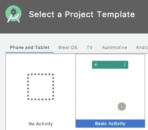

Create a Basic Activity

我们将使用其中一个模板，用**基本活动**模板创建一个新的应用程序。一些模板带有内置的导航功能，但是我们现在先从这个开始。

这个模板为我们创建了一个新的应用程序，它具有支持导航的应用程序的基本结构。我们得到了两个目的地以及一个定义它们之间导航路径的导航图。

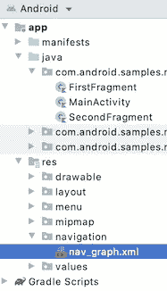

Navigate to the nav_graph resource file

在 IDE 中加载并准备好应用程序后，转到导航资源文件，`nav_graph.xml`使用设计选项(vs 代码或分割)查看该文件，这样您就可以看到应用程序的当前导航图。

您可以看到两个目的地:`FirstFragment`，它已被设置为初始目的地，或称家，以及`SecondFragment`，它是我们可以导航往返的另一个目的地。

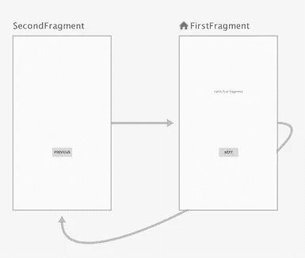

Basic Activity creates two destinations

单击这些目的地，您可以在右侧的属性表中看到关于它们的信息，其中显示了类似用于该目的地的`Fragment`类的信息。

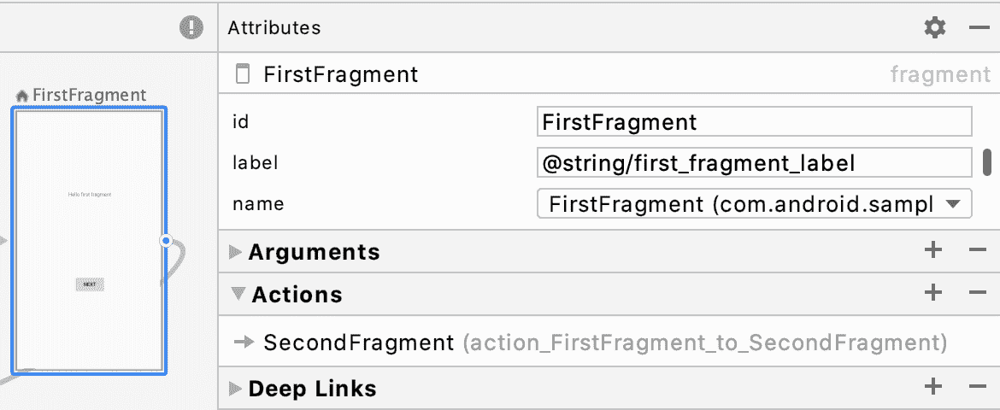

在上图所示的导航视图中，您还可以看到两个目的地之间的箭头。这些动作定义了此图中可能的导航。有一个从`FirstFragment`到`SecondFragment`以及从`SecondFragment`回到`FirstFragment`的导航。

动作定义了可能的导航，但是它们没有指定这些导航何时发生；这种逻辑存在于您的代码中。因此，当用户单击一个应该触发导航的项目时，就可以调用导航 API，使用这些操作之一导航到图中的目的地。

动作对于定义要传递到目的地的值以及进入和退出源和目的地时使用的过渡动画也很有用。我们将在以后的剧集中看到更多关于这些属性的内容，或者你可以在[导航文档](https://developer.android.com/guide/navigation/navigation-getting-started)中读到它们。

我们可以使用导航工具来定义新的目的地，如果我们还没有为目的地编写的`Fragment`类，这些目的地可以是占位符，或者他们可以为每个目的地使用现有的`Fragment`类。通过定义目的地和目的地之间的动作，你可以用比以前更直观的方式设计应用程序屏幕之间的整个流程。

# 但是代码在哪里？

到目前为止，我们已经在可视化工具中完成了所有这些工作。但是和 Android Studio 中的所有资源文件一样，它是由 XML 代码支持的，你可以直接查看和编辑。如果您切换到工具中的代码视图，您将看到底层的 XML:

```
*<?*xml version="1.0" encoding="utf-8"*?>* <navigation
    xmlns:android="http://schemas.android.com/apk/res/android"
    xmlns:app="http://schemas.android.com/apk/res-auto"
    xmlns:tools="http://schemas.android.com/tools"
    android:id="@+id/nav_graph"
    app:startDestination="@id/FirstFragment"> <fragment
        android:id="@+id/FirstFragment"
        android:name="com.android.samples.navoverviewarticle.FirstFragment"
        android:label="@string/first_fragment_label"
        tools:layout="@layout/fragment_first"> <action
            android:id="@+id/action_FirstFragment_to_SecondFragment"
            app:destination="@id/SecondFragment" />
    </fragment> <fragment
        android:id="@+id/SecondFragment"
        android:name="com.android.samples.navoverviewarticle.SecondFragment"
        android:label="@string/second_fragment_label"
        tools:layout="@layout/fragment_second"> <action
            android:id="@+id/action_SecondFragment_to_FirstFragment"
            app:destination="@id/FirstFragment" />
    </fragment></navigation>
```

这里你可以看到导航图的结构非常简单。还有`navigation`元素本身，它包含了结构的其余部分，并定义了哪个目的地是起点，或者说是主目的地。图中的每个目的地都是`fragment` s，每个目的地拥有零个或多个`action`，它们定义了到图中其他目的地的导航。

基本活动模板还创建占位符代码，以便在两个目的地之间导航。例如，`FirstFragment`有这样的代码，当用户点击 UI 中的按钮时触发:

```
override fun onViewCreated(view: View, savedInstanceState: Bundle?){
    super.onViewCreated(view, savedInstanceState)
    view.findViewById<Button>(R.id.button_first)
        .setOnClickListener {
         findNavController()
             .navigate(R.id.action_FirstFragment_to_SecondFragment)
    }
}
```

使用导航图文件中定义的`action_FirstFragment_to_SecondFragment`调用`navigate()`，使应用程序导航到第二个目的地。

您可以运行应用程序并单击按钮(或后退按钮，它会自动插入以向后导航)来查看结果:

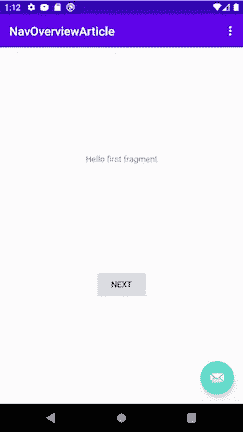

Run the application and navigate using the Next/Previous buttons and the Back button

# 导航层次结构

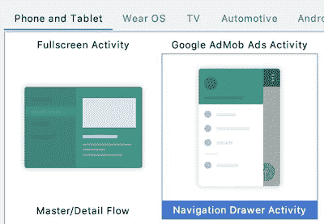

为了理解导航组件的各个部分是如何协同工作的，我发现看一看它们在 UI 的包含层次结构中是如何相互关联的是很有帮助的。为了看到这一点，让我们开始另一个项目，这一次使用导航抽屉活动模板。

一旦应用程序加载到 Android Studio 中，继续运行它。您应该会看到类似这样的内容:

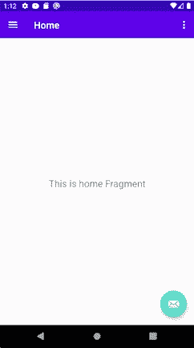

The app created by the Navigation Drawer Activity template

在这个应用程序中，与我们使用基本活动模板创建的应用程序不同，没有可以单击以导航到下一个目的地的按钮。相反，导航通过`DrawerLayout`中的菜单项进行:

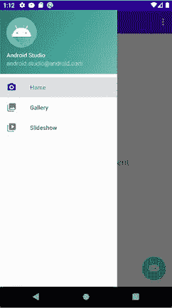

This time, navigation happens via the menu items in the drawer

当用户点击`DrawerLayout`中的项目时，会导致应用程序导航到与这些项目相关的目的地。这是因为导航组件自动将菜单项与目的地挂钩，因此您不必自己编写代码来建立这些连接。

现在，让我们来看看让所有这些工作正常进行所涉及的包容层次结构。为此，我们将在 Android Studio 中浏览布局检查器工具的用户界面，您可以从工具菜单启动该工具:

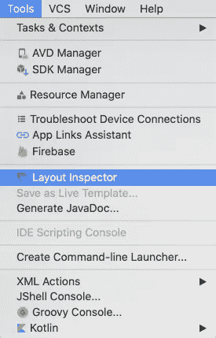

Launch the Layout Inspector from the Tools menu

布局检查器允许我们可视化整个应用程序的视图层次结构，以及我们看到的每个容器和视图的属性。您应该会看到类似这样的内容:

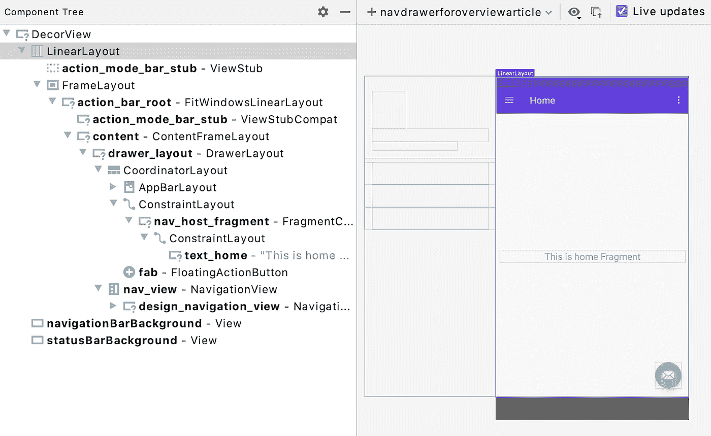

这里，活动显示中的蓝色矩形表示当前所选视图的边界(在本例中，是在`DecorView`中的顶层`LinearLayout`)。

我们可以遍历整个层次结构(我鼓励你这样做；它有助于可视化标准视图层次结构中正在发生的事情)。但是，我只想指出几个具体的项目。首先，让我们选择 ConstraintLayout 项:

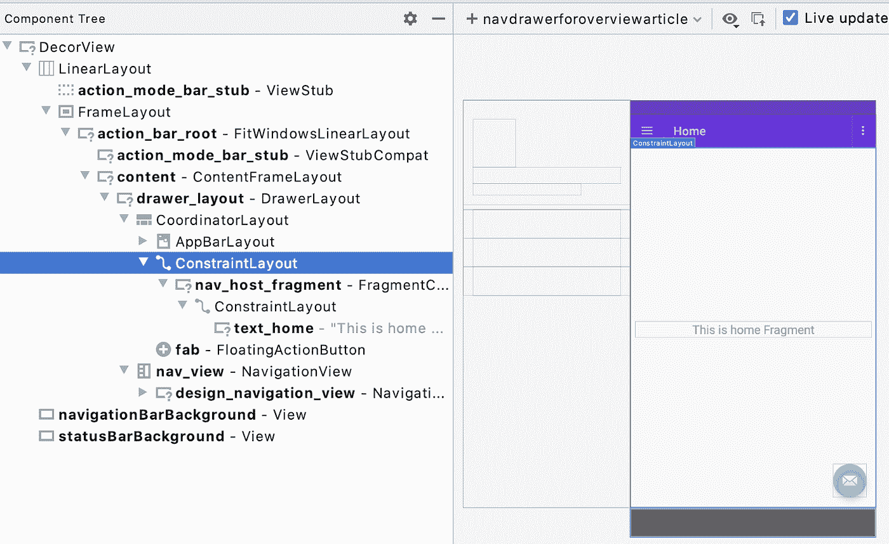

在 **main_activity.xml** 布局文件中定义了`ConstraintLayout`容器。它包含了应用程序的实际内容(而不是像`ActionBar`元素那样代表你创建的所有东西)。在里面，我们看到了`NavHostFragment`项目:

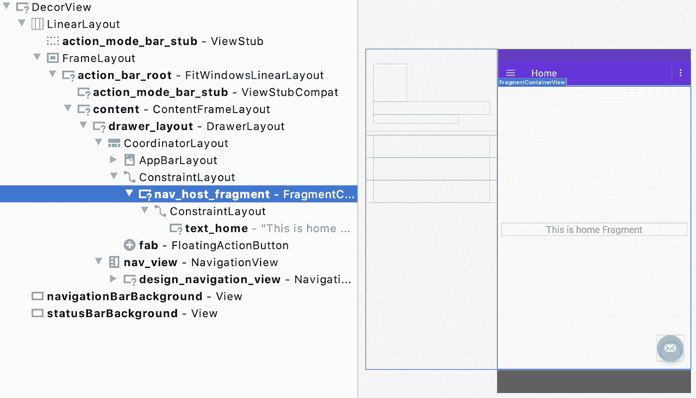

这就是导航组件的神奇之处。`NavHostFragment`是一个容器，当用户在它们之间导航时，片段目的地在其中交换。

我想指出的另一个元素是`NavigationView`:

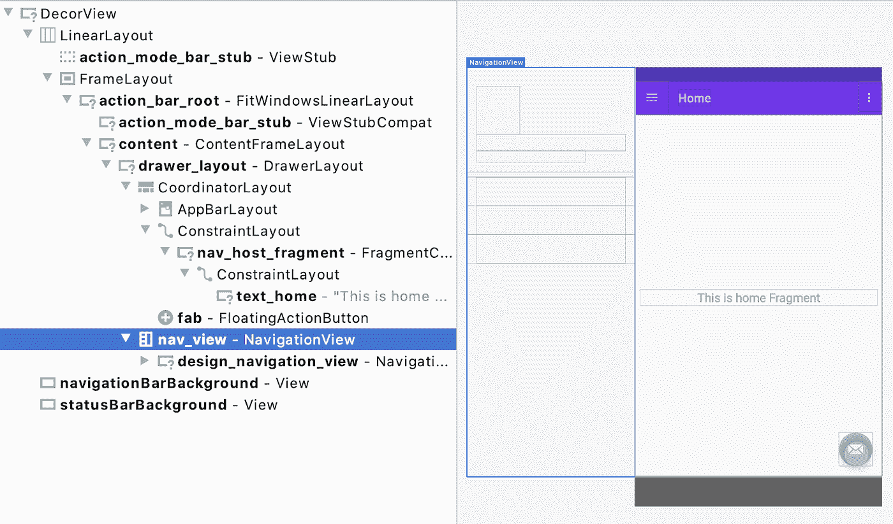

该视图当前位于屏幕左侧。这是`NavigationDrawer`，带有用于在目的地之间导航的菜单项。它目前是不可见的，因为我们需要点击动作栏菜单才能将其显示在屏幕上。

# 导航件

现在我们已经看到了一些 UI 部分在层次结构中是如何相互关联的，我想谈谈导航组件用来在目的地之间导航的一些重要部分。

当我第一次开始使用导航组件时，我发现这有些令人困惑，因为许多组件对术语*导航*和*导航*有相似的用法，其中一些元素甚至在导航组件库本身之前就存在了。因此，我认为了解这些主要部分是什么以及它们之间的关系可能会有所帮助。

## 应用程序容器

为了说明这些部分是如何集成的，我将使用整个应用程序容器的简化草图:

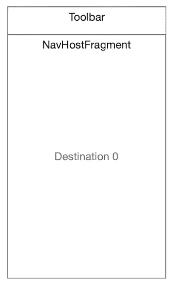

“Engineer art” showing the rough sketch of the content of the application.

这里我们看到工具栏在顶部，动作栏菜单就在那里。然后，应用程序内容本身位于其下，包含`NavHostFragment`，它包含当前目的地的 UI。

## 导航主机碎片

正如我前面说过的，NavHostFragment 是大量导航工作发生的地方。这是导航组件用来交换进出目的片段的容器。当您在应用程序中导航到给定的片段目的地时，它会用新的片段替换当前在 NavHostFragment 中的任何内容。

## 导航控制器

NavController 是导航组件使用的内部部件，在幕后起着至关重要的作用。这是导航库内部的逻辑，当用户在应用程序中导航时，它处理目的地进出`NavHostFragment`的交换。

## 导航视图

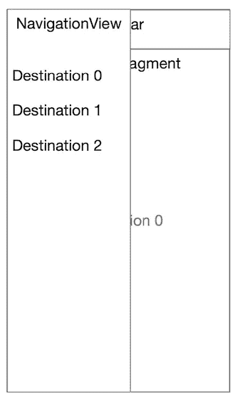

more engineer art, showing the NavigationView (the drawer) overlaid on top of the activity content

接下来是`NavigationView`，从左边滑入的抽屉。它在导航图中提供了一个可能目的地的菜单。关于`NavigationView`的一个很酷的事情是，您可以使用抽屉中的菜单 id 自动导航到相关的目的地，避免样板代码根据菜单选择手动导航。

需要注意的是`NavigationView`存在于`NavHostFragment`容器的之外*；它本身不是一个目的地，而是一种用于指定要导航到的目的地的机制。有趣的是，这个 API 在*组件之前就已经存在了，并且在导航组件出现并将其集成到整个导航系统之前就有了自己的生命。

# 导航 UI

这是负责更新`NavHostFragment`的外的 UI *的导航组件。大多数与导航相关的视觉更新都发生在`NavHostFragment`中，但是还有其他不在该容器中的系统部分也需要更新，包括我们上面看到的导航抽屉，以及像标签栏(可以用来显示当前目的地信息)这样的元素。*

# 摘要

这是对导航组件的一个非常快速的概述，让您了解如何创建一个支持导航的应用程序，以及这种应用程序的整体结构。在以后的文章和视频中，我将探索如何与导航 API 的特定部分进行交互的更多技术细节，比如导航到对话目的地、使用 SafeArgs 和处理深层链接。

# 了解更多信息

有关导航组件的更多详细信息，请查看指南[开始使用 developer.android.com 上的导航组件](https://developer.android.com/guide/navigation/navigation-getting-started)。