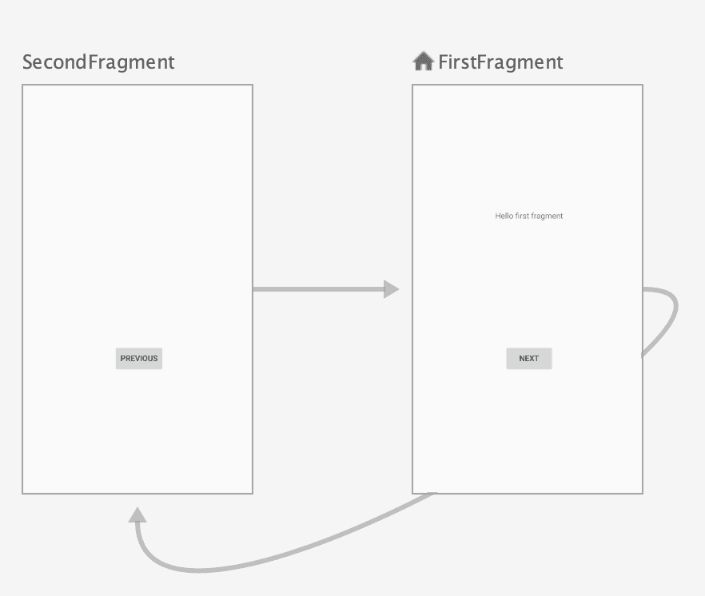
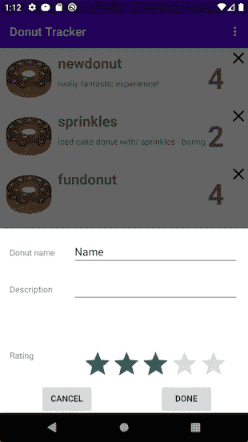
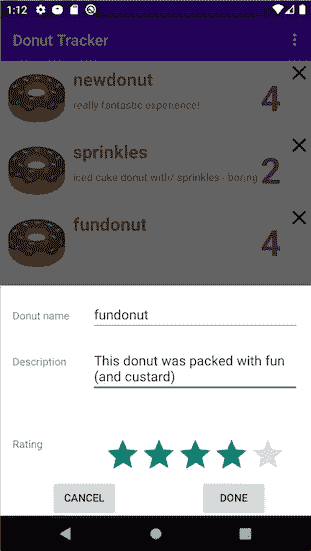

# 导航到对话目标

> 原文：<https://medium.com/androiddevelopers/navigation-component-dialog-destinations-bfeb8b022759?source=collection_archive---------0----------------------->


## 导航组件不限于`NavHostFragment`内的目的地

这是关于导航组件的[疯狂技能](https://www.youtube.com/playlist?list=PLWz5rJ2EKKc91i2QT8qfrfKgLNlJiG1z7)系列文章的第二篇。这些文章是基于视频形式解释的内容，作为 [MAD Skills](https://www.youtube.com/playlist?list=PLWz5rJ2EKKc91i2QT8qfrfKgLNlJiG1z7) 系列的一部分，所以请随意以您喜欢的任何方式使用这些材料(尽管从文本中复制代码比从视频中复制代码更容易，这也是我们提供这个版本的原因)。

如果你更喜欢视频形式的内容，可以看看下面的内容:

# 介绍

在[上一集](/androiddevelopers/navigation-component-an-overview-4697a208c2b5)中，我简要介绍了导航组件，包括导航图的使用。

在这一集里，我将探索如何使用 API 来导航到对话目的地。大多数导航发生在不同的片段目的地之间，这些目的地在 UI 中的`NavHostFragment`对象内部交换。但是也可以导航到容器之外的目的地，包括对话框。我们可以使用导航图工具来完成这项工作，就像我们对普通目的地所做的那样。

# 环形跟踪

我有一个问题:我喜欢油炸圈饼。很多。

我想知道哪些甜甜圈是我喜欢的，这样我就可以再吃到它们，哪些是我不喜欢的，这样我就可以避免吃到它们。但是我记性不好。那么我该如何跟踪这些重要的数据呢？

我知道了:我就用个 app！

不幸的是，我在 Play Store 上找不到甜甜圈追踪应用程序(你能相信吗？！？！).所以我需要自己写。该应用程序将有一个我吃过的甜甜圈列表，以及我记录的每一个甜甜圈的信息，如它们的名称，描述，可能是一张图片，肯定是一个评级。

这将是一个非常简单的应用程序，由两个屏幕组成:

*   油炸圈饼的清单
*   一个窗体，我可以在其中输入一个甜甜圈的信息，可以是我正在添加到列表中的一个新甜甜圈，也可以是我正在编辑的列表中的一个现有甜甜圈的信息

对于信息编辑屏幕，我想使用一个对话框。我想要一些轻量级的东西，在不替换整个 UI 的情况下，在活动的顶部弹出。我知道导航组件处理目的地，但是那些只是在单个`NavHostFragment`中交换出来的片段，对吗？

是…也不是。导航组件的默认行为是交换出`NavHostFragment`中的片段。但是导航组件也处理对话目的地，它位于`NavHostFragment`的之外的*。*

# 从模板开始

首先，我将展示如何在一个新的应用程序中设置导航的基础。然后，我将展示我编写的甜甜圈跟踪应用程序，这样您就可以看到它的发展方向。(*我把这个叫做* [*茱莉亚·切尔德*](https://en.wikipedia.org/wiki/Julia_Child) *的把戏。在她多年前的* [*烹饪秀*](https://en.wikipedia.org/wiki/The_French_Chef) *中，蔡尔德女士会开始烹饪食谱，然后迅速拿出完成的菜肴，跳过中间那段乏味的部分，她在那里编写了准备和烹饪食物的所有代码*。

在 Android Studio 3.6 和更高版本中，您可以选择一个新的项目模板，让自己开始使用导航组件。我发现这很有帮助，即使我最终的 UI 不会与我在 template 应用程序中开始时的 UI 相似，因为模板处理拉入适当的依赖项和创建基础架构代码和资源的工作。

现在让我们在 Android Studio 中创建一个基本活动。我在[以前的文章](/androiddevelopers/navigation-component-an-overview-4697a208c2b5)或[视频](https://youtu.be/xITkfPIaStU)中浏览了一些，所以如果你愿意，可以查看更多细节和视觉效果。同时，我将跳到下一步。

# 对话目标

当您查看我们基本活动的导航图时，您可以看到该应用程序有 2 个目的地，以及将我们带到这些目的地之间的操作。这些目的地是片段，它们将在模板为我们创建的`NavHostFragment`中交换进出。



Basic Activity comes with two fragment destinations along with actions to navigate between them

这几乎是我们所需要的…除了我们真正想要的目的地是一个对话框，我们将在其中输入关于我们的甜甜圈的细节。为了创建那个目的地，让我们首先创建我们需要的对话框类。

首先，我们将在 UI 中创建一个只有占位符项的布局。在布局资源目录中创建一个名为`my_dialog.xml`的文件。在该布局中，添加一个`TextView`，并将其约束到所有四个边，使其在容器中居中。结果应该是这样的:


Our simple dialog, with Placeholder text in the center

接下来，创建`Fragment`，它将膨胀布局。在主包中，创建一个名为`MyDialog.kt`的新 Kotlin 文件。在该文件中，创建`MyDialog`作为`BottomSheetDialogFragment`的子类，并让它覆盖`onCreateView()` 以返回从我们之前创建的布局资源中展开的视图:

```
class MyDialog : BottomSheetDialogFragment() {
    override fun onCreateView(
        inflater: LayoutInflater,
        container: ViewGroup?,
        savedInstanceState: Bundle?
    ): View? {
        return inflater.inflate(R.layout.*my_dialog*, 
            container, false)
    }
}
```

现在我们有了对话框片段，我们可以创建一个导航到它的目的地。返回导航图并添加一个目的地。在弹出菜单中，你可以看到它知道`MyDialog`。选择那个。


Select MyDialog from the list as the new destination… and make sure it’s coming in as a “Dialog” and not a “Fragment”

细心的读者可能会注意到上面截图中的一个 IDE 小 bug。即使`MyDialog`实际上是一个`Dialog`对象，导航工具有时也不会检测到它，而是将其添加为`Fragment`目的地。这绝对不是我们想要的。它并不总是发生(耶，不可预测的结果！)，但是在这个项目中它经常发生，所以我想在这里强调一下，以防它发生在你身上。因为…这很令人困惑。幸运的是，解决方法很简单，所以知道它可能发生真的是最重要的事情。

要解决这个问题，如果您看到了，只需进入导航图的 XML 代码，将`fragment`标记改为`dialog`。下面是我修复代码后的样子:

```
<**dialog**
    android:id=”@+id/myDialog”
    android:name=”com.android.samples.navdialogsample.MyDialog”
    android:label=”MyDialog” />
```

*【旁白:这个问题我问过安卓工作室团队。这显然与内部搜索依赖项的顺序有关。他们正在解决问题。】*

现在我们有了对话框的目的地，我们可以创建一个动作，将我们从主目的地带到对话框:


Create a new action to navigate from FirstFragment to the dialog

还需要一个步骤才能导航到这个对话框。为此，我们需要研究 FirstFragment 的代码。在该类中，有代码(由基本活动模板创建)通过导航到`SecondFragment`目的地来处理按钮点击:

```
view.findViewById<Button>(R.id.*button_first*).setOnClickListener {
    *findNavController*().navigate(
        R.id.*action_FirstFragment_to_SecondFragment*)
}
```

我们只需将它改为导航到对话框，使用适当的 id，这是我们在导航图中创建目的地时为我们创建的:

```
view.findViewById<Button>(R.id.*button_first*).setOnClickListener **{** *findNavController*().navigate(
        R.id.***action_FirstFragment_to_myDialog***)
}
```

就是这样！现在我们可以运行我们的应用程序并查看结果。当我们点击按钮时，它会把我们带到对话目的地，正如广告所说:


Clicking on the button brings up the [very tiny] dialog with its Placeholder text item

请注意，对话框比在设计工具中显示的要小得多——这是因为只有那么一点点`TextView`“占位符”内容需要包含和环绕。但是相信我——那是我们的对话。

到目前为止，我们已经为我的甜甜圈跟踪应用程序创建了一个非常简化的版本，只是为了展示如何创建和使用对话框目的地的基础知识。现在让我们来看看甜甜圈应用程序中的实际代码，看看它在实践中是什么样子的。

# DonutTracker:应用程序

剧透提示:我已经写了[DonutTracker 应用](https://github.com/android/architecture-components-samples/tree/main/MADSkillsNavigationSample)。我将带您浏览展示我如何使用对话框目标导航的重要部分。

首先，这是应用程序的导航图:


DonutTracker has two destinations in its navigation graph

你可以看到像以前一样有家的目的地，叫做`donutList`。这是包含甜甜圈列表的片段(在一个`RecyclerView`中)。我还创建了第二个目的地，`donutEntryDialogFragment`，这是用户编辑甜甜圈信息的地方。

如果我们查看`DonutList`中的代码，它是包含数据列表的`RecyclerView`的片段，我们可以看到导航是如何处理的。点击`FloatingActionButton` (FAB)可导航至对话框

```
binding.fab.setOnClickListener { fabView ->
    fabView.*findNavController*().navigate(DonutListDirections
        .actionDonutListToDonutEntryDialogFragment())
}
```

注意，我在这里使用视图绑定来获取对`FloatingActionButton`的引用，也就是对`binding.fab`的引用。

在该文件的其他地方，我们还可以看到如何点击`RecyclerView`中的一个项目，将我们导航到编辑该项目的信息的对话框:

```
donut ->
    *findNavController*().navigate(DonutListDirections
        .actionDonutListToDonutEntryDialogFragment(donut.id))
```

在上面的代码片段中有一些需要注意的地方。

首先，这里使用`navigate()`函数的语法(使用`Directions`对象导航)与我们之前创建的基本活动(导航到由`R.id.action_FirstFragment_to_myDialog`指定的动作)略有不同。这是因为我们正在查看 DonutTracker 应用程序最终版本的代码，它使用了`SafeArgs`。SafeArgs 生成了`Directions`代码，使得在带有参数的目的地之间导航变得更加容易。

第二，当我们从 FAB 导航时(这里我们没有传递参数给`Directions`对象)和当我们从列表中的一个甜甜圈项目导航时(这里我们用`donut.id`调用它)，对`navigate()`的调用是不同的。这种差异允许我们创建一个新的甜甜圈项目(当不传递参数时)或者编辑一个现有的项目(当传递`donut.id`时)。(*剧透:我会在下一集讲述这个话题。你也可以在此期间看看* [*完整代码*](https://github.com/android/architecture-components-samples/tree/main/MADSkillsNavigationSample) *。*)

运行该应用程序显示它是如何工作的。我已经在应用中预装了重要的甜甜圈数据，如你所见:


The DonutTracker app, showing a tantalizing list of items

单击 FAB 会将我们带到一个对话框，我们可以在其中输入有关新甜甜圈的信息:



Clicking on the FAB navigates to the dialog destination to enter information about a new donut item

但是，如果我们单击一个现有的项目(这里我单击了“fundonut ”,因为我显然需要一个更好的描述)，这将把我们带到同一个对话框目的地，在那里我们可以编辑被单击项目的数据:



Clicking on one of the items navigates to the dialog to edit that item’s information

单击 DONE 按钮保存对数据库的更改并返回列表，而 CANCEL 放弃编辑并返回。请注意，单击 Back 按钮也会将我们带回到甜甜圈列表，因为导航组件会自动为我们设置 back stack 来做正确的事情。

# 摘要

这次到此为止。我们看到了如何快速创建一个内置导航组件的新应用程序，以及如何导航到一个对话目的地。在未来的几集中，我们将继续使用这个真正重要的应用程序来展示导航组件的其他功能…当然，还要构建一个更强大的甜甜圈跟踪应用程序。

# 了解更多信息

有关导航组件的更多详细信息，请查看 developer.android.com 上的指南[导航组件](https://developer.android.com/guide/navigation/navigation-getting-started)入门。

要查看完成的 DonutTracker 应用程序(它包含上面概述的代码，但也包含未来剧集中涉及的代码)，请查看 [GitHub 示例](https://github.com/android/architecture-components-samples/tree/main/MADSkillsNavigationSample)。

最后，要查看 MAD Skills 系列的其他内容，请查看 YouTube 上 Android 开发者频道中的[视频播放列表](https://www.youtube.com/playlist?list=PLWz5rJ2EKKc91i2QT8qfrfKgLNlJiG1z7)。