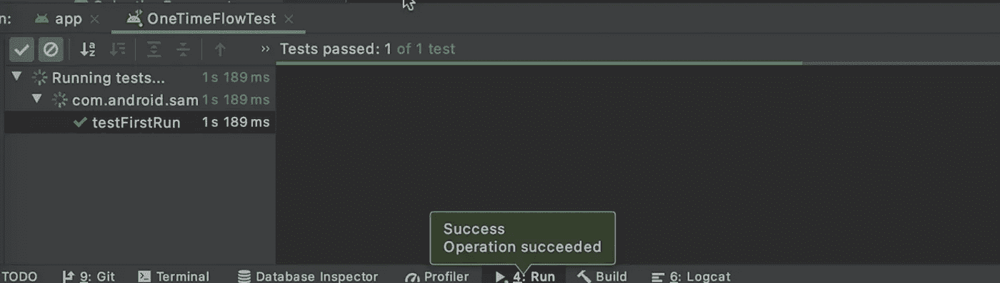

# 导航:条件导航

> 原文：<https://medium.com/androiddevelopers/navigation-conditional-navigation-e82d7e4905f0?source=collection_archive---------4----------------------->


这是导航系列的第二篇文章。如果你更喜欢看这些内容而不是阅读，看看下面的视频:

Conditional Navigation

# 介绍

在上一篇文章中，我使用了`NavigationUI`，在应用程序中实现了底部导航，还添加了一个`SelectionFragment`来启用或禁用咖啡跟踪。然而，无论我们禁用还是启用咖啡跟踪器，用户仍然可以导航到看起来不太正确的`CoffeeList`片段。

在这篇文章中，我将通过添加条件导航并指导用户在第一次启动应用程序时做出选择来解决这个问题。我将使用[数据存储 API](https://developer.android.com/topic/libraries/architecture/datastore) 来保存用户的选择，并使用它来决定在底部导航中显示`coffeeList`目的地。

# 为条件导航准备应用程序

这里是对我自上一篇文章以来所做的[改变](https://github.com/google-developer-training/android-demos/tree/starter/DonutTracker/ConditionalNavigation)的快速回顾。

*   首先，我添加了一个`[UserPreferencesRepository](https://github.com/google-developer-training/android-demos/blob/starter/DonutTracker/ConditionalNavigation/app/src/main/java/com/android/samples/donuttracker/UserPreferencesRepository.kt)`，它使用数据存储 API 来保存用户的选择。
*   为了访问存储库，我对 ViewModelFactories 以及如何构造`[DonutListViewModel](https://github.com/google-developer-training/android-demos/blob/starter/DonutTracker/ConditionalNavigation/app/src/main/java/com/android/samples/donuttracker/donut/DonutListViewModel.kt)`和`[SelectionViewModel](https://github.com/google-developer-training/android-demos/blob/starter/DonutTracker/ConditionalNavigation/app/src/main/java/com/android/samples/donuttracker/setup/SelectionViewModel.kt)`做了一些更改。

如果你想回顾这些变化，你可以在这里查看回购。如果您想继续学习，也可以查看这个回购的代码！

该应用程序现在可以在 3 个不同的状态。

*   `DONUT_ONLY`，表示用户禁用了咖啡跟踪功能
*   `DONUT_AND_COFFEE`，这意味着用户想要跟踪甜甜圈和咖啡的消费
*   `NOT_SELECTED`这意味着用户还没有做出选择，可能是第一次运行应用*或者他们只是很难下定决心*🤷

# 实现条件导航

我将开始在 SelectionFragment 中实现条件导航。首先，我获得了 selectionViewModel 的一个实例，因此我可以访问数据存储。接下来，我观察用户的选择，并使用它来恢复复选框的状态。为了持久化用户的选择，我将通过调用`saveCoffeeTrackerSelection()`来更新复选框被点击时的状态。

```
**val selectionViewModel: SelectionViewModel by viewModels {
    SelectionViewModelFactory(
        UserPreferencesRepository.getInstance(requireContext())
    )
}****selectionViewModel.checkCoffeeTrackerEnabled().observe(
    viewLifecycleOwner
) { selection ->
    if (selection == UserPrefRepository.Selection.DONUT_AND_COFFEE){
        binding.checkBox.isChecked = true
    }
}**binding.button.setOnClickListener { button ->
    **val coffeeSelected = binding.checkBox.isChecked                
    selectionViewModel.saveCoffeeTrackerSelection(coffeeSelected)**
    //...
```

现在是时候用用户的选择来更新底部的选项卡了。如果用户选择禁用咖啡跟踪，底部标签中剩下的唯一选项将是`donutList`，这意味着我们可以安全地删除底部标签。在`MainActivity`中，我添加了一个观察者并更新了底部标签的可见性。为此，我将添加一个观察者，并根据用户选择更新`BottomNavigation`的可见性。

```
private fun setupMenu(
    selection: UserPreferencesRepository.Selection
) {
    val bottomNav = findViewById<BottomNavigationView>(R.id.bottom_nav_view)
    bottomNav.isVisible = when (selection) {
        UserPreferencesRepository.Selection.DONUT_AND_COFFEE -> true
        else -> false
    }
}
```

在 onCreate()中:

```
val selectionViewModel: SelectionViewModel by viewModels {
    SelectionViewModelFactory(
        UserPreferencesRepository.getInstance(this)
    )
}selectionViewModel.checkCoffeeTrackerEnabled().observe(this) { s ->
    setupMenu(s)
}
```

在这种状态下运行应用程序，你会看到启用或禁用咖啡跟踪器会添加或删除应用程序的底部标签。这很棒，但如果我们在用户第一次运行应用程序时自动让他们做出选择，这不是很好吗？

`DonutList`是默认片段，也是我们的开始目的地，这意味着应用程序总是以`DonutList`开始，我检查用户之前是否做了选择，如果没有，则触发导航到`SelectionFragment`。

```
donutListViewModel.isFirstRun().observe(viewLifecycleOwner) { s ->
    if (s == UserPreferencesRepository.Selection.NOT_SELECTED) {
        val navController = findNavController()
        navController.navigate(
            DonutListDirections.actionDonutListToSelectionFragment()
        )
    }
}
```

在我测试之前，我从设备上卸载了应用程序，这样我就可以确定没有保存我之前运行的偏好设置。现在，当我运行应用程序时，它会将我带到`selectionFragment`。以后启动该应用程序时，它会记住我所做的选择，并引导我到达正确的起始目的地。

就是这样！我们在甜甜圈跟踪器应用程序中添加了条件导航。但是我们如何测试这个流程呢？每次运行测试之前删除应用程序或应用程序数据并不理想。这就是测试拯救的地方！

# 测试导航

我在 androidTestFolder 中创建了一个名为`OneTimeFlowTest`的新测试。然后我创建一个名为`testFirstRun()`的测试，并用`@Test`对其进行注释。现在我可以开始实现测试了。首先我通过使用`applicationContext`创建一个`TestNavHostController()` 。我还将应用程序中的`nav_graph`设置为我刚刚创建的`testNavigationController`实例。

```
@Test
fun testFirstRun() {
    // Create a mock NavController
    val mockNavController = TestNavHostController(
        ApplicationProvider.getApplicationContext()
    ) mockNavController.setGraph(R.navigation.nav_graph) //...
}
```

`mockNavigationController`已经可以使用了。是时候创建场景了。为此，我用`DonutList`片段启动应用程序，并设置我之前创建的`mockNavigationController`实例。然后检查 app 是否如预期自动导航到`selectionFragment`。

```
val scenario = launchFragmentInContainer {
    DonutList().also { fragment ->
        fragment.viewLifecycleOwnerLiveData.observeForever{   
            viewLifecycleOwner ->
            if (viewLifecycleOwner != null){
                Navigation.setViewNavController(
                    fragment.requireView(), 
                    mockNavController
                )
            }
        }
    }
}scenario.onFragment {
    assertThat(
        mockNavController.currentDestination?.id
    ).isEqualTo(R.id.selectionFragment)
}
```

现在我运行测试并等待结果…测试成功通过了！*或者井可能只是绿色的*。



Testing Navigation

# 摘要

在本文中，我在 DonutTracker 应用程序中添加了条件导航，还添加了一个测试来验证流程是否有效！你可以点击查看解决方案代码[。](https://github.com/google-developer-training/android-demos/tree/main/DonutTracker/ConditionalNavigation)

通过条件导航，甜甜圈追踪器应用程序将在用户第一次启动应用程序时触发一次性流程，将用户带到选择片段。如果用户选择禁用咖啡跟踪器，应用程序会从导航菜单中移除`coffeeList`。

这样，咖啡跟踪器的功能就完成了！在接下来的文章中，我们将学习如何使用嵌套图和模块化这个应用程序。