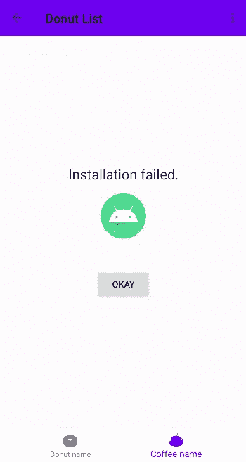
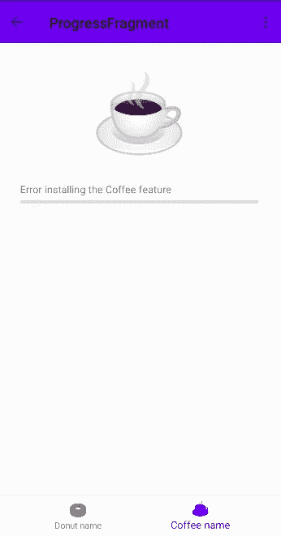

# 功能模块中的导航

> 原文：<https://medium.com/androiddevelopers/navigation-in-feature-modules-322ac3d79334?source=collection_archive---------7----------------------->


欢迎阅读关于导航的第二个 MAD 技能系列的另一篇文章！如果你更喜欢视频形式的内容，可以看看下面的内容:

Navigation in Feature Modules video

# 介绍

在上一篇文章中，您学习了如何在多模块项目中使用导航。在本文中，我们将更进一步，将 coffee 模块转换为特性模块。如果你不熟悉功能模块，你可能想先看看这个视频。

App Bundles

功能模块不会在安装时下载，而是仅在应用程序请求时下载。这节省了下载和安装的时间和带宽，以及设备存储。

因此，让我们为用户节省一些字节！让我们开始编码吧！

# 功能模块

因为我在上一篇文章中已经模块化了甜甜圈跟踪器应用程序，所以我将从将现有的 coffee 模块转换为 feature 模块开始。如果你想继续下去，你可以从这个报告中查看启动代码。

首先，我用 coffee 模块的`build.gradle`中的动态特性插件替换了库插件。

```
id 'com.android.dynamic-feature'
```

接下来，我在`androidmanifest.xml`中将 coffee 模块声明为按需模块。

```
<?xml version="1.0" encoding="utf-8"?>
<manifest xmlns:android="http://schemas.android.com/apk/res/android"
    xmlns:dist="http://schemas.android.com/apk/distribution"
    package="com.android.samples.donuttracker.coffee">
    **<dist:module
        dist:instant="false"
        dist:title="@string/title_coffee">
        <dist:delivery>
            <dist:on-demand />
        </dist:delivery>
        <dist:fusing dist:include="true" />
    </dist:module>**
</manifest>
```

既然 coffee 模块已经被转换，我将这个模块添加为一个`dynamicFeature`。

```
android {
    //...

    packagingOptions **{** exclude 'META-INF/atomicfu.kotlin_module'
    **}

    dynamicFeatures = [':coffee']**

**}**
```

我还从应用程序`build.gradle`的依赖项列表中删除了 coffee 模块，并添加了导航动态特性依赖项。

```
implementation "androidx.navigation:navigation-dynamic-features-fragment:$navigationVersion"
```

一旦 gradle 同步完成，就该更新导航图了。我将 include 标签改为`include-dynamic`，添加一个`id`、`graphResName`和指向特性模块的`moduleName`。

```
<include-dynamic
    android:id="@+id/coffeeGraph"
    app:moduleName="coffee"
    app:graphResName="coffee_graph"/>
```

此时，我可以安全地从`coffee_graph.xml`中移除`id`属性，因为动态导航库忽略了所包含图形的根元素中的`id`属性。

```
<navigation xmlns:android="[http://schemas.android.com/apk/res/android](http://schemas.android.com/apk/res/android)"
    xmlns:app="[http://schemas.android.com/apk/res-auto](http://schemas.android.com/apk/res-auto)"
    xmlns:tools="[http://schemas.android.com/tools](http://schemas.android.com/tools)"
    app:startDestination="[@id/coffeeList](http://twitter.com/id/coffeeList)">
    <fragment
        android:id="@+id/coffeeList"
        android:name="com.android.samples.donuttracker.coffee.CoffeeList"
        android:label="[@string/coffee_list](http://twitter.com/string/coffee_list)">
        <action
            android:id="@+id/action_coffeeList_to_coffeeEntryDialogFragment"
            app:destination="[@id/coffeeEntryDialogFragment](http://twitter.com/id/coffeeEntryDialogFragment)" />
    </fragment>
    <dialog
        android:id="@+id/coffeeEntryDialogFragment"
        android:name="com.android.samples.donuttracker.coffee.CoffeeEntryDialogFragment"
        android:label="CoffeeEntryDialogFragment">
        <argument
            android:name="itemId"
            android:defaultValue="-1L"
            app:argType="long" />
    </dialog>
</navigation>
```

在`activity_main`布局中，我将`FragmentContainerView`的`name`从`NavHostFragment`改为`DynamicNavHostFragment`。

```
<androidx.fragment.app.FragmentContainerView
        android:id="@+id/nav_host_fragment"
        android:name="**androidx.navigation.dynamicfeatures.fragment.DynamicNavHostFragment**"
        android:layout_width="match_parent"
        android:layout_height="0dp"
        android:layout_weight="1"
        app:defaultNavHost="true"
        app:navGraph="[@navigation/nav_graph](http://twitter.com/navigation/nav_graph)" />
```

类似于包含图，为了使动态包含工作，咖啡的菜单项`id`需要匹配图名，而不是目的地`id`。

```
<menu xmlns:android="[http://schemas.android.com/apk/res/android](http://schemas.android.com/apk/res/android)">
    <item
        android:id="[@id/donutList](http://twitter.com/id/donutList)"
        android:icon="[@drawable/donut_with_sprinkles](http://twitter.com/drawable/donut_with_sprinkles)"
        android:title="[@string/donut_name](http://twitter.com/string/donut_name)" />
    <item
        **android:id="**[**@id/coffeeGraph**](http://twitter.com/id/coffeeGraph)**"**
        android:icon="[@drawable/coffee_cup](http://twitter.com/drawable/coffee_cup)"
        android:title="[@string/coffee_name](http://twitter.com/string/coffee_name)" />
</menu>
```

这是我添加动态导航所需要做的一切。现在我将使用 bundletool 来测试特性模块。您还可以使用播放控制台来测试功能模块。如果您想了解更多关于如何使用 bundletool 和 Play Console 来测试功能模块安装的信息，您可能想看看下面的视频。

bundletool video

我还想测试如果模块不能安装会发生什么。为此，我从运行/调试配置中要部署的模块列表中取消选择`donuttracker.coffee` 。现在，当我运行应用程序并导航到`coffeeList`时。将显示一般错误消息。



generic error message

既然功能模块设置已经完成，是时候改善用户体验了。在下载功能模块时给用户定制的反馈，或者显示一个更有意义的错误信息而不是一般的错误信息，这不是很好吗？

为此，我可以添加一个监视器来处理安装状态、进度变化或错误，同时用户保持在同一个屏幕上。或者，我可以添加一个定制的进度片段，在下载功能模块时显示进度。

导航内置了对[进度片段](https://developer.android.com/guide/navigation/navigation-dynamic)的支持。我需要做的就是创建一个扩展 AbstractProgressFragment 的新片段。

```
class ProgressFragment : AbstractProgressFragment(R.layout.fragment_progress) {}
```

我添加了一个`ImageView`、一个`TextView`和一个`ProgressBar`来显示下载状态。

```
<LinearLayout xmlns:android="[http://schemas.android.com/apk/res/android](http://schemas.android.com/apk/res/android)"
    xmlns:tools="[http://schemas.android.com/tools](http://schemas.android.com/tools)"
    android:layout_width="match_parent"
    android:layout_height="match_parent"
    android:orientation="vertical"
    android:paddingLeft="[@dimen/default_margin](http://twitter.com/dimen/default_margin)"
    android:paddingTop="[@dimen/default_margin](http://twitter.com/dimen/default_margin)"
    android:paddingRight="[@dimen/default_margin](http://twitter.com/dimen/default_margin)"
    android:paddingBottom="[@dimen/default_margin](http://twitter.com/dimen/default_margin)"> **<ImageView
        android:id="@+id/progressImage"
        android:layout_width="wrap_content"
        android:layout_height="wrap_content"
        android:src="**[**@drawable/coffee_cup**](http://twitter.com/drawable/coffee_cup)**"
        android:layout_marginBottom="**[**@dimen/default_margin**](http://twitter.com/dimen/default_margin)**"
        android:layout_gravity="center"/>** **<TextView
        android:id="@+id/message"
        android:layout_width="wrap_content"
        android:layout_height="wrap_content"
        tools:text="**[**@string/installing_coffee_module**](http://twitter.com/string/installing_coffee_module)**"/>** **<ProgressBar
        android:id="@+id/progressBar"
        style="**[**@style/Widget**](http://twitter.com/style/Widget)**.AppCompat.ProgressBar.Horizontal"
        android:layout_width="match_parent"
        android:layout_height="wrap_content"
        tools:progress="10" />**</LinearLayout>
```

接下来，我覆盖了`onProgress()`函数来更新`progressBar`。我还覆盖了`onFailed()`和`onCanceled()`函数，并更新了`textView`来给用户一些反馈。

```
override fun onProgress(status: Int, bytesDownloaded: Long, bytesTotal: Long) {
    progressBar?.*progress* = (bytesDownloaded.toDouble() * 100 / bytesTotal).toInt()
}

override fun onFailed(errorCode: Int) {
    message?.*text* = getString(R.string.*install_failed*)
}

override fun onCancelled() {
    message?.*text* = getString(R.string.*install_cancelled*)
}
```

我需要将`progressFragment`目的地添加到导航图中。最后，将`progressFragment`声明为导航图的`progressDestination`。

```
<navigation xmlns:android="[http://schemas.android.com/apk/res/android](http://schemas.android.com/apk/res/android)"
    xmlns:app="[http://schemas.android.com/apk/res-auto](http://schemas.android.com/apk/res-auto)"
    xmlns:tools="[http://schemas.android.com/tools](http://schemas.android.com/tools)"
    app:startDestination="[@id/donutList](http://twitter.com/id/donutList)"
    **app:progressDestination="@+id/progressFragment"**><fragment
        android:id="@+id/donutList"
        android:name="com.android.samples.donuttracker.donut.DonutList"
        android:label="[@string/donut_list](http://twitter.com/string/donut_list)" >
        <action
            android:id="@+id/action_donutList_to_donutEntryDialogFragment"
            app:destination="[@id/donutEntryDialogFragment](http://twitter.com/id/donutEntryDialogFragment)" />
        <action
            android:id="@+id/action_donutList_to_selectionFragment"
            app:destination="[@id/selectionFragment](http://twitter.com/id/selectionFragment)" />
    </fragment>
    <dialog
        android:id="@+id/donutEntryDialogFragment"
        android:name="com.android.samples.donuttracker.donut.DonutEntryDialogFragment"
        android:label="DonutEntryDialogFragment">
        <deepLink app:uri="myapp://navdonutcreator.com/donutcreator" />
        <argument
            android:name="itemId"
            app:argType="long"
            android:defaultValue="-1L" />
    </dialog>
    <fragment
        android:id="@+id/selectionFragment"
        android:name="com.android.samples.donuttracker.setup.SelectionFragment"
        android:label="[@string/settings](http://twitter.com/string/settings)"
        tools:layout="[@layout/fragment_selection](http://twitter.com/layout/fragment_selection)" >
        <action
            android:id="@+id/action_selectionFragment_to_donutList"
            app:destination="[@id/donutList](http://twitter.com/id/donutList)" />
    </fragment>
    **<fragment
        android:id="@+id/progressFragment"
        android:name="com.android.samples.donuttracker.ProgressFragment"
        android:label="ProgressFragment" />**
    <include-dynamic
        android:id="@+id/coffeeGraph"
        app:moduleName="coffee"
        app:graphResName="coffee_graph"/>
</navigation>
```

现在，我再次运行应用程序，取消选择咖啡并导航至`coffeeList`。这次 app 显示的是定制的`progressFragment`。



customized `progressFragment`

同样，我可以用捆绑工具测试应用程序，看看进度条在下载咖啡模块时是如何工作的。你可以从[这个报告](https://github.com/google-developer-training/android-demos/tree/main/DonutTracker/FeatureModules)中查看示例代码。

# 摘要

仅此而已！在这个系列中，我们重新访问了 Chet 的 DonutTracker 应用程序，并添加了咖啡跟踪功能。因为…我喜欢咖啡。

新的功能带来了新的责任。为了提供更好的用户体验，首先我添加了`NavigationUI`来集成 UI 组件和导航。然后我实现了一次性流程和条件导航。后来，我使用嵌套图和包含标签来组织导航图，并将应用程序模块化，以节省用户的网络和存储空间。现在我们已经完成了应用程序，是时候享受一杯咖啡和一个甜甜圈了！