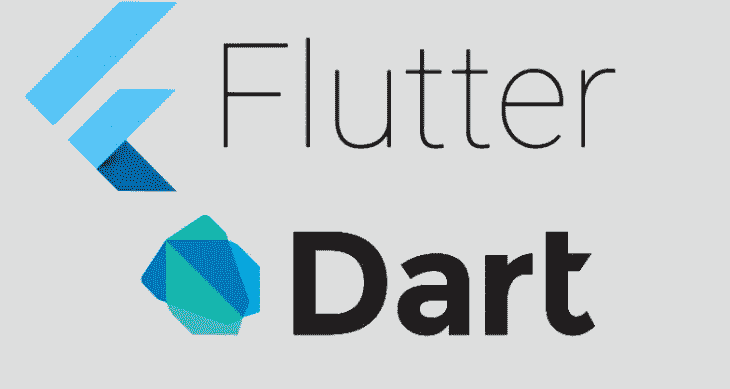

# 颤动:导航

> 原文：<https://medium.com/globant/navigation-in-flutter-application-7cac0ce8ef34?source=collection_archive---------0----------------------->



# 如何在 Flutter 应用中导航？

*   在 Flutter 中，屏幕和页面被称为路由。
*   我创建了两个类**第一屏**和**第二屏**，这两个类都扩展了**无状态控件**。

```
class FirstScreen extends StatelessWidget {
  @override
  Widget build(BuildContext context) {
    return Scaffold(
      appBar: AppBar(
        title: Text('First Screen'),
      ),
      body: Center(
        child: RaisedButton(
          child: Text('Press to move second screen !!'),
           );
          },
        ),
      ),
    );
  }
}class SecondScreen extends StatelessWidget {
  @override
  Widget build(BuildContext context) {
    return Scaffold(
      appBar: AppBar(
        title: Text("Second Screen"),
      ),
      body: Center(
        child: RaisedButton(
          child: Text('Go back'),
        ),
      ),
    );
  }
}
```

*   在 **FirstScreen** 类中我使用了 **RaisedButton()** ，其中我必须使用**material page route(builder:(context)=>second screen())，)；**
*   按下带有文本"**的按钮，移动第二个屏幕！！**“在第一个屏幕上 onPressed()方法将得到执行推送操作的调用。
*   push()方法将路由添加到由导航器管理的路由堆栈中。
*   用户将被导航到第二个屏幕，标题为“第二个屏幕”，按钮上有文本“**返回**”。

```
class FirstScreen extends StatelessWidget {
  @override
  Widget build(BuildContext context) {
    return Scaffold(
      appBar: AppBar(
        title: Text('First Screen'),
      ),
      body: Center(
        child: RaisedButton(
          child: Text('Press to move second screen !!'),
          onPressed: () {
            Navigator.*push*(
              context,
              MaterialPageRoute(builder: (context) => SecondScreen()),
            );
          },
        ),
      ),
    );
  }
}
```

*   现在，要返回第一个屏幕，我们必须在 SecondScreen 类中使用。

```
class SecondScreen extends StatelessWidget {
  @override
  Widget build(BuildContext context) {
    return Scaffold(
      appBar: AppBar(
        title: Text("Second Screen"),
      ),
      body: Center(
        child: RaisedButton(
          onPressed: () {
            Navigator.*pop*(context);
          },
          child: Text('Go back'),
        ),
      ),
    );
  }
}
```

*   pop()方法从导航器管理的路线堆栈中删除当前路线。

快乐阅读:)