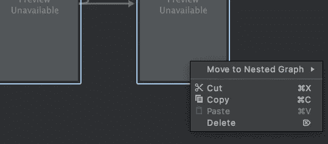
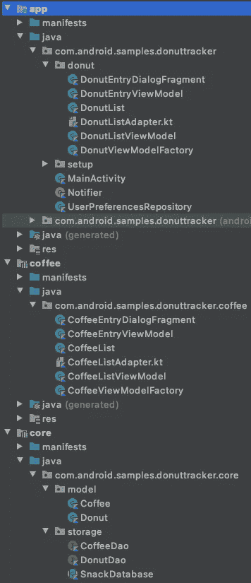
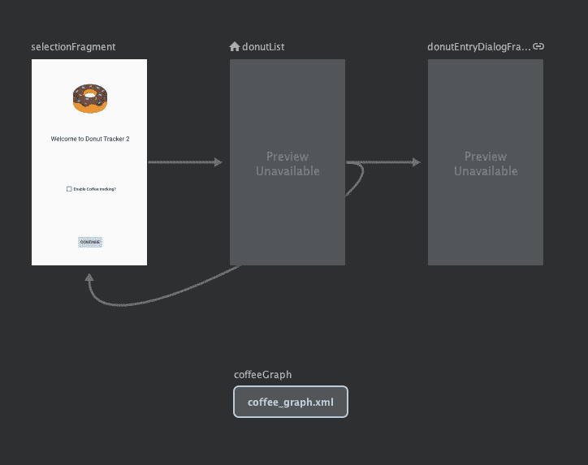

# 导航:嵌套图形和包含标签

> 原文：<https://medium.com/androiddevelopers/navigation-nested-graphs-and-include-tag-92fd62739b73?source=collection_archive---------3----------------------->


这是第二个导航系列的第三篇文章。如果你更喜欢看这些内容而不是阅读，看看下面的视频:

# 介绍

在本系列的前几篇文章中，我们添加了 coffee tracker 功能，增强了导航 UI 的用户体验，并实现了条件导航。这次我们将看到如何通过使用嵌套图和使用 include 标签导入其他图来组织导航图。这将允许我们模块化应用程序，并查看导航如何与模块一起工作。
现在启动 Android Studio，看看如何使用导航模块。

# 嵌套导航图

让我们从导航图开始。嵌套图可以帮助您在父导航图中对一系列目的地进行分组。
查看导航图，coffeeList 和 coffeeEntryDialog 目的地是转换成嵌套图的好选择。为此，我按住 shift 键选择两个片段，并选择 move to nested graph。



Move coffeeList and coffeeEntryDialogFragment to a nested graph

现在，切换到代码视图，您可以看到嵌套图只是根图中的一个新的导航图。

```
<navigation xmlns:android="http://schemas.android.com/apk/res/android"
    xmlns:app="http://schemas.android.com/apk/res-auto"
    xmlns:tools="http://schemas.android.com/tools"
    app:startDestination="@id/donutList">

    <fragment
        android:id="@+id/donutList"
        android:name="com.android.samples.donuttracker.donut.DonutList"
        android:label="@string/donut_list" >
        <action
            android:id="@+id/action_donutList_to_donutEntryDialogFragment"
            app:destination="@id/donutEntryDialogFragment" />
        <action
            android:id="@+id/action_donutList_to_selectionFragment"
            app:destination="@id/selectionFragment" />
    </fragment>
    <dialog
        android:id="@+id/donutEntryDialogFragment"
        android:name="com.android.samples.donuttracker.donut.DonutEntryDialogFragment"
        android:label="DonutEntryDialogFragment">
        <deepLink app:uri="myapp://navdonutcreator.com/donutcreator" />
        <argument
            android:name="itemId"
            app:argType="long"
            android:defaultValue="-1L" />
    </dialog>
    <fragment
        android:id="@+id/selectionFragment"
        android:name="com.android.samples.donuttracker.setup.SelectionFragment"
        android:label="@string/settings"
        tools:layout="@layout/fragment_selection" >
        <action
            android:id="@+id/action_selectionFragment_to_donutList"
            app:destination="@id/donutList" />
    </fragment>
 **<navigation
        android:id="@+id/coffeeGraph"
        app:startDestination="@id/coffeeList">
        <fragment
            android:id="@+id/coffeeList"
            android:name="com.android.samples.donuttracker.coffee.CoffeeList"
            android:label="@string/coffee_list">
            <action
                android:id="@+id/action_coffeeList_to_coffeeEntryDialogFragment"
                app:destination="@id/coffeeEntryDialogFragment" />
        </fragment>
        <dialog
            android:id="@+id/coffeeEntryDialogFragment"
            android:name="com.android.samples.donuttracker.coffee.CoffeeEntryDialogFragment"
            android:label="CoffeeEntryDialogFragment">
            <argument
                android:name="itemId"
                android:defaultValue="-1L"
                app:argType="long" />
        </dialog>
    </navigation>**
</navigation>
```

所选片段之间的导航被移动到嵌套图中。
嵌套图形必须有一个 id。您可以使用此 id 创建操作来导航到嵌套图，但不能直接导航到其子目标。嵌套图有自己的开始目标，不会单独显示其子目标。

```
<navigation
    **android:id="@+id/coffeeGraph"**
    app:startDestination="@id/coffeeList">
```

如果您双击嵌套图，那么您可以看到嵌套的目的地和它们之间的动作。

# 包括标签

除了使用嵌套图，我还可以将图提取到一个新的导航 xml 文件中。我创建了一个名为 coffee_graph 的新 xml 文件，并将嵌套图的内容移动到这个新文件中。

```
<navigation xmlns:android="http://schemas.android.com/apk/res/android"
    xmlns:app="http://schemas.android.com/apk/res-auto"
    xmlns:tools="http://schemas.android.com/tools"
    android:id="@+id/coffeeGraph"
    app:startDestination="@id/coffeeList">
    <fragment
        android:id="@+id/coffeeList"
        android:name="com.android.samples.donuttracker.coffee.CoffeeList"
        android:label="@string/coffee_list">
        <action
            android:id="@+id/action_coffeeList_to_coffeeEntryDialogFragment"
            app:destination="@id/coffeeEntryDialogFragment" />
    </fragment>
    <dialog
        android:id="@+id/coffeeEntryDialogFragment"
        android:name="com.android.samples.donuttracker.coffee.CoffeeEntryDialogFragment"
        android:label="CoffeeEntryDialogFragment">
        <argument
            android:name="itemId"
            android:defaultValue="-1L"
            app:argType="long" />
    </dialog>
</navigation>
```

我可以使用 include 标记将这个新图嵌套在另一个图中。使用 include 标签提供了与嵌套图形相同的功能，但是允许您使用来自其他模块或库的图形。

```
<include app:graph="@navigation/coffee_graph"/>
```

与嵌套图类似，包含图不显示包含图中的目的地列表，这意味着我需要更新引用 coffeeList 的菜单 id。

```
<item
    android:id="@id/coffeeGraph"
    android:icon="@drawable/coffee_cup"
    android:title="@string/coffee_name" />
```

我更新菜单以使用包含的图形的 id。因为 CoffeeList 是包含图的 startDestination，所以我可以使用图 id 来导航到这个图。如果你现在试用这个应用程序，一切都应该和以前一样正常。现在，咖啡追踪的导航图是独立的，这是模块化应用程序的好时机，看看导航如何与模块一起工作。
如果你想跟进，你可以查看一下[这个回购](https://github.com/google-developer-training/android-demos/tree/starter/DonutTracker/NestedGraphs_Include)，里面有我到目前为止做的所有修改。
我创建了两个新模块:核心和咖啡。我将所有常见的类(如 Donut、Coffee、DAOs、Database 和其他常见资源)移到核心模块中。
接下来，我将 coffee 跟踪中使用的所有片段、视图模型和适配器类移动到 coffee 模块中。coffee tracking 中使用的布局和其他资源也被移到这里，还有 coffee_graph。



Existing classes and resources are moved to core and coffee modules

咖啡模块取决于核心模块。

```
dependencies **{** implementation project(":core")
    //...
}
```

最后，在 app 模块中，添加咖啡和核心模块作为依赖。

```
dependencies **{** implementation project(":coffee")
    implementation project(":core")
    //..}
```

请注意，导航图中没有任何变化；它不受这些变化的影响



No changes in the navigation graph

现在，如果我运行应用程序，一切都像以前一样工作，但使用模块代替！你可以在这里查看最终代码。

随着这一变化，我将咖啡跟踪器模块及其导航流程与应用程序的其余部分分离开来，这意味着咖啡跟踪器模块可以独立于甜甜圈跟踪器使用。

# 摘要

在本文中，我们已经看到了如何创建嵌套图，以及如何使用 include 标签来模块化 donut tracker 应用程序。

在下一篇文章中，我们将更进一步，并学习如何使用功能模块导航。敬请期待！