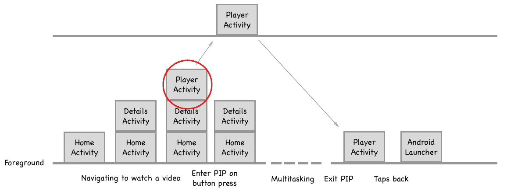

# 带画中画的导航模式

> 原文：<https://medium.com/androiddevelopers/navigation-patterns-with-pip-2c5b6a446ba0?source=collection_archive---------1----------------------->

## 处理后堆栈

本文研究了从画中画(PIP)窗口恢复到全屏时如何处理导航模式。关于 PIP 的概述以及如何在你的应用中实现它，请查看我的[上一篇文章](/google-developers/making-magic-moments-with-picture-in-picture-e02964bf75ae)。

[](/google-developers/making-magic-moments-with-picture-in-picture-e02964bf75ae) [## 用画中画创造神奇时刻

### 匹普，匹普，万岁

medium.com](/google-developers/making-magic-moments-with-picture-in-picture-e02964bf75ae) 

**从一个活动进入** PIP 模式很容易；就**叫** `enterPictureInPicture`。根据应用的架构，让用户在进入 PIP 后回到你的应用可能是一个挑战。

# 问题是

假设用户想要观看视频，并且在观看视频的同时，他们想要查看他们的日历。很容易进入视频画中画模式，使用户可以多任务。当他们检查完日历并将视频恢复到全屏时，可能会出现问题。

> 当用户点击从恢复的全屏视频返回到应用程序时，应用程序可能会意外退出。

# 为什么会这样？

进入 PIP 模式后，Android 只将 PIP 活动转移到新任务中。如果用户在将画中画窗口恢复到全屏并轻按“返回”后仍留在您的应用程序中，这可能会是一个问题。为了实现这一点，应用程序必须重新创建后台堆栈。我们将在后面的小节中研究如何知道何时重新创建后台堆栈。

比如你想在一个 app 里看一个视频。你打开应用程序，查看 HomeActivity。在主页活动中，您可以查看视频的详细信息，然后转到详细信息活动。在决定观看视频后，您开始启动 PlayerActivity 的视频。现在筹码已经有三倍深了。你按下 home 键，回到 Android 的启动器，启动另一个应用程序，这样你就可以在视频继续播放的同时进行多任务处理。你完成你的多任务并关闭另一个应用程序。当您将 PIP 窗口恢复为全屏时，back-stack 将会丢失。如果你点击返回，你会看到另一个应用程序。下图描述了该示例的时间线。


如果应用程序提供了一个进入画中画模式的按钮，那么 DetailsActivity 将保持在前台。



因为 PIP 活动被移动到它自己的任务中，所以你将能够在视频播放的同时留在应用程序中继续浏览。


这解释了为什么在最近的应用程序中有两个你的应用程序的实例。


如果只有一个活动，那么它将留在当前任务中。

让我们看看前面的例子，但不是每个函数的活动，而是每个函数的片段。由于片段管理器在应用内部处理后台堆栈，我们将有不同的行为。随着你深入应用程序，更多的片段被添加，但它只是一个活动。该活动将被移动到一个新的任务中，但是由于片段包含在活动中，所以导航被保留。


# 你能做什么？

根据应用程序的架构，可能会自动重新创建后台堆栈。例如，如果你的应用是用片段构建的，片段管理器管理后台栈，而不是框架。由于框架是在活动层分裂出来的，所以片段管理器和你的片段是 ***而不是*** 丢失的。

如果你的应用程序对每个函数都有一个活动，那么你需要跟踪后台栈何时丢失，并在用户离开你的活动时重新创建后台栈。

你可以覆盖`onPictureInPictureModeChanged()`来找出后备栈何时丢失。

```
boolean mBackstackLost = false;@Override
public void onPictureInPictureModeChanged (
        boolean isInPictureInPictureMode, Configuration newConfig) {
    if (! isInPictureInPictureMode) {
        mBackstackLost = true;
        // Restore the full-screen UI.
        ...
    }
}
```

一旦捕获到后备栈丢失，您可以在离开活动时覆盖`finish()`来重新创建后备栈。

```
@Override
public void finish () {
    if( mBackstackLost ){
        finishAndRemoveTask();
        startActivity(
            Intent.makeRestartActivityTask(
                new ComponentName(this, MockHomeActivity.class)));
    } else {
        super.finish();
    }
}
```

如果 PIP 活动有多个入口点，那么重新创建 back-stack 可能会很棘手。例如，用户可以从您的家庭活动开始观看视频，或者他们可以在观看之前搜索和查看详细信息。那么，当他们点击返回时，他们应该在哪里结束呢？家庭活动？细节活动？


*Potential flows for an application to watch a video.*

如果你的应用程序目前没有跟踪用户的路径，那么你可以强迫用户登陆一个特定的活动，不管他们来自哪里。例如，Google Play 电影会将用户返回到 home 活动，而不管用户是如何找到 watcher 活动的。

# 谢谢你

我要感谢 Ryan Johnstone 提出这个问题。希望这篇文章能帮助你和其他人构建更好的应用。


# 测试行为

我编写了一个示例，演示了一个具有深度后台堆栈的应用程序在进入 PIP 模式时的不同行为。可以在 github 上下载[源码自己玩。](https://github.com/benbaxter/pip-navigation)

我们希望听到您的反馈！如果您想继续讨论，请在 [Twitter](https://twitter.com/benjamintravels) 上留下您的回复或与我交谈。