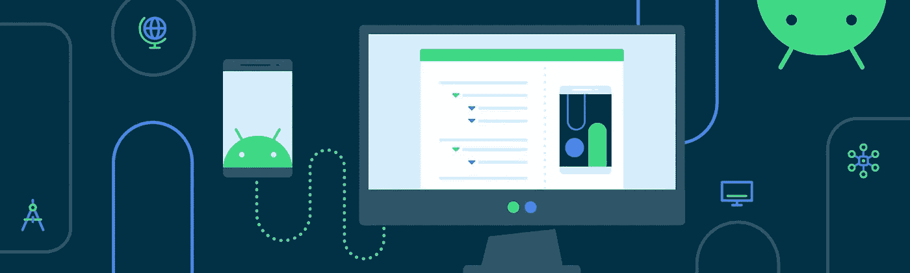
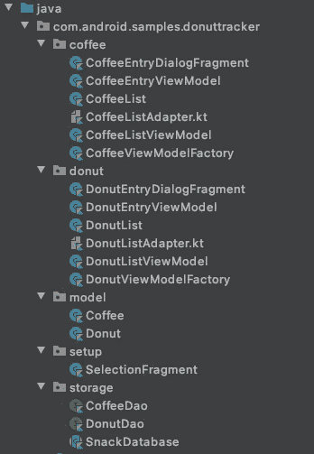
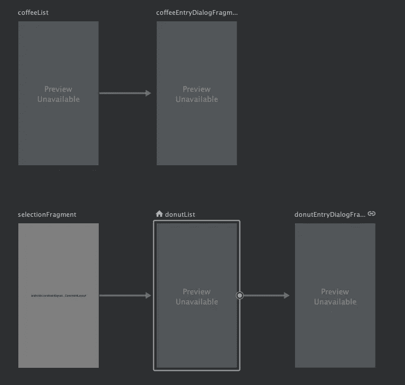
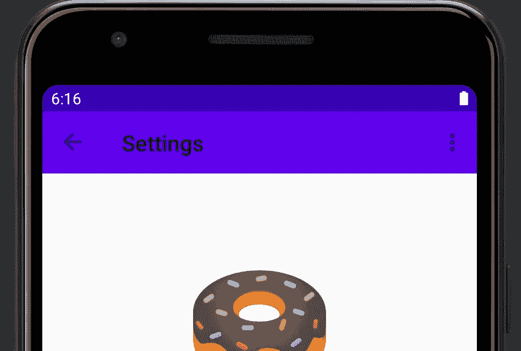
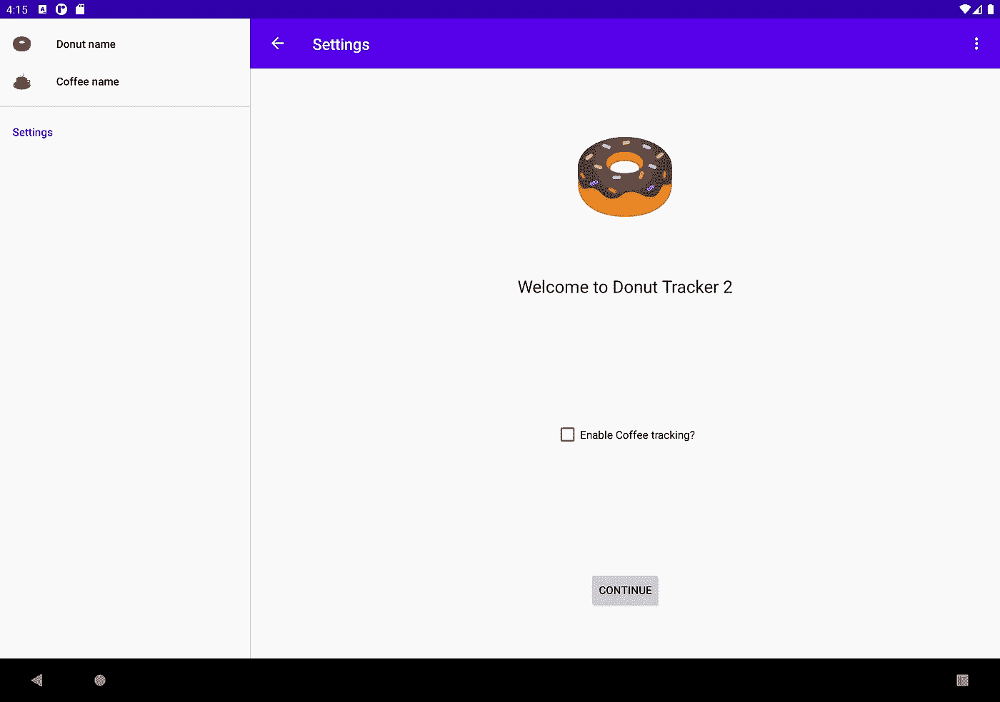

# 导航 UI

> 原文：<https://medium.com/androiddevelopers/navigationui-d21fd4f5c318?source=collection_archive---------1----------------------->



这是关于导航的第二篇 MAD 技巧系列文章。在本文中，我们将看看另一个用例，其中 UI 组件，如操作栏、底部标签或抽屉，用于在应用程序的不同部分之间导航。如果您喜欢以视频格式观看这些内容，请点击此处查看:

# 介绍

在之前的[导航系列](/androiddevelopers/navigation-component-an-overview-4697a208c2b5)中， [Chet](https://chethaase.medium.com/) 开发了一款[追踪甜甜圈的 app](https://github.com/android/architecture-components-samples/tree/main/MADSkillsNavigationSample)。但是甜甜圈配什么好呢？*(除了第二个甜甜圈)*:咖啡！所以我决定增加追踪咖啡的功能。

我需要在应用程序中添加更多的目的地，所以添加导航抽屉或底部标签来帮助用户导航可能是个好主意。但是我们如何将导航与这些 UI 组件集成在一起呢？通过点击监听器来手动触发导航动作？

不要！不需要监听器。相反，`NavigationUI` class 可以通过匹配目的地和菜单 id 来帮助您在不同目的地之间导航。让我们深入研究一下，看看它是如何工作的。

# 添加咖啡跟踪器



project structure

为了添加这个特性，我将与 donut 相关的类复制到一个新的包中，并重命名它们。对于真正的应用程序来说，这可能不是最好的方法，但可以帮助我们快速将咖啡跟踪功能添加到现有的应用程序中。如果你想跟进，你可以查看一下[这个回购](https://github.com/google-developer-training/android-demos/tree/starter)，它包含了从`NavigationUI`开始甜甜圈追踪器应用程序的所有变化。

有了这些改变，我也用从`coffeeFragment`到`coffeeDialogFragment`和从`selectionFragment`到`donutFragment`的新目的地和行动更新了导航图。我稍后将使用这些目的地 id；)



Navigation graph with the new destinations

随着导航图的更新，我们可以开始把事情联系在一起，并启用导航到`SelectionFragment`！

# 选项菜单

该应用程序目前有一个选项菜单，什么也不做。为了让它做点什么，在`onOptionsItemSelected()`函数中，我需要为选中的菜单项调用`onNavDestinationSelected()`，并传入`navController`。只要目的地和`MenuItem`T5 匹配，该功能将导航到与给定`MenuItem`相关的目的地。

```
override fun onOptionsItemSelected(item: MenuItem): Boolean {
    return item.onNavDestinationSelected(
        findNavController(R.id.nav_host_fragment)
    ) || super.onOptionsItemSelected(item)
}
```

现在导航控制器知道了菜单项，我将`MenuItem` `id`与我之前创建的目的地`id`相匹配。有了这个，导航系统就能够将`MenuItem`与目的地对应起来。

```
<menu xmlns:android="http://schemas.android.com/apk/res/android"
    xmlns:app="http://schemas.android.com/apk/res-auto"
    xmlns:tools="http://schemas.android.com/tools"
    tools:context="com.android.samples.donuttracker.MainActivity">
    <item
        android:id="**@+id/selectionFragment**"
        android:orderInCategory="100"
        android:title="@string/action_settings"
        app:showAsAction="never" />
</menu>
```

# 工具栏

应用程序现在导航到`selectionFragment`，但标题保持不变。我们希望标题更新，并显示一个后退按钮，当我们在`selectionFragment`。

首先我需要添加一个`AppBarConfiguration`对象，由`NavigationUI`用来管理应用程序左上角的导航按钮的行为。

```
appBarConfiguration = AppBarConfiguration(navController.graph)
```

此按钮根据您的目的地级别改变行为。例如，当您位于顶层目的地时，因为没有更高层目的地，所以不会显示向上按钮。

> 默认情况下，应用程序的起始目的地是唯一的顶级目的地，但您可以定义多个顶级目的地。例如，在我们的应用程序中，我可以将`donutList`和`coffeeList`目的地添加为顶级目的地。

接下来，我转到`MainActivity`类，获取`navController`和`toolbar`的实例，并验证是否调用了`setSupportActionBar()`函数。我还更新了传递给这个函数的工具栏引用。

```
val navHostFragment = supportFragmentManager.findFragmentById(
    R.id.nav_host_fragment
) as NavHostFragmentnavController = navHostFragment.navController
val toolbar = binding.toolbar
```

为了给默认动作栏添加导航支持，我调用了`setupActionBarWithNavController()`函数。这个函数需要两个参数，`navController`和`appBarConfiguration`。

```
setSupportActionBar(toolbar)
setupActionBarWithNavController(navController, appBarConfiguration)
```

接下来，我覆盖了`onSupportNavigationUp()`函数，并在`nav_host_fragment`上用`appBarConfiguration`调用`navigateUp()`来支持向上导航或显示菜单图标，这取决于当前的目的地。

```
override fun onSupportNavigateUp(): Boolean {
    return findNavController(R.id.nav_host_fragment).navigateUp(
        **appBarConfiguration**
    )
}
```

现在我导航到`selectionFragment`，你可以看到标签被更新，并显示后退按钮，这将让我们的用户回到他们来的地方。



Title is updated and the back button is displayed

# 底部标签

到目前为止，这看起来还不错，但是应用程序没有办法导航到`coffeeList`片段。接下来我会解决这个问题！

我将从添加底部标签开始。为此，我添加了`bottom_nav_menu.xml`并声明了两个菜单项。`NavigationUI`依靠`MenuItem`T5 来匹配导航图中的目的地`id`。我还为每个目的地设置了图标和标题。

```
<menu xmlns:android="http://schemas.android.com/apk/res/android">
    <item
        android:id="**@id/donutList**"
        android:icon="@drawable/donut_with_sprinkles"
        android:title="@string/donut_name" />
    <item
        android:id="**@id/coffeeList**"
        android:icon="@drawable/coffee_cup"
        android:title="@string/coffee_name" />
</menu>
```

现在`MenuItem`已经准备好了，我将`BottomNavigationView`添加到`mainActivity`的布局中，并将之前创建的`bottom_nav_menu`设置为`BottomNavigationView`的`menu`属性。

```
<com.google.android.material.bottomnavigation.BottomNavigationView
        android:id="@+id/bottom_nav_view"
        android:layout_width="match_parent"
        android:layout_height="wrap_content"
        app:menu="@menu/bottom_nav_menu" />
```

为了连接底部的标签，我通过调用`setupWithNavController()`函数将`navController`传递给`BottomNavigationView`。为了让事情更有条理，让我们用一个新方法来做这件事，并在`onCreate()`中调用这个方法。

```
private fun setupBottomNavMenu(navController: NavController) {
    val bottomNav = findViewById<BottomNavigationView>(
        R.id.bottom_nav_view
    )
    bottomNav?.setupWithNavController(navController)
}
```

注意，我没有从导航图中调用任何导航动作。实际上导航图甚至没有到`coffeeList`片段的路线。就像我之前用`ActionBar`做的一样，`BottomNavigationView`通过使用匹配的`MenuItem`和导航目的地自动为我们处理导航！

# 导航抽屉

这看起来很棒，但如果你的设备有一个大屏幕，底部标签可能不会提供最好的用户体验。为了解决这个问题，我将使用另一个布局文件，它有一个`w960dp`限定符来定位更大/更宽的设备。

该布局已经有一个类似于默认`activity_main`布局的`Toolbar`和`FragmentContainerView`。我需要添加一个`NavigationView`，还需要添加`nav_drawer_menu`作为`NavigationView`的`menu`属性。接下来，我将在`NavigationView`和`FragmentContainerView`之间添加一个分隔器。

```
<RelativeLayout
    xmlns:android="http://schemas.android.com/apk/res/android"
    xmlns:app="http://schemas.android.com/apk/res-auto"
    xmlns:tools="http://schemas.android.com/tools"
    android:layout_width="match_parent"
    android:layout_height="match_parent"
    tools:context="com.android.samples.donuttracker.MainActivity"> **<com.google.android.material.navigation.NavigationView
        android:id="@+id/nav_view"
        android:layout_width="wrap_content"
        android:layout_height="match_parent"
        android:layout_alignParentStart="true"
        app:elevation="0dp"
        app:menu="@menu/nav_drawer_menu" />** **<View
        android:layout_width="1dp"
        android:layout_height="match_parent"
        android:layout_toEndOf="@id/nav_view"
        android:background="?android:attr/listDivider" />** <androidx.appcompat.widget.Toolbar
        android:id="@+id/toolbar"
        android:layout_width="match_parent"
        android:layout_height="wrap_content"
        android:layout_alignParentTop="true"
        android:background="@color/colorPrimary"
        android:layout_toEndOf="@id/nav_view"
        android:theme="@style/ThemeOverlay.MaterialComponents.Dark.ActionBar" /> <androidx.fragment.app.FragmentContainerView
        android:id="@+id/nav_host_fragment"
        android:name="androidx.navigation.fragment.NavHostFragment"
        android:layout_width="match_parent"
        android:layout_height="match_parent"
        android:layout_below="@id/toolbar"
        app:defaultNavHost="true"
        android:layout_toEndOf="@id/nav_view"
        app:navGraph="@navigation/nav_graph" /></RelativeLayout>
```

这样，`NavigationView`总是出现在宽屏设备的屏幕上，而不是`BottomNavigationView`。现在布局已经准备好了，我创建一个`nav_drawer_menu.xml`并添加`donutList`和`coffeeList`目的地作为主组的一部分。作为最后的`MenuItem`，我添加了`selectionFragment`目的地。

```
<menu xmlns:android="http://schemas.android.com/apk/res/android">
    <group android:id="@+id/primary">
        <item
            android:id="@id/donutList"
            android:icon="@drawable/donut_with_sprinkles"
            android:title="@string/donut_name" />
        <item
            android:id="@id/coffeeList"
            android:icon="@drawable/coffee_cup"
            android:title="@string/coffee_name" />
    </group>
    <item
        android:id="@+id/selectionFragment"
        android:title="@string/action_settings" />
</menu>
```

现在布局已经准备好了，让我们切换到`MainActivity`并设置抽屉与`NavigationController`一起工作。类似于我对`BottomNavigationView`所做的，我创建了一个新方法，并通过调用`setupWithNavController()`函数将`navController`传递给`NavigationView`。为了让事情更有条理，让我们用一个新方法来做这件事，并在`onCreate()`中调用这个方法。

```
private fun setupNavigationMenu(navController: NavController){
    val sideNavView = findViewById<NavigationView>(R.id.nav_view)
    sideNavView?.setupWithNavController(navController)
}
```

现在，当我在宽屏设备上运行该应用程序时，我看到导航抽屉设置有`MenuItem` s，因为`MenuItem`s 与导航图中的目的地`id` s 相匹配。



Donut Tracker on wide screen device

请注意，当我导航时，后退箭头是如何自动显示在左上角的。如果您愿意，您可以更改`AppBarConfiguration`以包含`CoffeeList`作为顶级目的地。

# 摘要

就是这样！至少这次是这样。甜甜圈追踪器应用程序不需要底部标签或导航抽屉，但有了新的功能和目的地，`NavigationUI`极大地帮助了我们组织应用程序中的导航。

我们真的不需要做太多，除了添加 UI 组件和匹配`MenuItem`和目的地`id`之外。你可以查看[的完整代码](https://github.com/google-developer-training/android-demos/tree/main/DonutTracker/NavigationUI)和[比较](https://github.com/google-developer-training/android-demos/compare/main...starter)与 stater 代码的变化。