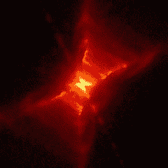
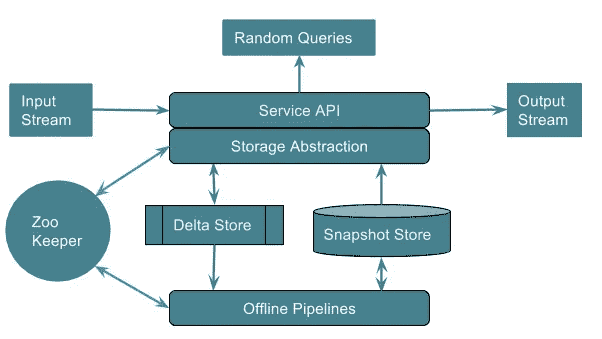
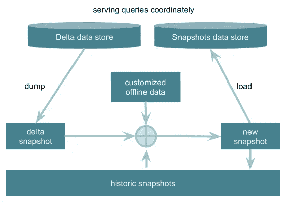

# Nebula 作为一个存储平台来构建 Airbnb 的搜索后端

> 原文：<https://medium.com/airbnb-engineering/nebula-as-a-storage-platform-to-build-airbnbs-search-backends-ecc577b05f06?source=collection_archive---------1----------------------->

由[查理斯何](https://www.linkedin.com/in/charles-changhua-he-7908044)、[苏米阿迪班纳吉](https://www.linkedin.com/in/soumyadip-banerjee-75991b42)、[陶陶](https://www.linkedin.com/in/taotaotw)、&奎师那普塔斯瓦米

**Image Credit:** NASA/JPL (Raghvendra Sahai). This image of the Red Rectangle was produced from data in the Hubble Space Telescope (HST) archive, taken with the Wide Field Planetary Camera 2 onboard the HST as part of Guest Observer program 7297.

去年，Airbnb 发展到一定程度，需要一个可扩展的分布式存储系统来存储一些应用程序的数据。例如，用于搜索的个性化数据变得比单台机器所能容纳的还要大。虽然我们可以重建个性化服务来扩大规模，但我们预见到其他服务也会有类似的需求，并决定构建一个公共平台来简化其他服务所有者的此类任务。

除了正常的请求/响应模式之外，许多服务还有不同的需求，例如执行定期的批量操作以与“事实的来源”(例如，MySQL DB)同步，引导新派生的数据源(例如，新的搜索功能)，消费来自数据流的增量更新(在我们的例子中是 Kafka)，提供对数据的分析交互，以及以非常低的延迟为面向站点的流量提供数据。随着公司的不断发展，我们将有更多的应用程序积累越来越多的数据。如果我们能够挖掘出有用的信号并向应用程序提供反馈，这些数据可以为我们的产品提供巨大的价值。

# 要求

我们从个性化搜索开始。它需要保存快速增长的用户行为历史。它需要实时记录用户的操作，并立即可用，以帮助个性化搜索结果(并改进其他产品)。需要提供数据快照，以便其他应用程序可以使用它(例如，用于分析或验证)。它需要定期压缩来聚合并可能截断旧的历史记录，还要将一批新的要素(离线计算)批量加载回系统。

这些需求在公司的许多应用程序中都很常见。因此，我们决定构建一个通用存储平台来支持此类需求，并帮助服务所有者专注于他们特定的业务逻辑。我们的目标是通过该系统满足以下具体要求:

1.  为面向站点的流量提供服务的低延迟操作(毫秒级)
2.  实时数据流接收的全新增量更新
3.  以方便高效的方式对数据进行批量操作
4.  可根据公司数据规模和吞吐量的增长进行扩展
5.  最低运营成本

注意，我们将“批量操作”定义为对整个储存库进行快照和压缩的操作，用新的快照替换现有的快照以便提供服务的操作，将完整的新信号合并到储存库中的操作，用新的数据集替换现有信号的操作，以及对整个数据集的任何其他操作。Nebula 是我们为满足这些存储级需求而构建的平台。

# 星云是什么？

Nebula 是一个无模式、版本化的数据存储服务，具有实时随机数据访问和离线批量数据管理。它是一个独立的服务，具有用于增量数据(最近一段时间内的更新)的动态数据存储，以及用于支持批量操作的快照数据的静态数据存储。我们选择将 DynamoDB 用于动态数据存储(主要是因为它具有非常低的读取延迟，并且因为它由 AWS 托管，所以运营成本最低)，并将 HFileService(Airbnb 内部构建的可扩展静态存储，可以从本地磁盘分区并提供预先计算的 HFile 格式的数据)用于静态快照。

## **随机数据访问的存储抽象**

Nebula 为底层物理存储提供了统一的 API。API 作为通用键值存储 API 提供给应用程序，增量数据和静态数据在内部合并，因此每个应用程序不需要开发自己的机制来分别处理实时数据和批量数据。因此，它可以灵活地迁移到不同的物理存储，而无需更改基于它构建的 API 和应用程序。

Nebula 使用版本化的表格模式进行存储抽象，类似于 BigTable 和 HBase。与原始键值存储相比，版本化的表格存储使服务所有者更方便地定义他们的数据模型。需要时，版本还可以用于解决冲突和跟踪时间序列数据。对于应用程序可以为每行和每列存储多少个版本没有限制。

Nebula 支持 *<行、列、版本>* 级别的原子操作。对同一 *<行、列>* 的并发写入具有不同的版本，因此它们可以被适当地排序。每一列都有自己的版本控制，所有写入都直接附加到各个列(按版本排序)。用户获得随机访问以检索给定 *<行、>* 列的一个或多个版本。针对多列和/或多行的请求也可以合并成一个多请求。

以个性化数据为例，数据模型如下所示:

每一行代表与用户相关的数据，每一列代表一种类型的用户交互(也称为用户事件),就像以前的搜索一样，每个版本都是用户事件在事件时间戳处的值。在生产中，我们有许多用户事件，每个事件列可能会累积大量带有不同时间戳的事件。

为了满足搜索请求，搜索后端查找给定用户所需的事件数据，并在排名模型中使用个性化数据来决定向用户显示的有序列表。由于这是在搜索请求路径上，我们对延迟和可用性有非常严格的要求。

可以通过增量数据流(包含单个用户事件)在每个单元的基础上更新数据，以及通过离线管道以批量模式更新数据(压缩历史和/或引导/合并/替换新列)。

## **内置批量数据处理支持**

Nebula 为每个存储库运行一个离线管道来快照 delta 存储，与以前的快照合并，并加载新的快照以供使用。由于此类作业与在线服务分开执行，因此对面向网站的流量影响极小。

根据需求，管道是高度可配置的。例如，每个应用程序可以定义它们自己的关于如何合并旧数据和新数据的策略(例如，新数据覆盖旧数据、按版本聚合旧数据、丢弃旧数据等)。)、如何压缩历史(例如，保留 N 个版本、删除超过特定时间段的数据等)。)，如何调度流水线执行等等。

Nebula 还提供了定义良好的接口，供用户定义自己定制的数据并自动加载到系统中。用户可以将他们的数据放在一个共享位置，更新一些 Nebula 配置，管道将拾取数据并将其合并到系统中进行服务。

应用程序所有者还可以将他们定制的逻辑挂接到管道中，以满足他们对数据快照的特殊要求。它们的逻辑将在最新的快照数据上执行，因此，可以以非常高效的方式完成。

在个性化搜索案例中，我们利用离线渠道进行以下工作:

1.  常规快照和增量/静态数据合并。
2.  根据每列要求压缩和过滤陈旧事件，以控制数据大小。
3.  离线特征提取以创建新特征，并将新特征批量加载到存储中。
4.  用于验证用户事件和健全性检查统计数据的定制逻辑。

所有个性化数据都是有版本的，所以每当有数据问题时，Nebula 都可以回滚到以前的好快照，并丢弃版本(时间戳)之前的任何坏数据。回滚的逻辑属于应用程序，但是 Nebula 中的批量接口使得它非常容易实现。

# 体系结构

这是系统的整体架构(如下所示)和一些突出的设计选择。

nebula read 查询查找两个数据存储。增量数据存储仅保存最新数据，而快照存储保存完整的快照。两个存储都提供读查询，但是只有动态存储接受写请求。通过切换底层快照来更新快照存储。数据存储的协调由 Zookeeper 处理。

## **DynamoDB 作为动态数据存储器**

我们选择 DynamoDB 是因为低延迟需求，但是也可以根据不同的需求切换到不同的物理存储(比如 HBase)。要成为 Nebula 的底层存储，物理存储只需支持一个主键和一个排序的辅键。因为它们是相同接口的不同实现，所以物理存储的切换对于构建在系统之上的任何应用程序(和服务用户)都是透明的。

我们不打算构建另一个物理存储，因此依靠 DynamoDB 作为低级存储层使我们能够非常快速地构建一个健壮的系统。

流式输入数据被写入动态存储器；它允许随机更新，并支持非常高的更新 QPS。DynamoDB 的读取延迟很低，因此我们可以满足 10 毫秒的整体延迟要求。为了使 DynamoDB 表的大小易于管理，我们做了一个优化，就是每天将数据划分到新的表中。因此，我们的每个表只占用几个 DynamoDB 碎片，并提供良好的 QPS 保证。

## **HFileService 作为批量数据存储**

最新的快照是在一个专用的 HFileService 集群中提供的，Nebula 从这个集群中组合出数据的实时视图以及动态更新。

HFileService 直接从本地磁盘提供静态 HFiles(快照的格式),可以提供非常低的延迟和高吞吐量。此外，数据加载过程对读取流量的影响极小，因此离线数据合并操作不会影响数据的实时访问。

HFileService 通过动态分片机制对数据进行分区，因此它可以随着总数据大小进行水平扩展。由于它是静态数据，复制策略非常简单，可以根据流量增长进行调整。

## **用于快照、压缩和定制逻辑的离线流水线**

Nebula 支持随机在线数据访问和批量操作。批量操作不会影响在线访问。下图说明了 Nebula 的离线架构。

delta store 定期将数据作为批量更新转储到分布式文件系统(亚马逊 S3)。完成转储后，一个离线 Spark 作业开始将所有历史数据与批量更新合并在一起。我们经常有其他离线生成的数据，例如机器学习功能，我们希望将这些数据批量上传到系统中。这也在合并阶段完成。通过组合批量更新、历史数据和定制的离线数据来创建新的快照。我们在流程中添加了健全性检查，以防止坏数据被导入到我们的系统中。

新创建的快照保留在 S3 上，用于下一轮合并。它还被加载到我们的历史数据存储中。在整个转储-合并-加载过程中，实时存储继续为转储到 S3 的增量数据提供服务，并且仅在新快照成功加载到历史数据存储中之后才删除它们。这通过结合实时和历史存储保证了读取查询总是获得完整的数据。

S3 的完整快照用于其他离线数据分析。

## **流式更新输出**

除了通过快照进行随机访问和批处理，Nebula 还提供了一个更新流，为应用程序提供对数据更改的即时访问。这是由 DynamoDB 通过 streams API 支持更新流而实现的。一个单独的组件使用 Kinesis 消费者中的流，并将其发布到特定的 Kafka 流中，因此任何感兴趣的服务都可以订阅它。

# 另一个例子:搜索索引基础设施

在推出 Nebula 之后，我们还使用 Nebula 重建了 Airbnb 的搜索索引。先说说为什么需要重建。

由于 Airbnb 在很大程度上使用 Rails/MySQL 作为前端，搜索索引监听(现在仍然如此)数据库表的变化，维护当前搜索索引文档的缓存，如果有任何变化，就用新文档更新搜索实例。由于轮询加载器加载的特性以及为保持数据一致性而与真实来源进行的定期同步，导致性能不确定。新的搜索引擎可以通过从缓存中缓慢流出来引导他们的索引。

为改进系统，确定了以下要求:

1.  端到端的低延迟操作(中位数不到 1 秒)
2.  能够使用批量作业离线构建的功能，并合并到搜索索引中
3.  也能够消费实时功能
4.  离线生成索引(它还应该能够离线将索引分片)
5.  在出现错误的情况下快速回滚索引
6.  快速调出新的搜索实例进行扩展
7.  搜索索引文档的可审核性发生变化
8.  可扩展到索引数据增长

星云系统是一个完美的组合，因为我们可以用它的特性做上面所有的事情。版本化的表格存储意味着我们可以拥有可审计的索引文档，对批量作业的支持意味着我们可以离线生成索引(并在中合并列表功能)并直接部署到搜索。因为索引是基于快照构建和部署的，所以如果出现坏的索引数据，我们可以快速回滚。新的搜索实例可以使用生成的索引快速启动(只需下载索引)。

上图显示了 Nebula 的搜索索引架构。数据快照作为离线数据合并的一部分每天生成。索引构建器作业对该快照进行操作，以构建分片索引，然后像普通的二进制部署一样定期部署该索引进行搜索。系统使用 Nebula 提供的常用功能，只需要实现与搜索索引相关的定制逻辑。

# 未来计划

我们在 Nebula 的基础上建立了一些服务，包括我们刚刚谈到的搜索索引管道、个性化基础设施和 Airbnb 的定价服务数据仓库。它为每个应用程序提供多个 TB 的数据，平均延迟约为 10 毫秒。我们希望鼓励其他团队构建更多由 Nebula 提供服务的应用。

我们还计划将该系统与我们的数据仓库进行深度集成，即在 Hive 中存储历史快照，共享更多的数据流消费逻辑等。目标是使数据可用于分析并保持一致，使系统更易于管理和交互，从而使开发人员构建他们的应用程序变得更加容易。

# 承认

有许多人使这项工作成为可能。我们要感谢 Alex Guziel 为此项目做出的重大贡献，还要感谢、、唐、卢经纬的大力帮助，以及搜索、应用基础设施、数据基础设施、产品基础设施和其他团队的许多人在许多方面提供的帮助。

## 在 [airbnb.io](http://airbnb.io) 查看我们所有的开源项目，并在 Twitter 上关注我们:[@ Airbnb eng](https://twitter.com/AirbnbEng)+[@ Airbnb data](https://twitter.com/AirbnbData)