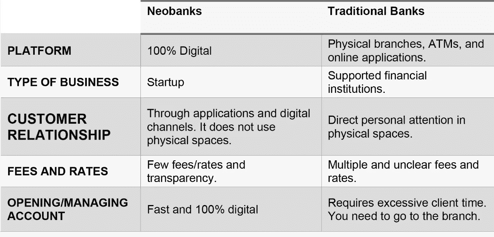

# 新时代。

> 原文：<https://medium.com/globant/neobanks-the-new-era-df29e11885f0?source=collection_archive---------0----------------------->

考虑到银行和金融部门的这些新变化。我要谈谈新银行以及它们如今代表着什么。

**定义**

Neobanks 是提供银行和/或金融产品和服务的金融科技(fintech)公司；他们完全通过移动应用程序在线工作。它们是没有实体分支机构的金融机构。

Fintechs 拥有强大的技术架构，因此，他们的目标是通过其数字平台提供全新的卓越用户体验。

**他们提供什么…**

新银行提供类似于传统银行的产品和服务，尽管目录简单而精简。最常见的产品包括借记卡、信用卡和预付卡。

然而，一些新银行开始提供贷款产品，如个人贷款；抵押贷款；和商业信贷。

**特色**

1.  **简化财务管理流程。**

新银行的目标之一是为其用户和客户简化财务管理流程。

Neobanks 还与第三方合作交叉销售产品和服务，让他们专注于用户体验。

**2。新时代、灵活、可扩展的技术平台。**

他们比传统银行更注重技术。它们从根本上是基于应用程序的，这些应用程序允许在舒适的家中或办公室中以最少的步骤执行常见的流程，如开户、资金转账或客户服务。

**新银行与传统银行**

**产品工作室面临的主要挑战**

作为一个产品工作室，我们必须对新银行业进行全球分析，使我们对这一新趋势有一个全面的了解。同样:

*   定义增加项目执行价值的策略。
*   向客户提供对用户体验产生积极影响的解决方案(后端用户/客户)。
*   设计符合最佳银行和金融实践的产品和服务。
*   灵活性和适应这一新技术趋势所代表的变化。
*   愿意在操作故障和技术事故中提供支持，考虑信息安全和技术欺诈问题。

**结论**

考虑到技术和通信的全球趋势，新银行目前代表了一个新的市场领域。

我们可以看到这类机构的新浪潮，它们不断涌现，并寻求在银行和金融业获得空间。