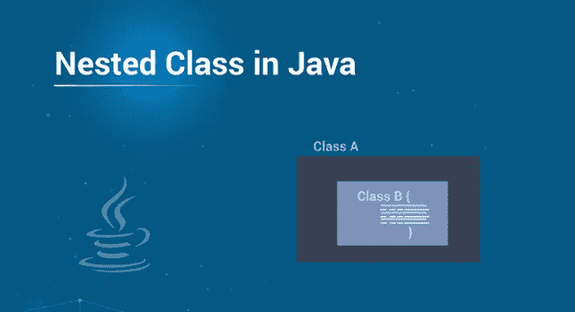
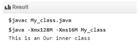
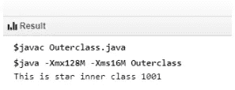
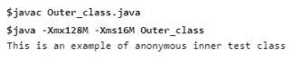
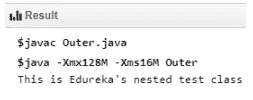

# 如何在 Java 中实现嵌套类？

> 原文：<https://medium.com/edureka/nested-classes-java-f1987805e7e3?source=collection_archive---------1----------------------->



在 Java 中，一个类可以在另一个类中定义，这样的类称为嵌套类。这些类帮助您对只在一个地方使用的类进行逻辑分组。这增加了封装的使用，并创建了更具可读性和可维护性的代码。这篇关于“Java 中的嵌套类”的博客将向您简要介绍 Java 语言中的嵌套类。以下是本博客涵盖的主题:

*   Java 中的嵌套类
*   嵌套类的类型
*   静态和非静态嵌套类的区别
*   需要记住的要点

# Java 中的嵌套类

写在类中的类称为嵌套类，而包含内部类的类称为外部类。以下是 Java 中嵌套类需要记住的几点

*   嵌套类的范围受其封闭类的限制。
*   嵌套类可以访问嵌套它的类的成员。但是，封闭类不能访问嵌套类的成员。
*   嵌套类是它的封闭类成员。
*   嵌套类可以声明为 public、private、protected 或 package-private。

# 嵌套类的类型

**内部/非静态嵌套类:**在 Java 中，非静态类是一种安全机制。一个类不能与访问修饰符 private 相关联，但是如果你有一个类作为其他类的成员，那么非静态类可以成为 private。

内部类的类型

*   内部类
*   方法-局部内部类
*   匿名内部类

## 内部类

要创建一个内部类，你只需要在一个类中写一个类。内部类可以是私有的，不能从类外的对象访问。下面是一个创建内部类的程序。在这个例子中，内部类是私有的，并通过方法被访问。

```
class Outer_Test {
   int num;

   // inner class
   private class Inner_Test {
      public void print() {
         System.out.println("This is an Our inner class");
      }
   }

   // Accessing he inner class from the method 
   void display_Inner() {
      Inner_Test inner = new Inner_Test();
      inner.print();
   }
}

public class My_class {

   public static void main(String args[]) {
      // Instantiating the outer class 
      Outer_Test outer = new Outer_Test();

      // Accessing the display_Inner() method.
      outer.display_Inner();
   }
}
```

**输出**



## 方法-局部内部类

在 Java 中，一个类可以写在一个[方法](https://www.edureka.co/blog/java-methods/)中，并且是一个局部类型。与局部变量类似，内部类的范围被限制在方法内。方法局部内部类只包含在定义内部类的方法中。下面的程序展示了如何使用一个方法-局部内部类。

```
public class Outerclass {
   // instance method of the outer class 
   void my_Method() {
      int num = 1001;

      // method-local inner class
      class StarInner_Test {
         public void print() {
            System.out.println("This is star inner class "+num);       
         }   
      } // end of inner class

      // Accessing the inner class
      StarInner_Test star = new StarInner_Test();
      star.print();
   }

   public static void main(String args[]) {
      Outerclass outer = new Outerclass();
      outer.my_Method();           
   }
}
```

**输出**



## 匿名内部类

匿名内部类是没有类名声明的内部类。在匿名内部类中，我们同时声明和实例化它。它们通常在需要重写类或接口的方法时使用。下面的程序展示了如何使用一个匿名的内部类

```
abstract class AnonymousInnerTest {
   public abstract void mytest();
}

public class Outer_class {

   public static void main(String args[]) {
      AnonymousInnerTest inner = new AnonymousInnerTest() {
         public void mytest() {
            System.out.println("This is an example of anonymous inner test class");
         }
      };
      inner.mytest();   
   }
}
```

**输出-**



# **静态嵌套类:**

静态类是嵌套类，是外部类的静态成员。与内部类不同，静态嵌套类不能访问外部类的成员变量，因为静态嵌套类不需要外部类的实例。因此，没有使用 OuterClass.this 引用外部类。静态嵌套类的语法是–

```
class MyOuter {
   static class Nested_Test {
   }
}
```

## 静态嵌套类的示例

```
public class Outer {
   static class Nested_Test {
      public void my_method() {
         System.out.println("This is Edureka's nested test class");
      }
   }

   public static void main(String args[]) {
      Outer.Nested_Test nested = new Outer.Nested_Test();    
      nested.my_method();
   }
}
```

**输出**



# 静态和非静态嵌套类的区别

静态嵌套类不能直接访问封闭类的其他成员。由于是静态的，它必须通过一个对象访问其封闭类的非静态成员，这意味着它不能直接引用其封闭类的非静态成员。由于这种限制，很少使用静态嵌套类。

非静态嵌套类可以访问其外部类的所有成员，并且可以像外部类的其他非静态成员一样直接引用它们。

在结束本文之前，让我们先来看几个要点。

# 需要记住的要点

*   内部类被视为类的常规成员。
*   由于内部类是外部类的成员，您可以对内部类应用不同的访问修饰符，如 protected、private。
*   因为嵌套类是其封闭类的成员，所以可以使用。(点)符号，以便访问嵌套类及其成员。
*   使用嵌套类使您的代码更具可读性，并提供更好的封装。
*   内部类可以访问外部类的其他成员，即使它们被声明为私有。

*至此，我们结束了这篇关于 Java 嵌套类的博客。*如果你想查看更多关于人工智能、DevOps、道德黑客等市场最热门技术的文章，你可以参考 [Edureka 的官方网站。](https://www.edureka.co/blog/?utm_source=medium&utm_medium=content-link&utm_campaign=nested-classes-java)

请留意本系列中的其他文章，它们将解释 Java 的各个方面。

> 1.[面向对象编程](/edureka/object-oriented-programming-b29cfd50eca0)
> 
> 2.[Java 中的继承](/edureka/inheritance-in-java-f638d3ed559e)
> 
> 3.[Java 中的多态性](/edureka/polymorphism-in-java-9559e3641b9b)
> 
> 4.[Java 中的抽象](/edureka/java-abstraction-d2d790c09037)
> 
> 5. [Java 字符串](/edureka/java-string-68e5d0ca331f)
> 
> 6. [Java 数组](/edureka/java-array-tutorial-50299ef85e5)
> 
> 7. [Java 集合](/edureka/java-collections-6d50b013aef8)
> 
> 8. [Java 线程](/edureka/java-thread-bfb08e4eb691)
> 
> 9.[Java servlet 简介](/edureka/java-servlets-62f583d69c7e)
> 
> 10. [Servlet 和 JSP 教程](/edureka/servlet-and-jsp-tutorial-ef2e2ab9ee2a)
> 
> 11.[Java 中的异常处理](/edureka/java-exception-handling-7bd07435508c)
> 
> 12.[高级 Java 教程](/edureka/advanced-java-tutorial-f6ebac5175ec)
> 
> 13. [Java 面试问题](/edureka/java-interview-questions-1d59b9c53973)
> 
> 14. [Java 程序](/edureka/java-programs-1e3220df2e76)
> 
> 15. [Kotlin vs Java](/edureka/kotlin-vs-java-4f8653f38c04)
> 
> 16.[依赖注入使用 Spring Boot](/edureka/what-is-dependency-injection-5006b53af782)
> 
> 17.[在 Java 中可比](/edureka/comparable-in-java-e9cfa7be7ff7)
> 
> 18.[十大 Java 框架](/edureka/java-frameworks-5d52f3211f39)
> 
> 19. [Java 反射 API](/edureka/java-reflection-api-d38f3f5513fc)
> 
> 20.[Java 中的 30 大模式](/edureka/pattern-programs-in-java-f33186c711c8)
> 
> 21.[核心 Java 备忘单](/edureka/java-cheat-sheet-3ad4d174012c)
> 
> 22.[Java 中的套接字编程](/edureka/socket-programming-in-java-f09b82facd0)
> 
> 23. [Java OOP 备忘单](/edureka/java-oop-cheat-sheet-9c6ebb5e1175)
> 
> 24.[Java 中的注释](/edureka/annotations-in-java-9847d531d2bb)
> 
> 25.[Java 中的图书管理系统项目](/edureka/library-management-system-project-in-java-b003acba7f17)
> 
> 26.[Java 中的树](/edureka/java-binary-tree-caede8dfada5)
> 
> 27.[Java 中的机器学习](/edureka/machine-learning-in-java-db872998f368)
> 
> 28.[Java 中的顶级数据结构&算法](/edureka/data-structures-algorithms-in-java-d27e915db1c5)
> 
> 29. [Java 开发者技能](/edureka/java-developer-skills-83983e3d3b92)
> 
> 30.[前 55 名 Servlet 面试问题](/edureka/servlet-interview-questions-266b8fbb4b2d)
> 
> 31. [](/edureka/java-exception-handling-7bd07435508c) [顶级 Java 项目](/edureka/java-projects-db51097281e3)
> 
> 32. [Java 字符串备忘单](/edureka/java-string-cheat-sheet-9a91a6b46540)
> 
> 33. [Java 教程](/edureka/java-tutorial-bbdd28a2acd7)
> 
> 34. [Java 集合面试问答](/edureka/java-collections-interview-questions-162c5d7ef078)
> 
> 35.[Java 中如何处理死锁？](/edureka/deadlock-in-java-5d1e4f0338d5)
> 
> 36.[你需要知道的 50 大 Java 集合面试问题](/edureka/java-collections-interview-questions-6d20f552773e)
> 
> 37.[Java 中的字符串池是什么概念？](/edureka/java-string-pool-5b5b3b327bdf)
> 
> 38.[C、C++和 Java 有什么区别？](/edureka/difference-between-c-cpp-and-java-625c4e91fb95)
> 
> 39.[Java 中的回文——如何检查一个数字或字符串？](/edureka/palindrome-in-java-5d116eb8755a)
> 
> 40.[你需要知道的顶级 MVC 面试问答](/edureka/mvc-interview-questions-cd568f6d7c2e)
> 
> 41.[Java 编程语言的十大应用](/edureka/applications-of-java-11e64f9588b0)
> 
> 42.[Java 中的死锁](/edureka/deadlock-in-java-5d1e4f0338d5)
> 
> 43.[Java 中的平方和平方根](/edureka/java-sqrt-method-59354a700571)
> 
> 44.Java 中的类型转换
> 
> 45.[Java 中的运算符及其类型](/edureka/operators-in-java-fd05a7445c0a)
> 
> 46.[Java 中的析构函数](/edureka/destructor-in-java-21cc46ed48fc)
> 
> 47.[爪哇的二分搜索法](/edureka/binary-search-in-java-cf40e927a8d3)
> 
> 48.[Java 中的 MVC 架构](/edureka/mvc-architecture-in-java-a85952ae2684)
> 
> 49. [Hibernate 面试问答](/edureka/hibernate-interview-questions-78b45ec5cce8)

*原载于 2019 年 9 月 20 日*[*https://www.edureka.co*](https://www.edureka.co/blog/nested-classes-java/)*。*