# Oracle 云基础架构上的嵌套 KVM 虚拟化

> 原文：<https://medium.com/oracledevs/nested-kvm-virtualization-on-oracle-cloud-infrastructure-5559bdd2213d?source=collection_archive---------0----------------------->

嵌套虚拟化允许您在另一个虚拟机内运行一个虚拟机，同时仍然使用来自主机的硬件加速。在 Oracle 云基础架构(OCI)上，您还可以为 KVM 虚拟机管理程序使用裸机实例形状，而不是嵌套的虚拟机。

查看我们的[在裸机实例上使用多虚拟网卡安装和配置 KVM](https://docs.us-phoenix-1.oraclecloud.com/Content/Resources/Assets/installing_kvm_multi_vnics.pdf)白皮书，如果您打算使用裸机形状而不是虚拟机形状，该白皮书详细解释了这一过程。

这篇博客描述了如何在 OCI KVM 虚拟机管理程序上安装、配置和使用 KVM Guests 虚拟机。这个过程也称为嵌套 KVM 虚拟化。

# 入门指南

如上所述，在 Oracle 云基础设施上，您的 KVM 虚拟机管理程序可以安装在裸机或虚拟机主机上。

以下是您可以用于 KVM 虚拟机管理程序的当前形状选项:

**裸机形状**

**虚拟机形状**

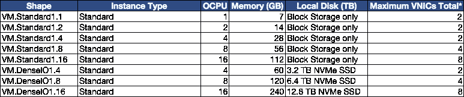

建议查看[我们的公共文档](https://docs.us-phoenix-1.oraclecloud.com/Content/Compute/Tasks/launchinginstance.htm)以了解您可以在自己的环境中使用的当前选项和功能。

根据您的工作负载要求选择一个虚拟机形状，并在继续操作之前进行配置。

# 要求

*   运行 Oracle Linux 7.x 的 OCI 虚拟机实例(只要支持 KVM，也可以使用其他 Linux 发行版)
*   在 Windows 服务器实例上运行时，Microsoft Windows 应用程序许可证可能需要通过软件保障进行许可证移动。有关您的许可权的问题应该向 Microsoft 或您的 Microsoft 经销商提出
*   请注意，将第三方应用程序许可引入 Oracle 云基础架构时，您需要独自承担在 KVM 服务器实例上使用的任何第三方操作系统/应用程序供应商的许可义务
*   您的 KVM 虚拟机操作系统 ISO 需要上传到 KVM 服务器实例中，以便安装来宾虚拟机
*   建议使用额外的块存储卷，并将其连接到嵌套的 KVM 服务器实例，以保存 KVM VM qco w2 磁盘映像。您还可以使用 NVMe 磁盘的 OCI 形状来代替 iSCSI 块存储。

发出以下命令来安装最新的 qemu 包和 virt-manager，它提供了管理虚拟机的图形界面。

$ sudo yum-y install QEMU-KVM QEMU-img virt-manager lib virt lib virt-python lib virt-client virt-install virt-viewer

# 为 GUI 远程连接安装 VNC

运行以下命令安装 VNC 软件包

$ sudo yum groupinstall "带 GUI 的服务器"-y

$ sudo yum install xorg-X11-xauth xorg-X11-fonts-* xorg-X11-utils tiger VNC-server-y

现在，复制 vncserver@。对 vncserver@的服务:1.service。

$ cd /lib/systemd/system

$ sudo cp vncserver@。服务 vncserver@:1 .服务

$ sudo vi vncserver\@\:1.service

将 vncserver@1.service 中的<user>替换为“opc”用户名，现在为 vncserver@中定义的 opc 用户设置 VNC 密码。服务</user>

# su — opc

# vncpasswd

密码:

验证:

#退出

配置防火墙以允许 VNC 连接

$ sudo firewall-cmd-permanent-zone = public-add-service VNC-server

将 VNC 配置为自动启动

$ sudo systemctl 后台程序-重新加载

$ sudo system CTL enable VNC server @:1 . service

$ sudo system CTL start vncserver @:1 . service

# 为多虚拟网卡和嵌套虚拟化准备 KVM 服务器

在 Oracle Linux 7.x KVM 服务器实例上，执行以下操作:

$ sudo vi /etc/default/grub

#在 GRUB_CMDLINE_LINUX 行中追加以下参数

kvm 上的 Intel _ io MMU = Intel . nested = 1

下面是一个例子:

$ sudo cat /etc/default/grub |grep 命令行

GRUB _ CMDLINE _ LINUX = " crash kernel = auto LANG = en _ US。UTF-8 控制台=tty0 控制台=ttyS0，9600 rd . luks = 0 rd . LVM = 0 rd . MD = 0dm = 0 IP = DHCP net root = iscsi:169 . 254 . 0 . 2::::iqn . 2015–02 . Oracle . boot:uefi iscsi _ param = node . session . timeo . replacement _ time out = 6000**Intel _ io MMU = on****KVM-Intel . nested = 1【T4**

保存并退出 vi。

现在，运行以下命令来

-启用调谐

$ sudo systemctl 启用优化

$ sudo systemctl 开始调整

$ sudo tuned-adm 配置文件虚拟主机

-重新创建 grub 以验证所有更改

$ sudo CP/boot/EFI/EFI/red hat/grub . CFG/boot/EFI/EFI/red hat/grub . CFG . orig

$ sudo grub 2-mkconfig-o/boot/EFI/EFI/red hat/grub . CFG

使用您的 OCI 控制台，编辑您的虚拟云网络安全列表，并启用端口 5901(如果该端口对应于您正在使用的 VNC 端口)

资料来源:0.0.0.0/0

IP 协议:TCP

源端口范围:所有

目标端口范围:5901

允许:端口的 TCP 流量:5901

重新启动 OCI KVM 嵌套虚拟机实例，以加载 KVM 内核模块。一旦您的虚拟机恢复在线，您应该能够通过任何 VNC 应用程序(如 [vncviewer](https://www.realvnc.com/en/download/viewer/) )访问您的 KVM 虚拟机管理程序实例

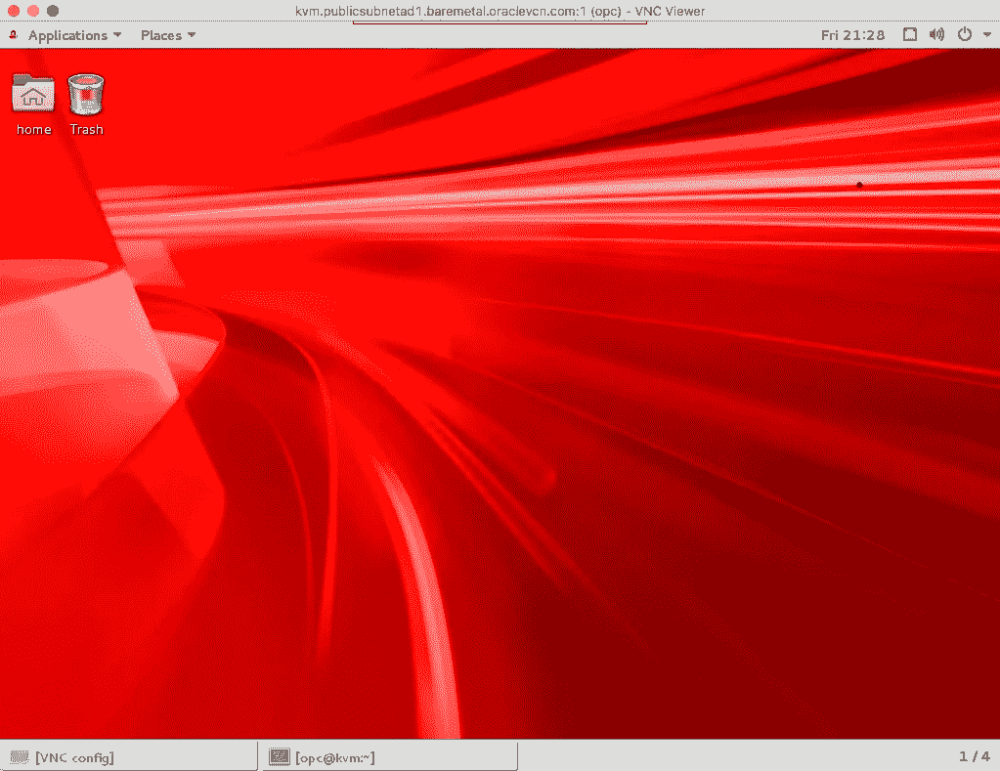

# 创建 OCI 辅助虚拟网卡

下一步是创建一个辅助 vNIC，并将其连接到 KVM 嵌套 VM 实例。这个辅助 vNIC 将用于您的嵌套 VM 客户机。

使用 OCI 仪表板，单击 KVM 实例的详细信息，选择“附加的 vNIC ”,然后单击“创建 vNIC”选项。

下面是一个在可用性域 1 (AD1)上使用名为“New-BM-172”的虚拟云网络(VCN)的示例

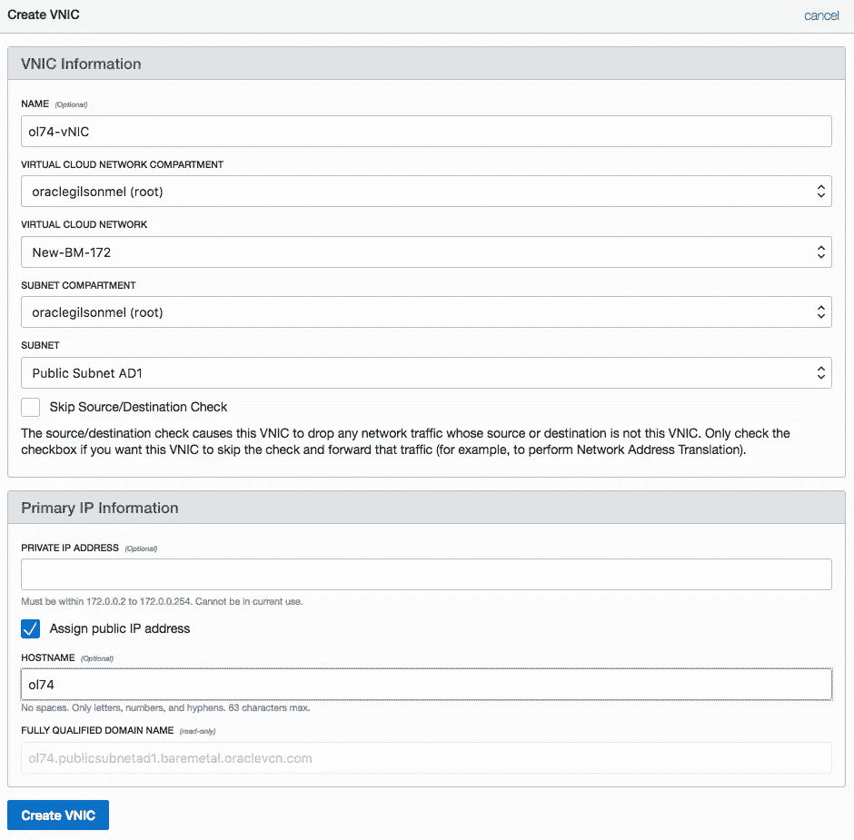

创建之后，您应该会看到以下内容:

请注意“MAC 地址”和 IP 地址信息，因为您稍后会用到它们。

# 将 OCI 辅助虚拟网卡与您的 KVM 来宾虚拟机关联

在开始客户机安装过程之前，在 KVM 虚拟机管理程序上运行以下命令

$ sudo ip 链接

1: lo: <loopback>mtu 65536 qdisc noqueue 状态未知模式默认</loopback>

链路/回送 00:00:00:00:00:00 brd 00:00:00:00:00:00

2: ens3: <broadcast>mtu 9000 qdisc mq 状态 UP 模式默认 qlen 1000</broadcast>

link/ether 00:00:17:01:16:5d brd ff:ff:ff:ff:ff:ff:ff

**3: ens4: <广播，组播，UP，LOWER_UP > mtu 1500 qdisc mq 状态 UP 模式默认 qlen 1000**

**link/ether 00:00:17:01:ce:47 brd ff:ff:ff:ff:ff:ff**

4:virbr 0:<no-carrier>MTU 1500 qdisc no queue 状态关闭模式默认值</no-carrier>

link/ether 52:54:00:40:76:12 brd ff:ff:ff:ff:ff:ff

5:virbr 0-NIC:<broadcast>MTU 1500 qdisc p FIFO _ fast master virbr 0 状态下降模式默认 qlen 500</broadcast>

link/ether 52:54:00:40:76:12 brd ff:ff:ff:ff:ff:ff

并确定与您的 OCI 辅助 vNIC mac 地址匹配的接口。如上所示，ens4 将在本博客中与 KVM Guest 一起使用。

下一步是调配 KVM 来宾虚拟机，并将上述虚拟网卡添加到其中。

# 创建 KVM 来宾实例

建议在继续操作之前，将 iSCSI 块卷连接到 OCI 嵌套虚拟机管理程序，以存储 KVM qcow2 文件。如果您对嵌套的 KVM 虚拟机管理程序使用 NVMe 虚拟机形状选项，也可以使用 NVMe 磁盘。

KVM 可以使用命令行或可用的图形工具来管理，所以让我们使用 VNC 连接到您的 OCI KVM 管理程序实例，然后打开 gnome 终端并运行以下命令

如果这是您第一次运行 virt-manager，您将需要创建一个本地 QEMU/KVM 连接，然后单击“创建一个新的虚拟机”按钮，并按照所需的选项进行操作，如下所示

选择 ISO 图像

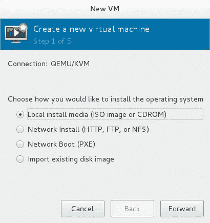

来宾操作系统信息

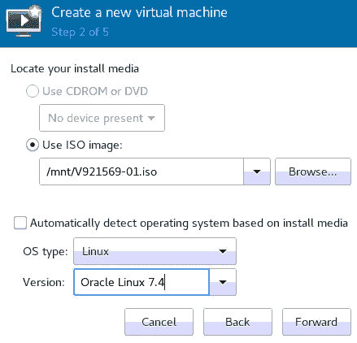

内存/CPU

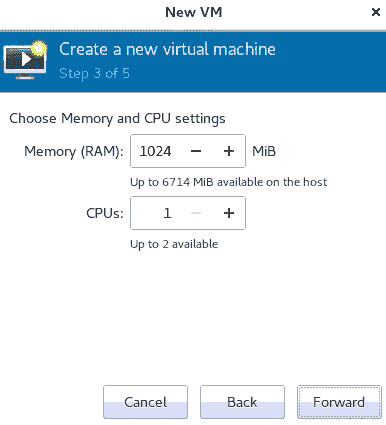

存储大小和位置

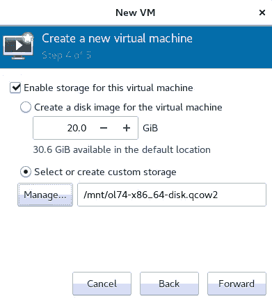

**注意:**确保选择“安装前自定义配置”选项，然后单击“完成”

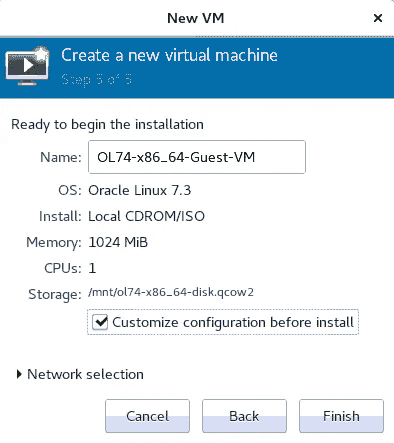

现在，在 virt-manager 上单击在上述来宾创建过程中添加的默认 NIC，将其更改为“Passthrough”，添加上面标识的 OCI 辅助 vNIC mac 地址以及正确的接口名称(即；ens4)

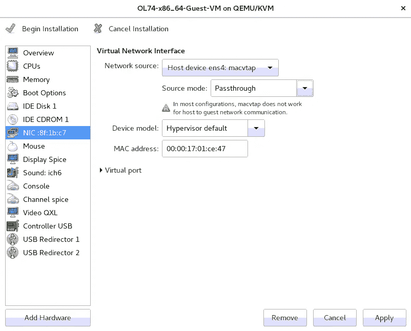

单击“应用”和“开始安装”按钮，并照常遵循操作系统安装流程。请记住，您需要在安装期间或之后添加网络信息。

确保您的网络配置设置为静态 IP(使用基于您在上面创建的辅助 vNIC 的 IP 信息)、DNS(服务器和名称搜索选项)和网关 IP。

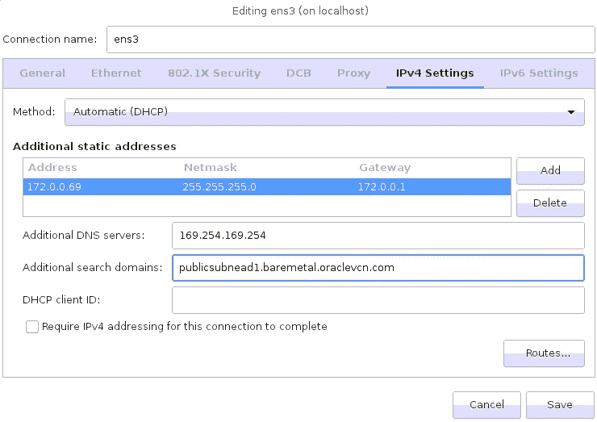

配置完成！作为一个例子，下面是一个嵌套的 KVM 虚拟机。运行 2 KVM 客户机的 Standard1.8 实例。

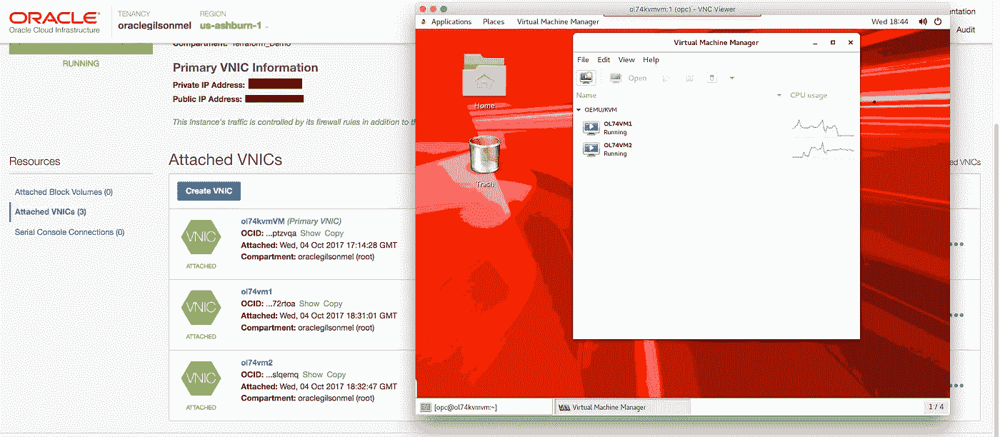

# 其他安全建议:

*   禁用 ssh 密码认证并启用 SSH 密钥认证(在/home/opc/中添加您的 SSH 公钥。ssh/授权密钥文件)
*   保持 KVM 客户机防火墙处于启用状态，仅打开所需的端口
*   定期修补您的 KVM 来宾虚拟机
*   如果可能，使用 VPN
*   保持 VNC 端口阻塞，并使用“ssh -L”在 OCI 嵌套 KVM 虚拟机管理程序和本地主机之间创建一个隧道，以便能够使用 VNC