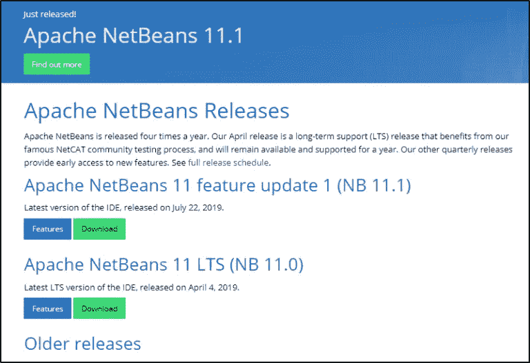
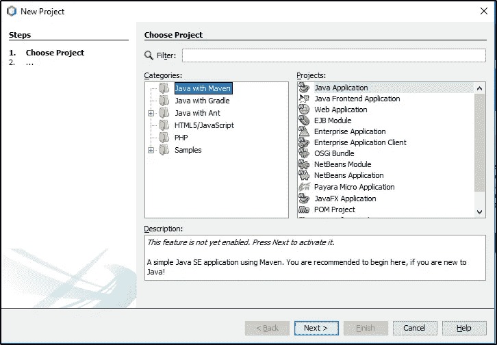
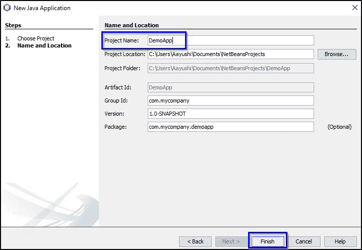
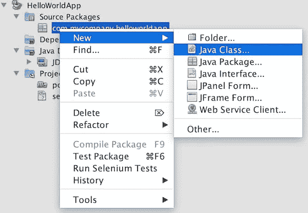

# Netbeans 教程:什么是 NetBeans IDE，如何入门？

> 原文：<https://medium.com/edureka/netbeans-tutorial-fafbbb194906?source=collection_archive---------1----------------------->


一边挠头一边想什么是 Netbeans？嗯，这是适合你的地方。Netbeans 是一个开源的集成开发环境，用于使用 Java、PHP、C++和其他编程语言进行开发。本 Netbeans 教程将为您提供基本的工作流程以及关于 NetBeans 安装的完整见解。让我们看看这篇文章的议程！

*   NetBeans 简介
*   如何下载安装 NetBeans？
*   在 Netbeans IDE 中创建第一个项目
*   如何创建 Java 源文件？
*   如何在 Java 源文件中添加代码？
*   如何运行应用程序？

让我们开始吧。

# NetBeans 简介


Netbeans 是一个开源的集成开发环境(IDE)。它用于用 Java、PHP、C++、HTML 和许多其他编程语言开发应用程序。这些应用程序是使用 Java 中的模块开发的。NetBeans 可以在任何操作系统上运行，如 Windows、MacOS、Linux 等。

接下来，让我们看看如何设置 NetBeans。

# 如何下载和安装 NetBeans

让我来指导您完成在系统上安装 NetBeans 的过程。只需遵循以下步骤:

转到链接:**步骤 1:**【https://netbeans.apache.org/download/index.html】T2 您可以找到未来几年 NetBeans 的各种版本。最新版本是 Apache Netbeans 11.1。你可以根据自己的选择下载任何版本。

参考下面的截图，以获得更好的理解。



根据您匹配的系统配置，单击下载链接。下载完成后，您必须选择 Accept License Agreement 单选按钮，系统将指导您完成安装 IDE 的步骤。

按照这些步骤，您就完成了安装部分。在本 NetBeans 教程中，我们该构建自己的 Java 应用程序了。

激动吗？我们开始吧！

# NetBeans 教程:创建您的第一个项目

Netbeans IDE 具有简单的布局结构，按钮数量有限。

让我们看看 NetBeans UI 是什么样子的:


注意，让我们创建我们的第一个项目。

只需进入文件->新项目。选择“Java”类别和“Java 应用程序”项目。请参考下面的截图了解更多信息:



选择 Next 并命名您的第一个项目。您也可以根据自己的方便更改项目位置。



点击“完成”，你就可以开始了，你的项目已经准备好了！

创建项目后，下一步是创建 Java 源文件。

# 如何创建 Java 源文件？

右键单击包名，选择新建，然后选择 Java 类。

现在，在 New Java Class 向导中，在 class name 字段中键入 Main，然后单击 finish！



您的 Java 源文件将被创建并打开。

有些组件是您必须关注的:

*   **Source Editor** :这是包含文件的中心区域，在这里你将使用被称为 main open 的 Java 源文件进行当前的工作。
*   **项目窗口**:它在左上方，包含我们的核心所依赖的源文件和库以及其他几个组件。
*   **导航器**:它位于左下角，用于在您选择的类中的元素之间导航。

现在，下一步是向 Java 源文件添加代码。

# 如何在 Java 源文件中添加代码？

您创建的主类将帮助您创建一些内容来生成 hello world 消息。

完成该任务的代码如下所示:

```
**package** Demoapp;
**public** **class** DemoApp {
**public** **static** **void** main(String[] args) {
System.out.println("Hello World!");
}
}
```

Hello world 将打印在输出屏幕上！看完代码后，让我向您展示如何运行该应用程序。

# 如何运行应用程序？

在右键单击项目并选择“运行”或“运行”菜单下的“运行项目”之后，必须先保存 Java 源文件。之后，选择主类。

您将看到您的应用程序正在工作。通过打开“文件”窗口，然后展开目标节点，可以看到构建输出。
如果你想查看更多关于人工智能、DevOps、道德黑客等市场最热门技术的文章，你可以参考 [Edureka 的官方网站。](https://www.edureka.co/blog/?utm_source=medium&utm_medium=content-link&utm_campaign=netbeans-tutorial)

请留意本系列中的其他文章，它们将解释 Java 的各个方面。

> *1。* [*面向对象编程*](/edureka/object-oriented-programming-b29cfd50eca0)
> 
> *2。*[*Java 中的继承*](/edureka/inheritance-in-java-f638d3ed559e)
> 
> *3。*[*Java 中的多态性*](/edureka/polymorphism-in-java-9559e3641b9b)
> 
> *4。*[*Java 中的抽象*](/edureka/java-abstraction-d2d790c09037)
> 
> *5。* [*Java 字符串*](/edureka/java-string-68e5d0ca331f)
> 
> *6。* [*Java 数组*](/edureka/java-array-tutorial-50299ef85e5)
> 
> *7。* [*Java 集合*](/edureka/java-collections-6d50b013aef8)
> 
> *8。* [*Java 线程*](/edureka/java-thread-bfb08e4eb691)
> 
> *9。*[*Java servlet 简介*](/edureka/java-servlets-62f583d69c7e)
> 
> 10。 [*Servlet 和 JSP 教程*](/edureka/servlet-and-jsp-tutorial-ef2e2ab9ee2a)
> 
> 11。[*Java 中的异常处理*](/edureka/java-exception-handling-7bd07435508c)
> 
> *12。* [*Java 教程*](/edureka/java-tutorial-bbdd28a2acd7)
> 
> *13。* [*Java 面试题*](/edureka/java-interview-questions-1d59b9c53973)
> 
> 14。 [*Java 程序*](/edureka/java-programs-1e3220df2e76)
> 
> 15。 [*科特林 vs Java*](/edureka/kotlin-vs-java-4f8653f38c04)
> 
> 16 岁。 [*依赖注入使用 Spring Boot*](/edureka/what-is-dependency-injection-5006b53af782)
> 
> *17。* [*堪比 Java 中的*](/edureka/comparable-in-java-e9cfa7be7ff7)
> 
> *18。* [*十大 Java 框架*](/edureka/java-frameworks-5d52f3211f39)
> 
> *19。* [*Java 反射 API*](/edureka/java-reflection-api-d38f3f5513fc)
> 
> *20。*[*Java 中的 30 大模式*](/edureka/pattern-programs-in-java-f33186c711c8)
> 
> *21。* [*核心 Java 备忘单*](/edureka/java-cheat-sheet-3ad4d174012c)
> 
> *22。*[*Java 中的套接字编程*](/edureka/socket-programming-in-java-f09b82facd0)
> 
> *23。* [*Java OOP 备忘单*](/edureka/java-oop-cheat-sheet-9c6ebb5e1175)
> 
> *24。*[*Java 中的注释*](/edureka/annotations-in-java-9847d531d2bb)
> 
> *25。*[*Java 中的库管理系统项目*](/edureka/library-management-system-project-in-java-b003acba7f17)
> 
> *26。*[*Java 中的树*](/edureka/java-binary-tree-caede8dfada5)
> 
> *27。*[*Java 中的机器学习*](/edureka/machine-learning-in-java-db872998f368)
> 
> *28。* [*顶层数据结构&Java 中的算法*](/edureka/data-structures-algorithms-in-java-d27e915db1c5)
> 
> *29。* [*Java 开发者技能*](/edureka/java-developer-skills-83983e3d3b92)
> 
> 三十岁。 [*前 55 名 Servlet 面试问题*](/edureka/servlet-interview-questions-266b8fbb4b2d)
> 
> *31。*[](/edureka/java-exception-handling-7bd07435508c)*[*顶级 Java 项目*](/edureka/java-projects-db51097281e3)*
> 
> *32。 [*Java 字符串备忘单*](/edureka/java-string-cheat-sheet-9a91a6b46540)*
> 
> *33。[*Java 中的嵌套类*](/edureka/nested-classes-java-f1987805e7e3)*
> 
> **34。* [*Java 集合面试问答*](/edureka/java-collections-interview-questions-162c5d7ef078)*
> 
> **35。*[*Java 中如何处理死锁？*](/edureka/deadlock-in-java-5d1e4f0338d5)*
> 
> **36。* [*你需要知道的 50 个 Java 合集面试问题*](/edureka/java-collections-interview-questions-6d20f552773e)*
> 
> *37。[*Java 中的字符串池是什么概念？*](/edureka/java-string-pool-5b5b3b327bdf)*
> 
> *38。[*C、C++和 Java 有什么区别？*](/edureka/difference-between-c-cpp-and-java-625c4e91fb95)*
> 
> **39。*[*Java 中的回文——如何检查一个数字或字符串？*](/edureka/palindrome-in-java-5d116eb8755a)*
> 
> **四十。* [*你需要知道的顶级 MVC 面试问答*](/edureka/mvc-interview-questions-cd568f6d7c2e)*
> 
> **41。*[*Java 编程语言的十大应用*](/edureka/applications-of-java-11e64f9588b0)*
> 
> **42。*[*Java 中的死锁*](/edureka/deadlock-in-java-5d1e4f0338d5)*
> 
> **43。*[*Java 中的平方和平方根*](/edureka/java-sqrt-method-59354a700571)*
> 
> **44。*[*Java 中的类型转换*](/edureka/type-casting-in-java-ac4cd7e0bbe1)*
> 
> **45。*[*Java 中的运算符及其类型*](/edureka/operators-in-java-fd05a7445c0a)*
> 
> **46。*[*Java 中的析构函数*](/edureka/destructor-in-java-21cc46ed48fc)*
> 
> *47。[*Java 中的二分搜索法*](/edureka/binary-search-in-java-cf40e927a8d3)*
> 
> **48。*[*Java 中的 MVC 架构*](/edureka/mvc-architecture-in-java-a85952ae2684)*
> 
> *49。 [*冬眠面试问答*](/edureka/hibernate-interview-questions-78b45ec5cce8)*

**原载于 2019 年 8 月 19 日*[*https://www.edureka.co*](https://www.edureka.co/blog/netbeans-tutorial/)*。**