# Oracle Linux 的网络安装

> 原文：<https://medium.com/oracledevs/network-install-of-oracle-linux-8b529771ea0f?source=collection_archive---------1----------------------->


快速安装从一个小的 iso 映像开始。

要安装 Oracle Linux，您需要下载一个 iso 映像。从那里，iso 映像可以传输到闪存盘(如 USB 驱动器)，或连接到虚拟机。然后，可以安装 Oracle Linux。

 [## 甲骨文，软件。硬件。完成。

### 本页包含 Oracle Linux 版本的三个最新更新的 ISO 映像。自 2006 年以来，Oracle Linux…

yum.oracle.com](https://yum.oracle.com/oracle-linux-isos.html) 

完整的 iso 映像超过 9GB，其中有许多可供选择的环境配置文件。

然而，如果不需要 GUI，或者 web 控制台更好，那么启动 iso 映像就足够了。引导 iso 是一个小于 1GB 的较小映像，因此下载和创建闪存盘更快。

## 安装

安装 Linux 的初始屏幕如下:

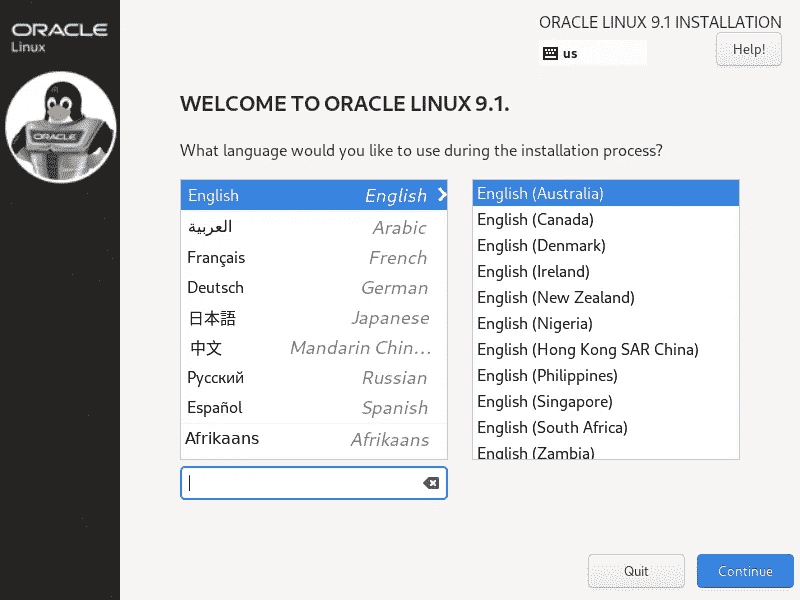

选择一种语言，然后将出现主安装屏幕。

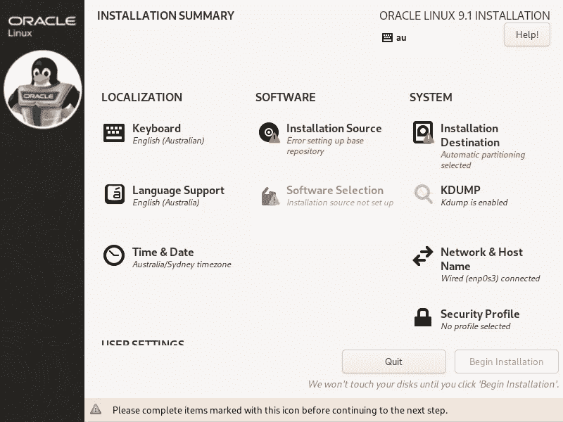

因为引导 iso 映像不包含软件包，所以需要手动指定网络存储库。

二进制包的可能回购包括:

*   美国英特尔公司(财富 500 强公司之一ˌ以生产 CPU 芯片著称)

[https://yum . Oracle . com/repo/Oracle Linux/OL9/baseos/latest/x86 _ 64/](https://yum.oracle.com/repo/OracleLinux/OL9/baseos/latest/x86_64/)

*   手臂ˌ武器ˌ袖子ˌ装备

[http://yum . Oracle . com/repo/Oracle Linux/OL9/baseos/latest/aarch 64](http://yum.oracle.com/repo/OracleLinux/OL9/baseos/latest/aarch64)

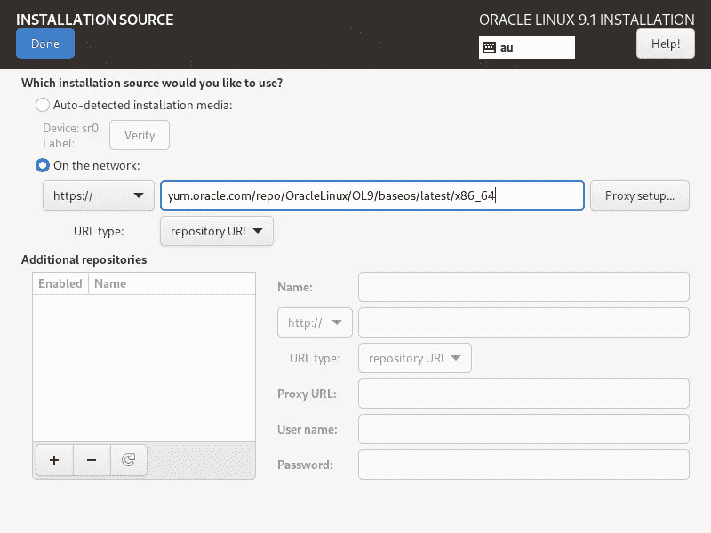

指定 repo 后，安装程序将检查 URL 是否正确。

接下来，返回主安装屏幕并指定 root 密码。

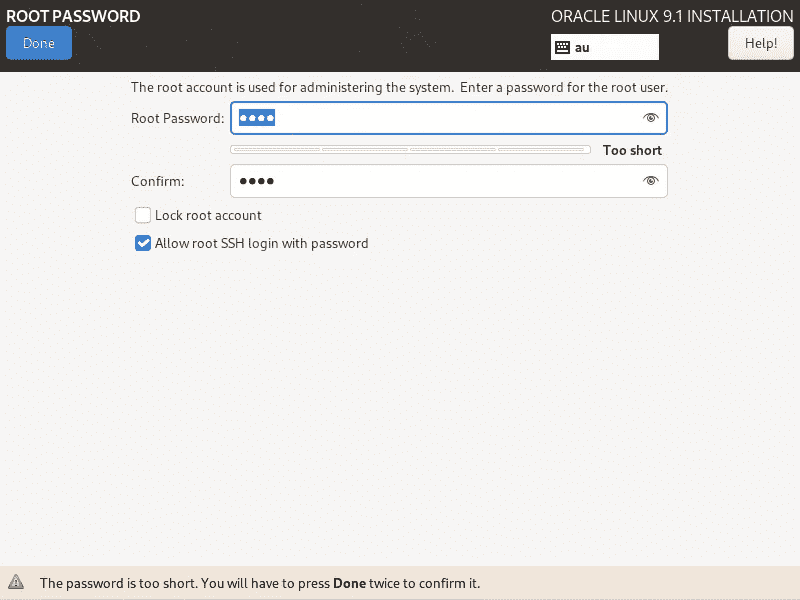

然后可以指定要安装的环境类型。

没有完整的 9GB iso 映像所具有的环境范围，但即使是基本安装也会有一个 web 界面(稍后显示)。

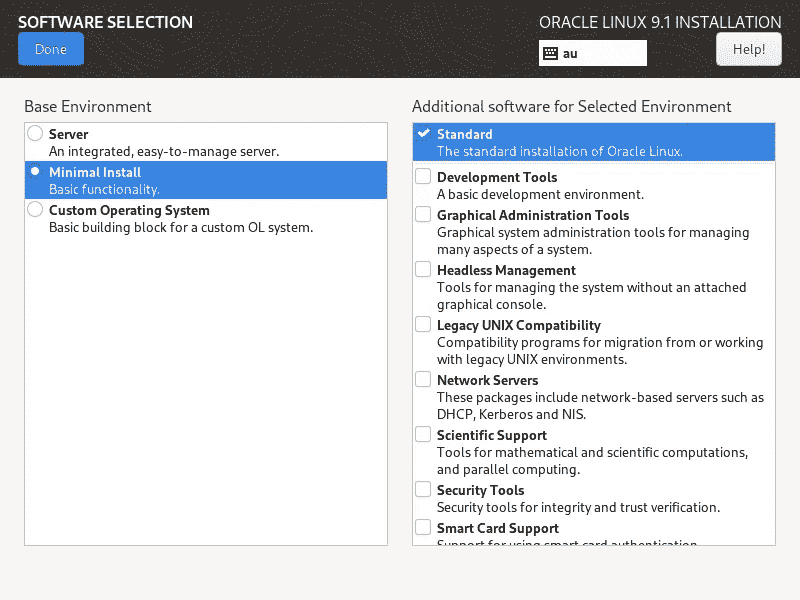

在主安装屏幕上，当所有缺少的细节都完成后，您就可以开始安装了。

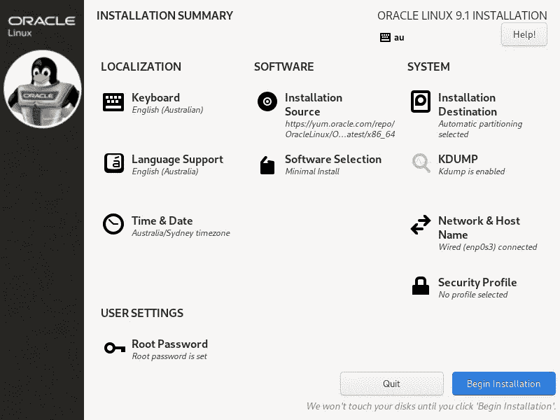

安装将包括从前面指定的 URL 下载软件包。

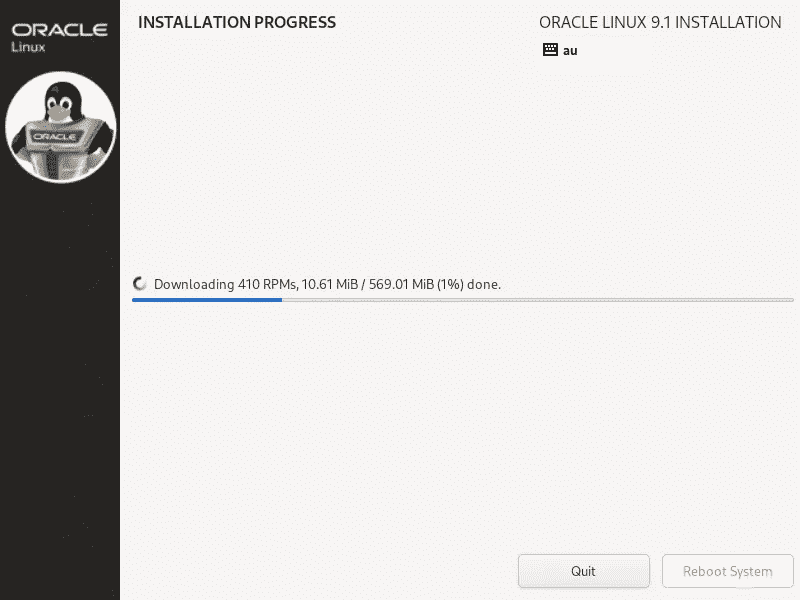

几分钟后，安装完成。

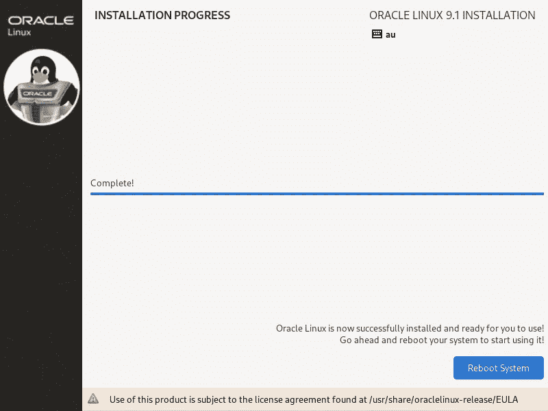

## 启动

重新启动后，将显示登录屏幕，并会显示一条激活 web 控制台的消息，如下所示:

```
systemctl enable --now cockpit.socket
```

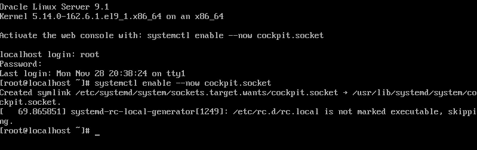

启用 web 控制台后，下次重新启动时，您会收到另一条消息，其中包含 web 控制台的 URL。

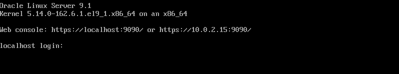

如果您在 Virtualbox 虚拟机中运行 Oracle Linux，那么您将能够通过本地端口转发进行连接，类似于从浏览器进行连接:

```
http://localhost:9090/
```

然后，您在另一台主机上的浏览器将为您提供登录 web 控制台的机会。

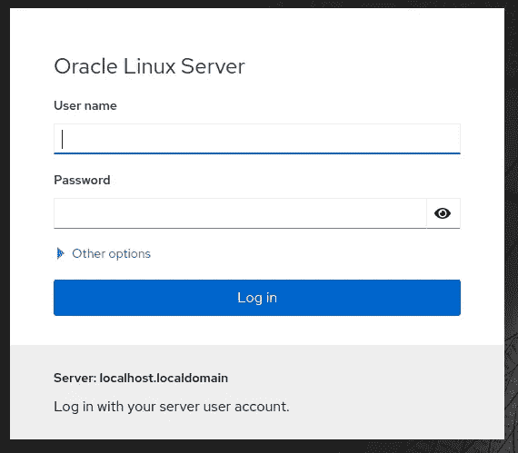

登录后，您将看到 web 控制台的功能。

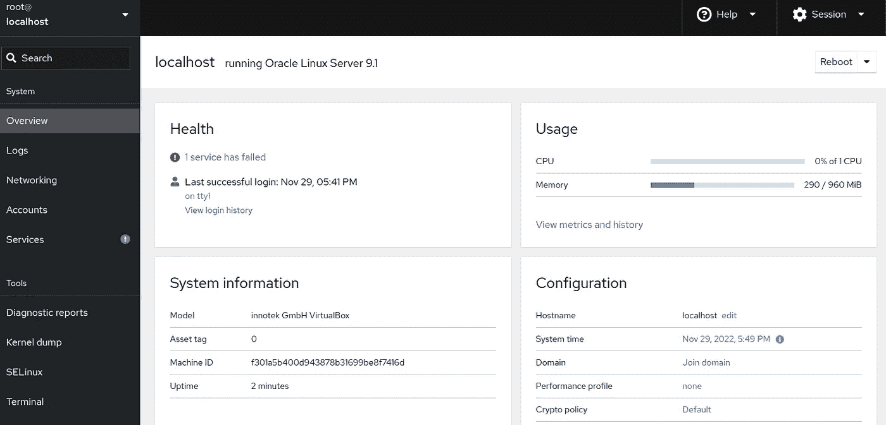

Paul Guerin 出席了一些世界领先的甲骨文会议，包括 2013 年甲骨文全球大会。自 2015 年以来，他的工作一直是 IOUG 最佳实践技巧小册子以及 AUSOUG、Oracle Technology Network、Quest 和 Oracle Developers (Medium)出版物的主题。2019 年，他被授予 My Oracle 支持社区最有价值贡献者。他将继续参与 Oracle ACE 计划。

想谈谈吗？借 [devs 公开松绑](https://bit.ly/odevrel_slack)！