# 使用 VTAP 和 OpenSearch 在 OCI 进行网络监控和分析

> 原文：<https://medium.com/oracledevs/network-monitoring-and-analysis-in-oci-using-vtap-and-opensearch-5100da1dbf23?source=collection_archive---------0----------------------->

在本文中，我们将了解 OCI 的两项新功能/服务:虚拟测试访问点(VTAP)和开放搜索。要了解更多关于 VTAP 的情况，请阅读米莎·卡斯温的博客文章或[本·沃尔兹的](https://www.ateam-oracle.com/authors/ben-woltz)和[的例子](https://www.ateam-oracle.com/post/mirroring-traffic-in-oci-using-vtap)。但如果你很着急，我在这里为你总结一下:VTAP 允许你复制(或镜像)你网络中特定点的网络流量，过滤你感兴趣的流量，并将其发送到网络分析工具进行进一步分析。


VTAP 由 3 部分组成:

*   一个来源
*   一个或多个捕获过滤器，可让您专注于想要镜像的所需网络流量类型
*   一个目标

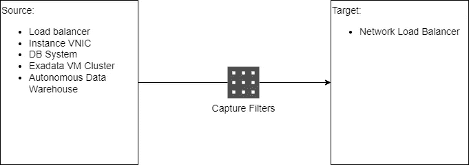

VTAP

为了举例说明这一点，我们将使用 VTAP 捕获一个传入流量，并将捕获的网络数据插入 OCI 的 OpenSearch 服务。从概念上讲，这是我们将尝试做的事情:

*   我们的工作负载是一个运行在 OKE 上的微服务，它连接到一个 DB 服务以实现持久性。
*   它可以通过由入口控制器实例化的 HTTP 负载平衡器公开访问。
*   我们将在 HTTP 负载平衡器上设置一个 VTAP，将到达 HTTP 负载平衡器的网络流量镜像到运行 Wireshark 的虚拟机。在以后的文章中，我们还将在 worker 节点和 DB 系统上添加 VTAPs，但是不要急于求成。
*   在 Wireshark 虚拟机上，我们将捕获镜像流量，将其写入文件，然后将其发送到 OpenSearch
*   管理员用户将访问 OpenSearch 仪表板来分析流量

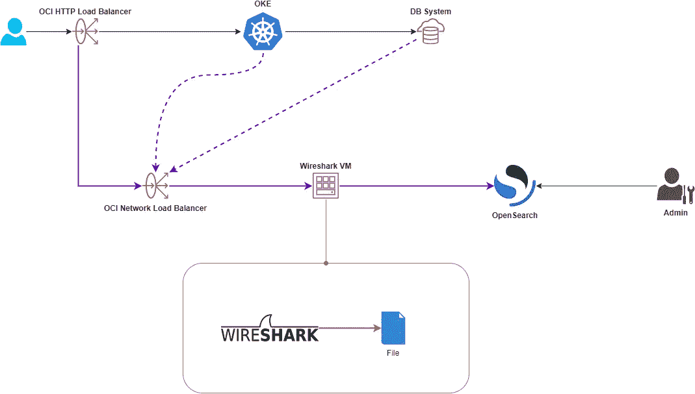

Solution Architecture

## 建立基础设施

为了实现上述目标，我们需要建立以下基础设施:

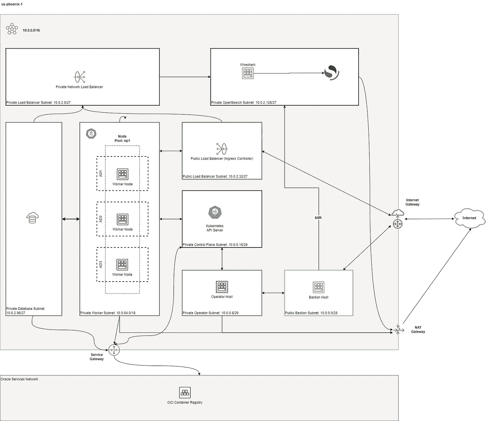

Infrastructure

1.  部署了入口控制器的私有 OKE 集群
2.  运行简单微服务的私有工作节点。对于本文，运行 ACME 网站就足够了。
3.  一个专用网络负载平衡器，它将从 VTAP 接收镜像流量，并将其发送到运行 Wireshark 的主机
4.  私人开放搜索服务
5.  堡垒主机，或者您也可以使用 OCI 堡垒服务来访问 Wireshark 虚拟机和 OpenSearch

我正在使用 [terraform-oci-oke](https://github.com/oracle-terraform-modules/terraform-oci-oke) 来创建我的集群。就附加安全规则而言，我们还需要在 NSG 中添加以下附加规则，但 OpenSearch 除外，我们将对其使用安全列表:

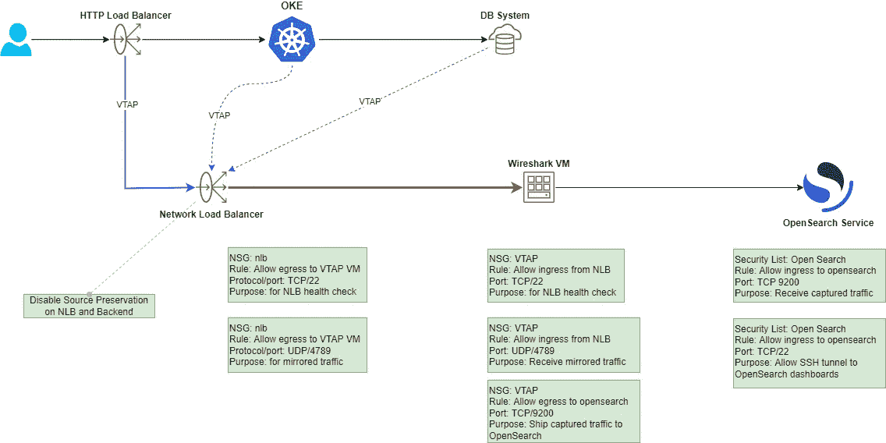

Additional security rules

您可以使用 Terraform 将它们作为扩展添加到其他 NSG 或安全列表中。

## 部署入口控制器

我们将使用 [ingress-nginx](https://kubernetes.github.io/ingress-nginx/) 作为入口控制器:

```
helm repo add ingress-nginx [https://kubernetes.github.io/ingress-nginx](https://kubernetes.github.io/ingress-nginx)helm show values ingress-nginx/ingress-nginx > nginx.yaml
```

编辑 nginx.yaml 并添加以下服务注释:

```
service.beta.kubernetes.io/oci-load-balancer-security-list-management-mode: "None"
oci.oraclecloud.com/oci-network-security-groups: "<public-lb-nsg-id>"
```

试运行安装以验证您已经正确设置了服务注释:

```
helm install --dry-run nginx ingress-nginx/ingress-nginx -f nginx.yaml
```

如果您做得很好，您可以继续安装:

```
helm install nginx ingress-nginx/ingress-nginx -n ingress-nginx --create-namespace -f nginx.yaml
```

这将创建一个公共 HTTP 负载平衡器。

## 部署 ACME 网站服务(可选)

我们现在将部署 ACME 网站服务。这是一个运行单一页面的简单网站，非常适合测试部署。

```
kubectl apply -f [https://raw.githubusercontent.com/hyder/okesamples/master/ingresscontrollers/acme/acme-website.yaml](https://raw.githubusercontent.com/hyder/okesamples/master/ingresscontrollers/acme/acme-website.yaml)
```

创建入口，确保为下面的主机参数设置了正确的值:

```
kubectl apply -f - <<EOF
apiVersion: networking.k8s.io/v1
kind: Ingress
metadata:
  name: acme-website
  annotations:
    kubernetes.io/ingress.class: "nginx"
spec:
  rules:
  - host: ***f.q.d.n***
    http:
      paths:
      - path: /
        pathType: Prefix
        backend:
          service:
            name: acme-website
            port:
              number: 80
EOF
```

然后按照[上一篇文章](/oracledevs/loadbalancer-service-oracle-container-engine-oke-and-oci-dns-d7b1f7b4f9bd)中的步骤添加一个 DNS 记录。在浏览器/curl 中测试您的服务:


## 创建 OpenSearch 集群

需要注意的一点是，OpenSearch 还不使用 NSGs，因此您必须创建一个安全列表，并将其与 opensearch 子网相关联。

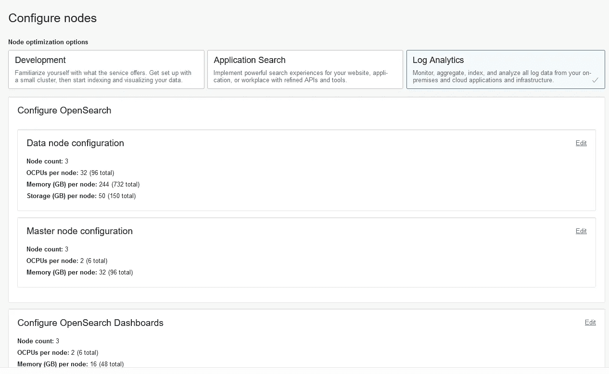

Creating an OpenSearch Cluster

调配群集后，您可以在详细信息页面上检索端点:

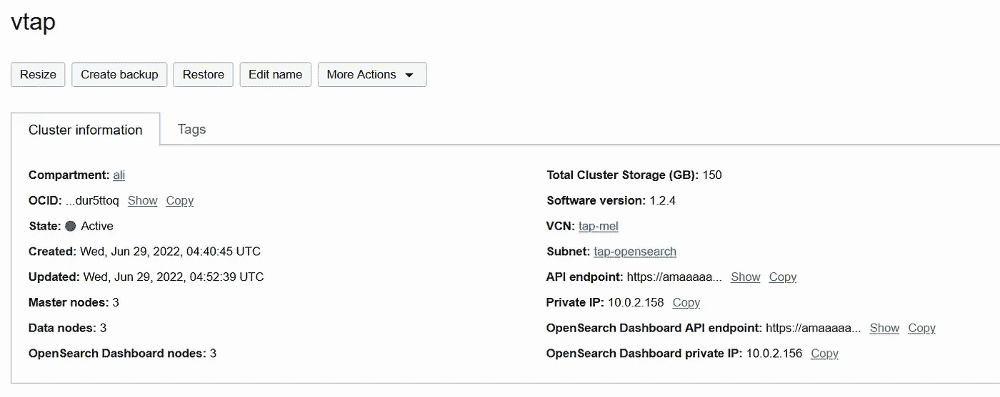

OpenSearch Cluster detail

注意有两个 API 端点:

1.  OpenSearch API 端点
2.  OpenSearch 仪表板 API 端点

同样，也有 2 个私有 IP 地址:

1.  私有 IP 实际上是 API 端点的 IP 地址
2.  OpenSearch 仪表板私有 IP

我们将同时使用这两种工具，所以请记住从哪里获取它们。

## 部署 Wireshark 虚拟机

使用 Ubuntu 平台映像创建一个计算实例，将其部署到私有运营商子网，并确保您已经选择了运营商 NSG，这样您就可以通过 bastion 主机 ssh 到它。

配置完成后，ssh 到 Wireshark 虚拟机并安装 [tshark](https://www.wireshark.org/docs/wsug_html_chunked/AppToolstshark.html) ，一个基于终端的 Wireshark:

```
ssh -i /path/private/key -J opc@<bastion-public-ip> ubuntu@<wireshark-private-ip>sudo apt update && sudo apt install -y tshark
```

当提示允许非超级用户捕获数据包时，选择“是”。

授予 *ubuntu* 用户使用 Wireshark 的权限:

```
sudo usermod -aG wireshark $USER
```

注销您的终端会话并重新登录，检查您是否可以运行 tshark 而不出现任何问题:

```
ubuntu@tap-wireshark:~$ tshark -i ens3
Capturing on 'ens3'
 ** (tshark:3266) 04:46:41.473914 [Main MESSAGE] -- Capture started.
 ** (tshark:3266) 04:46:41.473964 [Main MESSAGE] -- File: "/tmp/wireshark_ens3FKTJO1.pcapng"
    1 0.000000000    10.0.0.11 → 10.0.0.4     SSH 286 Server: Encrypted packet (len=220)
    2 0.000167397     10.0.0.4 → 10.0.0.11    TCP 66 42930 → 22 [ACK] Seq=1 Ack=221 Win=463 Len=0 TSval=1035716911 TSecr=861840753
```

在 OCI 控制台中，导航到 Wireshark 实例页面，然后单击“连接的虚拟网卡”。我们将在 opensearch 子网中创建一个辅助 VNIC，专门将我们的流量数据从网络负载平衡器发送到此。这样做有助于我们将流量数据与其他数据隔离开来，例如 ssh 到实例本身。创建虚拟网卡时，还要选择 wireshark NSG，并确保未选中“跳过源/目的地检查”**。**

**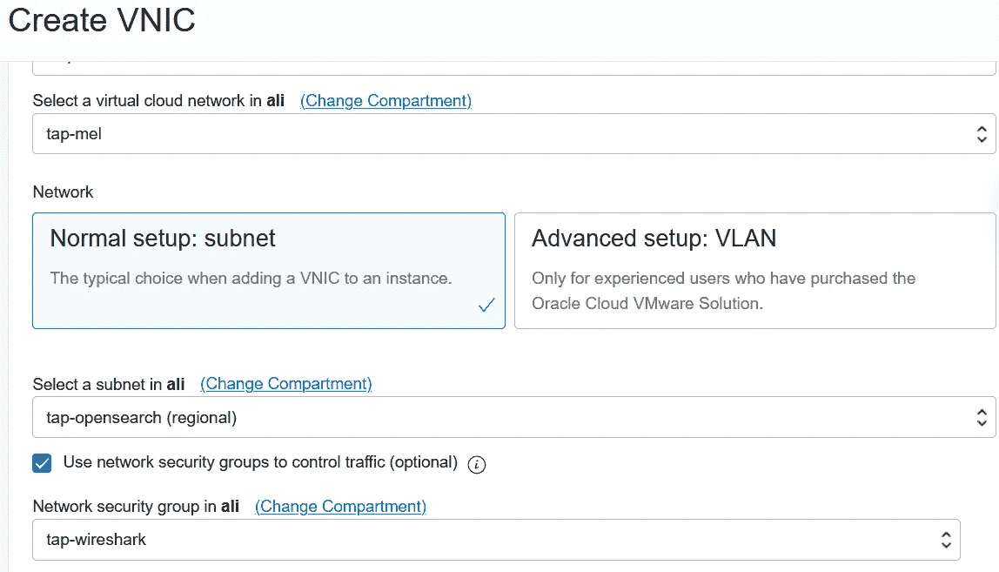**

**Creating the second VNIC**

**此时，VNIC 已创建，但尚未配置。让我们下载并运行[脚本来配置第二个虚拟网卡](https://docs.oracle.com/en-us/iaas/Content/Network/Tasks/managingVNICs.htm#Linux):**

```
curl [https://docs.oracle.com/en-us/iaas/Content/Resources/Assets/secondary_vnic_all_configure.sh](https://docs.oracle.com/en-us/iaas/Content/Resources/Assets/secondary_vnic_all_configure.sh) -Ochmod +x secondary_vnic_all_configure.sh sudo ./secondary_vnic_all_configure.sh -c
```

**您应该会看到如下所示的内容:**

```
Info: adding IP config for VNIC MAC 02:00:17:00:c9:c6 with id ocid1.vnic......
Info: added IP address 10.0.2.135 on interface ens5 with MTU 9000
Info: added rule for routing from 10.0.2.135 lookup ort1 with default via 10.0.2.129
```

**现在检查新网络接口是否有 IP 地址:**

```
ubuntu@tap-wireshark:~$ ip address show
1: lo: <LOOPBACK,UP,LOWER_UP> mtu 65536 qdisc noqueue state UNKNOWN group default qlen 1000
    link/loopback 00:00:00:00:00:00 brd 00:00:00:00:00:00
    inet 127.0.0.1/8 scope host lo
       valid_lft forever preferred_lft forever
    inet6 ::1/128 scope host
       valid_lft forever preferred_lft forever
2: ens3: <BROADCAST,MULTICAST,UP,LOWER_UP> mtu 9000 qdisc pfifo_fast state UP group default qlen 1000
    link/ether 02:00:17:00:e1:d6 brd ff:ff:ff:ff:ff:ff
    altname enp0s3
    inet 10.0.0.11/29 metric 100 brd 10.0.0.15 scope global ens3
       valid_lft forever preferred_lft forever
    inet6 fe80::17ff:fe00:e1d6/64 scope link
       valid_lft forever preferred_lft forever
3: ens5: <BROADCAST,MULTICAST,UP,LOWER_UP> mtu 9000 qdisc fq_codel state UP group default qlen 1000
    link/ether 02:00:17:00:c9:c6 brd ff:ff:ff:ff:ff:ff
    altname enp0s5
    inet **10.0.2.135/27** scope global ens5
       valid_lft forever preferred_lft forever
    inet6 fe80::17ff:fe00:c9c6/64 scope link
       valid_lft forever preferred_lft forever
```

**太棒了。**

**我们的 OpenSearch 集群应该准备好了，这样我们就可以检查是否可以从 Wireshark 虚拟机连接到 OpenSearch 集群。从集群详细信息页面复制 OpenSearch API 端点，用它替换下面的粗体并运行 curl:**

```
curl -k [https://**<OpenSearch API Endpoint>**:9200](https://amaaaaaadoggtjaavogwcspf5hjkkhbgda2qcbjbfxrkjids552ndur5ttoq.opensearch.ap-melbourne-1.oci.oracleiaas.com:9200){
  "name" : "opensearch-master-2",
  "cluster_name" : "opensearch",
  "cluster_uuid" : "EB998EMAQSuE37d71g8VcA",
  "version" : {
    "distribution" : "opensearch",
    "number" : "1.2.4",
    "build_type" : "tar",
    "build_hash" : "f0ac9204ab08d677ebcd4dfad4b66ff159991f46",
    "build_date" : "2022-03-14T22:05:06.345077Z",
    "build_snapshot" : false,
    "lucene_version" : "8.10.1",
    "minimum_wire_compatibility_version" : "6.8.0",
    "minimum_index_compatibility_version" : "6.0.0-beta1"
  },
  "tagline" : "The OpenSearch Project: [https://opensearch.org/](https://opensearch.org/)"
}
```

**最后，我们必须在 ufw 中打开 4789 上的 UDP 端口，以允许来自网络负载平衡器的网络数据:**

```
sudo ufw allow from 10.0.2.0/27 to any port 22 proto tcp
sudo ufw allow from 10.0.2.0/27 to any port 4789 proto udpsudo ufw enable
```

**列出打开的端口，以确保:**

```
ubuntu@wireshark:~$ sudo ufw status
Status: activeTo                         Action      From
--                         ------      ----
22/tcp                     ALLOW       10.0.2.0/27
4789/udp                   ALLOW       10.0.2.0/27
```

## **为 VTAP 创建网络负载平衡器**

**在创建 vtap 之前，我们先创建一个网络负载平衡器。导航到网络>负载平衡器并创建一个网络负载平衡器:**

**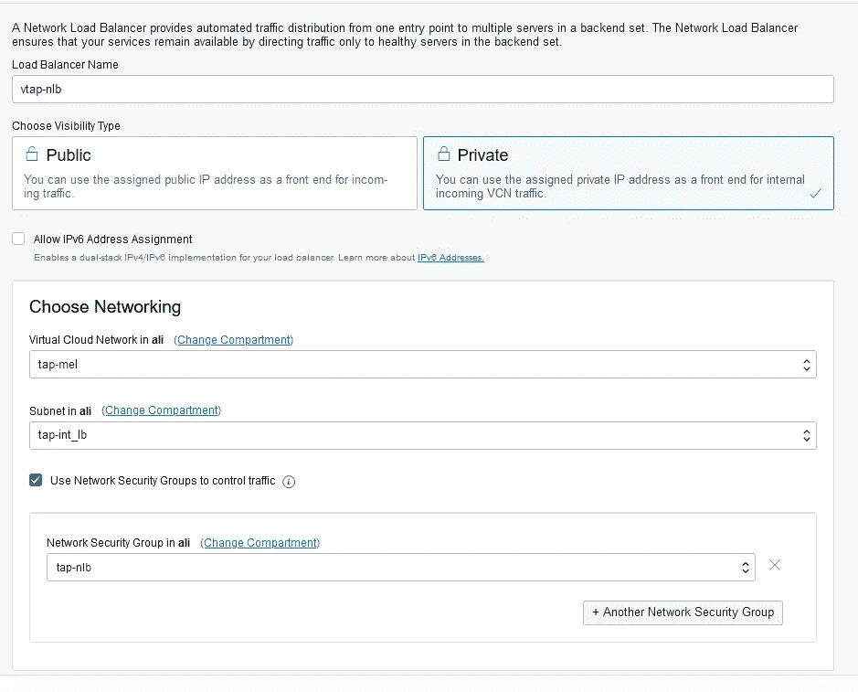**

**Create the NLB for VTAP**

**在监听器上，选择 UDP:**

**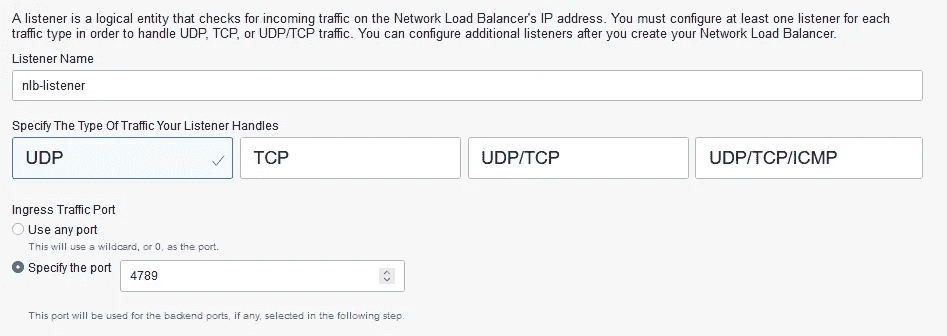**

**Create the NLB Listener**

**在“后端集”页面上，确保未选中负载平衡器和用于保留源/目标头的后端选项:**

**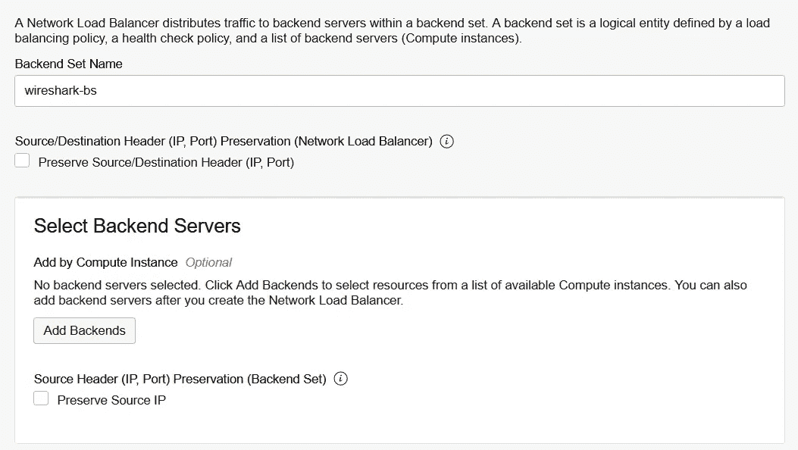**

**然后，您可以添加后端。在后端页面上，选择 Wireshark 虚拟机，并确保选择第二个虚拟网卡的 IP 地址:**

**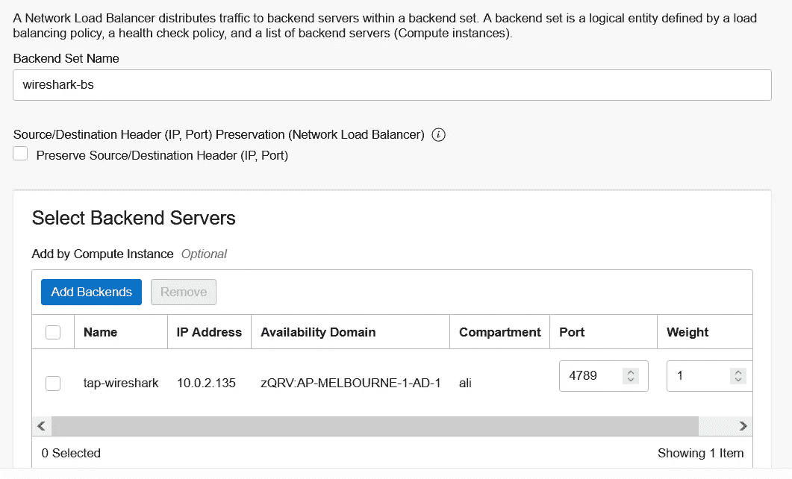**

**Selecting the correct VNIC for the wireshark backend**

**在运行状况检查策略部分，选择端口 22 上的“TCP ”:**

**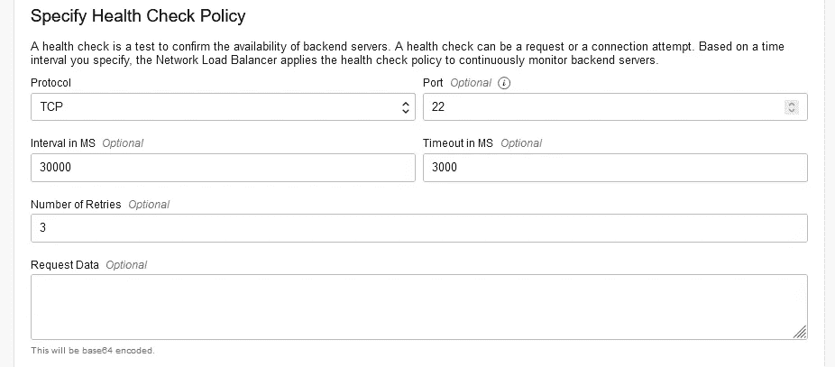**

**我们现在准备创建 VTAP。**

## **创造 VTAP**

**导航至 VCN 页面并创建 VTAP:**

**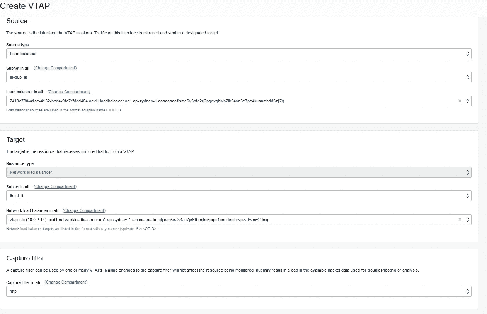**

**Create a VTAP**

**同时为 http 和 https 创建一个捕获过滤器:**

**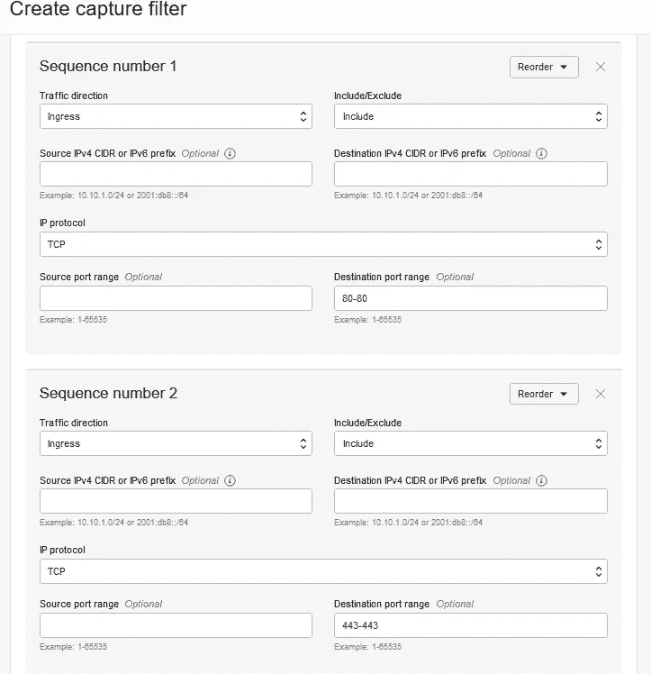**

**Capture filter rules**

**默认情况下，VTAP 将被停止，因此您需要启动它。现在，我们需要测试我们是否能够接收镜像流量。在 Wireshark 虚拟机上，让我们使用 tcpdump 进行快速测试:**

```
$ sudo tcpdump -nn -i ens5 udp
tcpdump: verbose output suppressed, use -v[v]... for full protocol decode
listening on ens5, link-type EN10MB (Ethernet), snapshot length 262144 bytes
```

**使用 curl 或您的浏览器点击 http 负载平衡器 IP 地址，如果您没有部署 acme 网站，您应该会得到 404 响应。没关系。入口控制器只是以 404 作为响应。但是，在 tcpdump 输出中，每当您在浏览器中点击负载平衡器时，您应该会看到一个输出:**

```
12:15:25.132960 IP 10.0.2.18.18066 > 10.0.2.15.4789: VXLAN, flags [I] (0x08), vni 129057
IP 123.123.123.123.58177 > 10.0.2.56.80: Flags [S], seq 79568112, win 64240, options [mss 1440,nop,wscale 8,nop,nop,sackOK], length 0
12:15:25.153063 IP 10.0.2.18.18066 > 10.0.2.15.4789: VXLAN, flags [I] (0x08), vni 129057
IP 123.123.123.123.58177 > 10.0.2.56.80: Flags [.], ack 1967181215, win 517, length 0
12:15:25.157493 IP 10.0.2.18.18066 > 10.0.2.15.4789: VXLAN, flags [I] (0x08), vni 129057
IP 123.123.123.123.58177 > 10.0.2.56.80: Flags [P.], seq 0:348, ack 1, win 517, length 348: HTTP: GET / HTTP/1.1
12:15:25.198446 IP 10.0.2.18.18066 > 10.0.2.15.4789: VXLAN, flags [I] (0x08), vni 129057
IP 123.123.123.123.58177 > 10.0.2.56.80: Flags [P.], seq 348:650, ack 280, win 516, length 302: HTTP: GET /favicon.ico HTTP/1.1
12:15:25.198446 IP 10.0.2.18.18066 > 10.0.2.15.4789: VXLAN, flags [I] (0x08), vni 129057
IP 123.123.123.123.58177 > 10.0.2.56.80: Flags [F.], seq 650, ack 280, win 516, length 0
12:15:25.219993 IP 10.0.2.18.18066 > 10.0.2.15.4789: VXLAN, flags [I] (0x08), vni 129057
IP 123.123.123.123.58177 > 10.0.2.56.80: Flags [.], ack 281, win 516, length 0
```

**这里有几个 IP 地址。让我们打开包装:**

*   **10 . 0 . 2 . 28:NLB 的私有 IP 地址**
*   **10 . 0 . 2 . 15:Wireshark 虚拟机的辅助虚拟网卡的专用 IP 地址**
*   **10 . 0 . 2 . 56:HTTP 负载平衡器的私有 IP 地址**
*   **123.123.123.123:访问负载均衡器时我的(假)公共 IP 地址。**

**让我们用 Wireshark 捕获流量，进行一些离线分析:**

```
ubuntu@tap-wireshark:~$ tshark -i ens5 -w http.pcap udp
```

**将文件 scp 到您的笔记本电脑上，让我们用 Wireshark 做一点分析。点击统计>端点>地图>在浏览器中打开。我的同事 Rakesh Singh 非常有用地使用了一个专用 VPN 来生成来自世界各地的流量，这是 Wireshark 中可视化的捕获流量:**

**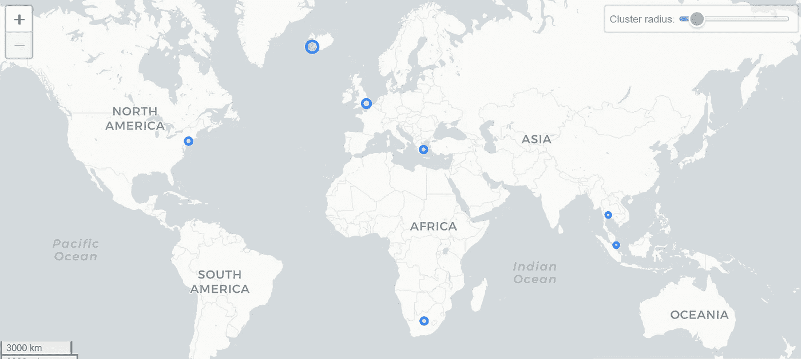**

**Origin of access in Wireshark**

## **访问 OpenSearch 仪表板**

**现在我们知道我们的网络流量正在顺利进入，我们希望使用 OpenSearch 仪表板进行一些分析。**

**首先，我们需要从 pcap 格式中提取数据，这样我们就可以将它加载到 OpenSearch 中。Wireshark 有一些输出选项，如 ek、json、jsonraw。让我们转换成 JSON，这样我们就可以把它上传到 OpenSearch:**

```
tshark -T ek -j "http tcp ip" -P -V -r http.pcap > http.json
```

**这基本上是从我们之前保存的 http.pcap 文件中读取，过滤 http、IP 和 TCP 协议，并将结果 JSON 保存到 http.json 文件中。**

**一旦我们将其转换成 JSON，我们就可以将数据上传到 OpenSearch:**

```
curl -k -H "Content-Type: application/x-ndjson" -XPOST [https://**<opensearch_api_endpoint>**:9200/_bulk](https://amaaaaaadoggtjaavogwcspf5hjkkhbgda2qcbjbfxrkjids552ndur5ttoq.opensearch.ap-melbourne-1.oci.oracleiaas.com:9200/_bulk) --data-binary "[@http](http://twitter.com/http).json"
```

**生成一个映射文件，作为 packets-* index 的模板加载，以便将 Wireshark 类型转换为 elasticsearch 类型:**

```
tshark -G elastic-mapping --elastic-mapping-filter ip > template.json
```

**像以前一样，将模板映射上传到 OpenSearch:**

```
curl -k -H "Content-Type: application/x-ndjson" -XPOST [https://**<opensearch_api_endpoint>**:9200/](https://amaaaaaadoggtjaavogwcspf5hjkkhbgda2qcbjbfxrkjids552ndur5ttoq.opensearch.ap-melbourne-1.oci.oracleiaas.com:9200/_bulk)_template/packets?include_type_name=true --data-binary "[@t](http://twitter.com/http)emplate.json"
```

**现在让我们通过 bastion 访问 OpenSearch 仪表板:**

```
ssh -C -t -L 127.0.0.1:5601:**10.0.2.156**:5601 -L 127.0.0.1:9200:**10.0.2.158**:9200 opc@<bastion_ip> 
```

**上面的第一个 IP 地址(10.0.2.156)是 OpenSearch 仪表板专用 IP 地址，而第二个 IP 地址(10.0.2.158)是 OpenSearch 专用 IP 地址。您需要创建一个带有正确端口的到正确目标的隧道。创建完成后，您可以在本地访问 OpenSearch 仪表板: [https://localhost:5601](https://localhost:5601)**

**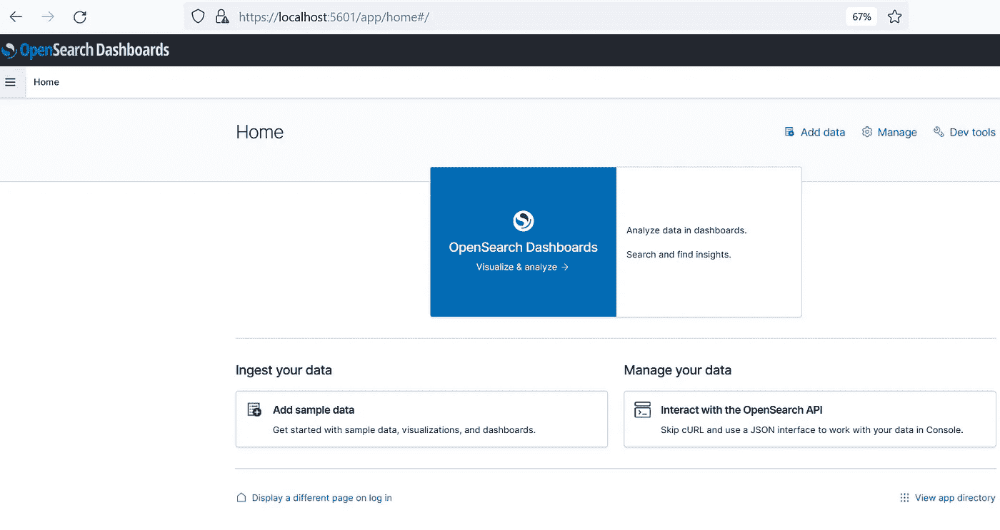**

**Accessing OpenSearch Dashboard locally**

**点击左侧菜单>堆栈管理:**

**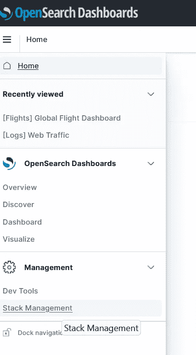**

**然后，单击索引模式>创建索引模式。在索引模式名称中，键入*数据包-** ，然后单击“下一步”:**

**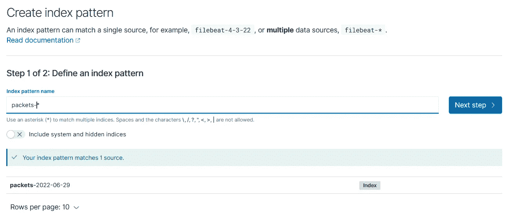**

**Creating an index pattern**

**选择“时间戳”作为时间字段，并创建索引模式。**

**现在，再次单击菜单，然后单击“发现”。您应该能够在 OpenSearch Dashboard 中看到您捕获的流量:**

**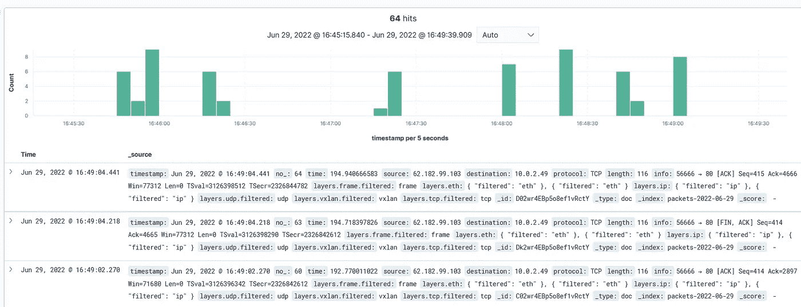**

**OpenSearch Dashboard**

**从这里，您可以创建您自己的漂亮的可视化和仪表板，用于进一步的分析。**

## **摘要**

**这篇文章向你介绍了:**

*   **VCN 的一个新特性——虚拟测试接入点，又名 VTAP**
*   **如何配置使用 VTAP 的 NSG 和安全规则**
*   **如何使用 Wireshark 捕获镜像流量**
*   **将捕获的 Wireshark 跟踪转换为 JSON 格式**
*   **将转换后的跟踪推送到 OCI OpenSearch 仪表板**

**在本练习中，我们仅从一个来源(HTTP 负载平衡器)捕获流量。我们也是手动做几个步骤。在以后的文章中，我们将尝试同时捕获多个跟踪，并自动上传跟踪。**

**我希望这篇文章对你有用。我要感谢我的同事 Shaun Levey、Avi Miller、Andrea Marchesini 和 Rakesh Singh 对这个职位及时作出的贡献和最有帮助的建议。**

**来和[在我们的公共休闲时间](https://bit.ly/devrel_slack)讨论一下吧！**

## **参考**

**[tshark + ElasticSearch](https://www.h21lab.com/tools/tshark-elasticsearch)**

**[Wireshark 可视化提示和技巧](https://sharkfestus.wireshark.org/assets/presentations19/28-37.pdf)**

**[ElasticSearch 7 根映射定义有不支持的参数](https://stackoverflow.com/questions/55699623/elasticsearch-7-root-mapping-definition-has-unsupported-parameters-mapper-par)**