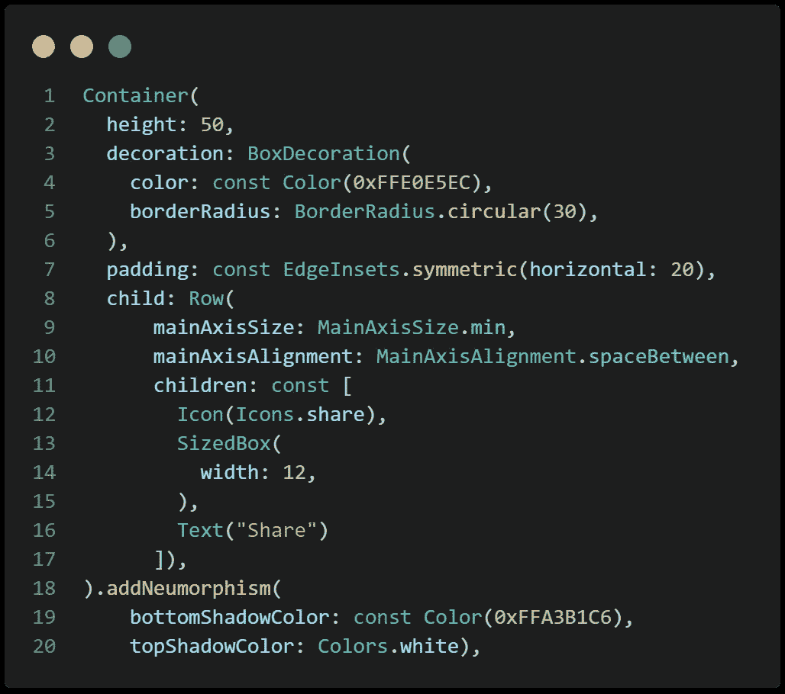

# 神经形态小部件— Dart 扩展#2

> 原文：<https://medium.easyread.co/neumorphismwidget-dart-extension-2-3259e650e177?source=collection_archive---------0----------------------->

## 创建具有神经形态设计的颤振部件

欢迎来到飞镖 [**延伸**](https://dart.dev/guides/language/extension-methods) 系列。一篇关于我用来开发****apps 的 [**扩展**](https://dart.dev/guides/language/extension-methods) 方法的文章。在上一篇文章中，我探索了[地图排序](https://pmatatias.medium.com/map-sorting-dart-extension-1-e98747ad9635)。如果你错过了，可以通过本文末尾的链接阅读。****

****darts 扩展系列的第二篇文章将探索 flutter 应用程序中的 neumorphism 小部件。新形态是 UI 设计的新趋势。你可能会在几个平台上发现很多使用这种风格的设计，比如 [*运球*](https://dribbble.com/search/neomorphism) 、 [*Pinterest*](https://www.pinterest.com/lenaatz/neomorphism-ui/) 等。****

****要实现窗口小部件的变形，添加阴影是必须的。要在 [**小部件**](https://api.flutter.dev/flutter/widgets/widgets-library.html) 上创建阴影，常见的方法是将其包裹在 [**容器**](https://api.flutter.dev/flutter/widgets/Container-class.html) 中。我们需要[**box shadow**](https://api.flutter.dev/flutter/painting/BoxShadow-class.html)**from[**box decoration**](https://api.flutter.dev/flutter/painting/BoxDecoration-class.html)**属性。而提供[**box decoration**](https://api.flutter.dev/flutter/painting/BoxDecoration-class.html)的小部件之一就是 [**容器**](https://api.flutter.dev/flutter/widgets/Container-class.html) 小部件。所以基本上，在这个方法中，我们将通过把它包装在一个 [**容器**](https://api.flutter.dev/flutter/widgets/Container-class.html) 中来给 [**小部件**](https://api.flutter.dev/flutter/widgets/widgets-library.html) 添加神经变形功能。********

****这就是 [**扩展**](https://dart.dev/guides/language/extension-methods) 的方法:****

> ****属性:****

*   ****[**双**](https://api.dart.dev/stable/2.18.3/dart-core/double-class.html) `**borderRadius**` :创建圆角的方框。****
*   ****[**偏移**](https://api.flutter.dev/flutter/dart-ui/Offset-class.html) `**offset**` :创建一个偏移。第一个参数设置水平分量`dx`，第二个参数设置垂直分量`dy`。****
*   ****[**double**](https://api.dart.dev/stable/2.18.3/dart-core/double-class.html)**`**blurRadius**` :高斯与阴影形状卷积的标准差。应用于[**box shadow**](https://api.flutter.dev/flutter/painting/BoxShadow-class.html)**属性。********
*   ******[**颜色**](https://api.flutter.dev/flutter/dart-ui/Color-class.html) `**topShadowColor**`:出现在左上角的阴影颜色。******
*   ****[**颜色**](https://api.flutter.dev/flutter/dart-ui/Color-class.html) `**bottomShadowColor**`:出现在右下角的阴影颜色。****

****我只是在左上角和右下角应用阴影。您还可以自定义该方法，这样您就可以通过在列表中添加一个[**box shadow**](https://api.flutter.dev/flutter/painting/BoxShadow-class.html)**并设置左下方的 [**Offset**](https://api.flutter.dev/flutter/dart-ui/Offset-class.html) ( —，+)和右上方的 [**Offset**](https://api.flutter.dev/flutter/dart-ui/Offset-class.html) ( +，—)来为所有边添加阴影。******

## ****履行****

****我发现了一篇关于神经形态设计的很棒的[文章](https://uxplanet.org/neumorphism-in-user-interface-tutorial-c353698ac5c0)，作者 [Kanhaiya Sharma](https://medium.com/u/c4aaf966a474?source=post_page-----3259e650e177--------------------------------) 。正如他提到的****

> ****“神经形态设计就是选择正确的调色板。对于神经形态效果，你需要 3 个相同颜色的阴影。”****

****现在，我将采用 3 种示例颜色，并在上面的 [**扩展**](https://dart.dev/guides/language/extension-methods) 方法中实现它们。****

*   ****光影:`**Color(0xFFFFFFFF)**`****
*   ****主背景及元素颜色:`**Color(0xFFE0E5EC)**`****
*   ****暗影:`**Color(0xFFA3B1C6)**`****

> ****我们用主背景色设置`Scaffold`的背景色，****

********

****background color****

> ****接下来为小部件添加亮阴影和暗阴影****

****由于我们是在扩展 [**小部件**](https://api.flutter.dev/flutter/widgets/widgets-library.html) ，所以可以在 [**小部件**](https://api.flutter.dev/flutter/widgets/widgets-library.html) 的“右括号”后面增加一个纽形方法。而且别忘了，你要导入的时候小工具和 [**扩展**](https://dart.dev/guides/language/extension-methods) 的方法都是分开在一个不同的文件里。****

********

****share btn code****

****暗阴影作为`bottomShadowColor`而对于`topShadowColor`我们使用光阴影。结果是:****

********

****share btn****

****现在我们有了一个漂亮的带有神经形态风格的共享按钮。正如您在第一张图片中看到的，我创建了一些具有神经变形风格的按钮小部件。您可以通过下面的链接在 dartpad 上尝试****

> ****[“dart pad 演示神经变形小部件](https://dartpad.dev/?id=d80516dc3127fc29663ee5b7c245547a)”****

********

****demo result****

****谢谢你一直读到最后。如前所述，这是第二飞镖 [**延伸**](https://dart.dev/guides/language/extension-methods) 系列。如果你对第一篇文章感兴趣，你可以通过下面的链接阅读。****

**** [## 地图排序-省道扩展#1

### 在颤振中使用扩展方法对 Map 进行升序和降序排序

pmatatias.medium.com](https://pmatatias.medium.com/map-sorting-dart-extension-1-e98747ad9635) 

顺便说一下，我将收集 GitHub 存储库中的所有扩展方法。您可以通过以下链接获取。如果您有一个扩展方法并想共享它，请随意贡献给这个存储库。

 [## git hub-pmata tias/extension-Dart 采样器:一些出色的 extension 方法采样器| Dart

github.com](https://github.com/pmatatias/sampler-of-extension-Dart.git) 

参考:

*   [颤振响应电子邮件-ui—-移动-平板电脑-Web/extensions . dart(github.com)](https://github.com/abuanwar072/Flutter-responsive-email-ui---Mobile-Tablet-and-Web/blob/master/lib/extensions.dart)
*   [界面设计中的神经变形(Soft UI)——教程| UX 星球](https://uxplanet.org/neumorphism-in-user-interface-tutorial-c353698ac5c0)
*   [为 Figma on Behance 提供的免费 Neumorphism UI 套件](https://www.behance.net/gallery/92714821/FREE-Neumorphism-UI-kit-for-Figma)****