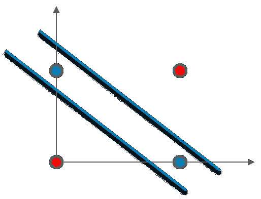

# 神经网络教程—了解如何建立多层神经网络模型

> 原文：<https://medium.com/edureka/neural-network-tutorial-2a46b22394c9?source=collection_archive---------0----------------------->


Neural Network Tutorial — Edureka

在这个神经网络教程中，我们将讨论称为多层感知器(人工神经网络)的感知器网络。

在本神经网络教程中，我们将讨论以下主题:

*   单层感知器的局限性
*   什么是多层感知器(人工神经网络)？
*   人工神经网络是如何工作的？
*   使用案例

这篇关于神经网络教程的文章将在最后包含一个用例。为了实现这个用例，我们将使用 TensorFlow。

现在，我将从讨论单层感知器的局限性开始。

# 单层感知器的局限性；

嗯，有两个主要问题:

*   单层 Percpetrons 无法对非线性可分离数据点进行分类。
*   单层感知器无法解决涉及大量参数的复杂问题。

## 单层 Percpetrons 无法对非线性可分离数据点进行分类

让我们以异或门为例来理解这一点。考虑下图:


在这里，你不能用一条直线来区分高点和低点。但是，我们可以用两条直线把它分开。考虑下图:



## 单层感知器无法解决涉及大量参数的复杂问题:

这里我也用一个例子来说明。

作为一家电子商务公司，你注意到你的销售额在下降。现在，你试着组建一个营销团队，销售产品以增加销售额。

营销团队可以通过各种方式营销您的产品，例如:

*   谷歌广告
*   个人电子邮件
*   相关网站上的销售广告
*   引用程序
*   博客等等。。。

考虑到所有可用的因素和选项，营销团队必须决定一个策略来进行最佳和有效的营销，但这项任务太复杂，人类无法分析，因为参数数量相当高。这个问题将不得不使用深度学习来解决。考虑下图:


他们可以只使用一种方式来推销他们的产品，也可以使用多种方式。

每种方式都有不同的优点和缺点，他们必须关注各种因素和选项，例如:


将发生的销售数量将取决于不同的分类输入、它们的子类别和它们的参数。然而，仅仅通过一个神经元(感知器)不可能从如此多的输入及其子参数进行计算。

这就是为什么要用一个以上的神经元来解决这个问题。考虑下图:


由于所有这些原因，单层感知器不能用于复杂的非线性问题。

接下来，在这个神经网络教程中，我将重点介绍多层感知器(MLP)。

# 什么是多层感知器？

正如你所知，我们的大脑是由数百万个神经元组成的，所以神经网络实际上只是感知器的组合，以不同的方式连接，并对不同的激活功能进行操作。

考虑下图:


*   **输入节点** —输入节点向网络提供来自外界的信息，统称为“输入层”。任何输入节点都不执行任何计算，它们只是将信息传递给隐藏节点。
*   **隐藏节点** —隐藏节点与外界没有直接联系(因此得名“隐藏”)。它们执行计算并将信息从输入节点传输到输出节点。隐藏节点的集合形成了“隐藏层”。虽然网络只有一个输入图层和一个输出图层，但它可以有零个或多个隐藏图层。多层感知器有一个或多个隐藏层。
*   **输出节点** —输出节点统称为“输出层”，负责计算和从网络向外界传输信息。

是的，你猜对了，我举个例子来解释一下——一个*人工神经网络*是如何工作的。

假设我们有一个足球队的数据，切尔西。该数据包含三列。最后一栏显示了切尔西是赢了比赛还是输了比赛。另外两栏大概是，上半场进球领先，下半场控球。控球时间是球队控球时间的百分比。所以，如果我说一个队在半场(45 分钟)有 50%的控球率，这意味着，这个队在 45 分钟里有 22.5 分钟有球。


最终的结果列可以有两个值 1 或 0，表示切尔西是否赢得了比赛。例如，我们可以看到，如果在上半场有 0 球领先，而在下半场切尔西有 80%的控球率，那么切尔西就赢了这场比赛。

现在，假设，我们想预测切尔西是否会赢得比赛，如果上半场的进球领先优势是 2，下半场的控球率是 32%。

这是一个二元分类问题，其中多层感知器可以从给定的示例(训练数据)中学习，并在给定新数据点的情况下做出明智的预测。我们将在下面看到多层感知器如何学习这样的关系。

多层感知器学习的过程被称为反向传播算法，我会推荐你阅读 [**反向传播**](/edureka/backpropagation-bd2cf8fdde81) 文章。

考虑下图:


# 正向传播:

这里，我们将向前传播，即计算输入的加权和并添加偏差。在输出层，我们将使用 softmax 函数来获得切尔西输赢的概率。

如果你注意到这个图表，赢的概率是 0.4，输的概率是 0.6。但是，根据我们的数据，我们知道当上半场的进球领先是 1，下半场的控球率是 42%时，切尔西会赢。我们的网络做出了错误的预测。

如果我们看到误差(比较网络输出和目标)，它是 0.6 和-0.6。

# 反向传播和权重更新；

我会推荐你参考 [*反向传播文章。*](/edureka/backpropagation-bd2cf8fdde81)

我们计算输出节点的总误差，并使用反向传播通过网络传播这些误差，以计算*梯度*。然后，我们使用优化方法，如*梯度下降*来“调整”**网络中的所有**权重，目的是减少输出层的误差。

让我解释一下梯度下降优化器的工作原理:

**步骤— 1:** 首先我们计算误差，考虑下面的等式:


**步骤— 2:** 根据我们得到的误差，它将计算误差随重量变化的变化率。


**第 3 步:**现在，根据重量的变化，我们将计算新的重量值。

如果我们现在再次向网络输入相同的例子，网络应该比以前表现得更好，因为权重现在已经被调整以最小化预测中的误差。考虑下面的例子，如图所示，与之前的[0.6，-0.4]相比，输出节点的误差现在减少到[0.2，-0.2]。这意味着我们的网络已经学会正确分类我们的第一个训练样本。


我们对数据集中的所有其他训练示例重复此过程。然后，我们的网络据说已经*学会了*那些例子。

现在，我可以向我们的网络输入信息。如果我把上半场的进球领先数输入为 2，下半场的控球率输入为 32%，我们的网络将预测切尔西是否会赢得这场比赛。

在这篇文章中，我们将体验动手的乐趣。我将使用张量流来模拟一个多层神经网络。

# 使用案例:

让我们看看我们的问题陈述:


现在，让我们看看数据集，我们将使用它来训练我们的网络。


前四列是要素，最后一列是标注。

数据是从图像中提取的，这些图像取自真的和伪造的类似钞票的样本。最终图像的像素为 400×400。由于物镜和到所研究物体灰度的距离，获得了分辨率约为 660 dpi 的照片。小波变换工具用于从图像中提取特征。

为了实现这个用例，我们将使用下面的流程图:


让我们现在执行它:

```
import matplotlib.pyplot as plt
import tensorflow as tf
import numpy as np
import pandas as pd
from sklearn.preprocessing import LabelEncoder
from sklearn.utils import shuffle
from sklearn.model_selection import train_test_split

# Reading the dataset
def read_dataset():
    df = pd.read_csv("C:\\Users\\Saurabh\\PycharmProjects\\Neural Network Tutorial\\banknote.csv")
    # print(len(df.columns))
    X = df[df.columns[0:4]].values
    y = df[df.columns[4]]

    # Encode the dependent variable
    Y = one_hot_encode(y)
    print(X.shape)
    return (X, Y)

# Define the encoder function.
def one_hot_encode(labels):
    n_labels = len(labels)
    n_unique_labels = len(np.unique(labels))
    one_hot_encode = np.zeros((n_labels, n_unique_labels))
    one_hot_encode[np.arange(n_labels), labels] = 1
    return one_hot_encode

# Read the dataset
X, Y = read_dataset()

# Shuffle the dataset to mix up the rows.
X, Y = shuffle(X, Y, random_state=1)

# Convert the dataset into train and test part
train_x, test_x, train_y, test_y = train_test_split(X, Y, test_size=0.20, random_state=415)

# Inpect the shape of the training and testing.
print(train_x.shape)
print(train_y.shape)
print(test_x.shape)

# Define the important parameters and variable to work with the tensors
learning_rate = 0.3
training_epochs = 100
cost_history = np.empty(shape=[1], dtype=float)
n_dim = X.shape[1]
print("n_dim", n_dim)
n_class = 2
model_path = "C:\\Users\\Saurabh\\PycharmProjects\\Neural Network Tutorial\\BankNotes"

# Define the number of hidden layers and number of neurons for each layer
n_hidden_1 = 4
n_hidden_2 = 4
n_hidden_3 = 4
n_hidden_4 = 4

x = tf.placeholder(tf.float32, [None, n_dim])
W = tf.Variable(tf.zeros([n_dim, n_class]))
b = tf.Variable(tf.zeros([n_class]))
y_ = tf.placeholder(tf.float32, [None, n_class])

# Define the model
def multilayer_perceptron(x, weights, biases):

    # Hidden layer with RELU activationsd
    layer_1 = tf.add(tf.matmul(x, weights['h1']), biases['b1'])
    layer_1 = tf.nn.relu(layer_1)

    # Hidden layer with sigmoid activation
    layer_2 = tf.add(tf.matmul(layer_1, weights['h2']), biases['b2'])
    layer_2 = tf.nn.relu(layer_2)

    # Hidden layer with sigmoid activation
    layer_3 = tf.add(tf.matmul(layer_2, weights['h3']), biases['b3'])
    layer_3 = tf.nn.relu(layer_3)

    # Hidden layer with RELU activation
    layer_4 = tf.add(tf.matmul(layer_3, weights['h4']), biases['b4'])
    layer_4 = tf.nn.sigmoid(layer_4)

    # Output layer with linear activation
    out_layer = tf.matmul(layer_4, weights['out']) + biases['out']
    return out_layer

# Define the weights and the biases for each layer

weights = {
    'h1': tf.Variable(tf.truncated_normal([n_dim, n_hidden_1])),
    'h2': tf.Variable(tf.truncated_normal([n_hidden_1, n_hidden_2])),
    'h3': tf.Variable(tf.truncated_normal([n_hidden_2, n_hidden_3])),
    'h4': tf.Variable(tf.truncated_normal([n_hidden_3, n_hidden_4])),
    'out': tf.Variable(tf.truncated_normal([n_hidden_4, n_class]))
}
biases = {
    'b1': tf.Variable(tf.truncated_normal([n_hidden_1])),
    'b2': tf.Variable(tf.truncated_normal([n_hidden_2])),
    'b3': tf.Variable(tf.truncated_normal([n_hidden_3])),
    'b4': tf.Variable(tf.truncated_normal([n_hidden_4])),
    'out': tf.Variable(tf.truncated_normal([n_class]))
}

# Initialize all the variables

init = tf.global_variables_initializer()

saver = tf.train.Saver()

# Call your model defined
y = multilayer_perceptron(x, weights, biases)

# Define the cost function and optimizer
cost_function = tf.reduce_mean(tf.nn.softmax_cross_entropy_with_logits(logits=y, labels=y_))
training_step = tf.train.GradientDescentOptimizer(learning_rate).minimize(cost_function)

sess = tf.Session()
sess.run(init)

# Calculate the cost and the accuracy for each epoch

mse_history = []
accuracy_history = []

for epoch in range(training_epochs):
    sess.run(training_step, feed_dict={x: train_x, y_: train_y})
    cost = sess.run(cost_function, feed_dict={x: train_x, y_: train_y})
    cost_history = np.append(cost_history, cost)
    correct_prediction = tf.equal(tf.argmax(y, 1), tf.argmax(y_, 1))
    accuracy = tf.reduce_mean(tf.cast(correct_prediction, tf.float32))
    # print("Accuracy: ", (sess.run(accuracy, feed_dict={x: test_x, y_: test_y})))
    pred_y = sess.run(y, feed_dict={x: test_x})
    mse = tf.reduce_mean(tf.square(pred_y - test_y))
    mse_ = sess.run(mse)
    mse_history.append(mse_)
    accuracy = (sess.run(accuracy, feed_dict={x: train_x, y_: train_y}))
    accuracy_history.append(accuracy)

    print('epoch : ', epoch, ' - ', 'cost: ', cost, " - MSE: ", mse_, "- Train Accuracy: ", accuracy)

save_path = saver.save(sess, model_path)
print("Model saved in file: %s" % save_path)

#Plot Accuracy Graph
plt.plot(accuracy_history)
plt.xlabel('Epoch')
plt.ylabel('Accuracy')
plt.show()

# Print the final accuracy

correct_prediction = tf.equal(tf.argmax(y, 1), tf.argmax(y_, 1))
accuracy = tf.reduce_mean(tf.cast(correct_prediction, tf.float32))
print("Test Accuracy: ", (sess.run(accuracy, feed_dict={x: test_x, y_: test_y})))

# Print the final mean square error

pred_y = sess.run(y, feed_dict={x: test_x})
mse = tf.reduce_mean(tf.square(pred_y - test_y))
print("MSE: %.4f" % sess.run(mse))
```

一旦您运行此代码，您将获得以下输出:


您可以注意到，最终精度为 99.6364%，均方误差为 2.2198。我们实际上可以通过增加纪元的数量来使它变得更好。

下面是历元与精确度的关系图:


你可以看到，每次迭代之后，精确度都在增加。

这就把我们带到了“神经网络”这篇文章的结尾。我希望这篇文章对你有所帮助，并增加了你的知识价值。

如果你想查看更多关于人工智能、DevOps、道德黑客等市场最热门技术的文章，那么你可以参考 [Edureka 的官方网站。](https://www.edureka.co/blog/?utm_source=medium&utm_medium=content-link&utm_campaign=neural-network-tutorial)

请留意本系列中的其他文章，它们将解释深度学习的各个其他方面。

> 1. [TensorFlow 教程](/edureka/tensorflow-tutorial-ba142ae96bca)
> 
> 2. [PyTorch 教程](/edureka/pytorch-tutorial-9971d66f6893)
> 
> 3.[感知器学习算法](/edureka/perceptron-learning-algorithm-d30e8b99b156)
> 
> 4.[tensor flow 中的对象检测](/edureka/tensorflow-object-detection-tutorial-8d6942e73adc)
> 
> 5.[什么是反向传播？](/edureka/backpropagation-bd2cf8fdde81)
> 
> 6.[卷积神经网络](/edureka/convolutional-neural-network-3f2c5b9c4778)
> 
> 7.[胶囊神经网络](/edureka/capsule-networks-d7acd437c9e)
> 
> 8.[递归神经网络](/edureka/recurrent-neural-networks-df945afd7441)
> 
> 9.[自动编码器教程](/edureka/autoencoders-tutorial-cfdcebdefe37)
> 
> 10.[受限玻尔兹曼机教程](/edureka/restricted-boltzmann-machine-tutorial-991ae688c154)
> 
> 11. [PyTorch vs TensorFlow](/edureka/pytorch-vs-tensorflow-252fc6675dd7)
> 
> 12.[用 Python 进行深度学习](/edureka/deep-learning-with-python-2adbf6e9437d)
> 
> 13.[人工智能教程](/edureka/artificial-intelligence-tutorial-4257c66f5bb1)
> 
> 14.[张量流图像分类](/edureka/tensorflow-image-classification-19b63b7bfd95)
> 
> 15.[人工智能应用](/edureka/artificial-intelligence-applications-7b93b91150e3)
> 
> 16.[如何成为一名人工智能工程师？](/edureka/become-artificial-intelligence-engineer-5ac2ede99907)
> 
> 17.[问学习](/edureka/q-learning-592524c3ecfc)
> 
> 18. [Apriori 算法](/edureka/apriori-algorithm-d7cc648d4f1e)
> 
> 19.[用 Python 实现马尔可夫链](/edureka/introduction-to-markov-chains-c6cb4bcd5723)
> 
> 20.[人工智能算法](/edureka/artificial-intelligence-algorithms-fad283a0d8e2)
> 
> 21.[机器学习的最佳笔记本电脑](/edureka/best-laptop-for-machine-learning-a4a5f8ba5b)
> 
> 22.[12 大人工智能工具](/edureka/top-artificial-intelligence-tools-36418e47bf2a)
> 
> 23.[人工智能(AI)面试问题](/edureka/artificial-intelligence-interview-questions-872d85387b19)
> 
> 24. [Theano vs TensorFlow](/edureka/theano-vs-tensorflow-15f30216b3bc)
> 
> 25.[什么是神经网络？](/edureka/what-is-a-neural-network-56ae7338b92d)
> 
> 26.[模式识别](/edureka/pattern-recognition-5e2d30ab68b9)
> 
> 27.[人工智能中的阿尔法贝塔剪枝](/edureka/alpha-beta-pruning-in-ai-b47ee5500f9a)

*原载于 2017 年 12 月 8 日 www.edureka.co**的* [*。*](https://www.edureka.co/blog/neural-network-tutorial/)