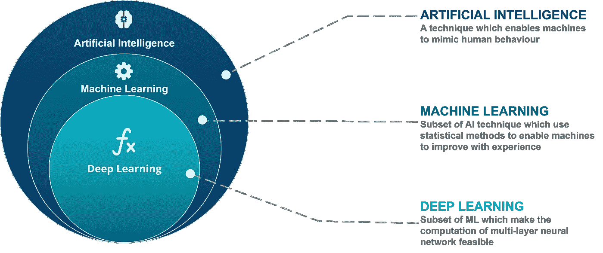
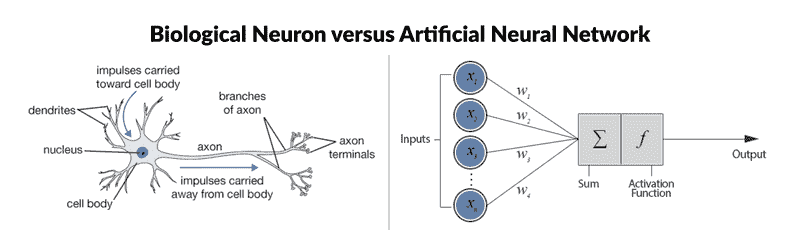
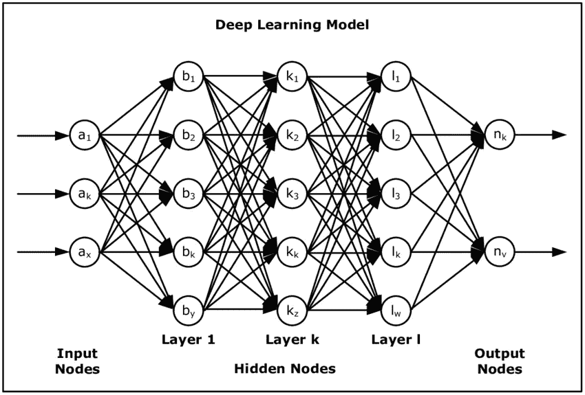
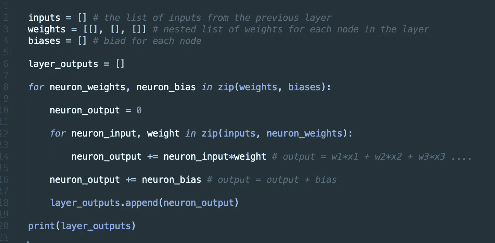

# 神经网络暴露:你好世界！

> 原文：<https://medium.com/walmartglobaltech/neural-networks-exposed-hello-world-5a2f5984f936?source=collection_archive---------0----------------------->

[Source](https://www.wisdomgeek.com/wp-content/uploads/2020/10/Recurrent-Neural-Networks.jpg)

我认为自己是一名工程师，一名问题解决者，在他成长的岁月里爱上了人工智能和数据科学。一直想通过成为机器学习工程师/应用数据科学家(我认为是这样)来带来两个世界的最佳效果，工程师的分析推理和数据科学家的才华。理解数据科学之美背后的数学和概念非常重要，同样重要的是将一个纯粹的概念转化为现实，并将其转化为实际产品。作为一名实践工程师，精通挑战&获得期望的输出所需的执行和实验的重要性。带着对 APJ 阿卜杜勒·卡拉姆博士、Tony Stark(钢铁侠)、Elon Musk 和 Howard Wolowitz 的赞美，我开始了这个系列，其中我们将见证在最先进的 ML/DL 库的复杂套筒下抽象的神经网络的粗糙面。所以，让我们踏上一段启蒙之旅，揭开 AI 世界的神秘面纱。

对于编码神经网络，我们有 python 来拯救。想学 Python 的观众可以来硬的(不是字面上的)[学 Python 来硬的](https://learncodethehardway.org/python/)。

# 艾家族

虽然神经网络在 2010 年后开始流行，但直觉可以追溯到 20 世纪 40 年代。他们在赢得比赛和预测/创造价值后变得受欢迎，否则这被认为是不可能的。我个人认为，随着计算设备*的进步和数据生成 的指数级增长，神经网络获得了动力。随着处理速度的提高和 GPU 的出现，训练神经网络对于商业目的变得切实可行。“数据是新的石油”，这句话足以解释数据对现代企业的重要性(以及对新的脸书/Whatsapp 隐私政策的重要性)，以及为它们提供新燃料的必要性。*

**

*AI Hierarchy([Source](https://www.edureka.co/blog/wp-content/uploads/2018/03/AI-vs-ML-vs-Deep-Learning.png))*

*任何模仿人类行为的程序都可以在人工智能的大伞下考虑。与人工智能的统计子集相关的任务可以被称为机器学习。深度学习是处理多层感知器/神经网络的机器学习的子组。*

# *神经网络结构*

*神经网络在结构上非常类似于也被称为神经元的神经细胞。神经网络中的每个节点都模仿生物神经系统中神经元的行为。虽然单个节点实际上并不有效，但当与其他节点融合形成神经网络时，会产生奇迹。*

**

*[Source](https://miro.medium.com/max/800/0*XVTzs5PHRzX5Vuyc)*

# *数学概述*

*神经网络需要“学习”某些参数来生成预测。这些参数包括每个节点的权重和偏差。让我告诉你权重和偏差的实际含义，考虑一个等式 **y=mx+c，**其中 y 是我们需要识别的值(目标变量)，x 是输入，m 是直线的斜率(权重)，c 是常数(偏差)。m 和 c 是需要识别的参数，以防我们需要从 x 中找到 y 的值。*

*现在，我们如何计算我们的神经网络需要学习多少参数？*

**

*Neural Network Layers ([Source](https://www.researchgate.net/profile/Will-Serrano/publication/313408173/figure/fig8/AS:669010169438243@1536515862984/Artificial-Neural-Network-Deep-Learning-model.png))*

*考虑上图，一个有 1 个输入层、3 个隐藏层和 1 个输出层的神经网络。输入层由 3 个节点组成:a1、ak 和 ax。输出层由两个节点组成:nk 和 nv。现在，关注输入层与层 1 的交互，层 1 的每个节点都连接到输入层的每个节点。因此，第 1 层中的每个节点将学习 3 个权重(每个输入节点 1 个)。类似地，我们可以将我们的观察扩展到后续层，我们得到(3*5 + 5*5 + 5*5 + 5*2) = **75** 个权重。由于隐藏层和输出层中的每个节点都包含一个偏差分量，因此参数总数达到 **92 (75 个权重+ 17 个偏差)。***

*我们的深度学习模型会优化上述参数来预测最终结果。权重和偏差以不同的方式影响结果，权重往往会改变输入的大小，并可以反转值的符号，而偏差会对输出产生整体影响。来自节点的最终输出是在计算权重和偏差之后获得的结果上应用的激活函数的结果，这引入了非线性(使得节点“着火”)，并且将其自身与经典的机器学习算法区分开来。因此，最后的等式是:*

> *outputFromNode = activation function(输入*权重+偏差)*

*常用的激活函数有 ReLU，Leaky ReLU，sigmoid，softmax，tanh。*

*现在，是我们使用基本 Python 编写图层输出计算实用程序的时候了。下面是代码，供参考。目前，我们不会利用任何激活函数来计算层输出。*

**

*Layer Output Computation Utility*

*瞧啊。您只是用纯 Python 编写了神经网络层的输出，没有任何外部库的帮助。然而，在我们获得一个在现实生活中表现良好的复杂神经网络模型之前，还有很多工作要做。*

# *结论*

*您可以在 [Github 资源库](https://github.com/bajajra/Neural-Networks-Exposed)中找到这个系列的所有代码(不要忘记开始🌟它)。这些通用代码片段将帮助您从头开始构建自己的神经网络。虽然我们已经完成了第一篇文章，但这仅仅是一次激动人心的冒险的开始。下期再见！*

# *其他文章*

* [## 聊天机器人的创造者

### “我相信，在本世纪末，文字的使用和一般受过教育的观点将会发生如此大的变化，以至于……

medium.com](/walmartglobaltech/tête-à-tête-the-chatbot-creator-56a5b9b36c2)  [## 电子商务中的人工智能:自动视频生成

### “第一步是确定某事是可能的；那么概率就会发生。”

medium.com](/walmartglobaltech/ai-in-e-commerce-automated-video-generation-1b93b9d17ba8) 

# 参考

 [## 机器学习导论

### 机器学习中的介绍性文本，给出了基于统计，模式…

mitpress.mit.edu](https://mitpress.mit.edu/books/introduction-machine-learning)  [## 统计学习的要素:数据挖掘、推理和预测。第二版。

web.stanford.edu](https://web.stanford.edu/~hastie/ElemStatLearn/)  [## 艰难地学习 Python

### 当您直接从作者 Zed A. Shaw 那里购买《艰难地学习 Python 3》时，您将获得专业质量的 PDF…

learncodethehardway.org](https://learncodethehardway.org/python/)*