# 神经网络第 1 部分:逻辑回归

> 原文：<https://medium.com/walmartglobaltech/neural-networks-part-1-logistic-regression-least-square-error-f78c79159cb7?source=collection_archive---------2----------------------->

## 深度学习

## 神经网络的单个神经元

必修学习:线性回归基础知识[链接](http://www.holehouse.org/mlclass/01_02_Introduction_regression_analysis_and_gr.html)

我们从神经网络的基本单元——单激活神经元开始。具有单个神经元的神经网络与逻辑回归相同。因此，神经网络可以被认为是逻辑回归单元的网络集合。

**注意:上述对于仅具有 Sigmoid 激活函数的神经网络是正确的，因为逻辑回归使用 Sigmoid 函数。不要担心，这将在随后的博客中得到澄清**

# 建立符号以备将来使用

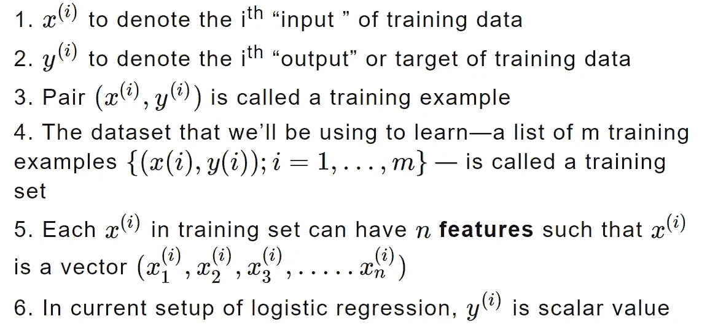

**注意，符号中的上标“(I)”只是训练集的一个索引，与取幂无关。**

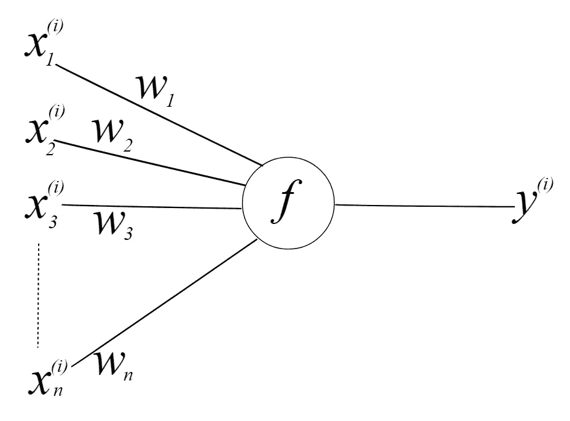

Fig: Single Neuron (Created using inkscape)

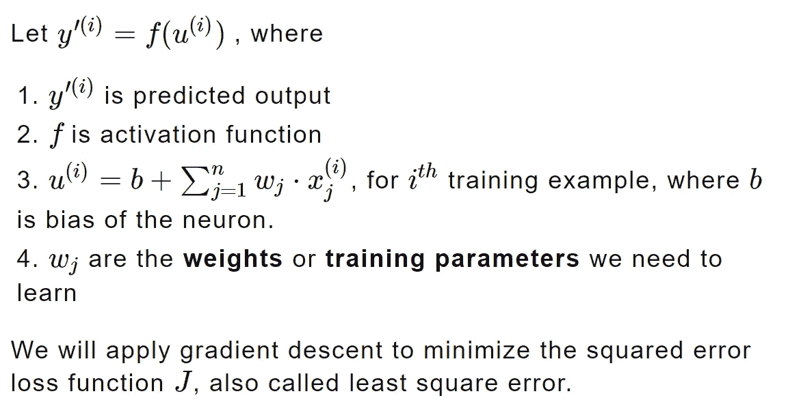

**注意:我们可以为逻辑回归使用更好的损失函数，但是为了简单起见，我们使用最小二乘误差**

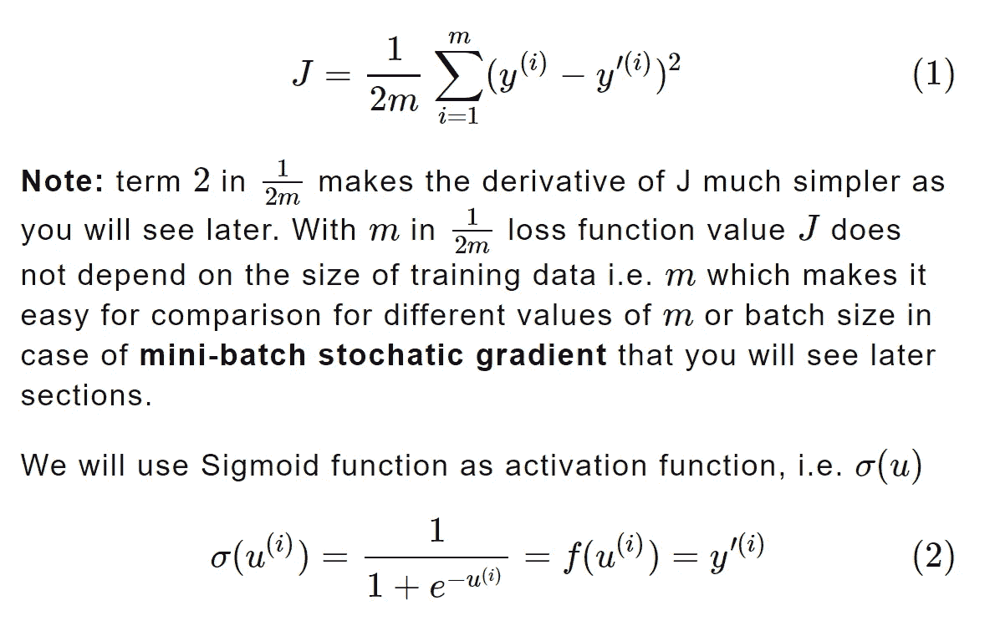

# 派生物

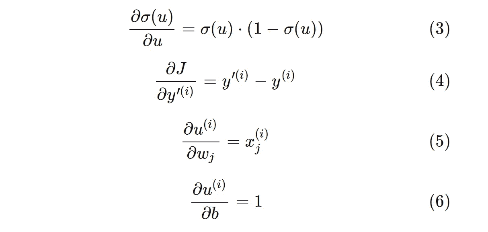

# 梯度下降

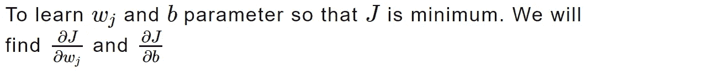

**注: *J* 是我们的损失函数， *j* 用于索引**

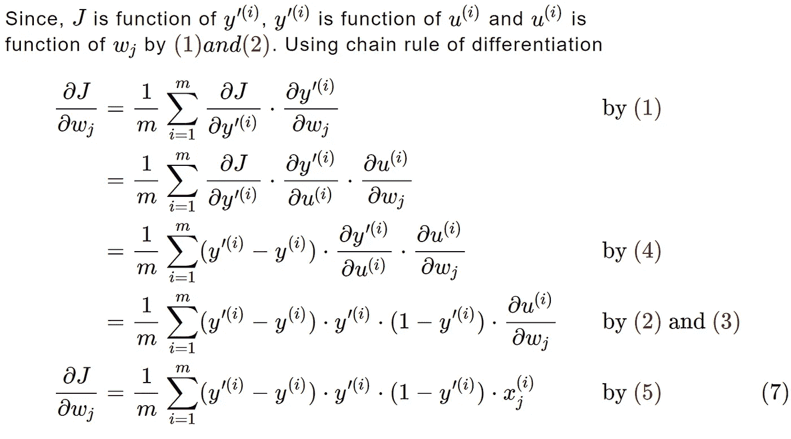

1.  对训练样本的单个梯度求和使得梯度更新更加平滑
2.  不求平均的学习率取决于训练数据的大小 ***m*** 或批量大小
3.  通过平均，梯度大小与批次大小无关。这允许在使用不同批次大小或训练数据大小 ***m*** 时进行比较。

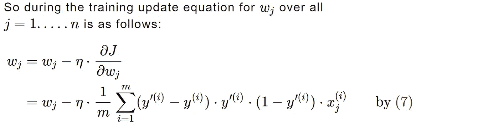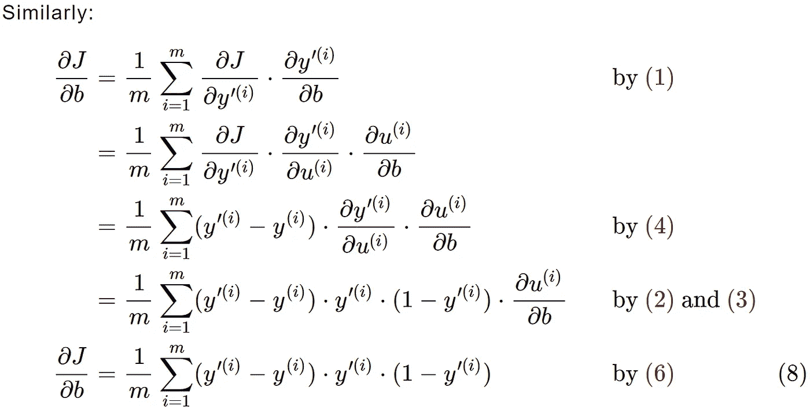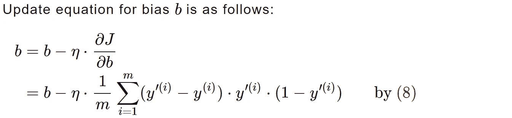

## 培训步骤:

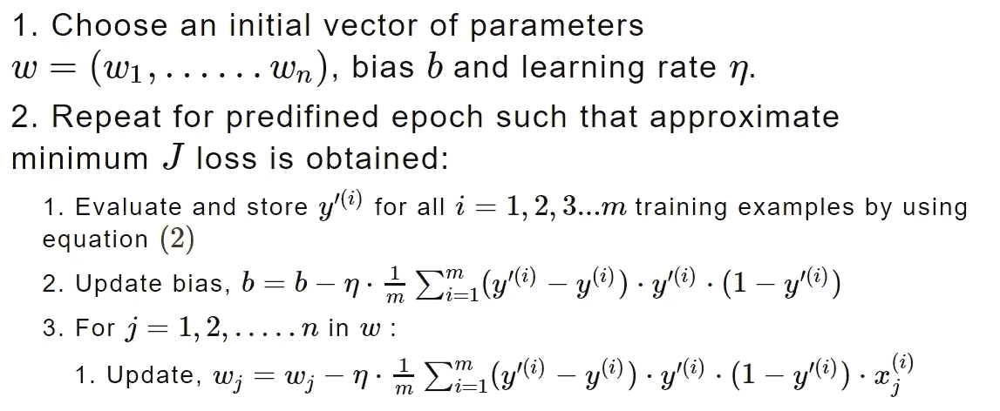

上述步骤的代码片段:

```
#Accumulate gradient with respect to bias and weights
    grad_bias = 0
    grad_w = np.zeros(len(W))
    for i in range(X_train.shape[0]):        
        grad_bias += (YP[i] - y_train[i])*(YP[i])*(1-YP[i]) #dJ/db
        for j in range(len(W)):
            #dJ/dW_j
            grad_w[j] += (YP[i] - y_train[i])*(YP[i])*(1-YP[i])*(X_train[i][j])

    #Update bias
    bias = bias - grad_bias*lr/X_train.shape[0]
```

# 随机梯度下降

当训练数据量 mm 较大时，我们选择*<***m***的批量大小。我们将训练数据分成大小为***【m’***的批次。我们按如下方式更新每批的重量和偏差:*

*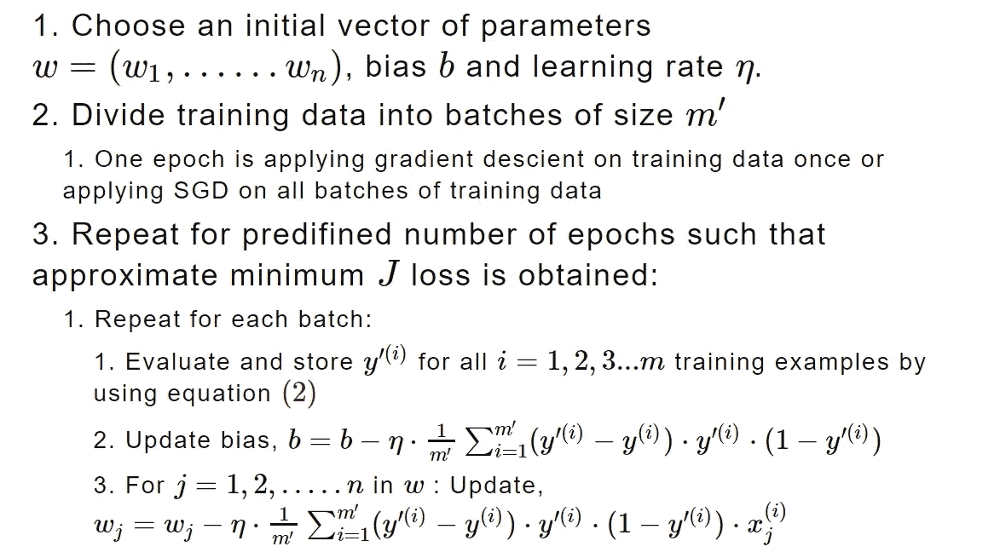*

## *SGD 的优势*

1.  *比正常的梯度下降快得多*
2.  *当整个训练数据无法放入系统的 RAM(可用内存)时，这是更好的选择*

# *密码*

*[这里的](https://github.com/rakesh-malviya/MLCodeGems/blob/master/notebooks/Neural_networks/2-neural-networks-part-1-logistic-regression-least-square-error.ipynb)是逻辑回归的 python 实现。*

# *参考资料:*

1.  *[http://cs229.stanford.edu/notes](http://cs229.stanford.edu/notes)*