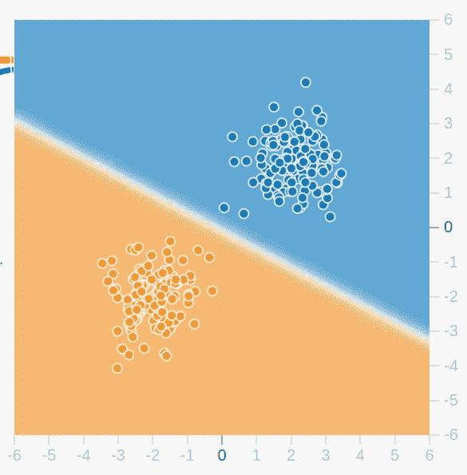
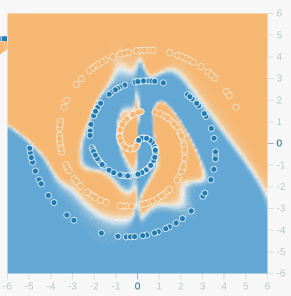
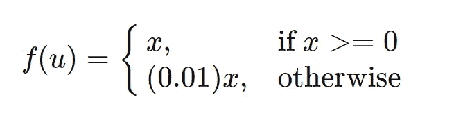
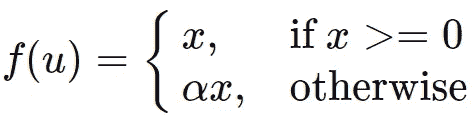
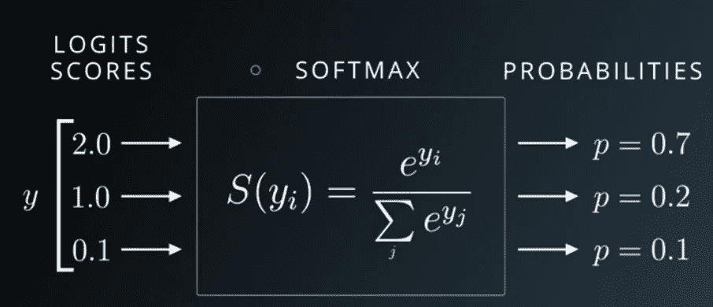
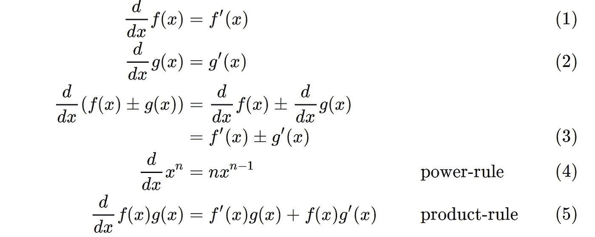
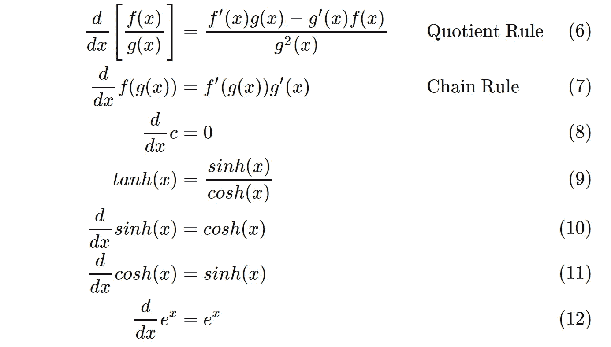
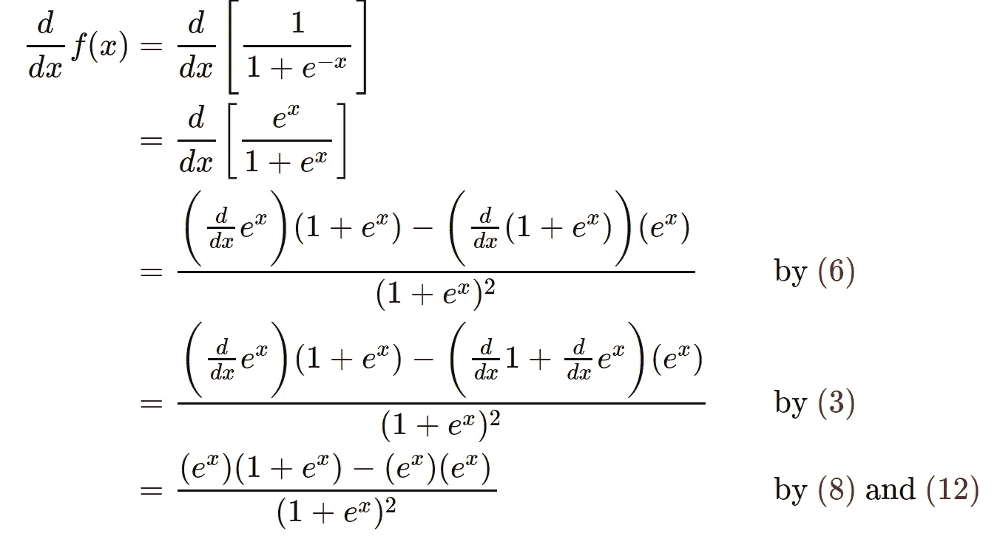
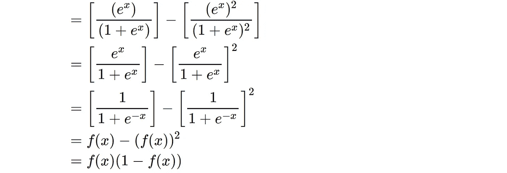
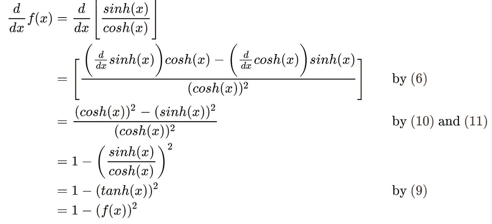

# 神经网络第 2 部分:激活函数和微分

> 原文：<https://medium.com/walmartglobaltech/neural-networks-part-2-activation-functions-and-differentiation-cd16b7eb2aa1?source=collection_archive---------4----------------------->

## 深度学习

# 激活功能

神经网络是以特定方式相互连接的人工神经元的网络。神经网络的工作是从给定的数据中学习。神经网络必须学习的预测函数可能是高度非线性的。选择人工神经元的激活函数来捕捉潜在的非线性。

Linear prediction (Source: Tensorflow playground [link](http://playground.tensorflow.org/))

Non-linear prediction (Source: Tensorflow playground [link](http://playground.tensorflow.org/))

激活函数(一般)的函数形式为***f(u)= f(wᵀx+b)***其中 ***w*** 为权重向量， ***x*** 为单个训练数据向量

这可以被视为输入的线性组合，随后是非线性变换。有许多选项可用于选择非线性变换。一些突出的例子如下。

## 1.Sigmoid 激活函数

一个 sigmoid 函数，***f(u)= 1/(1+e⁻ᵘ)***。它取一个实数值，并将其“挤压”到介于 ***0*** 和 ***1*** 之间的范围内。大负数变成≈ ***0*** 大正数变成≈ ***1*** 。

**优点:**

对于二元分类问题，它被用作神经网络输出层的激活。

**缺点**:

1.  **能饱和并杀死梯度:**当神经元的激活在 ***1*** 或 ***0*** 处饱和时，梯度几乎为零。这就造成了学习上的困难。
2.  **输出不以零为中心**:由于输出在 ***0*** 到 ***1*** 范围内，下一层的神经元将接收不以零为中心的数据。因此，在反向传播期间，权重的梯度 ***w*** 将全部是正的或者全部是负的，这可能在权重的梯度更新中导致不期望的曲折动态。当考虑在一批所有训练数据上添加梯度时，与“饱和并消除梯度”相比，这个问题不会太严重

## 2.Tanh 激活函数

一个 **tanh** 函数，**f(u)= sinh(u)/cosh(u)**。它接受一个实数值，并将其“压缩”到-1 和 1 之间的范围内。大负数变为≈1，大正数变为≈1。

**优点**:

它优于 sigmoid，因为其输出以零为中心

**缺点**:

**能饱和并杀死梯度:**当神经元的激活在 1 或-1 饱和时，梯度几乎变为零。这就造成了学习上的困难。

## 3.ReLU 激活功能

整流后的线性单位， **ReLU** 为**f(u)= max(0，u)**

**优点:**

1.  与 tanh 和 sigmoid 相比，大大提高了训练速度
2.  与tanh 和 sigmoid 相比，计算成本更低
3.  降低渐变消失的可能性。由于当 ***u > 0*** 时，梯度具有恒定值。
4.  **稀疏度:**当更多的 u < =0 时，***【f(u)***可以更稀疏

**缺点:**

1.  倾向于炸掉激活(没有机制约束神经元的输出，因为 ***u*** 本身就是输出)。
2.  **Closed ReLU 或 Dead ReLU** :如果输入倾向于使 ***u < =0*** ，那么大多数神经元将总是具有 0 梯度更新，因此关闭或死亡。

## 4.泄漏 ReLU:

它解决了死 ReLU 问题。 ***0.01*** 是泄漏系数。泄漏的 ReLU 如下:

Leaky ReLU

## 5.参数化 ReLU 或 PReLU:

将泄漏 ReLU 中的泄漏系数αα参数化。

Parameterized ReLU

## 6.最大输出

ReLU，Leaky ReLU 和 PReLU 的推广。它没有***f(u)= f(wᵀx+b)***的函数形式，而是计算函数***【max(w′ᵀx+b′,wᵀx+b】***

**优点:**

Maxout 有 ReLU 的优点，但没有死的 ReLU 问题

**缺点:**

它具有两倍数量的权重参数来学习***w′***和 ***w***

## 7.Softmax

Udacity Deep Learning Slide on Softmax

sofmax 函数是 sigmoid 函数的推广。Sigmoid 用于 2 类(二元)分类，而 Softmax 用于多类分类。如上图所示，Softmax 函数将 logit[2.0，1.0，0.1]转换为概率[0.7，0.2，0.1]

# 我应该使用什么激活功能？

1.  对于输出图层，在分类任务中使用 sigmoid 或 softmax
2.  对于输出层，在回归任务中使用无激活或纯林函数 ***f(u)=u***
3.  如果您仔细设置学习率并监控网络中“无效 ReLU”的比例，请使用 ReLU 非线性。
4.  否则请尝试 Leaky ReLU 或 Maxout。
5.  或者试试 tanh，虽然可能比 ReLU 差
6.  避免乙状结肠

# 差异化:

## 基本公式:

给定 f(x)f(x)和 g(x)g(x)是可微函数(导数存在)，cc 和 nn 是任意实数:

## Sigmoid 函数:

## 双曲正切函数:

# 参考资料:

1.  Tensorflow 游乐场[链接](http://playground.tensorflow.org/)
2.  [http://cs231n.github.io](http://cs231n.github.io)
3.  Softmax 上的 Udacity 深度学习幻灯片