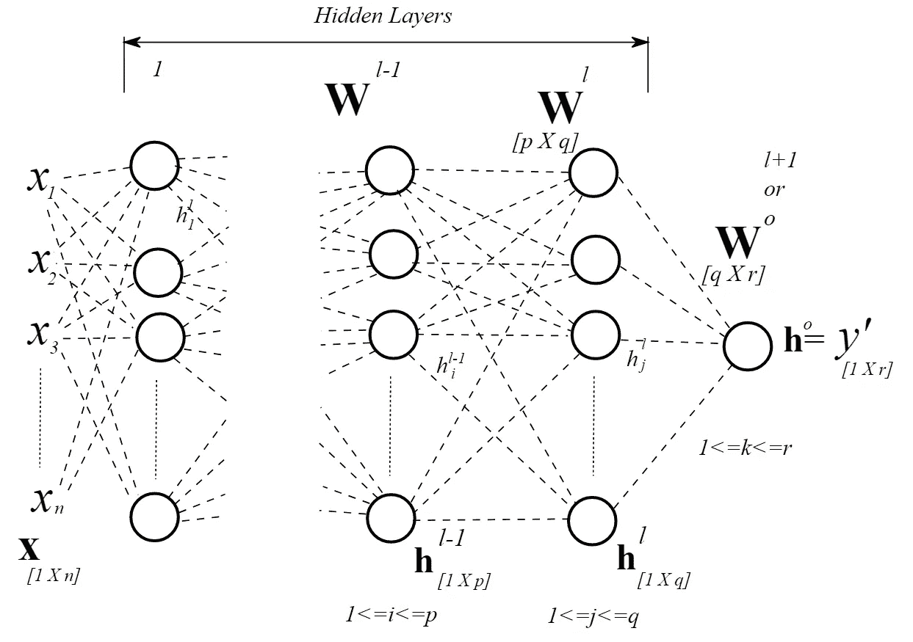
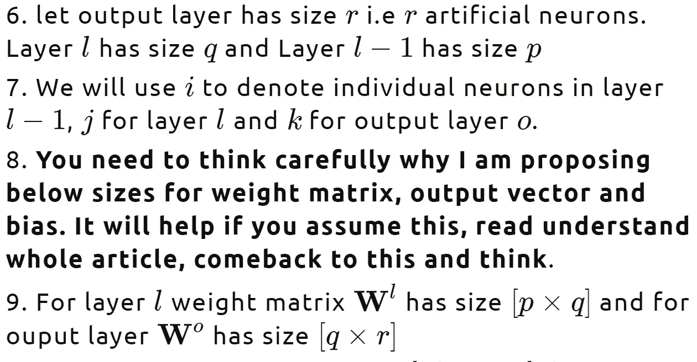

# 神经网络第 3 部分:前馈神经网络

> 原文：<https://medium.com/walmartglobaltech/neural-networks-part-3-feed-forward-neural-network-fd67f75abb42?source=collection_archive---------8----------------------->

## 深度学习

**必修课**:我之前在神经网络[上的帖子第一部分](/walmartlabs/neural-networks-part-1-logistic-regression-least-square-error-f78c79159cb7)和[第二部分](/walmartlabs/neural-networks-part-2-activation-functions-and-differentiation-cd16b7eb2aa1)。

# 前馈神经网络

*Fig 1: Feed-forward neural network*

# 建立符号

# 培养

# 前进传球

*Fig 2 : Forward pass*

# 正向传递(矢量化)

# 有用的衍生物

# 偶数道次

# 反向传递(矢量化)

# 更新步骤

# TL；博士

# **代码**

[这里的](https://github.com/rakesh-malviya/MLCodeGems/tree/master/Projects/Neural_networks/src)是上面文章的 python 实现。

# 参考资料:

1.  神经网络和深度学习第二章[链接](http://neuralnetworksanddeeplearning.com/chap2.html)