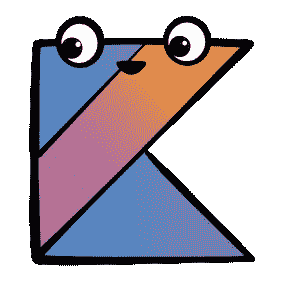

# 新的惊人的文章

> 原文：<https://blog.kotlin-academy.com/new-amazing-articles-7d7c038419f4?source=collection_archive---------4----------------------->

自从我们上一次的媒体通讯和许多伟大的文章发表在 Kt 已经有一段时间了。学院。让我们快速回顾一下。

## 有效科特林级数

*   [项目:考虑将元素聚合到一个地图上](/item-consider-aggregating-elements-to-map-a5a35a7b6c61)
*   [排除项:使用尾部递归实现高效递归](/excluded-item-use-tail-recursion-to-achieve-efficient-recurrence-364593eed969)
*   [枚举与密封类——选择哪一个？](/enum-vs-sealed-class-which-one-to-choose-dc92ce7a4df5)

## 关于一个值得了解的狡猾的科特林行为

*   [惰性属性中的方法引用和 lambdas](https://blog.kotlin-academy.com/method-references-and-lambdas-in-lazy-properties-371dbbea857bhttps://blog.kotlin-academy.com/method-references-and-lambdas-in-lazy-properties-371dbbea857b)

## 竞争编程的科特林

*   [用于竞争性编程的 kot Lin](/kotlin-for-competitive-programming-803ef03e8683?source=friends_link&sk=0d1bf4c340b81b45685c18bfd72c2e6e)
*   [在 Kotlin 中设置竞争性编程的工作流程](/setting-up-your-workflow-for-competitive-programming-in-kotlin-b1e84e6a6670?source=friends_link&sk=3a260568d981debe815f37bd99d4b770)

## 教程

*   [使用 Uniflow 的有效方式](https://medium.com/p/an-efficient-way-to-use-uniflow-2b41a9785a05)
*   [为获取 Instagram 照片实现分页](/implementing-pagination-for-fetching-instagram-photos-3c58453f15b4)
*   [使用 Kotlin 对 Firebase 进行单元测试](/unit-testing-firebase-with-kotlin-85ae7205d3ef)
*   [如何使用 Kotlin 构建 YouTube 播放器](/building-a-youtube-player-using-kotlin-b0e4beef302a)
*   从一个项目中扼杀一个数据库客户

## 在引擎盖下理解科特林

*   在 Kotlin 中连接字符串…在幕后🎃

## 对于初学者

*   [最佳科特林免费在线课程](/best-kotlin-free-online-courses-5838cb7063c6)
*   [如何在 9 个月内学会编程](https://medium.com/p/learn-programming-in-9-months-eac3f049c5bc)

我相信你会找到对你有意思的东西；)

祝你快乐科特林，

马尔钦·莫斯卡扎